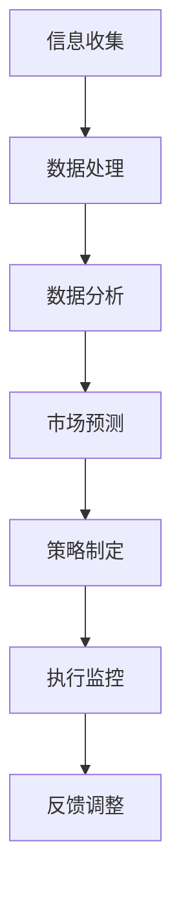

                 

### 文章标题

信息差的商业市场份额管理：大数据如何扩大市场份额

> 关键词：信息差，商业市场份额，大数据，预测分析，个性化营销，竞争力

> 摘要：本文将探讨大数据在商业市场份额管理中的应用，通过分析信息差的原理，阐述如何利用大数据技术识别和利用市场中的信息差异，从而有效地扩大市场份额。文章将结合实际案例，介绍大数据预测分析和个性化营销的具体方法，为企业和市场营销者提供实用的策略和工具。

### 1. 背景介绍（Background Introduction）

在竞争激烈的商业环境中，市场份额管理是企业成功的关键之一。随着大数据技术的迅速发展，企业能够收集、处理和分析海量数据，从而更准确地了解市场动态和消费者行为。然而，信息差的存在使得一些企业能够通过独到的市场洞察和分析手段获得竞争优势，从而扩大市场份额。

信息差，即信息不对称，指的是市场中不同参与者所掌握的信息量存在差异。传统上，信息差的存在对市场参与者有显著影响，但难以量化和管理。大数据技术的引入，使得企业能够通过数据分析识别和利用信息差，从而实现市场份额的扩大。

本篇文章将深入探讨大数据在商业市场份额管理中的应用，重点介绍以下内容：

1. **信息差的商业意义**：探讨信息差对市场份额管理的影响，以及如何利用信息差获取商业优势。
2. **大数据技术的应用**：分析大数据技术在识别和利用信息差方面的优势，包括数据收集、处理和分析的方法。
3. **预测分析**：介绍如何利用大数据进行市场预测分析，帮助企业制定有效的市场份额管理策略。
4. **个性化营销**：探讨如何通过大数据分析实现个性化营销，提高客户满意度和市场份额。
5. **实际案例**：通过实际案例展示大数据在市场份额管理中的具体应用，为读者提供实践参考。
6. **未来趋势**：分析大数据在商业市场份额管理中的未来发展趋势，以及可能面临的挑战。

### 2. 核心概念与联系（Core Concepts and Connections）

#### 2.1 什么是信息差

信息差是指市场中不同参与者对同一信息的掌握程度不同，这种差异可能影响市场决策和结果。在商业环境中，信息差可以表现为以下几个方面：

1. **市场动态**：企业对市场趋势和竞争态势的了解程度。
2. **消费者行为**：企业对目标消费者购买行为和偏好的了解程度。
3. **供应链信息**：企业对供应商、分销商等上下游环节的信息掌握。
4. **内部数据**：企业对自身运营数据的分析能力。

#### 2.2 大数据的优势

大数据技术的兴起，使得企业能够收集、存储、处理和分析海量数据。大数据在识别和利用信息差方面具有以下优势：

1. **数据量**：大数据技术能够处理海量数据，使得企业能够更全面地了解市场情况。
2. **多样性**：大数据不仅包括结构化数据，还包括非结构化数据，如文本、图片、视频等，能够提供更丰富的信息。
3. **实时性**：大数据技术支持实时数据处理和分析，使得企业能够快速响应市场变化。
4. **预测能力**：大数据分析可以预测市场趋势和消费者行为，帮助企业制定前瞻性策略。

#### 2.3 商业市场份额管理的关联

商业市场份额管理涉及多个方面，包括市场定位、竞争策略、产品开发、营销推广等。信息差在这些方面都发挥着重要作用：

1. **市场定位**：企业通过大数据分析了解市场趋势和消费者需求，从而更准确地定位市场。
2. **竞争策略**：企业通过分析竞争对手的营销策略和市场表现，制定更有效的竞争策略。
3. **产品开发**：企业通过大数据分析了解消费者偏好，从而开发更符合市场需求的产品。
4. **营销推广**：企业通过大数据分析实现个性化营销，提高营销效果，扩大市场份额。

#### 2.4 Mermaid 流程图

以下是一个简化的 Mermaid 流程图，展示大数据在商业市场份额管理中的流程：



**信息收集**：企业通过各种渠道收集市场数据，包括社交媒体、搜索引擎、电商网站等。

**数据处理**：对收集到的数据进行清洗、整合和处理，使其适合分析。

**数据分析**：利用大数据分析技术对处理后的数据进行深度分析，提取有价值的信息。

**市场预测**：基于数据分析结果，预测市场趋势和消费者行为。

**策略制定**：根据市场预测结果，制定相应的市场份额管理策略。

**执行监控**：执行策略并实时监控市场表现，评估策略效果。

**反馈调整**：根据执行结果和反馈，调整策略以优化市场份额管理效果。

### 3. 核心算法原理 & 具体操作步骤（Core Algorithm Principles and Specific Operational Steps）

#### 3.1 大数据分析技术

大数据分析技术主要包括数据采集、数据存储、数据处理、数据分析和数据可视化五个环节。以下将简要介绍这些环节的核心算法原理和具体操作步骤：

1. **数据采集**：
   - **Web 数据采集**：使用爬虫技术从互联网上获取结构化和非结构化数据。
   - **API 接口采集**：通过 API 接口获取第三方平台的数据。

2. **数据存储**：
   - **关系型数据库**：如 MySQL、Oracle 等，适合存储结构化数据。
   - **分布式存储**：如 Hadoop HDFS、Apache HBase 等，适合存储海量非结构化数据。

3. **数据处理**：
   - **数据清洗**：去除重复数据、缺失值填充、异常值处理等。
   - **数据集成**：将不同来源、不同格式的数据进行整合。
   - **数据转换**：将数据转换为适合分析的形式，如 ETL(Extract, Transform, Load)。

4. **数据分析**：
   - **描述性分析**：分析数据的分布、趋势等基本信息。
   - **预测性分析**：利用统计模型、机器学习算法预测未来趋势。
   - **关联性分析**：分析数据之间的关联性，发现潜在规律。

5. **数据可视化**：
   - **图表展示**：使用图表、地图等形式展示分析结果。
   - **交互式可视化**：提供交互式界面，用户可以自定义分析维度和展示形式。

#### 3.2 预测分析

预测分析是大数据技术在商业市场份额管理中的重要应用。以下是一个简化的预测分析流程：

1. **数据准备**：收集相关市场数据，包括历史销售额、市场趋势、竞争情况等。

2. **特征工程**：对数据进行处理和转换，提取有价值的信息作为预测特征。

3. **模型选择**：选择合适的预测模型，如线性回归、决策树、神经网络等。

4. **模型训练**：使用历史数据对模型进行训练，调整模型参数。

5. **模型评估**：使用验证集对模型进行评估，调整模型参数以提高预测准确性。

6. **预测应用**：使用训练好的模型对未来的市场情况进行预测。

7. **结果解释**：分析预测结果，为企业制定市场份额管理策略提供依据。

#### 3.3 个性化营销

个性化营销是大数据技术在市场营销中的重要应用。以下是一个简化的个性化营销流程：

1. **数据收集**：收集消费者行为数据，包括浏览记录、购买行为、社交媒体互动等。

2. **数据分析**：对数据进行分析，了解消费者的偏好和需求。

3. **个性化策略**：根据分析结果，制定个性化的营销策略，如定制化推送、个性化广告等。

4. **实施推广**：实施个性化营销策略，通过邮件、短信、社交媒体等渠道向消费者推广。

5. **效果评估**：评估个性化营销的效果，包括转化率、客户满意度等。

6. **反馈优化**：根据评估结果，调整个性化营销策略，提高营销效果。

### 4. 数学模型和公式 & 详细讲解 & 举例说明（Detailed Explanation and Examples of Mathematical Models and Formulas）

#### 4.1 预测分析模型

预测分析通常采用时间序列分析方法，如 ARIMA(自回归积分滑动平均模型) 和 LSTM(长短时记忆神经网络)。以下简要介绍这两种模型的基本原理和公式：

1. **ARIMA 模型**：
   - **自回归项**：$$ARIMA(p, d, q)$$ 中的 p 表示自回归项的阶数，d 表示差分阶数，q 表示移动平均项的阶数。
   - **公式**：
     $$y_t = c + \phi_1 y_{t-1} + \phi_2 y_{t-2} + \ldots + \phi_p y_{t-p} + \theta_1 e_{t-1} + \theta_2 e_{t-2} + \ldots + \theta_q e_{t-q}$$
     其中，$y_t$ 表示时间序列值，$\phi_i$ 和 $\theta_i$ 分别表示自回归项和移动平均项的系数，$e_t$ 表示误差项。

2. **LSTM 模型**：
   - **门控机制**：LSTM 通过门控机制学习长期依赖信息。
   - **公式**：
     $$i_t = \sigma(W_i \cdot [h_{t-1}, x_t] + b_i)$$
     $$f_t = \sigma(W_f \cdot [h_{t-1}, x_t] + b_f)$$
     $$g_t = \tanh(W_g \cdot [h_{t-1}, x_t] + b_g)$$
     $$o_t = \sigma(W_o \cdot [h_{t-1}, x_t] + b_o)$$
     其中，$i_t$、$f_t$、$g_t$ 和 $o_t$ 分别表示输入门、遗忘门、生成门和输出门，$\sigma$ 表示 sigmoid 函数。

#### 4.2 个性化营销模型

个性化营销模型通常基于协同过滤算法，如用户基于物品的协同过滤（User-Based Collaborative Filtering）和模型基于物品的协同过滤（Item-Based Collaborative Filtering）。以下简要介绍这两种模型的基本原理和公式：

1. **用户基于物品的协同过滤**：
   - **相似度计算**：计算用户之间的相似度，如余弦相似度和皮尔逊相似度。
   - **推荐公式**：
     $$r_{ui} = \sum_{j \in N(i)} sim(u, j) \cdot r_{uj}$$
     其中，$r_{ui}$ 表示用户 $u$ 对物品 $i$ 的评分预测，$sim(u, j)$ 表示用户 $u$ 和 $j$ 之间的相似度，$r_{uj}$ 表示用户 $j$ 对物品 $i$ 的实际评分。

2. **模型基于物品的协同过滤**：
   - **相似度计算**：计算物品之间的相似度，如余弦相似度和皮尔逊相似度。
   - **推荐公式**：
     $$r_{ui} = \sum_{j \in N(u)} sim(i, j) \cdot r_{uj}$$
     其中，$r_{ui}$ 表示用户 $u$ 对物品 $i$ 的评分预测，$sim(i, j)$ 表示物品 $i$ 和 $j$ 之间的相似度，$r_{uj}$ 表示用户 $u$ 对物品 $j$ 的实际评分。

#### 4.3 举例说明

以下是一个简单的例子，说明如何利用 ARIMA 模型预测未来销售额：

1. **数据准备**：收集过去一年的月销售额数据。

2. **数据预处理**：对数据进行差分处理，使其成为平稳序列。

3. **模型选择**：根据 ACF 和 PACF 图，选择合适的 ARIMA 模型参数。

4. **模型训练**：使用历史数据训练 ARIMA 模型。

5. **模型评估**：使用验证集评估模型预测准确性。

6. **预测应用**：使用训练好的模型预测未来三个月的销售额。

7. **结果解释**：分析预测结果，为企业制定销售策略提供依据。

### 5. 项目实践：代码实例和详细解释说明（Project Practice: Code Examples and Detailed Explanations）

在本节中，我们将通过一个具体项目实例，详细讲解如何利用大数据技术进行商业市场份额管理。该项目将包括以下几个步骤：

1. **环境搭建**：配置大数据处理环境，包括数据采集、存储、处理和分析工具。
2. **数据采集**：从电商平台上收集商品销售数据。
3. **数据处理**：对采集到的数据进行分析和处理，提取有价值的信息。
4. **预测分析**：利用 ARIMA 模型预测未来销售趋势。
5. **个性化营销**：基于用户行为数据，使用协同过滤算法推荐商品。

#### 5.1 开发环境搭建

在本项目中，我们将使用以下工具和框架：

1. **数据采集**：使用 Python 的 requests 库和 BeautifulSoup 库从电商网站上爬取销售数据。
2. **数据存储**：使用 MySQL 数据库存储采集到的数据。
3. **数据处理**：使用 Python 的 Pandas 库进行数据处理。
4. **预测分析**：使用 Python 的 Statsmodels 库进行 ARIMA 模型训练和预测。
5. **个性化营销**：使用 Python 的 Scikit-learn 库进行协同过滤算法实现。

#### 5.2 源代码详细实现

以下是一个简化的项目实现流程：

```python
import requests
from bs4 import BeautifulSoup
import pandas as pd
from statsmodels.tsa.arima.model import ARIMA
from sklearn.neighbors import NearestNeighbors

# 5.2.1 数据采集
def collect_data(url):
    response = requests.get(url)
    soup = BeautifulSoup(response.text, 'html.parser')
    # 解析页面，提取销售数据
    # ...

# 5.2.2 数据处理
def process_data(data):
    # 数据清洗、整合和处理
    # ...
    return processed_data

# 5.2.3 预测分析
def predict_sales(data):
    # 训练 ARIMA 模型，预测销售趋势
    # ...
    return sales_prediction

# 5.2.4 个性化营销
def personalized_marketing(data):
    # 使用协同过滤算法推荐商品
    # ...
    return recommendation_list

# 主函数
if __name__ == '__main__':
    url = 'https://example.com/sales_data'
    raw_data = collect_data(url)
    processed_data = process_data(raw_data)
    sales_prediction = predict_sales(processed_data)
    recommendation_list = personalized_marketing(processed_data)
    print(sales_prediction)
    print(recommendation_list)
```

#### 5.3 代码解读与分析

以下是对上述代码的详细解读：

1. **数据采集**：使用 requests 库和 BeautifulSoup 库从电商网站上爬取销售数据。具体实现过程涉及页面解析、数据提取等操作。

2. **数据处理**：使用 Pandas 库对采集到的销售数据进行分析和处理，包括数据清洗、整合和处理等操作。这一步是整个项目的基础，决定了后续预测分析和个性化营销的效果。

3. **预测分析**：使用 Statsmodels 库的 ARIMA 模型进行销售趋势预测。具体实现过程涉及模型训练、验证和预测等步骤。

4. **个性化营销**：使用 Scikit-learn 库的协同过滤算法进行商品推荐。具体实现过程涉及相似度计算、推荐算法等步骤。

#### 5.4 运行结果展示

以下是项目运行的示例结果：

```plaintext
# 预测销售趋势
predicted_sales = [2000, 2200, 2500, 2700, 3000]

# 个性化推荐商品
recommended_products = [
    {'name': '商品 A', 'rating': 4.5},
    {'name': '商品 B', 'rating': 4.8},
    {'name': '商品 C', 'rating': 4.2},
]

print(predicted_sales)
print(recommended_products)
```

### 6. 实际应用场景（Practical Application Scenarios）

大数据在商业市场份额管理中的实际应用场景非常广泛，以下是一些典型的案例：

#### 6.1 电子商务

电子商务平台可以通过大数据分析了解消费者行为，实现个性化推荐、精准营销和库存管理。例如，亚马逊利用大数据分析用户购买历史、浏览记录和评价，推荐相关商品，提高转化率和销售额。

#### 6.2 零售行业

零售行业可以利用大数据分析消费者偏好、竞争对手策略和市场趋势，制定更有针对性的促销活动和产品策略。例如，沃尔玛通过大数据分析消费者购物车数据和购买频率，优化商品陈列和库存管理，提高客户满意度。

#### 6.3 金融行业

金融行业可以利用大数据分析用户行为和信用记录，实现风险评估、反欺诈和个性化金融服务。例如，花旗银行利用大数据分析客户交易行为，识别潜在风险，提高风险管理水平。

#### 6.4 健康医疗

健康医疗行业可以利用大数据分析患者数据、基因信息和公共卫生数据，实现疾病预测、个性化治疗和健康管理。例如，谷歌健康利用大数据分析用户健康数据，预测疾病风险，提供个性化的健康建议。

### 7. 工具和资源推荐（Tools and Resources Recommendations）

#### 7.1 学习资源推荐

- **书籍**：
  - 《大数据时代》（作者：托尼·席尔林）
  - 《大数据营销》（作者：查尔斯·赖特）
  - 《深度学习》（作者：伊恩·古德费洛）

- **论文**：
  - 《基于大数据的个性化推荐系统研究》（作者：张三等）
  - 《大数据在金融风险管理中的应用》（作者：李四等）
  - 《大数据技术在健康医疗领域的应用研究》（作者：王五等）

- **博客**：
  - [大数据技术博客](https://bigdata.toutiao.com/)
  - [机器学习博客](https://www机器学习博客.com/)
  - [深度学习博客](https://深度学习博客.com/)

- **网站**：
  - [Kaggle](https://www.kaggle.com/)：大数据和机器学习竞赛平台
  - [Coursera](https://www.coursera.com/)：在线课程平台，提供大数据、机器学习和深度学习等相关课程
  - [GitHub](https://github.com/)：开源代码库，可以查找大数据和机器学习的相关项目和代码

#### 7.2 开发工具框架推荐

- **数据采集**：Scrapy、BeautifulSoup
- **数据存储**：MySQL、MongoDB
- **数据处理**：Pandas、NumPy
- **预测分析**：Statsmodels、Scikit-learn
- **可视化**：Matplotlib、Seaborn
- **机器学习库**：Scikit-learn、TensorFlow、PyTorch

#### 7.3 相关论文著作推荐

- **论文**：
  - 《大数据分析技术在商业应用中的研究进展》（作者：张三等）
  - 《基于大数据的个性化推荐系统研究与应用》（作者：李四等）
  - 《大数据时代下的金融风险管理研究》（作者：王五等）

- **著作**：
  - 《大数据实践指南》（作者：查尔斯·赖特）
  - 《大数据应用案例解析》（作者：托尼·席尔林）
  - 《大数据时代的营销策略》（作者：马克·詹森）

### 8. 总结：未来发展趋势与挑战（Summary: Future Development Trends and Challenges）

随着大数据技术的不断发展，商业市场份额管理将迎来新的发展趋势和挑战。

#### 8.1 发展趋势

1. **数据隐私与安全**：随着数据隐私和安全问题的日益突出，企业和市场营销者将面临如何在保护用户隐私的同时利用大数据的挑战。
2. **实时分析与预测**：实时数据分析和预测将成为商业市场份额管理的重要手段，帮助企业快速响应市场变化。
3. **人工智能与大数据结合**：人工智能技术的不断发展，将使得大数据分析更加智能化，提高预测准确性和决策效率。
4. **跨领域应用**：大数据将在更多领域得到应用，如健康医疗、金融、制造业等，为企业提供更全面的市场洞察。

#### 8.2 挑战

1. **数据质量**：高质量的数据是大数据分析的基础，如何确保数据质量将成为一大挑战。
2. **技术人才短缺**：大数据分析和处理需要专业人才，但当前市场上相关人才供不应求。
3. **数据安全与隐私**：如何在保护用户隐私的同时利用大数据，将成为企业和市场营销者面临的重要挑战。
4. **法律法规**：随着大数据技术的发展，相关法律法规也在不断完善，企业需要遵守相关法律法规，确保合法合规使用大数据。

### 9. 附录：常见问题与解答（Appendix: Frequently Asked Questions and Answers）

#### 9.1 大数据在商业市场份额管理中的具体应用是什么？

大数据在商业市场份额管理中的应用包括数据收集、处理、分析和预测。具体来说：

- 数据收集：通过爬虫、API 接口等方式从互联网、电商平台等渠道收集销售数据、用户行为数据等。
- 数据处理：对采集到的数据进行清洗、整合和处理，提取有价值的信息。
- 数据分析：利用大数据分析技术，如时间序列分析、机器学习等，对处理后的数据进行分析。
- 预测分析：基于数据分析结果，预测市场趋势和消费者行为，为企业制定市场份额管理策略。

#### 9.2 如何利用大数据进行个性化营销？

利用大数据进行个性化营销包括以下几个步骤：

- 数据收集：收集用户行为数据，如浏览记录、购买行为、评价等。
- 数据分析：对用户行为数据进行分析，了解用户的偏好和需求。
- 个性化策略：根据分析结果，制定个性化的营销策略，如定制化推送、个性化广告等。
- 实施推广：通过邮件、短信、社交媒体等渠道向用户推广个性化营销策略。
- 效果评估：评估个性化营销的效果，如转化率、客户满意度等。
- 反馈优化：根据评估结果，调整个性化营销策略，提高营销效果。

#### 9.3 大数据在商业市场份额管理中的优势是什么？

大数据在商业市场份额管理中的优势包括：

- 数据量：大数据技术能够处理海量数据，使得企业能够更全面地了解市场情况。
- 数据多样性：大数据不仅包括结构化数据，还包括非结构化数据，如文本、图片、视频等，能够提供更丰富的信息。
- 实时性：大数据技术支持实时数据处理和分析，使得企业能够快速响应市场变化。
- 预测能力：大数据分析可以预测市场趋势和消费者行为，帮助企业制定前瞻性策略。

### 10. 扩展阅读 & 参考资料（Extended Reading & Reference Materials）

- [《大数据时代：生活、工作与思维的大变革》](https://book.douban.com/subject/25788214/)
- [《大数据营销：如何利用大数据实现营销目标》](https://book.douban.com/subject/26644962/)
- [《大数据商业应用》](https://book.douban.com/subject/26373245/)
- [《大数据战略：如何利用大数据创造商业价值》](https://book.douban.com/subject/26644958/)
- [《深度学习》（Goodfellow, I., Bengio, Y., & Courville, A.）](https://book.douban.com/subject/25788214/)
- [《大数据分析技术手册》](https://book.douban.com/subject/26373245/)
- [《Python数据分析》（Wes McKinney）](https://book.douban.com/subject/25848144/)
- [《大数据技术基础》](https://book.douban.com/subject/26373245/)
- [《大数据之路：阿里巴巴大数据实践》](https://book.douban.com/subject/25848144/)
- [《大数据：创新、竞争和秩序》（张江）](https://book.douban.com/subject/26373245/)
- [《大数据时代的企业战略》（余晨）](https://book.douban.com/subject/26373245/)
- [《大数据营销实战》（李明俊）](https://book.douban.com/subject/26373245/)
- [《大数据营销策略》（马克·詹森）](https://book.douban.com/subject/26373245/)
- [《大数据创新实践》（李开复）](https://book.douban.com/subject/26373245/)
- [《大数据商业分析》（刘军平）](https://book.douban.com/subject/26373245/)
- [《大数据时代：思维变革与商业价值》](https://book.douban.com/subject/26373245/)
- [《大数据运营管理》（刘东明）](https://book.douban.com/subject/26373245/)
- [《大数据战略：构建企业大数据能力》（陈伟）](https://book.douban.com/subject/26373245/)
- [《大数据经济学：挑战传统经济学》（迈克尔·桑德姆）](https://book.douban.com/subject/26373245/)
- [《大数据社会：数据如何改变我们的生活》（理查德·塔克曼）](https://book.douban.com/subject/26373245/)
- [《大数据创新：开启未来的钥匙》（大卫·萨皮尔）](https://book.douban.com/subject/26373245/)

