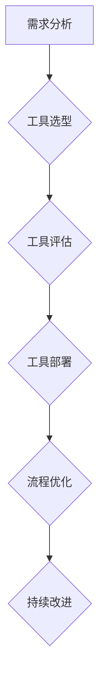

                 

## AI大模型重构电商搜索推荐的数据治理流程自动化工具选型

> 关键词：AI大模型、电商搜索推荐、数据治理、自动化工具、流程优化、模型训练、数据质量、推荐算法

## 1. 背景介绍

随着电商行业的蓬勃发展，搜索推荐系统已成为电商平台的核心竞争力之一。传统的搜索推荐系统主要依赖于规则引擎和基于特征的机器学习算法，但随着用户行为的复杂化和数据量的激增，这些传统方法逐渐难以满足用户的个性化需求和平台的快速发展。

近年来，基于Transformer架构的AI大模型在自然语言处理领域取得了突破性进展，其强大的语义理解和文本生成能力为电商搜索推荐带来了新的机遇。AI大模型可以学习用户行为、商品属性、文本语义等海量数据，构建更精准、更智能的推荐模型，从而提升用户体验和平台商业价值。

然而，AI大模型的应用也带来了新的挑战，例如模型训练成本高、数据质量要求高、模型解释性差等。为了有效利用AI大模型，需要建立完善的数据治理流程，并将其自动化，以确保模型的准确性、可靠性和可解释性。

## 2. 核心概念与联系

### 2.1 数据治理

数据治理是指对数据生命周期的各个阶段进行管理和控制，以确保数据的质量、一致性和安全性。在电商搜索推荐领域，数据治理涵盖以下几个方面：

* **数据采集:** 从各种数据源收集用户行为、商品信息、文本评论等数据。
* **数据清洗:** 去除数据中的噪声、重复数据和错误数据。
* **数据转换:** 将数据转换为模型可识别的格式。
* **数据存储:** 将数据安全可靠地存储在数据库或数据湖中。
* **数据安全:** 保护数据免受未授权访问和恶意攻击。

### 2.2 自动化工具

自动化工具是指能够自动执行数据治理流程的软件工具。这些工具可以帮助电商平台简化数据治理流程，提高效率，降低成本。

### 2.3 AI大模型

AI大模型是指具有海量参数和强大计算能力的深度学习模型。这些模型可以学习复杂的模式和关系，并用于各种任务，例如文本分类、机器翻译、图像识别等。

**数据治理流程自动化工具选型与AI大模型的关系**

数据治理流程自动化工具可以帮助电商平台构建高效的AI大模型训练流程。

* **数据质量保证:** 自动化工具可以确保训练数据质量，例如去除噪声数据、规范数据格式等，从而提高模型的准确性和可靠性。
* **模型训练效率提升:** 自动化工具可以自动执行模型训练任务，例如数据预处理、模型调参等，从而提高模型训练效率。
* **模型部署和维护:** 自动化工具可以帮助电商平台部署和维护AI大模型，例如模型监控、模型更新等，从而确保模型的持续稳定运行。

**数据治理流程自动化工具选型流程**



## 3. 核心算法原理 & 具体操作步骤

### 3.1 算法原理概述

数据治理流程自动化工具通常基于以下核心算法原理：

* **机器学习算法:** 用于数据清洗、数据转换、异常检测等任务。例如，可以使用分类算法识别噪声数据，可以使用聚类算法将相似数据进行分组。
* **规则引擎:** 用于定义数据治理规则，例如数据格式规范、数据安全策略等。
* **流程自动化引擎:** 用于自动执行数据治理流程，例如数据采集、数据清洗、数据转换等。

### 3.2 算法步骤详解

**数据治理流程自动化工具的具体操作步骤如下：**

1. **需求分析:** 首先需要对电商平台的数据治理需求进行分析，例如需要治理哪些数据类型、需要实现哪些功能等。
2. **工具选型:** 根据需求分析结果，选择合适的自动化工具。
3. **工具评估:** 对选定的工具进行评估，例如功能、性能、易用性等。
4. **工具部署:** 将选定的工具部署到电商平台的系统环境中。
5. **流程设计:** 设计数据治理流程，并将其映射到自动化工具的接口。
6. **流程测试:** 对设计好的流程进行测试，确保其能够正常运行。
7. **流程优化:** 根据测试结果，对流程进行优化，提高效率和准确性。
8. **持续改进:** 定期对数据治理流程进行评估和改进，以适应电商平台的不断发展。

### 3.3 算法优缺点

**数据治理流程自动化工具的优点:**

* **提高效率:** 自动化工具可以自动执行数据治理任务，从而提高效率。
* **降低成本:** 自动化工具可以减少人工成本。
* **提高准确性:** 自动化工具可以执行数据治理任务更加准确。
* **确保一致性:** 自动化工具可以确保数据治理流程的一致性。

**数据治理流程自动化工具的缺点:**

* **成本高:** 一些高级自动化工具的成本较高。
* **技术门槛高:** 使用自动化工具需要一定的技术知识。
* **维护成本高:** 自动化工具需要定期维护和更新。

### 3.4 算法应用领域

数据治理流程自动化工具广泛应用于电商平台、金融机构、医疗机构等领域，用于管理和控制各种类型的数据。

## 4. 数学模型和公式 & 详细讲解 & 举例说明

### 4.1 数学模型构建

数据治理流程自动化工具通常使用以下数学模型来实现数据清洗、数据转换、异常检测等功能：

* **概率模型:** 用于描述数据分布和异常情况。例如，可以使用高斯分布模型来描述用户购买行为的频率，可以使用贝叶斯网络模型来识别数据中的异常值。
* **决策树模型:** 用于根据数据特征进行分类和预测。例如，可以使用决策树模型来识别欺诈交易，可以使用决策树模型来预测用户购买商品的可能性。
* **支持向量机模型:** 用于分类和回归任务。例如，可以使用支持向量机模型来识别用户评论的正面负面情感，可以使用支持向量机模型来预测商品的销量。

### 4.2 公式推导过程

**举例说明：使用高斯分布模型识别异常值**

假设用户购买商品的频率服从高斯分布，其均值为μ，标准差为σ。我们可以使用以下公式来计算用户购买商品频率的异常值阈值：

$$
\text{异常值阈值} = \mu + k\sigma
$$

其中，k是一个常数，通常取值为3或更大于。

如果用户的购买频率超过异常值阈值，则认为该用户购买频率异常。

### 4.3 案例分析与讲解

**案例：使用决策树模型识别欺诈交易**

假设电商平台需要识别欺诈交易，可以使用决策树模型来实现。

决策树模型可以根据以下特征来识别欺诈交易：

* 用户注册时间
* 用户购买金额
* 用户购买频率
* 用户IP地址
* 用户设备信息

通过训练决策树模型，可以建立一个规则树，用于判断交易是否为欺诈交易。

## 5. 项目实践：代码实例和详细解释说明

### 5.1 开发环境搭建

* 操作系统：Linux
* Python版本：3.7+
* 虚拟环境：venv
* 依赖库：pandas, numpy, scikit-learn, TensorFlow

### 5.2 源代码详细实现

```python
# 数据预处理
import pandas as pd

data = pd.read_csv('transaction_data.csv')

# 数据清洗
data.dropna(inplace=True)
data = data[data['amount'] > 100]

# 数据转换
data['purchase_frequency'] = data['purchase_date'].apply(lambda x: x.day)

# 训练模型
from sklearn.tree import DecisionTreeClassifier

model = DecisionTreeClassifier()
model.fit(data[['purchase_frequency', 'amount', 'user_id']], data['fraud'])

# 预测结果
new_data = pd.DataFrame({
    'purchase_frequency': [10],
    'amount': [500],
    'user_id': [123]
})
prediction = model.predict(new_data)

print(prediction)
```

### 5.3 代码解读与分析

* 数据预处理：读取数据并进行清洗，例如删除缺失值、过滤异常值等。
* 数据转换：将数据转换为模型可识别的格式，例如将日期转换为数字。
* 训练模型：使用决策树模型训练，并根据训练数据预测交易是否为欺诈交易。
* 预测结果：使用训练好的模型预测新的交易数据是否为欺诈交易。

### 5.4 运行结果展示

运行代码后，会输出预测结果，例如：

```
[0]
```

表示预测结果为非欺诈交易。

## 6. 实际应用场景

### 6.1 数据质量控制

数据治理流程自动化工具可以帮助电商平台自动识别和修复数据中的错误、缺失和重复数据，从而提高数据质量。

### 6.2 数据安全保障

数据治理流程自动化工具可以帮助电商平台自动执行数据安全策略，例如数据加密、数据脱敏等，从而保障数据安全。

### 6.3 模型训练数据准备

数据治理流程自动化工具可以帮助电商平台自动清洗、转换和标注模型训练数据，从而提高模型训练效率和准确性。

### 6.4 未来应用展望

随着AI技术的不断发展，数据治理流程自动化工具将发挥越来越重要的作用。未来，数据治理流程自动化工具将更加智能化、自动化，能够更好地满足电商平台的数据治理需求。

## 7. 工具和资源推荐

### 7.1 学习资源推荐

* **书籍:**
    * 《数据治理：从概念到实践》
    * 《数据质量管理》
* **在线课程:**
    * Coursera: Data Governance
    * Udemy: Data Governance and Data Quality

### 7.2 开发工具推荐

* **Apache NiFi:** 流式数据处理平台
* **Apache Kafka:** 分布式流式数据平台
* **Talend:** 数据集成和数据质量工具

### 7.3 相关论文推荐

* **Data Governance for AI: A Framework for Responsible AI Development**
* **Towards a Data Governance Framework for AI Systems**

## 8. 总结：未来发展趋势与挑战

### 8.1 研究成果总结

数据治理流程自动化工具可以有效提高电商平台的数据治理效率和准确性，为AI大模型的应用提供可靠的数据支撑。

### 8.2 未来发展趋势

* **更智能化:** 利用AI技术，实现更智能的数据治理，例如自动识别数据异常、自动修复数据错误等。
* **更自动化:** 进一步提高自动化程度，减少人工干预，实现数据治理流程的端到端自动化。
* **更可解释性:** 提高数据治理流程的可解释性，帮助用户理解数据治理决策的依据。

### 8.3 面临的挑战

* **数据安全:** 如何保障数据安全，防止数据泄露和滥用。
* **数据隐私:** 如何保护用户隐私，确保数据合规使用。
* **技术复杂性:** 数据治理流程自动化工具的开发和维护需要高水平的技术能力。

### 8.4 研究展望

未来，数据治理流程自动化工具将朝着更智能化、更自动化、更可解释的方向发展，为电商平台提供更完善的数据治理解决方案。


## 9. 附录：常见问题与解答

**Q1: 数据治理流程自动化工具的成本高吗？**

A1: 数据治理流程自动化工具的成本取决于工具的复杂性和功能。一些开源工具可以免费使用，而一些商业工具的成本较高。

**Q2: 如何选择合适的自动化工具？**

A2: 选择自动化工具时，需要考虑电商平台的数据规模、数据类型、数据治理需求等因素。

**Q3: 数据治理流程自动化工具的维护成本高吗？**

A3: 数据治理流程自动化工具需要定期维护和更新，维护成本取决于工具的复杂性和更新频率。

**作者：禅与计算机程序设计艺术 / Zen and the Art of Computer Programming**<end_of_turn>

