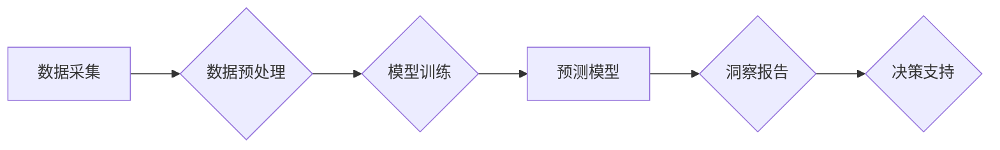

                 

## AI如何改变市场研究和消费者洞察

> 关键词：人工智能、市场研究、消费者洞察、自然语言处理、机器学习、深度学习、数据分析、预测模型

## 1. 背景介绍

市场研究一直是企业了解消费者需求、分析市场趋势、制定营销策略的重要手段。传统的市场研究方法主要依赖于问卷调查、焦点小组和数据分析等方式，这些方法虽然有效，但存在着成本高、效率低、数据分析难度大等问题。随着人工智能（AI）技术的快速发展，AI正在深刻地改变着市场研究和消费者洞察的格局。

AI技术能够自动处理海量数据，识别复杂模式，并生成精准的洞察，为企业提供更深入、更全面的消费者洞察。AI驱动的市场研究能够帮助企业：

* **更快速地收集和分析数据：** AI可以自动收集来自社交媒体、网站、评论等各种渠道的数据，并快速进行分析，帮助企业及时了解消费者需求和市场变化。
* **更精准地识别消费者需求：** AI可以分析消费者语言、行为和偏好，识别出潜在的需求和趋势，帮助企业开发更符合消费者期待的产品和服务。
* **更有效地进行市场预测：** AI可以基于历史数据和市场趋势，构建预测模型，帮助企业预测未来的市场变化和消费者行为，制定更有效的营销策略。

## 2. 核心概念与联系

**2.1 核心概念**

* **人工智能（AI）：** 指能够模拟人类智能行为的计算机系统，例如学习、推理、决策和解决问题。
* **自然语言处理（NLP）：** 是一门研究计算机如何理解、处理和生成人类语言的技术。
* **机器学习（ML）：** 是一种人工智能技术，通过算法训练模型，使模型能够从数据中学习并做出预测。
* **深度学习（DL）：** 是一种机器学习的子集，使用多层神经网络来模拟人类大脑的学习过程。
* **数据分析：** 指从数据中提取有价值信息的过程，帮助企业做出更明智的决策。

**2.2 架构图**



**2.3 联系**

AI技术通过自然语言处理、机器学习和深度学习等方法，从海量数据中提取有价值信息，构建预测模型，并生成洞察报告，最终为企业决策提供支持。

## 3. 核心算法原理 & 具体操作步骤

### 3.1 算法原理概述

AI驱动的市场研究主要依赖于以下核心算法：

* **聚类算法：** 将消费者群体按照相似性进行分类，例如根据年龄、性别、兴趣爱好等特征进行分组。
* **分类算法：** 根据已有的标签数据，预测新数据的类别，例如预测消费者是否会购买某个产品。
* **回归算法：** 预测连续型变量的值，例如预测消费者对某个产品的评分。
* **推荐算法：** 根据用户的历史行为和偏好，推荐相关的产品或服务。

### 3.2 算法步骤详解

以聚类算法为例，其具体操作步骤如下：

1. **数据收集：** 从各种渠道收集消费者数据，例如购买记录、浏览历史、社交媒体行为等。
2. **数据预处理：** 对收集到的数据进行清洗、转换和标准化，例如删除缺失值、转换数据类型、归一化数据等。
3. **特征选择：** 选择与消费者行为和偏好相关的特征，例如年龄、性别、收入、兴趣爱好等。
4. **聚类模型训练：** 使用聚类算法，例如K-means算法，将消费者数据进行聚类。
5. **聚类结果评估：** 使用聚类评估指标，例如Silhouette score，评估聚类结果的质量。
6. **洞察报告生成：** 对每个聚类进行分析，总结其特征和行为模式，生成洞察报告。

### 3.3 算法优缺点

**优点：**

* 自动化处理海量数据，提高效率。
* 识别复杂模式，发现隐藏的洞察。
* 提供更精准的消费者洞察。

**缺点：**

* 需要大量高质量的数据进行训练。
* 模型的解释性较差，难以理解模型的决策过程。
* 算法的选取和参数设置需要专业知识。

### 3.4 算法应用领域

* **市场细分：** 根据消费者特征进行细分，制定针对性的营销策略。
* **产品开发：** 了解消费者需求，开发更符合市场需求的产品。
* **品牌管理：** 监测品牌形象，及时调整营销策略。
* **客户关系管理：** 预测客户行为，提供个性化的服务。

## 4. 数学模型和公式 & 详细讲解 & 举例说明

### 4.1 数学模型构建

在AI驱动的市场研究中，常用的数学模型包括：

* **线性回归模型：** 用于预测连续型变量的值，例如预测消费者对某个产品的评分。

$$
y = \beta_0 + \beta_1x_1 + \beta_2x_2 + ... + \beta_nx_n + \epsilon
$$

其中：

* $y$ 是预测变量
* $x_1, x_2, ..., x_n$ 是解释变量
* $\beta_0, \beta_1, ..., \beta_n$ 是模型参数
* $\epsilon$ 是误差项

* **逻辑回归模型：** 用于预测分类变量的值，例如预测消费者是否会购买某个产品。

$$
P(y=1|x) = \frac{1}{1 + e^{-( \beta_0 + \beta_1x_1 + \beta_2x_2 + ... + \beta_nx_n )}}
$$

其中：

* $P(y=1|x)$ 是消费者购买产品的概率
* $x_1, x_2, ..., x_n$ 是解释变量
* $\beta_0, \beta_1, ..., \beta_n$ 是模型参数

### 4.2 公式推导过程

上述公式的推导过程涉及到概率论、统计学和线性代数等数学知识，这里不再赘述。

### 4.3 案例分析与讲解

**案例：** 预测消费者是否会购买某个新产品

**数据：** 收集消费者年龄、性别、收入、兴趣爱好等数据，以及是否购买该产品的历史记录。

**模型：** 使用逻辑回归模型，将消费者数据作为输入，预测其是否购买该产品的概率。

**结果：** 模型训练完成后，可以根据新消费者的特征，预测其购买该产品的概率。

## 5. 项目实践：代码实例和详细解释说明

### 5.1 开发环境搭建

* Python 3.x
* Jupyter Notebook
* scikit-learn 库
* pandas 库
* matplotlib 库

### 5.2 源代码详细实现

```python
import pandas as pd
from sklearn.model_selection import train_test_split
from sklearn.linear_model import LogisticRegression
from sklearn.metrics import accuracy_score

# 加载数据
data = pd.read_csv('consumer_data.csv')

# 选择特征和目标变量
features = ['age', 'gender', 'income', 'interest']
target = 'purchase'

# 将数据分为训练集和测试集
X_train, X_test, y_train, y_test = train_test_split(data[features], data[target], test_size=0.2, random_state=42)

# 创建逻辑回归模型
model = LogisticRegression()

# 训练模型
model.fit(X_train, y_train)

# 预测测试集结果
y_pred = model.predict(X_test)

# 计算模型准确率
accuracy = accuracy_score(y_test, y_pred)
print('模型准确率：', accuracy)
```

### 5.3 代码解读与分析

* 首先，加载数据并选择特征和目标变量。
* 然后，将数据分为训练集和测试集，用于训练和评估模型。
* 创建逻辑回归模型，并使用训练集进行模型训练。
* 训练完成后，使用测试集进行预测，并计算模型准确率。

### 5.4 运行结果展示

运行上述代码后，会输出模型的准确率，例如：

```
模型准确率： 0.85
```

这表示模型在预测消费者是否购买产品的任务上达到了85%的准确率。

## 6. 实际应用场景

AI驱动的市场研究已在各个行业得到广泛应用，例如：

* **零售业：** 预测消费者购买行为，优化库存管理，个性化推荐产品。
* **金融业：** 识别欺诈交易，评估客户信用风险，个性化金融产品推荐。
* **医疗保健业：** 预测患者疾病风险，辅助医生诊断，个性化医疗方案推荐。
* **教育行业：** 预测学生学习效果，个性化学习路径推荐，提高教学效率。

### 6.4 未来应用展望

随着AI技术的不断发展，AI驱动的市场研究将更加智能化、个性化和自动化。未来，AI将能够：

* 更深入地理解消费者需求和行为模式。
* 提供更精准的市场预测和洞察。
* 自动化市场研究流程，提高效率和降低成本。
* 为企业提供更个性化和定制化的营销解决方案。

## 7. 工具和资源推荐

### 7.1 学习资源推荐

* **在线课程：** Coursera、edX、Udacity 等平台提供丰富的AI和机器学习课程。
* **书籍：** 《深度学习》、《机器学习实战》、《Python机器学习》等书籍。
* **博客和论坛：** Kaggle、Towards Data Science、Machine Learning Mastery 等网站提供大量的AI和机器学习相关博客文章和讨论论坛。

### 7.2 开发工具推荐

* **Python：** 作为AI开发的主要语言，Python拥有丰富的库和框架，例如scikit-learn、TensorFlow、PyTorch等。
* **Jupyter Notebook：** 用于编写和运行Python代码，并可视化数据和模型结果。
* **云计算平台：** AWS、Azure、Google Cloud 等平台提供强大的计算资源和AI服务。

### 7.3 相关论文推荐

* **《Attention Is All You Need》:** 介绍了Transformer模型，在自然语言处理领域取得了突破性进展。
* **《Deep Learning》:** 深度学习经典著作，介绍了深度学习的基本原理和应用。
* **《Generative Adversarial Networks》:** 介绍了生成对抗网络，是一种用于生成数据的强大模型。

## 8. 总结：未来发展趋势与挑战

### 8.1 研究成果总结

AI技术正在深刻地改变着市场研究和消费者洞察的格局，为企业提供更深入、更全面的洞察，帮助企业做出更明智的决策。

### 8.2 未来发展趋势

* **更智能化：** AI模型将更加智能化，能够更深入地理解消费者需求和行为模式。
* **更个性化：** AI将能够为每个消费者提供个性化的产品和服务推荐。
* **更自动化：** AI将自动化市场研究流程，提高效率和降低成本。

### 8.3 面临的挑战

* **数据质量：** AI模型的性能依赖于高质量的数据，数据质量问题将影响模型的准确性和可靠性。
* **算法解释性：** 许多AI算法的决策过程难以解释，这可能会导致企业难以理解模型的预测结果。
* **伦理问题：** AI技术的使用可能会引发伦理问题，例如数据隐私和算法偏见等。

### 8.4 研究展望

未来，AI驱动的市场研究将继续发展，需要解决数据质量、算法解释性和伦理问题等挑战，并探索新的应用场景和技术方向。


## 9. 附录：常见问题与解答

**Q1：AI驱动的市场研究需要哪些数据？**

**A1：** AI驱动的市场研究需要各种类型的消费者数据，例如：

* **人口数据：** 年龄、性别、收入、教育程度等。
* **行为数据：** 购买记录、浏览历史、社交媒体行为等。
* **偏好数据：** 兴趣爱好、价值观、生活方式等。

**Q2：AI驱动的市场研究比传统市场研究有什么优势？**

**A2：** AI驱动的市场研究相比传统市场研究具有以下优势：

* **自动化处理海量数据，提高效率。**
* **识别复杂模式，发现隐藏的洞察。**
* **提供更精准的消费者洞察。**

**Q3：如何评估AI驱动的市场研究模型的准确性？**

**A3：** 可以使用各种评估指标来评估AI模型的准确性，例如：

* **准确率：** 模型正确预测的样本比例。
* **召回率：** 模型识别出所有正样本的比例。
* **F1-score：** 准确率和召回率的调和平均值。

**Q4：AI驱动的市场研究会取代传统市场研究吗？**

**A4：** AI驱动的市场研究将与传统市场研究相辅相成，两者各有优势。AI技术可以帮助企业更高效地处理数据和获取洞察，而传统市场研究仍然可以提供更深入的理解和洞察。


作者：禅与计算机程序设计艺术 / Zen and the Art of Computer Programming 
<end_of_turn>

