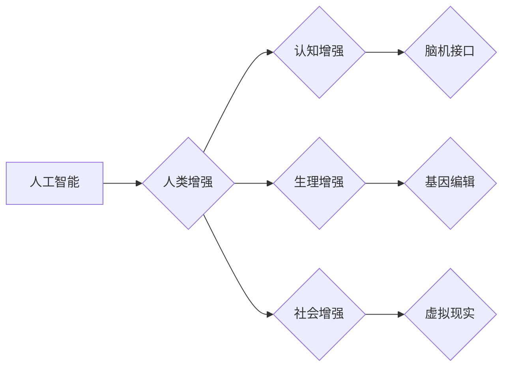

                 

## AI时代的人类增强：道德考虑与身体增强技术的融合

> 关键词：人工智能、身体增强、道德伦理、生物技术、神经接口、人机融合、可持续发展、社会影响

### 1. 背景介绍

人类文明自诞生以来，就一直在探索如何超越自身的局限性。从使用工具到发明火，从农业革命到工业革命，每一次进步都标志着人类对自身能力的提升。如今，人工智能（AI）和生物技术的飞速发展，为我们开启了新的篇章——人类增强。

人类增强是指利用科技手段提升人类的认知能力、生理能力和社会适应能力。它涵盖了多个领域，包括：

* **认知增强：** 通过脑机接口、智能辅助等技术，提升人类记忆、学习、创造力和决策能力。
* **生理增强：** 通过基因编辑、器官移植、仿生义肢等技术，增强人类的体力、耐力、寿命和抵抗力。
* **社会增强：** 通过虚拟现实、增强现实等技术，提升人类的沟通、协作和社交能力。

人类增强技术的发展潜力巨大，它有望解决人类面临的诸多挑战，例如：

* **提高生产力：** 增强人类的认知和生理能力，可以提高工作效率和创造力。
* **延长寿命：** 通过生物技术手段，可以延缓衰老，延长人类寿命。
* **改善生活质量：** 增强人类的健康和福祉，可以提高生活质量。

然而，人类增强技术也引发了许多伦理和社会问题，例如：

* **公平与正义：** 增强技术可能加剧社会不平等，导致富人更富、穷人更穷。
* **隐私与安全：** 脑机接口等技术可能会侵犯人类的隐私和安全。
* **人性的本质：** 人类增强技术可能会改变人类的本质，引发对人性的重新思考。

### 2. 核心概念与联系

**2.1 人类增强与人工智能**

人工智能作为人类增强技术的核心驱动力，赋予了增强技术以智能化和自动化能力。AI算法可以分析海量数据，识别模式，并根据模式做出决策，从而帮助人类提升认知能力和生理能力。例如，AI驱动的脑机接口可以实时监测脑电信号，并根据信号进行相应的控制，帮助残疾人恢复行动能力。

**2.2 人类增强与生物技术**

生物技术为人类增强提供了强大的工具，例如基因编辑、细胞治疗、器官移植等。通过这些技术，我们可以修改基因，修复细胞，甚至移植人工器官，从而增强人类的生理能力。例如，CRISPR-Cas9基因编辑技术可以用来治疗遗传性疾病，甚至可以用来增强人类的免疫力和抗病能力。

**2.3 人类增强与伦理道德**

人类增强技术的发展必须遵循伦理道德原则，以确保其安全、公平、可持续发展。例如，基因编辑技术可能导致不可逆转的遗传改变，因此需要谨慎使用。此外，增强技术可能加剧社会不平等，因此需要制定相应的政策，确保其公平分配。

**2.4 人类增强与社会影响**

人类增强技术将对社会产生深远的影响，例如：

* **劳动力市场：** 增强技术可能会导致部分工作岗位被自动化，但也可能创造新的工作机会。
* **教育体系：** 增强技术可能会改变教育方式，例如通过个性化学习和虚拟现实教学。
* **社会结构：** 增强技术可能会改变社会结构，例如导致新的社会阶层出现。

**Mermaid 流程图**



### 3. 核心算法原理 & 具体操作步骤

**3.1 算法原理概述**

人类增强技术涉及多种算法，例如机器学习、深度学习、自然语言处理、计算机视觉等。这些算法可以帮助AI系统理解人类语言、识别图像、预测行为等，从而实现对人类的辅助和增强。

**3.2 算法步骤详解**

以深度学习算法为例，其步骤如下：

1. **数据收集和预处理:** 收集大量相关数据，并进行清洗、格式化等预处理工作。
2. **模型构建:** 选择合适的深度学习模型架构，例如卷积神经网络、循环神经网络等。
3. **模型训练:** 使用训练数据训练模型，调整模型参数，使其能够准确地完成目标任务。
4. **模型评估:** 使用测试数据评估模型的性能，例如准确率、召回率、F1-score等。
5. **模型部署:** 将训练好的模型部署到实际应用场景中，例如脑机接口设备、智能辅助系统等。

**3.3 算法优缺点**

**优点:**

* **高精度:** 深度学习算法能够学习复杂的模式，实现高精度的人类行为预测和理解。
* **自动化能力:** 深度学习算法可以自动学习和优化，无需人工干预。
* **可扩展性:** 深度学习算法可以处理海量数据，并可以扩展到多个应用场景。

**缺点:**

* **数据依赖:** 深度学习算法需要大量数据进行训练，否则性能会下降。
* **计算资源消耗:** 深度学习算法训练需要大量的计算资源，成本较高。
* **黑盒效应:** 深度学习模型的内部机制复杂，难以解释其决策过程。

**3.4 算法应用领域**

深度学习算法在人类增强领域有广泛的应用，例如：

* **脑机接口:** 用于控制假肢、辅助残疾人恢复行动能力。
* **智能辅助:** 用于辅助人类学习、工作、生活。
* **虚拟现实:** 用于创造沉浸式体验，增强人类的社交和娱乐体验。

### 4. 数学模型和公式 & 详细讲解 & 举例说明

**4.1 数学模型构建**

人类增强技术涉及多种数学模型，例如：

* **神经网络模型:** 用于模拟人类大脑的结构和功能，实现对数据的学习和处理。
* **强化学习模型:** 用于训练智能体在特定环境中做出最优决策，例如控制机器人或玩游戏。
* **贝叶斯网络模型:** 用于表示和推理概率关系，例如预测疾病风险或识别欺诈行为。

**4.2 公式推导过程**

以神经网络模型为例，其核心公式是激活函数。激活函数用于将神经元的输入转换为输出，并引入非线性特性，使神经网络能够学习复杂的模式。常见的激活函数包括：

* **Sigmoid函数:** $$f(x) = \frac{1}{1 + e^{-x}}$$
* **ReLU函数:** $$f(x) = max(0, x)$$
* **Tanh函数:** $$f(x) = \frac{e^x - e^{-x}}{e^x + e^{-x}}$$

**4.3 案例分析与讲解**

以脑机接口为例，其数学模型可以用来预测用户的意图，并控制相应的设备。例如，用户可以通过脑电信号控制假肢，其数学模型可以将脑电信号转换为意图，并将其转换为控制信号，驱动假肢运动。

### 5. 项目实践：代码实例和详细解释说明

**5.1 开发环境搭建**

* 操作系统: Ubuntu 20.04
* 编程语言: Python 3.8
* 深度学习框架: TensorFlow 2.0
* 其他工具: Jupyter Notebook, Git

**5.2 源代码详细实现**

```python
import tensorflow as tf

# 定义神经网络模型
model = tf.keras.models.Sequential([
  tf.keras.layers.Dense(128, activation='relu', input_shape=(100,)),
  tf.keras.layers.Dense(64, activation='relu'),
  tf.keras.layers.Dense(1, activation='sigmoid')
])

# 编译模型
model.compile(optimizer='adam',
              loss='binary_crossentropy',
              metrics=['accuracy'])

# 训练模型
model.fit(x_train, y_train, epochs=10)

# 评估模型
loss, accuracy = model.evaluate(x_test, y_test)
print('Loss:', loss)
print('Accuracy:', accuracy)
```

**5.3 代码解读与分析**

* 代码首先定义了一个简单的多层感知机模型，包含三个全连接层和一个sigmoid激活函数的输出层。
* 然后，模型被编译，指定了优化器、损失函数和评估指标。
* 接着，模型被训练，使用训练数据进行迭代优化。
* 最后，模型被评估，使用测试数据计算损失和准确率。

**5.4 运行结果展示**

训练完成后，可以查看模型的损失和准确率，评估模型的性能。

### 6. 实际应用场景

**6.1 医疗保健**

* **疾病诊断:** AI算法可以分析患者的医疗影像数据，辅助医生诊断疾病。
* **个性化治疗:** AI算法可以根据患者的基因信息和病史，制定个性化的治疗方案。
* **远程医疗:** AI算法可以帮助医生远程诊断和治疗患者，提高医疗服务的可及性。

**6.2 教育**

* **个性化学习:** AI算法可以根据学生的学习进度和能力，提供个性化的学习内容和辅导。
* **智能评估:** AI算法可以自动批改作业，并提供个性化的反馈。
* **虚拟导师:** AI算法可以扮演虚拟导师的角色，为学生提供学习指导和支持。

**6.3 娱乐**

* **虚拟现实游戏:** AI算法可以创造更加逼真的虚拟世界和游戏体验。
* **个性化推荐:** AI算法可以根据用户的喜好，推荐个性化的娱乐内容。
* **智能陪伴:** AI算法可以开发智能机器人或虚拟助手，为用户提供陪伴和娱乐。

**6.4 未来应用展望**

随着人工智能和生物技术的不断发展，人类增强技术将应用到更多领域，例如：

* **增强人类能力:** 提升人类的认知能力、生理能力和创造力。
* **改善人类健康:** 预防和治疗疾病，延长人类寿命。
* **解决社会问题:** 缓解人口压力、环境污染等社会问题。

### 7. 工具和资源推荐

**7.1 学习资源推荐**

* **在线课程:** Coursera, edX, Udacity
* **书籍:** 《深度学习》、《人工智能：一种现代方法》
* **网站:** OpenAI, TensorFlow, PyTorch

**7.2 开发工具推荐**

* **编程语言:** Python, C++, Java
* **深度学习框架:** TensorFlow, PyTorch, Keras
* **云计算平台:** AWS, Azure, Google Cloud

**7.3 相关论文推荐**

* 《Attention Is All You Need》
* 《Generative Pre-trained Transformer 3》
* 《AlphaFold》

### 8. 总结：未来发展趋势与挑战

**8.1 研究成果总结**

近年来，人类增强技术取得了显著进展，例如：

* **脑机接口:** 已经可以用于控制假肢、辅助残疾人恢复行动能力。
* **基因编辑:** 已经可以用于治疗遗传性疾病，甚至可以用来增强人类的免疫力和抗病能力。
* **人工智能:** 已经可以用于辅助人类学习、工作、生活。

**8.2 未来发展趋势**

未来，人类增强技术将朝着以下方向发展：

* **更加智能化:** AI算法将更加智能化，能够更好地理解和响应人类的需求。
* **更加个性化:** 人类增强技术将更加个性化，能够根据个人的需求和特点提供定制化的服务。
* **更加融合:** 人类增强技术将更加融合，将人工智能、生物技术、纳米技术等多种技术结合起来。

**8.3 面临的挑战**

人类增强技术也面临着许多挑战，例如：

* **伦理道德:** 人类增强技术可能会引发伦理道德问题，例如公平、隐私、人性的本质等。
* **社会影响:** 人类增强技术可能会对社会结构、劳动力市场等产生深远影响。
* **技术风险:** 人类增强技术可能会带来技术风险，例如算法偏差、数据安全等。

**8.4 研究展望**

未来，我们需要加强对人类增强技术的伦理道德、社会影响和技术风险的评估和研究，制定相应的政策和规范，确保人类增强技术安全、可持续发展，造福人类社会。

### 9. 附录：常见问题与解答

**9.1 人类增强技术会取代人类吗？**

人类增强技术旨在提升人类的能力，而不是取代人类。AI和生物技术将成为人类的工具，帮助人类解决问题、创造价值。

**9.2 人类增强技术会加剧社会不平等吗？**

人类增强技术可能会加剧社会不平等，因为只有少数人能够负担得起这些技术。因此，我们需要制定相应的政策，确保这些技术公平地分配，造福所有的人。

**9.3 人类增强技术对人性的本质有什么影响？**

人类增强技术可能会改变人类的本质，例如提升人类的认知能力、延长人类寿命等。这些改变可能会引发对人性的重新思考。


作者：禅与计算机程序设计艺术 / Zen and the Art of Computer Programming 
<end_of_turn>

