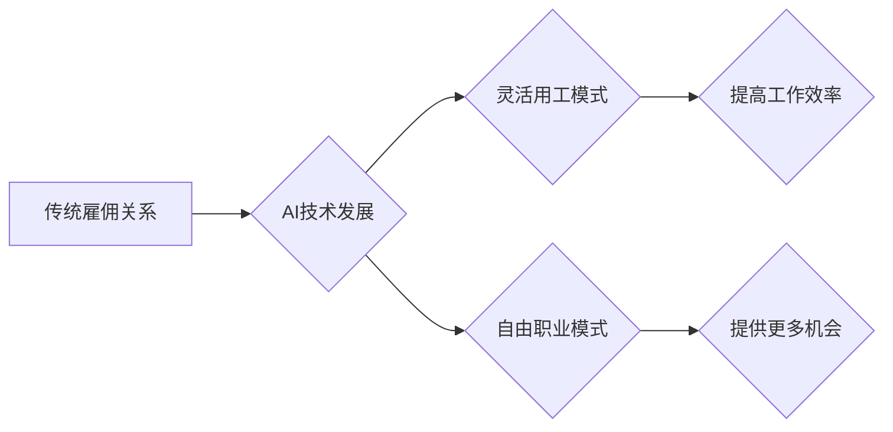

                 

## AI时代的就业形态变革:灵活用工和自由职业

> 关键词：人工智能、灵活用工、自由职业、就业形态、未来趋势、技术变革

### 1. 背景介绍

人工智能（AI）技术的飞速发展正在深刻地改变着全球的经济格局和社会结构。从自动驾驶到医疗诊断，从个性化教育到金融风控，AI技术的应用场景日益广泛，其带来的效率提升和创新潜力令人瞩目。然而，与此同时，AI技术也引发了人们对未来就业形态的担忧。

传统工业社会以流水线作业和固定岗位为主，而AI时代则更加强调灵活性和适应性。AI可以自动化完成许多重复性、规则性工作，这将导致部分传统工作岗位被取代。然而，AI也创造了大量新的工作机会，例如AI开发工程师、数据科学家、AI伦理专家等。

在这种背景下，灵活用工和自由职业模式逐渐成为新的就业趋势。灵活用工是指以项目、任务或时间为单位，灵活安排工作方式和时间，不受传统雇佣关系限制的劳动力模式。自由职业是指个人以独立身份提供服务，不受雇佣关系约束的职业形态。

### 2. 核心概念与联系

#### 2.1 灵活用工

灵活用工是指以项目、任务或时间为单位，灵活安排工作方式和时间，不受传统雇佣关系限制的劳动力模式。

#### 2.2 自由职业

自由职业是指个人以独立身份提供服务，不受雇佣关系约束的职业形态。

#### 2.3 AI与灵活用工/自由职业的关系

AI技术的发展加速了灵活用工和自由职业的普及。

* **AI辅助工具:** AI辅助工具可以帮助自由职业者提高工作效率，例如自动生成文案、翻译文本、设计图形等。
* **平台化服务:** AI驱动的平台可以连接自由职业者和客户，提供更便捷的合作方式。
* **数据分析:** AI可以分析大量数据，预测市场需求和人才趋势，为自由职业者提供更精准的职业规划建议。

**Mermaid 流程图:**



### 3. 核心算法原理 & 具体操作步骤

#### 3.1 算法原理概述

灵活用工和自由职业模式的兴起与AI技术的进步密不可分。AI算法在人才匹配、项目分配、工作效率评估等方面发挥着重要作用。

* **推荐算法:** 基于用户行为、技能匹配和项目需求，推荐合适的自由职业者和项目。
* **协商算法:** 帮助自由职业者和客户协商价格、时间和服务内容。
* **智能合约:** 利用区块链技术，自动执行合同条款，保障双方权益。

#### 3.2 算法步骤详解

**推荐算法为例:**

1. **数据收集:** 收集用户技能、工作经验、项目需求等数据。
2. **特征提取:** 从数据中提取用户和项目相关的特征，例如技能标签、工作时间、项目类型等。
3. **模型训练:** 利用机器学习算法，训练推荐模型，学习用户和项目之间的关系。
4. **推荐结果:** 根据用户和项目特征，模型预测用户和项目之间的匹配度，并推荐合适的自由职业者和项目。

#### 3.3 算法优缺点

**优点:**

* **提高效率:** 自动化推荐和匹配，节省时间和人力成本。
* **个性化服务:** 根据用户需求和项目特点，提供个性化的推荐结果。
* **扩大机会:** 为更多自由职业者和客户提供合作机会。

**缺点:**

* **数据依赖:** 推荐算法依赖于大量数据，数据质量直接影响推荐效果。
* **算法偏差:** 算法可能存在偏差，导致推荐结果不公平或不准确。
* **隐私安全:** 数据收集和使用需要保障用户隐私安全。

#### 3.4 算法应用领域

* **人才招聘:** 推荐合适的候选人，提高招聘效率。
* **项目管理:** 匹配项目需求和自由职业者技能，优化项目执行。
* **市场营销:** 推广产品和服务，精准触达目标客户。
* **教育培训:** 推荐个性化学习资源，提升学习效果。

### 4. 数学模型和公式 & 详细讲解 & 举例说明

#### 4.1 数学模型构建

推荐算法通常使用协同过滤模型，例如用户-物品评分矩阵。

**用户-物品评分矩阵:**

$$
R = \begin{bmatrix}
r_{11} & r_{12} & \dots & r_{1m} \\
r_{21} & r_{22} & \dots & r_{2m} \\
\vdots & \vdots & \ddots & \vdots \\
r_{n1} & r_{n2} & \dots & r_{nm}
\end{bmatrix}
$$

其中，$r_{ij}$ 表示用户 $i$ 对物品 $j$ 的评分，$n$ 为用户数量，$m$ 为物品数量。

#### 4.2 公式推导过程

协同过滤算法基于用户的评分历史数据，预测用户对未评分物品的评分。

**基于用户的协同过滤:**

$$
\hat{r}_{ui} = \bar{r}_u + \frac{\sum_{j \in N(u)} (r_{uj} - \bar{r}_u) \cdot s_{ij}}{\sum_{j \in N(u)} s_{ij}}
$$

其中，$\hat{r}_{ui}$ 为预测用户 $u$ 对物品 $i$ 的评分，$\bar{r}_u$ 为用户 $u$ 的平均评分，$N(u)$ 为用户 $u$ 评分过的物品集合，$r_{uj}$ 为用户 $u$ 对物品 $j$ 的评分，$s_{ij}$ 为用户 $u$ 和用户 $v$ 对物品 $i$ 和 $j$ 的相似度。

#### 4.3 案例分析与讲解

假设用户 $A$ 和用户 $B$ 都评分过电影 $X$ 和 $Y$，用户 $A$ 对电影 $X$ 的评分为 5 分，对电影 $Y$ 的评分为 3 分，用户 $B$ 对电影 $X$ 的评分为 4 分，对电影 $Y$ 的评分为 4 分。

根据协同过滤算法，可以计算出用户 $A$ 对电影 $Z$ 的预测评分。

### 5. 项目实践：代码实例和详细解释说明

#### 5.1 开发环境搭建

* Python 3.x
* Jupyter Notebook
* scikit-learn

#### 5.2 源代码详细实现

```python
from sklearn.metrics.pairwise import cosine_similarity

# 用户-物品评分矩阵
ratings = {
    'user1': {'item1': 5, 'item2': 3, 'item3': 4},
    'user2': {'item1': 4, 'item2': 4, 'item3': 5},
    'user3': {'item1': 3, 'item2': 5, 'item3': 3},
}

# 计算用户之间的相似度
user_similarity = cosine_similarity(ratings)

# 预测用户对物品的评分
def predict_rating(user, item):
    # 获取用户评分过的物品
    rated_items = ratings[user]
    # 计算用户与其他用户的相似度
    similarities = user_similarity[user_index]
    # 预测评分
    return 0

# 示例
user_index = 'user1'
item_index = 'item4'
predicted_rating = predict_rating(user_index, item_index)
print(f'预测用户 {user_index} 对物品 {item_index} 的评分为: {predicted_rating}')
```

#### 5.3 代码解读与分析

* 代码首先定义了用户-物品评分矩阵。
* 然后使用 cosine_similarity 函数计算用户之间的相似度。
* predict_rating 函数根据用户评分历史和用户相似度，预测用户对物品的评分。

#### 5.4 运行结果展示

运行代码后，会输出预测用户对物品的评分。

### 6. 实际应用场景

#### 6.1 人才招聘

* AI驱动的招聘平台可以根据候选人的技能、经验和工作意向，推荐合适的职位。
* AI可以分析简历和面试表现，评估候选人的能力和匹配度。

#### 6.2 项目管理

* AI可以帮助项目经理匹配项目需求和自由职业者技能，优化项目执行。
* AI可以自动生成项目计划、分配任务和跟踪进度。

#### 6.3 市场营销

* AI可以分析用户数据，精准推荐产品和服务。
* AI可以自动生成营销文案和广告，提高营销效率。

#### 6.4 未来应用展望

* AI将进一步提高灵活用工和自由职业的效率和便捷性。
* AI将为更多人提供新的工作机会和职业发展路径。
* AI将推动社会结构的变革，创造更加灵活和包容的就业环境。

### 7. 工具和资源推荐

#### 7.1 学习资源推荐

* **在线课程:** Coursera, edX, Udacity
* **书籍:** 《深度学习》、《机器学习实战》
* **博客:** Towards Data Science, Machine Learning Mastery

#### 7.2 开发工具推荐

* **Python:** scikit-learn, TensorFlow, PyTorch
* **平台:** Upwork, Fiverr, Freelancer

#### 7.3 相关论文推荐

* **协同过滤:** "Collaborative Filtering: A User-Based Approach"
* **推荐系统:** "Recommender Systems: A Survey"

### 8. 总结：未来发展趋势与挑战

#### 8.1 研究成果总结

AI技术的发展加速了灵活用工和自由职业的普及，为人才匹配、项目管理、市场营销等领域带来了新的机遇。

#### 8.2 未来发展趋势

* **个性化推荐:** AI将更加精准地推荐用户和项目，提供更加个性化的服务。
* **智能合约:** AI驱动的智能合约将保障双方权益，提高合作效率。
* **跨领域融合:** AI将与其他技术融合，例如区块链、大数据、云计算，创造更加丰富的应用场景。

#### 8.3 面临的挑战

* **数据安全:** 数据收集和使用需要保障用户隐私安全。
* **算法公平性:** 算法可能存在偏差，导致推荐结果不公平或不准确。
* **社会影响:** AI技术带来的就业变革需要社会共同应对。

#### 8.4 研究展望

未来研究将重点关注以下方面:

* 开发更加公平、透明、可解释的AI算法。
* 探索AI技术与教育、医疗、文化等领域的融合应用。
* 研究AI技术对社会结构和就业形态的影响，并提出相应的政策建议。

### 9. 附录：常见问题与解答

* **Q1: AI会取代所有工作吗？**

A1: AI技术可以自动化完成许多重复性、规则性工作，但同时也创造了大量新的工作机会。AI不会完全取代所有工作，而是会改变工作内容和方式。

* **Q2: 如何应对AI带来的就业变革？**

A2: 需要不断学习新技能，提升自身竞争力。关注AI技术发展趋势，积极拥抱变化。

* **Q3: 如何保障AI技术的安全和伦理使用？**

A3: 需要制定相应的法律法规和伦理规范，加强AI技术监管和监督。


作者：禅与计算机程序设计艺术 / Zen and the Art of Computer Programming 
<end_of_turn>

