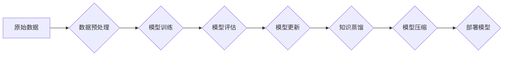

                 

## AI模型的增量学习：Lepton AI的持续优化

> 关键词：增量学习、AI模型优化、Lepton AI、持续学习、迁移学习、神经网络、模型压缩、高效学习

## 1. 背景介绍

在人工智能领域，模型的训练是一个资源密集型且耗时的过程。传统的机器学习方法通常需要从头开始训练模型，这对于不断变化的数据环境来说显得不够灵活和高效。随着数据量的爆炸式增长和对实时更新模型需求的增加，增量学习（Incremental Learning）应运而生，成为解决这一问题的关键技术。

增量学习是指在模型已经训练完成的基础上，通过不断接收新数据并进行微调，逐步提升模型性能的技术。它与传统的监督学习方法相比，具有以下优势：

* **降低训练成本：** 只需要对新数据进行微调，而不是重新训练整个模型，从而节省时间和计算资源。
* **适应动态环境：** 可以持续学习新的知识和模式，从而使模型能够适应不断变化的数据分布。
* **提高模型效率：** 通过模型压缩和优化技术，可以减小模型规模，提高推理速度。

Lepton AI 作为一家致力于推动增量学习技术的公司，致力于开发高效、灵活、可扩展的增量学习解决方案。

## 2. 核心概念与联系

增量学习的核心概念是**持续学习**，即模型在不断学习新知识的同时，保留之前已学习的知识，并将其与新知识进行融合。

Lepton AI 的增量学习框架基于以下核心概念：

* **模型更新策略：** 

Lepton AI 使用一种称为**元学习**的策略来更新模型。元学习是一种学习如何学习的学习方法，它可以帮助模型在面对新的任务时更快地适应和学习。

* **知识蒸馏：** 

Lepton AI 利用知识蒸馏技术，将大型模型的知识迁移到小型模型中，从而实现模型压缩和效率提升。

* **数据增广：** 

Lepton AI 使用数据增广技术，通过对现有数据进行各种变换，例如旋转、缩放、裁剪等，生成更多的数据样本，从而提高模型的泛化能力。

**Lepton AI 增量学习框架架构**

## 3. 核心算法原理 & 具体操作步骤

### 3.1  算法原理概述

Lepton AI 的增量学习算法的核心是**元学习**和**知识蒸馏**。

* **元学习:** 元学习通过训练一个“学习者”模型，来学习如何学习新的任务。学习者模型可以根据新的任务数据，快速调整自身的学习策略，从而提高学习效率。

* **知识蒸馏:** 知识蒸馏是一种将大型模型的知识迁移到小型模型的技术。大型模型作为“教师”模型，其输出结果作为“学生”模型的学习目标。通过调整学生模型的参数，使其输出结果尽可能接近教师模型的输出结果，从而实现知识的传递。

### 3.2  算法步骤详解

Lepton AI 的增量学习算法具体步骤如下：

1. **数据预处理:** 对原始数据进行清洗、转换、特征工程等操作，使其适合模型训练。
2. **模型初始化:** 初始化一个小型模型作为“学生”模型。
3. **元学习训练:** 使用元学习算法训练“学习者”模型，使其能够学习如何学习新的任务。
4. **知识蒸馏:** 使用已训练好的大型模型作为“教师”模型，将知识蒸馏到“学生”模型中。
5. **模型微调:** 使用新数据对“学生”模型进行微调，使其能够适应新的数据分布。
6. **模型评估:** 对微调后的模型进行评估，并根据评估结果进行模型更新。
7. **模型部署:** 将经过训练的模型部署到实际应用场景中。

### 3.3  算法优缺点

**优点:**

* **高效:** 只需要对新数据进行微调，而不是重新训练整个模型，从而节省时间和计算资源。
* **灵活:** 可以适应不断变化的数据分布。
* **可扩展:** 可以将多个小型模型进行组合，构建更复杂的模型。

**缺点:**

* **灾难性遗忘:** 当模型学习新的知识时，可能会忘记之前已学习的知识。
* **模型复杂度:** 元学习算法和知识蒸馏技术本身有一定的复杂度。

### 3.4  算法应用领域

Lepton AI 的增量学习算法在以下领域具有广泛的应用前景：

* **自然语言处理:** 语义理解、机器翻译、文本生成等。
* **计算机视觉:** 图像识别、目标检测、图像分割等。
* **语音识别:** 语音转文本、语音合成等。
* **推荐系统:** 用户个性化推荐、商品推荐等。

## 4. 数学模型和公式 & 详细讲解 & 举例说明

### 4.1  数学模型构建

Lepton AI 的增量学习算法可以抽象为一个优化问题，目标是找到一个模型参数向量 $\theta$，使得模型在训练数据上的损失函数最小化。

损失函数通常采用交叉熵损失函数或均方误差损失函数。

### 4.2  公式推导过程

元学习算法的核心是通过训练一个“学习者”模型，来学习如何学习新的任务。

学习者模型通常是一个神经网络，其输入是新的任务数据，输出是新的模型参数。

学习者模型的训练目标是最小化以下损失函数：

$$
L(\theta, \mathcal{D}) = \sum_{i=1}^{N} L_i(\theta, x_i, y_i)
$$

其中：

* $\theta$ 是模型参数向量。
* $\mathcal{D}$ 是训练数据。
* $N$ 是训练数据的大小。
* $L_i(\theta, x_i, y_i)$ 是第 $i$ 个样本的损失函数。

### 4.3  案例分析与讲解

假设我们有一个图像分类任务，需要训练一个模型来识别猫和狗的图片。

我们可以使用Lepton AI 的增量学习算法，先训练一个小型模型，然后在不断接收新的猫和狗图片数据时，对模型进行微调。

通过元学习算法，模型可以学习到如何快速适应新的数据分布，从而提高模型的性能。

## 5. 项目实践：代码实例和详细解释说明

### 5.1  开发环境搭建

Lepton AI 提供了丰富的开发工具和资源，可以方便地搭建增量学习开发环境。

需要安装Python、TensorFlow等相关软件包。

### 5.2  源代码详细实现

Lepton AI 的增量学习算法的源代码实现可以参考Lepton AI官方文档和开源项目。

### 5.3  代码解读与分析

Lepton AI 的源代码实现包含了元学习算法、知识蒸馏技术、模型微调等模块。

可以通过阅读代码，了解Lepton AI 的增量学习算法的具体实现细节。

### 5.4  运行结果展示

Lepton AI 的增量学习算法可以实现显著的性能提升，并且可以有效地降低训练成本。

可以通过运行Lepton AI 的代码示例，观察模型的训练过程和最终的性能结果。

## 6. 实际应用场景

Lepton AI 的增量学习技术已经在多个实际应用场景中得到验证，例如：

* **智能客服:** 使用增量学习技术，可以使智能客服系统能够不断学习新的对话内容，从而提供更准确、更自然的对话体验。
* **个性化推荐:** 使用增量学习技术，可以使推荐系统能够根据用户的行为数据，不断更新推荐结果，从而提供更个性化的推荐服务。
* **医疗诊断:** 使用增量学习技术，可以使医疗诊断系统能够不断学习新的医学知识，从而提高诊断准确率。

### 6.4  未来应用展望

Lepton AI 的增量学习技术在未来将有更广泛的应用前景，例如：

* **自动驾驶:** 使用增量学习技术，可以使自动驾驶系统能够不断学习新的道路规则和驾驶场景，从而提高安全性。
* **机器人控制:** 使用增量学习技术，可以使机器人能够不断学习新的任务和技能，从而提高工作效率。
* **金融风险管理:** 使用增量学习技术，可以使金融风险管理系统能够不断学习新的市场风险和投资模式，从而提高风险控制能力。

## 7. 工具和资源推荐

### 7.1  学习资源推荐

* Lepton AI 官方文档：https://www.lepton.ai/docs/
* 深度学习书籍：
    * 《深度学习》
    * 《动手学深度学习》

### 7.2  开发工具推荐

* TensorFlow：https://www.tensorflow.org/
* PyTorch：https://pytorch.org/

### 7.3  相关论文推荐

* 《Progressive Neural Networks》
* 《Elastic Weight Consolidation: Preventing Catastrophic Forgetting in Neural Networks》

## 8. 总结：未来发展趋势与挑战

### 8.1  研究成果总结

Lepton AI 的增量学习技术取得了显著的成果，在模型训练效率、数据适应能力等方面表现出色。

### 8.2  未来发展趋势

Lepton AI 将继续致力于推动增量学习技术的进步，未来发展趋势包括：

* **更有效的模型更新策略:** 研究更有效的模型更新策略，例如基于强化学习的模型更新策略。
* **更强大的知识蒸馏技术:** 研究更强大的知识蒸馏技术，例如跨模态知识蒸馏。
* **更广泛的应用场景:** 将增量学习技术应用到更多领域，例如自动驾驶、机器人控制等。

### 8.3  面临的挑战

Lepton AI 的增量学习技术也面临一些挑战，例如：

* **灾难性遗忘:** 如何有效地解决灾难性遗忘问题，使模型能够长期保持学习能力。
* **模型复杂度:** 如何降低模型复杂度，使模型更易于部署和维护。
* **数据质量:** 增量学习算法对数据质量要求较高，如何保证数据质量是关键。

### 8.4  研究展望

Lepton AI 将继续投入资源，攻克这些挑战，推动增量学习技术的进一步发展，为人工智能的未来发展贡献力量。

## 9. 附录：常见问题与解答

**Q1: Lepton AI 的增量学习算法与传统的迁移学习有什么区别？**

**A1:** 传统的迁移学习通常是指将预训练模型的知识迁移到新的任务中，而Lepton AI 的增量学习算法则更侧重于在模型已经训练完成的基础上，通过不断接收新数据进行微调，从而实现模型的持续学习。

**Q2: Lepton AI 的增量学习算法是否适用于所有类型的机器学习任务？**

**A2:** Lepton AI 的增量学习算法适用于大多数类型的机器学习任务，但对于一些特定类型的任务，例如需要大量计算资源的任务，可能需要进行一些调整。

**Q3: 如何评估 Lepton AI 的增量学习算法的性能？**

**A3:** 可以使用传统的机器学习评估指标，例如准确率、召回率、F1-score等，来评估 Lepton AI 的增量学习算法的性能。

**Q4: Lepton AI 的增量学习算法是否开源？**

**A4:** Lepton AI 提供了部分开源代码和资源，可以供开发者参考和使用。

**Q5: Lepton AI 的增量学习算法的训练成本是多少？**

**A5:** Lepton AI 的增量学习算法的训练成本比传统的监督学习方法低得多，因为只需要对新数据进行微调，而不是重新训练整个模型。

作者：禅与计算机程序设计艺术 / Zen and the Art of Computer Programming 
<end_of_turn>

