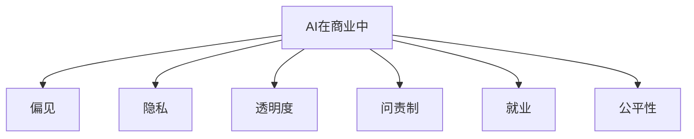
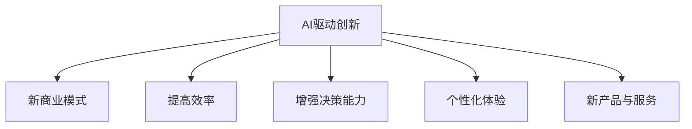

                 

**AI驱动的创新：人类计算在商业中的道德考虑因素与机遇**

## 1. 背景介绍

人工智能（AI）的发展正在重新定义商业世界，为各行各业带来前所未有的机遇和挑战。AI驱动的创新正在改变企业运作的方式，提高效率，增强决策能力，并创造新的商业模式。然而，AI的发展也带来了道德和伦理挑战，需要我们深入思考和解决。本文将探讨AI在商业中的道德考虑因素，并展示AI驱动创新的机遇。

## 2. 核心概念与联系

### 2.1 AI在商业中的道德考虑因素

AI在商业中的道德考虑因素包括偏见、隐私、透明度、问责制、就业和公平性等。这些因素需要企业在开发和部署AI系统时给予充分考虑。



### 2.2 AI驱动创新的机遇

AI驱动创新的机遇包括新的商业模式、提高效率、增强决策能力、个性化体验和新的产品与服务。这些机遇为企业提供了通过AI技术创造价值的途径。



## 3. 核心算法原理 & 具体操作步骤

### 3.1 算法原理概述

本节将介绍一种常用的AI算法——决策树算法。决策树是一种监督学习算法，用于分类和回归问题。它通过构建一系列如果-否则分支来模拟人类决策过程。

### 3.2 算法步骤详解

1. **特征选择**：选择最能区分目标变量的特征。
2. **构建决策树**：从根节点开始，对每个特征进行测试，将数据分成更小的子集。
3. **剪枝**：防止过拟合，通过剪枝技术（如预剪枝或后剪枝）来控制决策树的大小。
4. **预测**：使用构建好的决策树对新数据进行预测。

### 3.3 算法优缺点

**优点**：决策树易于理解和解释，可以处理混合数据类型，并能够处理缺失值。它还可以用于特征选择和特征重要性的评估。

**缺点**：决策树易于过拟合，对噪声和异常值敏感，并且不适合处理线性可分的数据。

### 3.4 算法应用领域

决策树在金融、医疗、电信、零售等行业有广泛应用，用于风险评估、诊断、客户细分、推荐系统等。

## 4. 数学模型和公式 & 详细讲解 & 举例说明

### 4.1 数学模型构建

决策树的数学模型基于信息论和熵的概念。给定一个训练集$D$和一个特征$A$，信息增益$IG(D, A)$定义为：

$$
IG(D, A) = H(D) - H(D|A)
$$

其中，$H(D)$是数据集$D$的熵，$H(D|A)$是条件熵。

### 4.2 公式推导过程

熵$H(D)$定义为：

$$
H(D) = -\sum_{i=1}^{n} p(c_i) \log p(c_i)
$$

其中，$p(c_i)$是类别$c_i$的概率。条件熵$H(D|A)$定义为：

$$
H(D|A) = \sum_{j=1}^{m} p(A = a_j) H(D|A = a_j)
$$

### 4.3 案例分析与讲解

假设我们要构建一个决策树来预测客户是否会流失（目标变量$C$），给定特征$A$（客户年龄）和特征$B$（客户消费金额）。我们可以计算信息增益$IG(D, A)$和$IG(D, B)$，选择信息增益最大的特征作为根节点。

## 5. 项目实践：代码实例和详细解释说明

### 5.1 开发环境搭建

我们将使用Python和scikit-learn库来实现决策树算法。首先，安装必要的库：

```bash
pip install pandas numpy scikit-learn
```

### 5.2 源代码详细实现

```python
from sklearn.model_selection import train_test_split
from sklearn.tree import DecisionTreeClassifier
from sklearn.metrics import accuracy_score
import pandas as pd

# 加载数据
data = pd.read_csv('customer_data.csv')

# 分割数据集
X = data[['Age', 'SpendingScore']]
y = data['Churn']
X_train, X_test, y_train, y_test = train_test_split(X, y, test_size=0.2, random_state=42)

# 创建决策树分类器
clf = DecisionTreeClassifier(random_state=42)

# 拟合模型
clf.fit(X_train, y_train)

# 预测
y_pred = clf.predict(X_test)

# 评估模型
print("Accuracy:", accuracy_score(y_test, y_pred))
```

### 5.3 代码解读与分析

我们首先加载数据集，然后分割数据集为训练集和测试集。接着，我们创建一个决策树分类器，并拟合模型。最后，我们使用测试集进行预测，并评估模型的准确性。

### 5.4 运行结果展示

运行代码后，您将看到决策树模型的准确性。例如：

```
Accuracy: 0.82
```

## 6. 实际应用场景

### 6.1 道德考虑因素的实际应用

在实际应用中，企业需要考虑AI系统的道德影响。例如，在使用AI进行就业匹配时，企业需要确保算法不会导致偏见，并提供透明度，让求职者了解决策过程。在使用AI进行客户分析时，企业需要考虑隐私问题，并遵循相关法规。

### 6.2 AI驱动创新的实际应用

AI驱动创新的实际应用包括个性化推荐系统、智能客服、自动驾驶、医疗诊断等。例如，在零售业，企业可以使用AI进行库存管理和需求预测，从而提高效率和降低成本。

### 6.3 未来应用展望

未来，AI驱动创新将继续改变商业世界。企业需要投资于AI技术，并开发道德和伦理框架，以确保AI系统的安全、公平和透明。

## 7. 工具和资源推荐

### 7.1 学习资源推荐

- 书籍：《人工智能：一种现代方法》作者：斯图尔特·罗素、彼得·诺维格
- 在线课程：Coursera上的“机器学习”课程，由斯坦福大学提供

### 7.2 开发工具推荐

- Python：一个强大的编程语言，广泛用于AI开发
- TensorFlow：一个开源的机器学习库
- Scikit-learn：一个简单易用的机器学习库

### 7.3 相关论文推荐

- “机器学习的伦理挑战”作者：斯图尔特·罗素
- “人工智能伦理：挑战和机遇”作者：马克斯·泰格马克

## 8. 总结：未来发展趋势与挑战

### 8.1 研究成果总结

本文讨论了AI在商业中的道德考虑因素和机遇。我们介绍了决策树算法，并提供了实现代码。我们还讨论了AI在实际应用中的道德和伦理挑战，以及未来的发展趋势。

### 8.2 未来发展趋势

未来，AI将继续渗透到各行各业，为企业带来新的机遇和挑战。企业需要投资于AI技术，并开发道德和伦理框架，以确保AI系统的安全、公平和透明。

### 8.3 面临的挑战

AI在商业中的道德和伦理挑战是当前面临的主要挑战。企业需要解决偏见、隐私、透明度、问责制、就业和公平性等问题。

### 8.4 研究展望

未来的研究将关注AI道德和伦理的进一步发展，包括开发新的道德框架和伦理指南，以指导AI系统的开发和部署。此外，研究还将关注AI技术的进一步发展，包括新的算法和模型，以提高AI系统的性能和可解释性。

## 9. 附录：常见问题与解答

**Q1：AI在商业中的道德考虑因素有哪些？**

**A1：AI在商业中的道德考虑因素包括偏见、隐私、透明度、问责制、就业和公平性等。**

**Q2：决策树算法的优缺点是什么？**

**A2：决策树算法的优点包括易于理解和解释，可以处理混合数据类型，并能够处理缺失值。它还可以用于特征选择和特征重要性的评估。决策树算法的缺点包括易于过拟合，对噪声和异常值敏感，并且不适合处理线性可分的数据。**

**Q3：如何解决AI在商业中的道德挑战？**

**A3：解决AI在商业中的道德挑战需要企业开发道德和伦理框架，确保AI系统的安全、公平和透明。这包括开发新的道德框架和伦理指南，指导AI系统的开发和部署。**

## 作者：禅与计算机程序设计艺术 / Zen and the Art of Computer Programming

**END**

