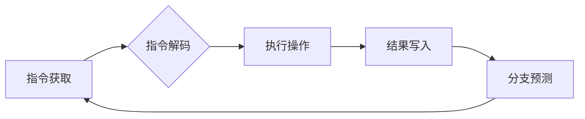

                 

## ARM 架构：嵌入式系统设计

> 关键词：ARM 架构，嵌入式系统，RISC，CPU，寄存器，指令集，内存管理，外设接口，应用场景

## 1. 背景介绍

嵌入式系统是现代社会不可或缺的一部分，它广泛应用于消费电子、工业控制、汽车电子、医疗设备等领域。这些系统通常具有体积小、功耗低、成本低的特点，对性能和可靠性要求较高。ARM 架构作为一种高效、灵活的处理器架构，在嵌入式系统领域占据主导地位。

ARM 架构由英国 ARM 公司开发，其全称是 Advanced RISC Machine，即高级精简指令集计算机。与传统的 CISC (复杂指令集计算机) 架构相比，ARM 架构采用精简指令集，每个指令执行速度快，功耗低，更适合嵌入式系统的应用需求。

ARM 架构的成功源于其开放的许可模式。ARM 公司不直接生产芯片，而是授权其他公司使用其架构设计和生产芯片。这使得 ARM 架构能够快速普及，并不断演进，满足不同应用场景的需求。

## 2. 核心概念与联系

ARM 架构的核心概念包括：

* **RISC (精简指令集)**：ARM 架构采用精简指令集，每个指令执行简单，操作速度快，减少了指令解码和执行的复杂度，从而提高了处理器的性能和效率。
* **Harvard 架构**: ARM 架构采用 Harvard 架构，即指令和数据使用不同的内存空间和总线。这种架构可以同时访问指令和数据，提高了数据传输速度。
* **寄存器优先**: ARM 架构注重寄存器的使用，尽可能将数据存储在寄存器中，减少了内存访问的次数，提高了处理器的速度。
* **流水线**: ARM 架构采用流水线技术，将指令的执行过程分解成多个阶段，并同时执行多个指令的不同的阶段，提高了指令执行的吞吐量。

**ARM 架构流程图**



## 3. 核心算法原理 & 具体操作步骤

### 3.1  算法原理概述

ARM 架构的核心算法原理是基于 RISC 的精简指令集和流水线技术。通过使用精简指令集，每个指令的执行时间短，可以提高指令执行的吞吐量。流水线技术将指令执行过程分解成多个阶段，并同时执行多个指令的不同阶段，进一步提高了指令执行的效率。

### 3.2  算法步骤详解

1. **指令获取**: CPU 从内存中获取一条指令。
2. **指令解码**: CPU 解码指令，确定指令的操作码和操作数。
3. **执行操作**: CPU 根据指令的操作码执行相应的操作，例如加减乘除、逻辑运算、数据移动等。
4. **结果写入**: CPU 将操作结果写入寄存器或内存。
5. **分支预测**: CPU 根据指令的跳转条件预测下一条指令的地址，并提前加载下一条指令。

### 3.3  算法优缺点

**优点**:

* **高性能**: 精简指令集和流水线技术提高了指令执行的吞吐量。
* **低功耗**: 每个指令执行时间短，减少了功耗。
* **灵活可扩展**: 开放的许可模式允许厂商根据需求定制芯片。

**缺点**:

* **指令集有限**: 精简指令集可能无法满足所有应用场景的需求。
* **内存访问效率**: 由于采用 Harvard 架构，内存访问效率可能不如其他架构。

### 3.4  算法应用领域

ARM 架构广泛应用于嵌入式系统领域，例如：

* **消费电子**: 智能手机、平板电脑、智能手表、游戏机等。
* **工业控制**: 自动化设备、机器人、传感器网络等。
* **汽车电子**: 车载信息娱乐系统、驾驶辅助系统、发动机控制系统等。
* **医疗设备**: 医疗影像设备、生命体征监测仪、手术机器人等。

## 4. 数学模型和公式 & 详细讲解 & 举例说明

### 4.1  数学模型构建

ARM 架构的性能可以根据以下数学模型进行评估：

* **指令周期**: 指令执行所需的时间，通常以时钟周期为单位。
* **指令吞吐量**: 每秒钟执行的指令数量，单位为指令/秒 (IPS)。
* **性能**: 指令吞吐量乘以指令的执行时间，单位为指令/秒 (IPS)。

### 4.2  公式推导过程

指令吞吐量 (IPS) 可以通过以下公式计算:

$$IPS = \frac{1}{指令周期}$$

性能 (MIPS) 可以通过以下公式计算:

$$MIPS = IPS * 指令执行时间$$

### 4.3  案例分析与讲解

假设一个 ARM 处理器指令周期为 1 个时钟周期，则其指令吞吐量为 1 IPS。如果指令执行时间为 1 纳秒，则其性能为 1 MIPS。

## 5. 项目实践：代码实例和详细解释说明

### 5.1  开发环境搭建

为了演示 ARM 架构的应用，我们可以使用以下开发环境：

* **交叉编译器**: 用于将 C/C++ 代码编译成 ARM 架构可执行文件。
* **仿真器**: 用于模拟 ARM 处理器的运行环境。
* **开发板**: 用于在实际硬件上运行 ARM 程序。

### 5.2  源代码详细实现

以下是一个简单的 ARM 程序，用于计算两个整数的和:

```assembly
.global _start

_start:
    mov r0, #10  ; 将 10 存储在寄存器 r0
    mov r1, #20  ; 将 20 存储在寄存器 r1
    add r2, r0, r1 ; 将 r0 和 r1 的值相加，结果存储在 r2
    mov r0, #0  ; 将 0 存储在寄存器 r0
    mov r7, #1  ; 将 1 存储在寄存器 r7，表示程序退出
    svc #0       ; 调用系统服务，退出程序
```

### 5.3  代码解读与分析

* `.global _start`: 定义 _start 作为全局符号，表示程序入口点。
* `mov r0, #10`: 将常量 10 存储在寄存器 r0。
* `add r2, r0, r1`: 将寄存器 r0 和 r1 的值相加，结果存储在寄存器 r2。
* `mov r0, #0`: 将常量 0 存储在寄存器 r0。
* `mov r7, #1`: 将常量 1 存储在寄存器 r7，表示程序退出。
* `svc #0`: 调用系统服务，退出程序。

### 5.4  运行结果展示

运行上述程序后，寄存器 r2 将存储值为 30，表示两个整数的和。

## 6. 实际应用场景

ARM 架构在嵌入式系统领域有着广泛的应用场景，例如：

### 6.1  智能手机

智能手机是 ARM 架构应用最成功的案例之一。ARM 处理器在智能手机中提供高性能、低功耗和高效的计算能力，支持各种应用，例如游戏、视频播放、网络浏览等。

### 6.2  物联网设备

物联网设备通常具有体积小、功耗低、成本低的特点，ARM 架构非常适合这些应用场景。ARM 处理器可以为物联网设备提供高效的计算能力，支持各种传感器数据处理、网络通信和应用程序运行。

### 6.3  工业控制系统

工业控制系统需要高可靠性和实时性，ARM 架构可以满足这些需求。ARM 处理器可以为工业控制系统提供稳定的计算能力，支持各种传感器数据采集、控制逻辑执行和数据通信。

### 6.4  未来应用展望

随着物联网、人工智能和边缘计算等技术的快速发展，ARM 架构的应用场景将更加广泛。例如，ARM 处理器可以用于构建更智能的家庭电器、更安全的汽车系统、更强大的工业机器人等。

## 7. 工具和资源推荐

### 7.1  学习资源推荐

* **ARM 官方网站**: https://www.arm.com/
* **ARM 架构技术文档**: https://developer.arm.com/documentation
* **嵌入式系统设计书籍**: 《嵌入式系统设计原理与实践》、《ARM 嵌入式系统编程》

### 7.2  开发工具推荐

* **Keil MDK**: https://www.keil.com/mdk5/
* **IAR Embedded Workbench**: https://www.iar.com/iar-embedded-workbench/
* **GCC 工具链**: https://gcc.gnu.org/

### 7.3  相关论文推荐

* **ARM 架构的演进与发展**: https://ieeexplore.ieee.org/document/7982102
* **ARM 架构在物联网中的应用**: https://ieeexplore.ieee.org/document/8765374

## 8. 总结：未来发展趋势与挑战

### 8.1  研究成果总结

ARM 架构在嵌入式系统领域取得了巨大的成功，其高性能、低功耗和灵活可扩展的特点使其成为嵌入式系统设计的首选架构。

### 8.2  未来发展趋势

未来，ARM 架构将继续朝着以下方向发展：

* **更小更低功耗**: 随着移动设备和物联网设备的普及，对功耗和体积的要求越来越高，ARM 架构将继续优化指令集和架构设计，降低功耗和体积。
* **更强更智能**: 随着人工智能和边缘计算的兴起，ARM 架构将需要提供更强大的计算能力和更智能的处理能力，支持更复杂的应用场景。
* **更安全**: 随着网络安全威胁的增加，ARM 架构将需要加强安全防护机制，保护嵌入式系统的安全性和可靠性。

### 8.3  面临的挑战

ARM 架构也面临着一些挑战：

* **指令集的局限性**: 精简指令集可能无法满足所有应用场景的需求，需要不断扩展指令集，提高指令集的丰富度和灵活性。
* **内存访问效率**: 由于采用 Harvard 架构，内存访问效率可能不如其他架构，需要进一步优化内存管理机制，提高内存访问效率。
* **安全威胁**: 嵌入式系统面临着越来越多的安全威胁，需要加强安全防护机制，保护嵌入式系统的安全性和可靠性。

### 8.4  研究展望

未来，ARM 架构的研究将继续围绕以下几个方面展开：

* **新型指令集设计**: 设计更灵活、更强大的指令集，满足更复杂的应用场景需求。
* **内存管理优化**: 优化内存管理机制，提高内存访问效率和安全性。
* **安全防护技术**: 研究和开发新的安全防护技术，保护嵌入式系统的安全性和可靠性。


## 9. 附录：常见问题与解答

### 9.1  ARM 架构和 RISC 架构有什么区别？

ARM 架构是一种具体的处理器架构，而 RISC 是指精简指令集计算机的一种设计理念。ARM 架构采用 RISC 的设计理念，但它不仅仅是 RISC 架构，它还包含了特定的指令集、寄存器结构和内存管理机制等。

### 9.2  ARM 架构的优势有哪些？

ARM 架构的优势包括：

* **高性能**: 精简指令集和流水线技术提高了指令执行的吞吐量。
* **低功耗**: 每个指令执行时间短，减少了功耗。
* **灵活可扩展**: 开放的许可模式允许厂商根据需求定制芯片。

### 9.3  ARM 架构的应用场景有哪些？

ARM 架构广泛应用于嵌入式系统领域，例如：

* **消费电子**: 智能手机、平板电脑、智能手表、游戏机等。
* **工业控制**: 自动化设备、机器人、传感器网络等。
* **汽车电子**: 车载信息娱乐系统、驾驶辅助系统、发动机控制系统等。
* **医疗设备**: 医疗影像设备、生命体征监测仪、手术机器人等。


作者：禅与计算机程序设计艺术 / Zen and the Art of Computer Programming 
<end_of_turn>

