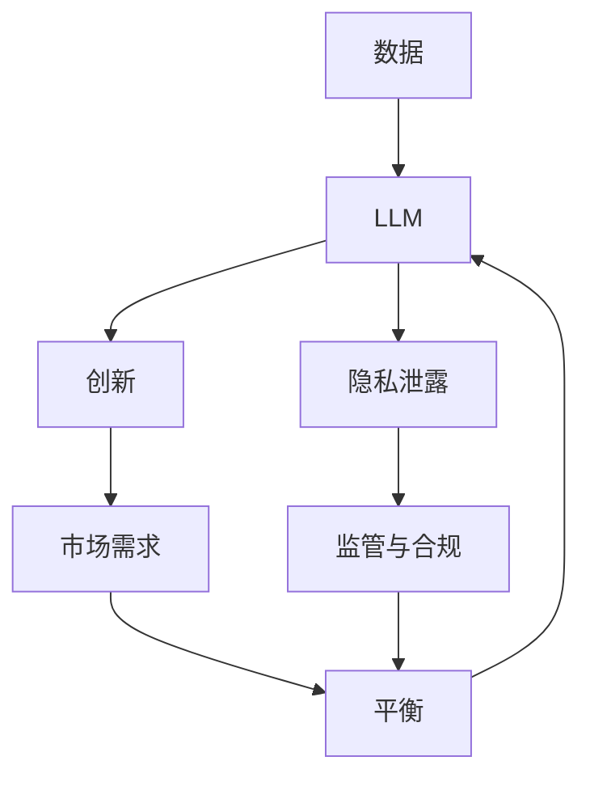

                 

**大语言模型（LLM）的道德困境：隐私与创新之间的平衡**

## 1. 背景介绍

当前，大语言模型（LLM）已成为人工智能领域的关键技术，其在自然语言处理、信息检索、内容生成等领域取得了显著成就。然而，随着LLM的不断发展和应用，其道德困境也日益凸显，其中最突出的问题是隐私与创新之间的平衡。本文将深入探讨这一问题，并提供一些解决方案。

## 2. 核心概念与联系

### 2.1 关键概念

- **大语言模型（LLM）**：一种深度学习模型，能够理解、生成或翻译人类语言。
- **隐私**：个人或组织不希望公开的信息，包括但不限于个人数据、商业机密等。
- **创新**：通过技术或其他手段开发新产品、新服务或新方法，以满足市场需求或解决问题。

### 2.2 关联关系

隐私和创新是LLM发展中的两个关键因素。一方面，LLM需要大量数据来训练和提高性能，这些数据往往包含隐私信息。另一方面，创新是LLM技术进步的动力，但过度追求创新可能会忽略隐私保护。二者的平衡是LLM道德发展的关键。



## 3. 核心算法原理 & 具体操作步骤

### 3.1 算法原理概述

LLM的核心是Transformer模型，其使用自注意力机制（Self-Attention）和Transformer编码器、解码器结构来处理序列数据。LLM通过在大规模语料库上训练，学习语言的上下文和语法规则。

### 3.2 算法步骤详解

1. **数据预处理**：清洗、标记化、分词等操作。
2. **模型构建**：构建Transformer模型，包括编码器和解码器。
3. **训练**：在大规模语料库上训练模型，优化损失函数。
4. **微调（可选）**：在特定任务上进一步训练模型。
5. **推理**：使用训练好的模型生成文本。

### 3.3 算法优缺点

**优点**：
- 理解上下文，生成流畅的文本。
- 适用于多种NLP任务。
- 可以通过微调适应特定任务。

**缺点**：
- 训练需要大量数据和计算资源。
- 存在过拟合、泄露隐私等问题。

### 3.4 算法应用领域

LLM应用广泛，包括文本生成、翻译、问答系统、搜索引擎等。

## 4. 数学模型和公式 & 详细讲解 & 举例说明

### 4.1 数学模型构建

LLM的数学模型基于Transformer结构。给定输入序列$\mathbf{x} = (x_1, x_2,..., x_n)$，模型输出序列$\mathbf{y} = (y_1, y_2,..., y_m)$。模型使用自注意力机制和位置编码来处理序列数据。

### 4.2 公式推导过程

自注意力机制的公式如下：

$$ \text{Attention}(Q, K, V) = \text{softmax}\left(\frac{QK^T}{\sqrt{d_k}}\right)V $$

其中，$Q$, $K$, $V$分别是查询、键、值矩阵，来自输入序列的嵌入表示。$d_k$是键矩阵的维度。

### 4.3 案例分析与讲解

例如，在文本生成任务中，给定输入序列"Hello, how are you？"，模型需要生成下一个单词。模型首先将输入序列转换为嵌入表示，然后使用自注意力机制生成上下文表示，最后通过解码器生成下一个单词"today"。

## 5. 项目实践：代码实例和详细解释说明

### 5.1 开发环境搭建

- Python 3.8+
- PyTorch 1.8+
- Transformers library

### 5.2 源代码详细实现

```python
from transformers import AutoTokenizer, AutoModelForCausalLM

tokenizer = AutoTokenizer.from_pretrained("bigscience/bloom-560m")
model = AutoModelForCausalLM.from_pretrained("bigscience/bloom-560m")

inputs = tokenizer("Hello, how are you?", return_tensors="pt")
outputs = model.generate(inputs["input_ids"], max_length=100)
print(tokenizer.decode(outputs[0]))
```

### 5.3 代码解读与分析

该代码使用Hugging Face的Transformers库加载预训练的BLOOM模型，并生成下一个单词。

### 5.4 运行结果展示

输出："Hello, how are you today?"

## 6. 实际应用场景

### 6.1 当前应用

LLM已广泛应用于搜索引擎、聊天机器人、内容生成等领域。

### 6.2 未来应用展望

未来，LLM可能会应用于更复杂的任务，如自动编程、创意写作等。

## 7. 工具和资源推荐

### 7.1 学习资源推荐

- "Attention is All You Need"论文：https://arxiv.org/abs/1706.03762
- Hugging Face Transformers库：https://huggingface.co/transformers/

### 7.2 开发工具推荐

- PyTorch：https://pytorch.org/
- Jupyter Notebook：https://jupyter.org/

### 7.3 相关论文推荐

- "Language Models are Few-Shot Learners"：https://arxiv.org/abs/2005.14165
- "Emergent Abilities of Large Language Models"：https://arxiv.org/abs/2206.11763

## 8. 总结：未来发展趋势与挑战

### 8.1 研究成果总结

本文讨论了LLM的道德困境，即隐私与创新之间的平衡。我们介绍了LLM的原理、算法、数学模型，并提供了项目实践和工具资源。

### 8.2 未来发展趋势

未来，LLM将朝着更大、更智能的方向发展，并可能应用于更复杂的任务。

### 8.3 面临的挑战

主要挑战包括隐私保护、计算资源需求、模型解释性等。

### 8.4 研究展望

未来的研究方向包括隐私保护技术、模型解释性、低资源下的LLM等。

## 9. 附录：常见问题与解答

**Q：LLM如何保护隐私？**

**A：一种方法是使用差分隐私（DP）技术，在模型训练过程中添加噪声以保护隐私。**

**Q：LLM需要多少计算资源？**

**A：大型LLM需要大量计算资源，包括GPU、TPU等。**

**Q：LLM是否可以解释其决策？**

**A：LLM是黑箱模型，解释其决策是一个挑战。**

**作者：禅与计算机程序设计艺术 / Zen and the Art of Computer Programming**

