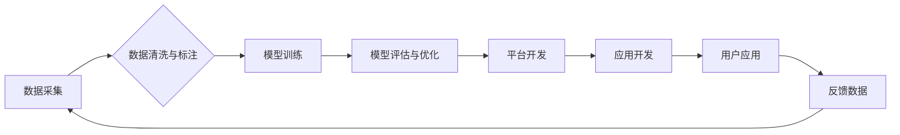

                 

## LLM全产业链：AI领域的新格局

> 关键词：LLM、大语言模型、全产业链、AI应用、商业模式、技术趋势、伦理挑战

### 1. 背景介绍

近年来，人工智能（AI）技术取得了飞速发展，其中大语言模型（LLM）作为AI领域最具潜力的技术之一，展现出强大的文本生成、理解和翻译能力。从ChatGPT的爆火到各行各业对LLM的积极探索，我们已经进入了一个以LLM为核心的新时代。

LLM的强大能力催生了围绕其构建的全产业链生态系统，涵盖了模型训练、平台开发、应用开发、数据服务等多个环节。这一全产业链的形成，不仅推动了LLM技术的快速迭代，也为各行各业带来了全新的商业机遇和发展模式。

### 2. 核心概念与联系

**2.1  LLM概述**

大语言模型（LLM）是一种基于深度学习的强大人工智能模型，能够理解和生成人类语言。它通过训练海量文本数据，学习语言的语法、语义和上下文关系，从而具备强大的文本处理能力。

**2.2  全产业链架构**

LLM全产业链的架构可以概括为以下几个主要环节：

* **模型训练:** 训练高性能的LLM模型需要大量的计算资源和高质量的训练数据。
* **平台开发:** 提供LLM模型的调用接口和服务，方便开发者进行应用开发。
* **应用开发:** 利用LLM模型开发各种应用，例如聊天机器人、文本生成、翻译、问答系统等。
* **数据服务:** 提供高质量的文本数据用于模型训练和应用开发。

**2.3  LLM全产业链流程图**



### 3. 核心算法原理 & 具体操作步骤

**3.1  算法原理概述**

LLM的核心算法是基于Transformer网络结构的深度学习模型。Transformer网络通过自注意力机制，能够捕捉文本序列中长距离依赖关系，从而实现更准确的文本理解和生成。

**3.2  算法步骤详解**

1. **数据预处理:** 将原始文本数据进行清洗、分词、标记等预处理操作，使其能够被模型理解。
2. **模型训练:** 使用训练数据训练Transformer网络模型，通过反向传播算法不断调整模型参数，使其能够生成更准确的文本输出。
3. **模型评估:** 使用测试数据评估模型的性能，例如准确率、流畅度等指标。
4. **模型优化:** 根据评估结果，对模型结构、参数进行调整，提高模型性能。

**3.3  算法优缺点**

**优点:**

* 能够捕捉长距离依赖关系，实现更准确的文本理解和生成。
* 训练效率高，能够在较短时间内训练出高性能模型。

**缺点:**

* 训练成本高，需要大量的计算资源和数据。
* 模型参数量大，部署和推理成本较高。

**3.4  算法应用领域**

LLM算法广泛应用于以下领域：

* **自然语言处理:** 文本分类、情感分析、机器翻译、问答系统等。
* **生成式AI:** 文本生成、代码生成、图像生成等。
* **对话系统:** 聊天机器人、虚拟助手等。
* **搜索引擎:** 搜索结果排序、文本摘要等。

### 4. 数学模型和公式 & 详细讲解 & 举例说明

**4.1  数学模型构建**

LLM模型通常基于Transformer网络结构，其核心是自注意力机制。自注意力机制通过计算每个词与所有其他词之间的相关性，来捕捉文本序列中的长距离依赖关系。

**4.2  公式推导过程**

自注意力机制的计算过程可以概括为以下公式：

$$
Attention(Q, K, V) = softmax(\frac{QK^T}{\sqrt{d_k}})V
$$

其中：

* $Q$：查询矩阵
* $K$：键矩阵
* $V$：值矩阵
* $d_k$：键向量的维度
* $softmax$：softmax函数

**4.3  案例分析与讲解**

假设我们有一个句子“我爱吃苹果”，其词向量表示为：

* 我：[0.1, 0.2, 0.3]
* 爱：[0.4, 0.5, 0.6]
* 吃：[0.7, 0.8, 0.9]
* 苹果：[1.0, 1.1, 1.2]

通过自注意力机制，我们可以计算每个词与所有其他词之间的相关性，例如“我”与“苹果”之间的相关性。

### 5. 项目实践：代码实例和详细解释说明

**5.1  开发环境搭建**

LLM开发环境通常需要以下软件：

* Python编程语言
* TensorFlow或PyTorch深度学习框架
* CUDA和cuDNN加速库

**5.2  源代码详细实现**

以下是一个简单的LLM文本生成代码示例，使用PyTorch框架：

```python
import torch
import torch.nn as nn

class SimpleLLM(nn.Module):
    def __init__(self, vocab_size, embedding_dim, hidden_dim):
        super(SimpleLLM, self).__init__()
        self.embedding = nn.Embedding(vocab_size, embedding_dim)
        self.lstm = nn.LSTM(embedding_dim, hidden_dim)
        self.fc = nn.Linear(hidden_dim, vocab_size)

    def forward(self, x):
        embedded = self.embedding(x)
        output, (hidden, cell) = self.lstm(embedded)
        output = self.fc(output[:, -1, :])
        return output

# 模型参数
vocab_size = 10000
embedding_dim = 128
hidden_dim = 256

# 实例化模型
model = SimpleLLM(vocab_size, embedding_dim, hidden_dim)

# 输入文本
input_text = torch.tensor([1, 2, 3])

# 模型输出
output = model(input_text)

# 打印输出
print(output)
```

**5.3  代码解读与分析**

该代码示例定义了一个简单的LLM模型，包含嵌入层、LSTM层和全连接层。

* 嵌入层将单词转换为向量表示。
* LSTM层捕捉文本序列中的长距离依赖关系。
* 全连接层将LSTM输出映射到词汇表，生成下一个单词的预测概率。

**5.4  运行结果展示**

运行该代码会输出一个包含预测概率的向量，表示模型对下一个单词的预测。

### 6. 实际应用场景

**6.1  聊天机器人**

LLM可以用于构建更智能、更自然的聊天机器人，能够理解用户意图，并提供更精准的回复。

**6.2  文本生成**

LLM可以用于生成各种类型的文本，例如文章、故事、诗歌等，为内容创作提供新的可能性。

**6.3  机器翻译**

LLM可以用于实现更准确、更流畅的机器翻译，突破语言障碍，促进跨文化交流。

**6.4  未来应用展望**

LLM的应用场景还在不断扩展，未来将可能应用于：

* **个性化教育:** 根据学生的学习情况，提供个性化的学习内容和辅导。
* **医疗诊断:** 辅助医生进行疾病诊断，提高诊断准确率。
* **法律服务:** 自动生成法律文件，提高法律服务效率。

### 7. 工具和资源推荐

**7.1  学习资源推荐**

* **书籍:**

    * 《深度学习》
    * 《自然语言处理》
    * 《Transformer网络》

* **在线课程:**

    * Coursera
    * edX
    * fast.ai

**7.2  开发工具推荐**

* **深度学习框架:** TensorFlow, PyTorch
* **文本处理工具:** NLTK, spaCy
* **云平台:** AWS, Azure, GCP

**7.3  相关论文推荐**

* 《Attention Is All You Need》
* 《BERT: Pre-training of Deep Bidirectional Transformers for Language Understanding》
* 《GPT-3: Language Models are Few-Shot Learners》

### 8. 总结：未来发展趋势与挑战

**8.1  研究成果总结**

近年来，LLM技术取得了显著进展，模型规模不断扩大，性能不断提升。

**8.2  未来发展趋势**

* **模型规模化:** 模型规模将继续扩大，带来更强大的能力。
* **多模态学习:** LLM将与其他模态数据（图像、音频等）融合，实现更全面的理解和生成。
* **可解释性增强:** 研究更有效的LLM可解释性方法，提高模型透明度和可信度。

**8.3  面临的挑战**

* **数据安全和隐私:** LLM训练需要大量数据，如何保证数据安全和隐私是一个重要挑战。
* **模型偏见和歧视:** LLM模型可能存在偏见和歧视，需要采取措施进行缓解。
* **伦理问题:** LLM的应用可能带来伦理问题，例如虚假信息生成、滥用等，需要进行深入探讨和规范。

**8.4  研究展望**

未来，LLM研究将继续朝着更安全、更可靠、更可解释的方向发展，为人类社会带来更多福祉。

### 9. 附录：常见问题与解答

**9.1  LLM模型训练需要多少数据？**

LLM模型训练需要海量数据，通常需要数十亿甚至数千亿个单词。

**9.2  LLM模型训练需要多少计算资源？**

LLM模型训练需要大量的计算资源，通常需要数百甚至数千个GPU。

**9.3  LLM模型的应用场景有哪些？**

LLM模型的应用场景非常广泛，包括聊天机器人、文本生成、机器翻译、问答系统等。


作者：禅与计算机程序设计艺术 / Zen and the Art of Computer Programming 
<end_of_turn>

