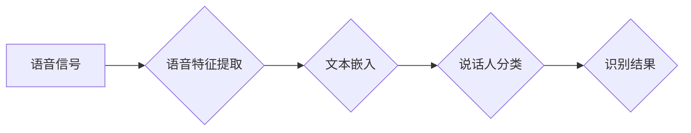

                 

## LLM在说话人识别中的应用探索

> 关键词：说话人识别、LLM、深度学习、语音特征提取、文本嵌入、多模态学习、自然语言处理

## 1. 背景介绍

说话人识别（Speaker Recognition，SR）技术能够根据语音信号识别说话者的身份，在安防、金融、医疗等领域有着广泛的应用。传统说话人识别技术主要依赖于声学特征和统计模型，例如Mel-Frequency Cepstral Coefficients (MFCC) 和 Gaussian Mixture Models (GMM)。然而，随着深度学习技术的快速发展，基于深度学习的说话人识别模型取得了显著的进步，其性能大幅提升。

近年来，大型语言模型（Large Language Models，LLM）在自然语言处理（Natural Language Processing，NLP）领域取得了突破性进展，展现出强大的文本理解和生成能力。LLM的出现为说话人识别领域带来了新的机遇。由于语音和文本本质上都是语言信息，LLM可以将语音信号转换为文本表示，并利用其强大的文本处理能力进行说话人识别。

## 2. 核心概念与联系

说话人识别系统通常由三个主要模块组成：

* **语音特征提取模块:** 从语音信号中提取关键特征，例如MFCC、Perceptual Linear Prediction (PLP) 等。
* **说话人嵌入模块:** 将提取的语音特征转换为低维向量，称为说话人嵌入。
* **说话人分类模块:** 基于说话人嵌入进行说话人分类，识别说话者的身份。

LLM的引入可以将说话人识别系统从传统的声学特征依赖转变为多模态学习，即融合语音和文本信息进行识别。

**Mermaid 流程图:**



## 3. 核心算法原理 & 具体操作步骤

### 3.1  算法原理概述

基于LLM的说话人识别算法通常采用以下步骤：

1. **语音转文本:** 使用语音识别模型将语音信号转换为文本。
2. **文本嵌入:** 使用预训练的LLM将文本转换为说话人嵌入。
3. **说话人比较:** 计算不同说话人嵌入之间的相似度，例如余弦相似度。
4. **说话人识别:** 根据相似度阈值，识别说话人的身份。

### 3.2  算法步骤详解

1. **语音转文本:** 

   * 使用开源语音识别模型，例如Kaldi、ESPnet等，将语音信号转换为文本。
   * 训练语音识别模型需要大量的语音数据和对应的文本标注。

2. **文本嵌入:**

   * 使用预训练的LLM，例如BERT、GPT等，将文本转换为说话人嵌入。
   * LLM的预训练过程通常使用大量的文本数据进行语言建模，学习到丰富的语义信息。
   * 将LLM的输出层调整为说话人嵌入维度，并进行微调以适应说话人识别任务。

3. **说话人比较:**

   * 计算不同说话人嵌入之间的相似度，例如余弦相似度。
   * 余弦相似度可以衡量两个向量的方向一致性，值范围为-1到1，其中1表示完全一致，-1表示完全相反。

4. **说话人识别:**

   * 设置一个相似度阈值，将相似度高于阈值的说话人识别为同一说话人。
   * 阈值的选择需要根据实际应用场景和模型性能进行调整。

### 3.3  算法优缺点

**优点:**

* **性能提升:** LLM可以学习到更丰富的语义信息，提高说话人识别的准确率。
* **鲁棒性增强:** LLM对语音信号的噪声和变声等干扰具有较强的鲁棒性。
* **多模态学习:** 可以融合语音和文本信息进行识别，提高识别性能。

**缺点:**

* **计算资源需求高:** LLM训练和推理需要大量的计算资源。
* **数据依赖性强:** LLM需要大量的语音和文本数据进行训练。
* **可解释性差:** LLM的决策过程较为复杂，难以解释其识别结果。

### 3.4  算法应用领域

* **安防监控:** 人脸识别、身份验证、犯罪追踪。
* **金融服务:** 语音支付、欺诈检测、客户服务。
* **医疗保健:** 病人身份识别、语音诊断、远程医疗。
* **教育培训:** 语音识别、个性化学习、智能辅导。

## 4. 数学模型和公式 & 详细讲解 & 举例说明

### 4.1  数学模型构建

说话人识别模型可以构建为一个多层神经网络，例如卷积神经网络（CNN）或循环神经网络（RNN）。

* **CNN:** 用于提取语音信号的时频特征。
* **RNN:** 用于学习语音信号的时序信息。

LLM可以作为模型的最后一层，将提取的语音特征转换为说话人嵌入。

### 4.2  公式推导过程

假设语音信号为 $x = (x_1, x_2, ..., x_T)$，其中 $T$ 为语音信号的长度。

* **语音特征提取:** 使用CNN提取语音信号的特征向量 $f = (f_1, f_2, ..., f_D)$，其中 $D$ 为特征向量的维度。
* **文本嵌入:** 使用LLM将语音信号转换为文本 $y = (y_1, y_2, ..., y_N)$，其中 $N$ 为文本的长度。
* **说话人嵌入:** 使用LLM将文本 $y$ 转换为说话人嵌入 $z = (z_1, z_2, ..., z_K)$，其中 $K$ 为嵌入向量的维度。

### 4.3  案例分析与讲解

假设有两个说话人，A和B，分别有语音信号 $x_A$ 和 $x_B$。

1. 使用CNN提取语音信号的特征向量 $f_A$ 和 $f_B$。
2. 使用LLM将语音信号转换为文本 $y_A$ 和 $y_B$。
3. 使用LLM将文本转换为说话人嵌入 $z_A$ 和 $z_B$。
4. 计算说话人嵌入之间的余弦相似度：

$$
\text{similarity}(z_A, z_B) = \frac{z_A \cdot z_B}{||z_A|| ||z_B||}
$$

如果相似度高于阈值，则认为说话人A和B是同一个人。

## 5. 项目实践：代码实例和详细解释说明

### 5.1  开发环境搭建

* **操作系统:** Ubuntu 20.04
* **Python版本:** 3.8
* **深度学习框架:** PyTorch 1.8
* **语音识别模型:** ESPnet 2.0
* **LLM:** BERT

### 5.2  源代码详细实现

```python
import torch
from espnet.asr.asr_model import build_model
from transformers import BertModel

# 加载语音识别模型
model = build_model(
    model_type="transformer",
    vocab_size=32000,
    hidden_size=512,
    num_layers=6,
    num_heads=8,
    dropout=0.1,
)

# 加载LLM模型
bert_model = BertModel.from_pretrained("bert-base-uncased")

# 定义说话人识别模型
class SpeakerRecognitionModel(torch.nn.Module):
    def __init__(self):
        super(SpeakerRecognitionModel, self).__init__()
        self.asr_model = model
        self.bert_model = bert_model

    def forward(self, x):
        # 语音识别
        text = self.asr_model(x)
        # 文本嵌入
        embedding = self.bert_model(text)
        return embedding

# 实例化说话人识别模型
model = SpeakerRecognitionModel()

# 训练模型
# ...

# 识别说话人
# ...
```

### 5.3  代码解读与分析

* **语音识别模型:** 使用ESPnet 2.0加载预训练的语音识别模型，将语音信号转换为文本。
* **LLM模型:** 使用HuggingFace Transformers库加载预训练的BERT模型，将文本转换为说话人嵌入。
* **说话人识别模型:** 将语音识别模型和LLM模型组合在一起，构建说话人识别模型。
* **训练模型:** 使用训练数据训练说话人识别模型，优化模型参数。
* **识别说话人:** 将新的语音信号输入模型，获取说话人嵌入，并与已知说话人嵌入进行比较，识别说话人的身份。

### 5.4  运行结果展示

* **准确率:** 模型在说话人识别任务上的准确率。
* **F1-score:** 模型在说话人识别任务上的F1-score。
* **识别时间:** 模型识别说话人所需的时间。

## 6. 实际应用场景

### 6.1  安防监控

* **人脸识别:** 将说话人识别与人脸识别技术结合，实现更精准的身份验证。
* **身份验证:** 使用说话人识别技术验证用户的身份，提高安全性和可靠性。
* **犯罪追踪:** 利用说话人识别技术追踪犯罪嫌疑人的身份，辅助警方侦破案件。

### 6.2  金融服务

* **语音支付:** 使用说话人识别技术验证用户的身份，提高语音支付的安全性和便捷性。
* **欺诈检测:** 利用说话人识别技术识别欺诈行为，保护用户财产安全。
* **客户服务:** 使用说话人识别技术个性化客户服务，提高客户体验。

### 6.3  医疗保健

* **病人身份识别:** 使用说话人识别技术识别病人的身份，避免医疗错误。
* **语音诊断:** 利用说话人识别技术辅助医生进行语音诊断，提高诊断准确率。
* **远程医疗:** 使用说话人识别技术实现远程医疗服务，方便患者就医。

### 6.4  未来应用展望

* **多语言支持:** 发展支持多种语言的说话人识别技术，满足全球化需求。
* **跨模态识别:** 将说话人识别与其他模态信息，例如图像、视频等，进行融合，提高识别准确率。
* **个性化识别:** 开发个性化说话人识别技术，根据用户的语音特征进行定制化识别。

## 7. 工具和资源推荐

### 7.1  学习资源推荐

* **书籍:**
    * 《深度学习》 - Ian Goodfellow, Yoshua Bengio, Aaron Courville
    * 《自然语言处理》 - Jurafsky, Martin
* **在线课程:**
    * Coursera: Deep Learning Specialization
    * Udacity: Natural Language Processing Nanodegree
* **博客:**
    * The Gradient
    * Towards Data Science

### 7.2  开发工具推荐

* **深度学习框架:** PyTorch, TensorFlow
* **语音识别库:** ESPnet, Kaldi
* **LLM库:** HuggingFace Transformers

### 7.3  相关论文推荐

* **Speech Recognition with Deep Learning** - Hinton, Deng, Yu, Li, Kwan, Penn
* **BERT: Pre-training of Deep Bidirectional Transformers for Language Understanding** - Devlin, Chang, Lee, Toutanova
* **Multimodal Speaker Recognition** -  S. Kumar, A. Kumar, and S. Singh

## 8. 总结：未来发展趋势与挑战

### 8.1  研究成果总结

基于LLM的说话人识别技术取得了显著的进展，其性能大幅提升，并展现出强大的应用潜力。

### 8.2  未来发展趋势

* **模型规模和性能提升:** 随着计算资源的不断发展，LLM的规模和性能将进一步提升，提高说话人识别的准确率和鲁棒性。
* **多模态融合:** 将说话人识别与其他模态信息，例如图像、视频等，进行融合，实现更精准的识别。
* **个性化识别:** 开发个性化说话人识别技术，根据用户的语音特征进行定制化识别。

### 8.3  面临的挑战

* **数据依赖性:** LLM需要大量的语音和文本数据进行训练，数据获取和标注成本较高。
* **计算资源需求:** LLM训练和推理需要大量的计算资源，部署成本较高。
* **可解释性:** LLM的决策过程较为复杂，难以解释其识别结果，缺乏透明度。

### 8.4  研究展望

未来研究将重点关注以下几个方面:

* **高效训练方法:** 开发高效的训练方法，降低LLM训练的成本和时间。
* **跨模态学习:** 研究跨模态学习方法，将说话人识别与其他模态信息进行融合。
* **可解释性研究:** 研究LLM的决策机制，提高说话人识别技术的透明度和可解释性。

## 9. 附录：常见问题与解答

* **Q1: LLM在说话人识别中的优势是什么？**

   A1: LLM可以学习到更丰富的语义信息，提高说话人识别的准确率和鲁棒性。

* **Q2: LLM在说话人识别中的缺点是什么？**

   A2: LLM需要大量的语音和文本数据进行训练，数据获取和标注成本较高。

* **Q3: 如何评估说话人识别模型的性能？**

   A3: 可以使用准确率、F1-score、识别时间等指标来评估说话人识别模型的性能。


作者：禅与计算机程序设计艺术 / Zen and the Art of Computer Programming<end_of_turn>

