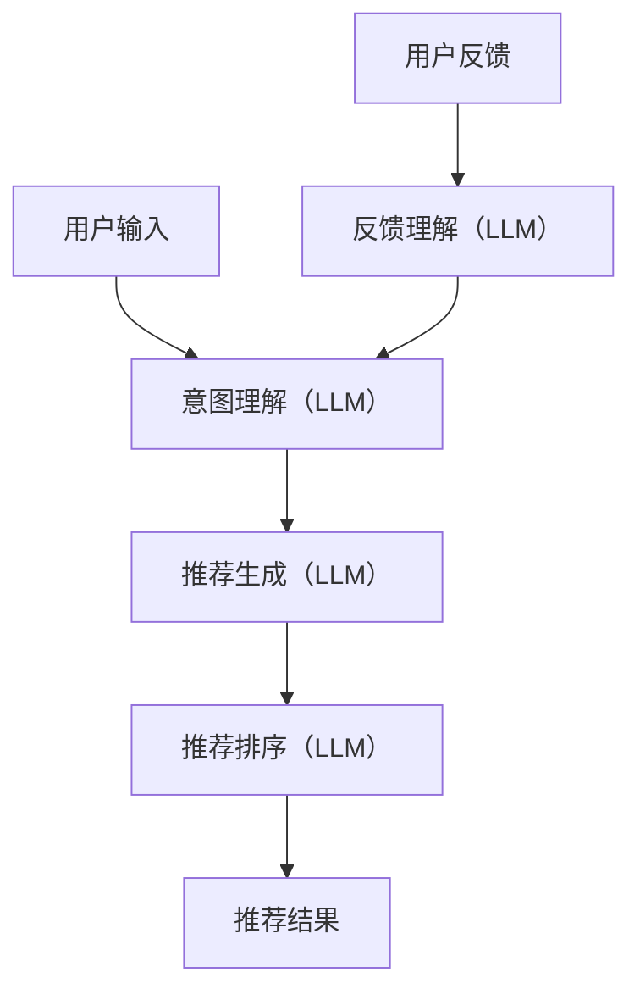
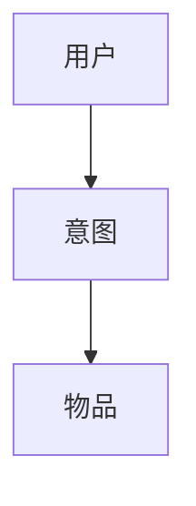

                 

**大语言模型（LLM）推荐中的多场景适配技术**

## 1. 背景介绍

随着大语言模型（LLM）的发展，它们在各种推荐系统中的应用日益广泛。然而，推荐系统需要适配各种场景，以提供个性化、有针对性的推荐。本文将探讨LLM推荐中的多场景适配技术，包括核心概念、算法原理、数学模型，并提供项目实践和工具推荐。

## 2. 核心概念与联系

### 2.1 多场景适配

多场景适配指的是根据用户、物品、上下文等因素，动态调整推荐算法以提供最佳推荐结果的能力。这包括但不限于：

- **用户场景**：根据用户的兴趣、偏好、行为等提供个性化推荐。
- **物品场景**：根据物品的属性、特征等提供相关推荐。
- **上下文场景**：根据时间、地点、设备等上下文因素提供相关推荐。

### 2.2 LLM在推荐中的作用

LLM可以理解、生成和推理人类语言，这使它们成为推荐系统的强大组成部分。它们可以：

- **理解用户意图**：通过自然语言处理（NLP）技术，LLM可以理解用户的搜索查询、反馈等，从而获取用户的偏好和意图。
- **生成推荐结果**：LLM可以生成推荐结果的文本描述，如推荐商品的简介或推荐电影的故事情节。
- **推理和排序**：LLM可以根据用户反馈和物品特征进行推理，并排序推荐结果。

### 2.3 核心架构

下图展示了LLM推荐系统的核心架构：



## 3. 核心算法原理 & 具体操作步骤

### 3.1 算法原理概述

LLM推荐算法的核心是利用LLM的理解、生成和推理能力，结合传统推荐算法，动态适配各种场景。常用的算法包括：

- **意图理解**：使用LLM进行文本分类、实体识别等NLP任务，理解用户意图。
- **推荐生成**：使用LLM生成推荐结果的文本描述，如商品简介或电影故事情节。
- **推荐排序**：使用LLM进行推理，结合用户反馈和物品特征，排序推荐结果。

### 3.2 算法步骤详解

1. **意图理解**：
   - 将用户输入（如搜索查询或反馈）输入LLM。
   - 使用LLM进行文本分类、实体识别等NLP任务，理解用户意图。
   - 将用户意图输入推荐生成模块。

2. **推荐生成**：
   - 根据用户意图，从物品库中选择相关物品。
   - 使用LLM生成推荐结果的文本描述。
   - 将推荐结果输入推荐排序模块。

3. **推荐排序**：
   - 结合用户反馈和物品特征，使用LLM进行推理，排序推荐结果。
   - 将排序后的推荐结果输出给用户。

### 3.3 算法优缺点

**优点**：

- LLM可以理解和生成人类语言，提供更人性化的推荐结果。
- LLM可以进行推理，结合用户反馈和物品特征，提供更准确的推荐结果。

**缺点**：

- LLM计算开销大，需要优化算法以提高效率。
- LLM模型可能存在偏见，需要进行偏见检测和校正。

### 3.4 算法应用领域

LLM推荐算法可以应用于各种推荐系统，包括但不限于：

- 电子商务推荐系统：推荐商品、服务等。
- 视频推荐系统：推荐视频、电影等。
- 新闻推荐系统：推荐新闻、文章等。
- 音乐推荐系统：推荐音乐、歌手等。

## 4. 数学模型和公式 & 详细讲解 & 举例说明

### 4.1 数学模型构建

我们可以使用概率图模型构建LLM推荐系统的数学模型。假设用户-物品-意图三者之间存在联系，我们可以构建如下图所示的Bayesian Network：



### 4.2 公式推导过程

根据Bayesian Network，我们可以推导出以下公式：

- **意图理解**：$P(I|U) = \frac{P(U|I)P(I)}{P(U)}$，其中$U$是用户输入，$I$是用户意图。
- **推荐生成**：$P(R|I) = \prod_{r\in R}P(r|I)$，其中$R$是推荐结果集，$r$是推荐结果。
- **推荐排序**：$P(R|U) = \sum_{I}P(R|I)P(I|U)$，其中$P(R|I)$是根据意图生成的推荐结果的概率，$P(I|U)$是用户意图的概率。

### 4.3 案例分析与讲解

假设用户输入“推荐一部好看的科幻电影”，意图理解模块输出意图为“推荐科幻电影”。推荐生成模块根据意图从物品库中选择相关电影，并生成推荐结果的文本描述。推荐排序模块结合用户反馈和电影特征，排序推荐结果，并输出给用户。

## 5. 项目实践：代码实例和详细解释说明

### 5.1 开发环境搭建

我们将使用Python开发环境，并安装必要的库，如Transformers（用于LLM）、Scikit-learn（用于传统推荐算法）、Numpy（用于数学运算）等。

### 5.2 源代码详细实现

以下是意图理解、推荐生成和推荐排序模块的伪代码实现：

**意图理解模块**

```python
def understand_intent(user_input, model):
    # 使用LLM理解用户意图
    intent = model.predict(user_input)
    return intent
```

**推荐生成模块**

```python
def generate_recommendations(intent, item_database, model):
    # 根据意图从物品库中选择相关物品
    relevant_items = item_database[intent]
    # 使用LLM生成推荐结果的文本描述
    recommendations = model.generate(relevant_items)
    return recommendations
```

**推荐排序模块**

```python
def sort_recommendations(user_feedback, recommendations, model):
    # 结合用户反馈和物品特征，使用LLM进行推理，排序推荐结果
    sorted_recommendations = model.sort(recommendations, user_feedback)
    return sorted_recommendations
```

### 5.3 代码解读与分析

在意图理解模块中，我们使用LLM理解用户意图。在推荐生成模块中，我们根据意图从物品库中选择相关物品，并使用LLM生成推荐结果的文本描述。在推荐排序模块中，我们结合用户反馈和物品特征，使用LLM进行推理，排序推荐结果。

### 5.4 运行结果展示

运行上述代码后，我们可以得到排序后的推荐结果。这些结果可以展示给用户，并根据用户反馈不断优化推荐算法。

## 6. 实际应用场景

### 6.1 用户场景

LLM推荐算法可以根据用户的兴趣、偏好、行为等提供个性化推荐。例如，在电子商务平台上，LLM可以理解用户的搜索查询，并根据用户的购买历史和浏览记录提供个性化推荐。

### 6.2 物品场景

LLM推荐算法可以根据物品的属性、特征等提供相关推荐。例如，在视频推荐平台上，LLM可以理解视频的内容、类型等，并根据用户的兴趣提供相关推荐。

### 6.3 上下文场景

LLM推荐算法可以根据时间、地点、设备等上下文因素提供相关推荐。例如，在新闻推荐平台上，LLM可以理解用户的地理位置，并提供当地新闻推荐。

### 6.4 未来应用展望

未来，LLM推荐算法可以结合更多因素，如用户的情感状态、环境因素等，提供更智能、更个性化的推荐结果。此外，LLM推荐算法可以应用于更多领域，如自动驾驶、医疗诊断等。

## 7. 工具和资源推荐

### 7.1 学习资源推荐

- **课程**：斯坦福大学的“机器学习”课程（https://www.coursera.org/learn/machine-learning）
- **书籍**：“推荐系统实践”*（Item Response Theory for the Social Sciences）*
- **论文**：“大语言模型在推荐系统中的应用”*（Large Language Models for Recommender Systems）*

### 7.2 开发工具推荐

- **开发环境**：Jupyter Notebook
- **LLM库**：Transformers（https://huggingface.co/transformers/）
- **传统推荐算法库**：Scikit-learn（https://scikit-learn.org/）
- **数学运算库**：Numpy（https://numpy.org/）

### 7.3 相关论文推荐

- “大语言模型在推荐系统中的应用”*（Large Language Models for Recommender Systems）*
- “基于意图的推荐系统”*（Intent-based Recommender Systems）*
- “多场景适配的推荐系统”*（Multi-Scenario Adaptive Recommender Systems）*

## 8. 总结：未来发展趋势与挑战

### 8.1 研究成果总结

本文介绍了LLM推荐中的多场景适配技术，包括核心概念、算法原理、数学模型，并提供了项目实践和工具推荐。

### 8.2 未来发展趋势

未来，LLM推荐算法将结合更多因素，提供更智能、更个性化的推荐结果。此外，LLM推荐算法将应用于更多领域，如自动驾驶、医疗诊断等。

### 8.3 面临的挑战

LLM推荐算法面临的挑战包括模型计算开销大、模型可能存在偏见等。未来需要开发更高效、更公平的LLM推荐算法。

### 8.4 研究展望

未来的研究方向包括开发更高效、更公平的LLM推荐算法，结合更多因素提供更智能、更个性化的推荐结果，应用LLM推荐算法于更多领域等。

## 9. 附录：常见问题与解答

**Q1：LLM推荐算法的优点是什么？**

**A1：LLM推荐算法的优点包括可以理解和生成人类语言，提供更人性化的推荐结果，可以进行推理，结合用户反馈和物品特征，提供更准确的推荐结果等。**

**Q2：LLM推荐算法的缺点是什么？**

**A2：LLM推荐算法的缺点包括模型计算开销大，需要优化算法以提高效率，模型可能存在偏见，需要进行偏见检测和校正等。**

**Q3：LLM推荐算法可以应用于哪些领域？**

**A3：LLM推荐算法可以应用于各种推荐系统，包括但不限于电子商务推荐系统、视频推荐系统、新闻推荐系统、音乐推荐系统等。**

**Q4：LLM推荐算法的未来发展趋势是什么？**

**A4：LLM推荐算法的未来发展趋势包括结合更多因素，提供更智能、更个性化的推荐结果，应用于更多领域等。**

**Q5：LLM推荐算法面临的挑战是什么？**

**A5：LLM推荐算法面临的挑战包括模型计算开销大、模型可能存在偏见等。未来需要开发更高效、更公平的LLM推荐算法。**

**Q6：LLM推荐算法的研究方向是什么？**

**A6：LLM推荐算法的研究方向包括开发更高效、更公平的LLM推荐算法，结合更多因素提供更智能、更个性化的推荐结果，应用LLM推荐算法于更多领域等。**

**作者：禅与计算机程序设计艺术 / Zen and the Art of Computer Programming**

