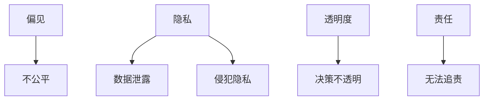

                 

**大型语言模型（LLM）的伦理问题：现状与未来**

## 1. 背景介绍

大型语言模型（LLM）是当今人工智能领域最先进的技术之一，它们能够理解、生成和翻译人类语言，并展示出惊人的学习和推理能力。然而，随着LLM的不断发展和应用，其伦理问题也日益凸显。本文将深入探讨LLM的伦理问题，包括偏见、隐私、透明度、责任和未来发展趋势。

## 2. 核心概念与联系

### 2.1 伦理问题的定义

伦理问题是指在道德、价值观和行为准则方面存在的问题。在LLM领域，伦理问题主要关注模型的设计、开发和部署过程中涉及的道德和社会影响。

### 2.2 LLM伦理问题的关键维度

LLM伦理问题的关键维度包括：

- **偏见（Bias）**：LLM可能会继承和放大训练数据中的偏见，导致输出结果不公平。
- **隐私（Privacy）**：LLM可能会泄露用户数据或侵犯用户隐私。
- **透明度（Transparency）**：LLM的决策过程可能缺乏透明度，难以理解和解释。
- **责任（Accountability）**：当LLM导致不良后果时，谁应该承担责任？

### 2.3 LLM伦理问题的关系图



## 3. 核心算法原理 & 具体操作步骤

### 3.1 算法原理概述

LLM的核心是Transformer模型，它使用自注意力机制（Self-Attention）和Transformer编码器/解码器架构来处理和生成文本。LLM通过在大规模文本数据上进行训练，学习语言的统计规律和语义关系。

### 3.2 算法步骤详解

1. **数据预处理**：对文本数据进行清洗、分词和向量化。
2. **模型训练**：使用训练数据调整模型参数，以最小化预测误差。
3. **模型评估**：使用验证数据评估模型性能，并调整超参数。
4. **模型部署**：将训练好的模型部署到生产环境中，用于生成或理解文本。

### 3.3 算法优缺点

**优点**：

- 理解和生成人类语言的能力强大且灵活。
- 可以在多种任务上进行微调，适应不同的应用场景。

**缺点**：

- 训练和部署成本高。
- 可能会继承和放大训练数据中的偏见。
- 决策过程缺乏透明度。

### 3.4 算法应用领域

LLM的应用领域包括自然语言处理（NLP）、机器翻译、文本生成、问答系统、搜索引擎和虚拟助手等。

## 4. 数学模型和公式 & 详细讲解 & 举例说明

### 4.1 数学模型构建

LLM的数学模型基于Transformer架构，其关键组件是自注意力机制。给定输入序列$\mathbf{x} = (x_1, x_2,..., x_n)$，自注意力机制计算每个位置的表示$\mathbf{h}_i$如下：

$$\mathbf{h}_i = \text{Attention}(\mathbf{Q}_i, \mathbf{K}, \mathbf{V})$$

其中，$\mathbf{Q}_i$, $\mathbf{K}$和$\mathbf{V}$分别是查询、键和值矩阵，它们通过线性变换从输入序列$\mathbf{x}$中得到。

### 4.2 公式推导过程

自注意力机制的推导过程如下：

1. 计算查询、键和值矩阵：

$$\mathbf{Q}_i = \mathbf{x}_i \mathbf{W}^Q, \quad \mathbf{K} = \mathbf{x} \mathbf{W}^K, \quad \mathbf{V} = \mathbf{x} \mathbf{W}^V$$

其中，$\mathbf{W}^Q$, $\mathbf{W}^K$和$\mathbf{W}^V$是学习参数矩阵。

2. 计算注意力分数：

$$\mathbf{score}(\mathbf{Q}_i, \mathbf{K}) = \text{softmax}\left(\frac{\mathbf{Q}_i \mathbf{K}^\top}{\sqrt{d_k}}\right)$$

其中，$d_k$是键矩阵的维度。

3. 计算注意力权重：

$$\mathbf{attn}(\mathbf{Q}_i, \mathbf{K}, \mathbf{V}) = \text{softmax}\left(\frac{\mathbf{Q}_i \mathbf{K}^\top}{\sqrt{d_k}}\right) \mathbf{V}$$

### 4.3 案例分析与讲解

例如，在机器翻译任务中，输入序列$\mathbf{x}$是源语言句子，输出序列$\mathbf{y}$是目标语言翻译。自注意力机制允许模型在翻译过程中考虑整个输入序列，从而生成更准确的翻译结果。

## 5. 项目实践：代码实例和详细解释说明

### 5.1 开发环境搭建

要开发LLM，需要安装以下软件和库：

- Python（3.8或更高版本）
- PyTorch（1.8或更高版本）
- Transformers库（Hugging Face）
- CUDA（如果使用GPU加速）

### 5.2 源代码详细实现

以下是使用Transformers库训练LLM的简化示例：

```python
from transformers import AutoTokenizer, AutoModelForCausalLM, Trainer, TrainingArguments

# 加载预训练模型和分词器
model_name = "bigscience/bloom-560m"
tokenizer = AutoTokenizer.from_pretrained(model_name)
model = AutoModelForCausalLM.from_pretrained(model_name)

# 准备数据
train_data =...  # 从训练数据集中加载数据

# 定义训练参数
training_args = TrainingArguments(
    output_dir="./results",
    num_train_epochs=3,
    per_device_train_batch_size=16,
    per_device_eval_batch_size=64,
    warmup_steps=500,
    weight_decay=0.01,
    logging_dir="./logs",
)

# 定义训练器
trainer = Trainer(
    model=model,
    args=training_args,
    train_dataset=train_data,
)

# 训练模型
trainer.train()
```

### 5.3 代码解读与分析

上述代码首先加载预训练模型和分词器，然后准备训练数据。之后，它定义训练参数，并使用这些参数创建训练器。最后，它调用`trainer.train()`方法开始训练模型。

### 5.4 运行结果展示

训练完成后，模型的性能可以通过评估数据集进行评估。此外，还可以使用生成文本任务（如文本完成）来评估模型的生成能力。

## 6. 实际应用场景

### 6.1 当前应用

LLM当前的应用场景包括：

- **机器翻译**：LLM可以帮助翻译各种语言的文本。
- **文本生成**：LLM可以生成各种文本，如新闻文章、小说和代码。
- **问答系统**：LLM可以回答用户的问题，提供信息和建议。

### 6.2 未来应用展望

未来，LLM可能会应用于：

- **自动驾驶**：LLM可以帮助理解和生成语音指令，改善自动驾驶体验。
- **虚拟现实**：LLM可以生成虚拟环境中的文本和对话，丰富用户体验。
- **教育**：LLM可以提供个性化的学习资源和互动式教学。

## 7. 工具和资源推荐

### 7.1 学习资源推荐

- **书籍**："Natural Language Processing with Python" by Steven Bird, Ewan Klein and Edward Loper
- **在线课程**：Stanford University's CS224n course on Natural Language Processing

### 7.2 开发工具推荐

- **Transformers库**：Hugging Face的Transformers库提供了预训练LLM和训练工具。
- **Hugging Face Spaces**：一个平台，可以在其中部署和共享LLM应用。

### 7.3 相关论文推荐

- "Attention is All You Need" by Vaswani et al.
- "Language Models are Few-Shot Learners" by Brown et al.

## 8. 总结：未来发展趋势与挑战

### 8.1 研究成果总结

本文总结了LLM的伦理问题，包括偏见、隐私、透明度和责任。我们还介绍了LLM的核心算法原理，数学模型和应用场景。

### 8.2 未来发展趋势

未来，LLM的发展趋势包括：

- **模型规模扩大**：更大的模型可以提供更强大的语言理解和生成能力。
- **多模式学习**：结合文本和其他模式（如图像和音频）的学习。
- **解释性AI**：开发更透明和可解释的LLM。

### 8.3 面临的挑战

LLM面临的挑战包括：

- **计算资源**：大规模模型需要大量计算资源。
- **数据质量**：训练数据的质量和多样性对模型性能至关重要。
- **伦理问题**：解决偏见、隐私、透明度和责任等伦理问题。

### 8.4 研究展望

未来的研究方向包括：

- **偏见缓解**：开发技术来缓解LLM中的偏见。
- **隐私保护**：开发技术来保护用户隐私。
- **决策解释**：开发技术来解释LLM的决策过程。

## 9. 附录：常见问题与解答

**Q：LLM是如何学习语言的？**

A：LLM通过在大规模文本数据上进行训练，学习语言的统计规律和语义关系。

**Q：LLM的决策过程是否透明？**

A：LLM的决策过程缺乏透明度，难以理解和解释。这是当前LLM研究的一个挑战。

**Q：谁应该对LLM导致的不良后果承担责任？**

A：当LLM导致不良后果时，谁应该承担责任是一个复杂的问题，取决于具体情况和相关法律法规。

**作者：禅与计算机程序设计艺术 / Zen and the Art of Computer Programming**

