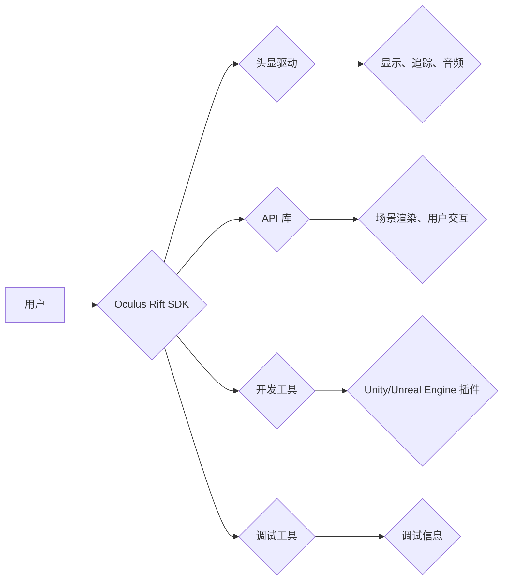

                 

## Oculus Rift SDK 集成：在 Rift 平台上开发 VR 应用

> 关键词：Oculus Rift, VR, SDK, Unity, C++, 虚拟现实, 3D图形, 沉浸式体验

## 1. 背景介绍

虚拟现实 (VR) 技术近年来发展迅速，为人们带来了身临其境的数字体验。Oculus Rift作为业界领先的 VR 头显设备，凭借其高分辨率显示、低延迟追踪和舒适的佩戴体验，吸引了众多开发者和用户。为了让开发者能够轻松地开发出高质量的 VR 应用，Oculus 公司推出了 Oculus Rift SDK，为开发者提供了丰富的 API 和工具，帮助他们构建沉浸式的 VR 体验。

本篇文章将深入探讨 Oculus Rift SDK 的集成方法，并详细介绍如何利用 SDK 开发 VR 应用。我们将从核心概念和原理出发，逐步讲解算法、数学模型、代码实现以及实际应用场景，并结合案例分析和代码示例，帮助读者全面理解 Oculus Rift SDK 的应用。

## 2. 核心概念与联系

### 2.1 VR 技术基础

VR 技术的核心是模拟真实世界的视觉、听觉、触觉等感官体验，让用户沉浸在虚拟环境中。Oculus Rift 通过以下技术实现 VR 体验：

* **立体显示:** 使用两个独立的显示屏呈现左右眼不同的图像，模拟人眼立体视觉，创造出三维空间感。
* **头部追踪:** 通过传感器追踪用户的头部运动，实时更新虚拟场景的视角，实现用户与虚拟环境的交互。
* **手柄追踪:** 通过手柄上的传感器追踪用户的双手运动，实现虚拟环境中的手部交互。
* **音频渲染:** 使用 3D 音频技术，根据用户的头部位置和方向，渲染出逼真的空间音频效果。

### 2.2 Oculus Rift SDK 架构

Oculus Rift SDK 提供了一套完整的 VR 开发工具链，包括：

* **头显驱动:** 控制头显的显示、追踪和音频输出。
* **API 库:** 提供一系列 API 函数，用于访问头显硬件、控制场景渲染、处理用户交互等。
* **开发工具:** 提供 Unity 和 Unreal Engine 等游戏引擎的插件，简化 VR 应用开发流程。
* **调试工具:** 提供工具帮助开发者调试和优化 VR 应用。

**Mermaid 流程图:**



## 3. 核心算法原理 & 具体操作步骤

### 3.1 算法原理概述

Oculus Rift SDK 中的核心算法主要包括：

* **视差渲染算法:** 根据用户的头部运动，计算左右眼需要显示的图像，实现立体视觉效果。
* **追踪算法:** 利用传感器数据，追踪用户的头部和手柄运动，并将其映射到虚拟场景中。
* **交互算法:** 处理用户的输入指令，例如手柄按钮点击、手势识别等，并将其转化为虚拟场景中的操作。

### 3.2 算法步骤详解

**视差渲染算法:**

1. **获取用户头部姿态:** 通过头显传感器获取用户的头部旋转和倾斜角度。
2. **计算左右眼视场:** 根据用户的头部姿态，计算左右眼需要看到的虚拟场景范围。
3. **渲染左右眼图像:** 将虚拟场景渲染成左右眼分别看到的图像。
4. **显示左右眼图像:** 将左右眼图像分别显示在头显的两个屏幕上。

**追踪算法:**

1. **获取传感器数据:** 通过头显和手柄上的传感器获取位置和姿态数据。
2. **数据融合:** 将来自不同传感器的数据进行融合，提高追踪精度。
3. **姿态估计:** 利用数学模型和算法，估计用户的头部和手柄姿态。
4. **位置更新:** 根据姿态估计结果，更新虚拟场景中的用户位置。

**交互算法:**

1. **获取用户输入:** 通过手柄按钮、摇杆、手势识别等方式获取用户的输入指令。
2. **指令解析:** 将用户输入解析成虚拟场景中的操作指令。
3. **执行操作:** 根据指令，在虚拟场景中执行相应的操作，例如移动物体、打开菜单等。

### 3.3 算法优缺点

**视差渲染算法:**

* **优点:** 能够实现逼真的立体视觉效果。
* **缺点:** 需要较高的计算资源，容易导致画面卡顿。

**追踪算法:**

* **优点:** 能够准确地追踪用户的运动，实现沉浸式的交互体验。
* **缺点:** 受到传感器精度和环境因素的影响，追踪精度可能会有所下降。

**交互算法:**

* **优点:** 能够实现灵活多样的用户交互方式。
* **缺点:** 需要设计合理的交互逻辑，才能保证用户体验良好。

### 3.4 算法应用领域

Oculus Rift SDK 的核心算法广泛应用于以下领域:

* **游戏:** 创造沉浸式的游戏体验，例如射击、冒险、模拟等。
* **教育:** 提供身临其境的学习环境，例如虚拟博物馆、科学实验等。
* **医疗:** 用于医疗培训、手术模拟、康复治疗等。
* **设计:** 用于建筑设计、产品设计、虚拟试衣等。

## 4. 数学模型和公式 & 详细讲解 & 举例说明

### 4.1 数学模型构建

Oculus Rift SDK 中的许多算法都依赖于数学模型。例如，视差渲染算法需要利用三角几何计算左右眼视场，追踪算法需要利用线性代数和微积分估计用户姿态。

### 4.2 公式推导过程

**视差渲染算法中的视场计算公式:**

$$
\theta_l = \arctan \left( \frac{d_l}{f} \right)
$$

$$
\theta_r = \arctan \left( \frac{d_r}{f} \right)
$$

其中：

* $\theta_l$ 和 $\theta_r$ 分别表示左右眼视场角度。
* $d_l$ 和 $d_r$ 分别表示左右眼到虚拟场景的距离。
* $f$ 是焦距。

### 4.3 案例分析与讲解

假设用户头部偏向左侧，需要计算左右眼视场角度。如果 $d_l = 1.5f$，$d_r = 0.5f$，则左右眼视场角度分别为：

$$
\theta_l = \arctan \left( \frac{1.5f}{f} \right) = \arctan (1.5) \approx 56.3^\circ
$$

$$
\theta_r = \arctan \left( \frac{0.5f}{f} \right) = \arctan (0.5) \approx 26.6^\circ
$$

由此可见，左侧视场角度大于右侧视场角度，实现了立体视觉效果。

## 5. 项目实践：代码实例和详细解释说明

### 5.1 开发环境搭建

开发 Oculus Rift VR 应用需要以下环境：

* **Oculus Rift 头显设备:** 用于体验 VR 应用。
* **计算机硬件:** 满足 Oculus Rift 的最低配置要求。
* **开发软件:** Unity 或 Unreal Engine 等游戏引擎。
* **Oculus Rift SDK:** 提供 VR 开发工具和 API。

### 5.2 源代码详细实现

以下是一个简单的 Unity 项目代码示例，演示如何使用 Oculus Rift SDK 渲染一个简单的 3D 场景：

```csharp
using UnityEngine;
using Oculus.VR;

public class VRController : MonoBehaviour
{
    public GameObject cube;

    void Start()
    {
        // 获取 Oculus 头显设备
        OVRManager.instance.Init();
    }

    void Update()
    {
        // 获取用户头部姿态
        OVRPose headPose = OVRManager.instance.GetCameraRig().transform.localToWorldMatrix;

        // 根据头部姿态旋转立方体
        cube.transform.rotation = headPose.orientation;
    }
}
```

### 5.3 代码解读与分析

* `OVRManager.instance.Init();` 初始化 Oculus Rift SDK。
* `OVRManager.instance.GetCameraRig().transform.localToWorldMatrix;` 获取 Oculus 头显设备的头部姿态。
* `cube.transform.rotation = headPose.orientation;` 将立方体的旋转角度设置为用户的头部旋转角度。

### 5.4 运行结果展示

运行此代码后，用户戴上 Oculus Rift 头显，将看到一个立方体跟随用户的头部运动旋转。

## 6. 实际应用场景

Oculus Rift SDK 的应用场景非常广泛，以下是一些具体的例子:

* **游戏:** 

    * **射击游戏:** 玩家可以身临其境地体验射击战斗，例如《Half-Life: Alyx》。
    * **冒险游戏:** 玩家可以探索虚拟世界，解开谜题，完成任务，例如《The Climb》。
    * **模拟游戏:** 玩家可以体验驾驶飞机、潜艇、汽车等，例如《Microsoft Flight Simulator》。

* **教育:**

    * **虚拟博物馆:** 玩家可以参观博物馆，欣赏文物，了解历史文化。
    * **科学实验:** 玩家可以进行虚拟科学实验，例如模拟化学反应、物理现象等。
    * **医学培训:** 医生可以利用 VR 技术进行手术模拟训练，提高手术技能。

* **设计:**

    * **建筑设计:** 建筑师可以利用 VR 技术进行虚拟建筑模型设计和展示。
    * **产品设计:** 设计师可以利用 VR 技术进行虚拟产品模型设计和测试。
    * **虚拟试衣:** 顾客可以利用 VR 技术试穿虚拟服装，体验不同风格。

### 6.4 未来应用展望

随着 VR 技术的不断发展，Oculus Rift SDK 将会有更广泛的应用场景，例如：

* **远程协作:** 团队成员可以利用 VR 技术进行远程协作，例如虚拟会议、虚拟设计审查等。
* **沉浸式娱乐:** VR 将为人们带来更加沉浸式的娱乐体验，例如虚拟演唱会、虚拟体育赛事等。
* **虚拟社交:** 人们可以利用 VR 技术进行虚拟社交，例如虚拟聚会、虚拟旅行等。

## 7. 工具和资源推荐

### 7.1 学习资源推荐

* **Oculus Rift SDK 官方文档:** https://developer.oculus.com/documentation/
* **Unity Learn VR 教程:** https://learn.unity.com/category/vr
* **Unreal Engine VR 开发指南:** https://docs.unrealengine.com/5.0/en-US/vr-development-overview/

### 7.2 开发工具推荐

* **Unity:** https://unity.com/
* **Unreal Engine:** https://www.unrealengine.com/

### 7.3 相关论文推荐

* **A Survey of Virtual Reality Head-Mounted Displays:** https://ieeexplore.ieee.org/document/7997717
* **Oculus Rift: A Review of the First-Generation Virtual Reality Headset:** https://www.researchgate.net/publication/329314539_Oculus_Rift_A_Review_of_the_First-Generation_Virtual_Reality_Headset

## 8. 总结：未来发展趋势与挑战

### 8.1 研究成果总结

Oculus Rift SDK 为 VR 开发者提供了强大的工具和资源，推动了 VR 技术的发展。通过视差渲染算法、追踪算法和交互算法，Oculus Rift SDK 能够实现逼真的立体视觉效果、准确的运动追踪和灵活的用户交互，为开发者创造了丰富的 VR 应用开发可能性。

### 8.2 未来发展趋势

未来 VR 技术将朝着以下方向发展:

* **更高分辨率和刷新率:** 提供更加清晰、流畅的视觉体验。
* **更精准的追踪:** 实现更加逼真的运动追踪和交互体验。
* **更舒适的佩戴体验:** 降低头显的重量和眩晕感。
* **更丰富的交互方式:** 支持手势识别、语音识别等更自然的交互方式。
* **更广泛的应用场景:** VR 将应用于更多领域，例如医疗、教育、设计、娱乐等。

### 8.3 面临的挑战

VR 技术的发展也面临着一些挑战:

* **成本:** VR 头显设备和开发成本仍然较高。
* **内容匮乏:** 目前 VR 应用内容相对匮乏，需要更多优质内容来吸引用户。
* **技术难题:** 提高 VR 技术的性能、降低成本、提升用户体验仍然是技术上的挑战。

### 8.4 研究展望

未来，我们将继续研究 VR 技术，探索新的应用场景，开发更先进的 VR 应用，为用户带来更加沉浸式的数字体验。

## 9. 附录：常见问题与解答

**Q1: 如何安装 Oculus Rift SDK?**

A1: 请访问 Oculus Rift SDK 官方网站，下载并安装 SDK。

**Q2: 如何使用 Oculus Rift SDK 开发 VR 应用?**

A2: 请参考 Oculus Rift SDK 官方文档和相关教程，学习如何使用 SDK 的 API 和工具开发 VR 应用。

**Q3: Oculus Rift SDK 支持哪些游戏引擎?**

A3: Oculus Rift SDK 支持 Unity 和 Unreal Engine 等主流游戏引擎。

**Q4: 如何调试 Oculus Rift VR 应用?**

A4: Oculus Rift SDK 提供了调试工具，可以帮助开发者调试 VR 应用。

**Q5: Oculus Rift SDK 的未来发展方向是什么?**

A5: Oculus Rift SDK 将朝着更高分辨率、更精准的追踪、更舒适的佩戴体验、更丰富的交互方式和更广泛的应用场景发展。


作者：禅与计算机程序设计艺术 / Zen and the Art of Computer Programming<end_of_turn>

