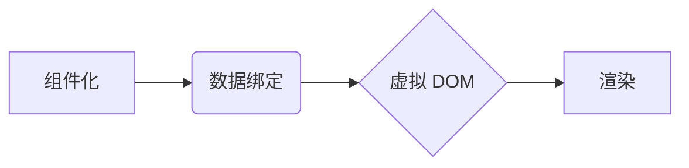

                 

## Vue.js 入门：渐进式 JavaScript 框架

> 关键词：Vue.js, 渐进式框架, JavaScript, 单页面应用, 组件化, 数据绑定, 虚拟 DOM

### 1. 背景介绍

随着 Web 应用的日益复杂化，传统的 HTML、CSS 和 JavaScript 开发模式逐渐显得力不从心。为了解决这些问题，前端开发框架应运而生。其中，Vue.js 作为一款轻量级、易于学习的渐进式 JavaScript 框架，凭借其简洁的语法、强大的功能和灵活的架构，迅速成为了前端开发的首选之一。

Vue.js 的诞生源于 Evan You 对前端开发痛点的深刻理解。他希望创建一个易于上手、易于扩展的框架，能够帮助开发者快速构建高质量的 Web 应用。Vue.js 的设计理念是“渐进式”，这意味着开发者可以根据项目需求逐步引入 Vue.js 的特性，从简单的组件化开始，逐渐扩展到更复杂的应用场景。

### 2. 核心概念与联系

Vue.js 的核心概念包括：

* **组件化:** Vue.js 将应用拆分成一个个独立的组件，每个组件负责特定的功能和UI，便于代码复用和维护。
* **数据绑定:** Vue.js 通过双向数据绑定机制，将数据和视图紧密地绑定在一起，当数据发生变化时，视图会自动更新，反之亦然。
* **虚拟 DOM:** Vue.js 使用虚拟 DOM 来优化渲染性能，它会先在内存中构建虚拟 DOM 树，然后根据差异算法，只更新真正需要改变的部分，从而减少浏览器重绘的次数。

**核心概念关系图:**



### 3. 核心算法原理 & 具体操作步骤

#### 3.1 算法原理概述

Vue.js 的核心算法是基于 **差异算法** 的虚拟 DOM 更新机制。

* **虚拟 DOM:** 虚拟 DOM 是一个 JavaScript 对象，它是一个应用程序 UI 的轻量级表示。它与真实 DOM 类似，但它只存在于内存中，不会直接影响浏览器渲染。
* **差异算法:** 差异算法用于比较旧的虚拟 DOM 和新的虚拟 DOM，找出需要更新的部分。Vue.js 使用一个高效的算法来识别这些差异，并只更新真正需要改变的部分。

#### 3.2 算法步骤详解

1. **创建虚拟 DOM:** 当数据发生变化时，Vue.js 会根据新的数据创建一个新的虚拟 DOM 树。
2. **比较虚拟 DOM:** Vue.js 会使用差异算法比较旧的虚拟 DOM 和新的虚拟 DOM，找出需要更新的部分。
3. **更新真实 DOM:** Vue.js 会根据差异算法的结果，只更新真实 DOM 中需要改变的部分，从而减少浏览器重绘的次数。

#### 3.3 算法优缺点

**优点:**

* **性能优化:** 虚拟 DOM 和差异算法可以显著提高渲染性能，减少浏览器重绘的次数。
* **易于维护:** 组件化和数据绑定机制使得代码更加模块化和易于维护。

**缺点:**

* **学习曲线:** 对于初学者来说，虚拟 DOM 和差异算法的原理可能比较难理解。
* **内存占用:** 虚拟 DOM 需要占用一定的内存空间。

#### 3.4 算法应用领域

Vue.js 的虚拟 DOM 和差异算法广泛应用于各种 Web 应用场景，例如：

* **单页面应用 (SPA):** Vue.js 非常适合构建 SPA，因为它可以高效地更新页面内容，提供流畅的用户体验。
* **移动应用:** Vue.js 可以通过框架如 Vue Native 或 Weex 来构建移动应用。
* **桌面应用:** Vue.js 可以通过 Electron 等框架来构建桌面应用。

### 4. 数学模型和公式 & 详细讲解 & 举例说明

#### 4.1 数学模型构建

Vue.js 的虚拟 DOM 更新机制可以抽象为一个数学模型，其中：

* **V:** 表示虚拟 DOM 树
* **R:** 表示真实 DOM 树
* **D:** 表示差异算法

**模型公式:**

$$R' = D(V, R)$$

其中，$R'$ 表示更新后的真实 DOM 树。

#### 4.2 公式推导过程

差异算法 $D$ 的具体实现方式有很多种，但其核心思想是比较 $V$ 和 $R$ 中节点的属性和子节点，找出需要更新的部分。

例如，如果 $V$ 中有一个节点的文本内容发生了变化，那么 $D$ 会将这个节点标记为需要更新，并更新 $R'$ 中对应的节点的文本内容。

#### 4.3 案例分析与讲解

假设我们有一个简单的虚拟 DOM 树：

```
<div id="app">
  <h1>Hello, Vue.js!</h1>
  <p>This is a simple example.</p>
</div>
```

如果我们想更新标题文本为 "Welcome to Vue.js!"，那么新的虚拟 DOM 树将是：

```
<div id="app">
  <h1>Welcome to Vue.js!</h1>
  <p>This is a simple example.</p>
</div>
```

差异算法 $D$ 会比较这两个虚拟 DOM 树，发现标题节点的文本内容发生了变化，并更新真实 DOM 中对应的节点的文本内容。

### 5. 项目实践：代码实例和详细解释说明

#### 5.1 开发环境搭建

1. 安装 Node.js 和 npm 或 yarn。
2. 创建一个新的 Vue.js 项目：

```bash
vue create my-vue-project
```

3. 选择默认配置，并按照提示进行操作。

#### 5.2 源代码详细实现

```vue
<template>
  <div id="app">
    <h1>{{ message }}</h1>
    <button @click="changeMessage">Change Message</button>
  </div>
</template>

<script>
export default {
  data() {
    return {
      message: 'Hello, Vue.js!'
    }
  },
  methods: {
    changeMessage() {
      this.message = 'Welcome to Vue.js!'
    }
  }
}
</script>
```

#### 5.3 代码解读与分析

* **template:** 定义了组件的视图结构，使用双花括号 `{{ }}` 进行数据绑定。
* **script:** 定义了组件的数据和方法。
* **data:** 定义了组件的数据属性，使用 `this.message` 访问数据。
* **methods:** 定义了组件的方法，使用 `@click` 事件监听器绑定按钮点击事件。

#### 5.4 运行结果展示

运行项目后，你会看到一个包含标题和按钮的页面。点击按钮，标题文本会从 "Hello, Vue.js!" 变为 "Welcome to Vue.js!"。

### 6. 实际应用场景

Vue.js 的应用场景非常广泛，例如：

* **单页面应用 (SPA):** Vue.js 可以构建各种类型的 SPA，例如电商平台、社交媒体应用、博客平台等。
* **移动应用:** Vue.js 可以通过框架如 Vue Native 或 Weex 来构建移动应用。
* **桌面应用:** Vue.js 可以通过 Electron 等框架来构建桌面应用。
* **渐进式增强:** Vue.js 可以逐步引入到现有项目中，增强其功能和性能。

### 6.4 未来应用展望

随着 Vue.js 的不断发展，其应用场景将会更加广泛，例如：

* **Server-Side Rendering (SSR):** Vue.js 支持 SSR，可以提高网站的 SEO 性能。
* **WebAssembly (Wasm):** Vue.js 可以与 Wasm 结合，构建高性能的 Web 应用。
* **人工智能 (AI):** Vue.js 可以与 AI 技术结合，构建智能化的 Web 应用。

### 7. 工具和资源推荐

#### 7.1 学习资源推荐

* **官方文档:** https://vuejs.org/v2/guide/
* **Vue.js 中文网:** https://cn.vuejs.org/
* **Vue Mastery:** https://www.vuemastery.com/

#### 7.2 开发工具推荐

* **Vue CLI:** https://cli.vuejs.org/
* **Vue Devtools:** https://chrome.google.com/webstore/detail/vuejs-devtools/nhdogjmejiglipccpnnnanhbledajbpd

#### 7.3 相关论文推荐

* **A Survey of JavaScript Frameworks for Web Development:** https://arxiv.org/abs/1809.05454

### 8. 总结：未来发展趋势与挑战

#### 8.1 研究成果总结

Vue.js 作为一款轻量级、易于学习的渐进式 JavaScript 框架，在前端开发领域取得了巨大的成功。其核心概念和算法原理为构建高质量的 Web 应用提供了强大的支持。

#### 8.2 未来发展趋势

Vue.js 将继续朝着以下方向发展：

* **性能优化:** Vue.js 将继续优化其虚拟 DOM 和差异算法，提高渲染性能。
* **生态系统建设:** Vue.js 的生态系统将不断完善，提供更多工具和资源。
* **新特性开发:** Vue.js 将不断开发新的特性，满足开发者不断变化的需求。

#### 8.3 面临的挑战

Vue.js 也面临着一些挑战，例如：

* **社区规模:** Vue.js 的社区规模相比于 React 或 Angular 来说相对较小。
* **企业级应用:** Vue.js 在企业级应用中的应用场景相对较少。
* **竞争压力:** Vue.js 面临着来自其他框架的竞争压力。

#### 8.4 研究展望

未来，Vue.js 将继续发展壮大，成为 Web 开发领域的重要力量。

### 9. 附录：常见问题与解答

* **Q: Vue.js 和 React 哪个更好？**

A: Vue.js 和 React 都是优秀的 JavaScript 框架，各有优缺点。Vue.js 更易于学习，React 更成熟，社区规模更大。选择哪个框架取决于项目的具体需求和开发者的个人偏好。

* **Q: 如何学习 Vue.js？**

A: Vue.js 的官方文档非常详细，可以作为学习的起点。此外，还有许多在线课程和教程可以帮助你快速入门。

* **Q: Vue.js 的未来发展方向是什么？**

A: Vue.js 将继续朝着性能优化、生态系统建设和新特性开发的方向发展。

作者：禅与计算机程序设计艺术 / Zen and the Art of Computer Programming


<end_of_turn>

