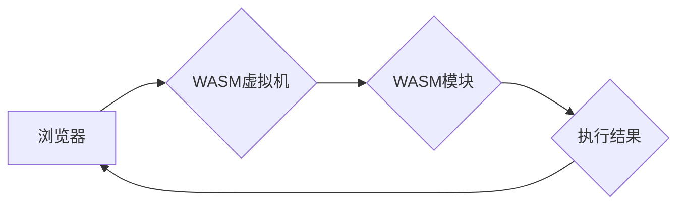

                 

## WebAssembly：Web平台的新时代

> 关键词：WebAssembly, WASM, Web平台, 浏览器, 性能, 安全, 跨平台, 虚拟机, 编译器

## 1. 背景介绍

随着互联网的蓬勃发展，Web平台作为信息交互和应用部署的主要载体，其性能和功能需求不断提升。传统的JavaScript语言，虽然在Web开发中占据主导地位，但其运行效率和资源占用率相对较高，难以满足一些高性能计算和复杂业务逻辑的需求。为了解决这一问题，WebAssembly（简称WASM）应运而生。

WebAssembly是一种新的Web标准，它定义了一种低级、高效的字节码格式，可以被浏览器和其他Web平台执行。WASM的目标是提供一种性能优越、安全可靠、跨平台的运行环境，从而扩展Web平台的功能，并支持更多类型的应用程序。

## 2. 核心概念与联系

### 2.1 WASM的本质

WebAssembly是一种二进制指令集，它与JavaScript语言不同，是一种独立的语言，可以由多种编程语言编译成WASM字节码。WASM字节码本身是一个紧凑、可执行的格式，可以被浏览器或其他Web平台上的WASM虚拟机解释执行。

### 2.2 WASM与JavaScript的关系

WASM和JavaScript并非相互替代的关系，而是互补的。JavaScript仍然是Web平台的主要脚本语言，负责用户界面交互、DOM操作等任务。而WASM则负责执行高性能计算、复杂逻辑等任务，两者可以协同工作，共同构建更强大的Web应用程序。

### 2.3 WASM的优势

* **高性能:** WASM字节码可以直接被虚拟机执行，无需解释或运行时环境，因此其执行效率远高于JavaScript。
* **安全可靠:** WASM运行在沙盒环境中，与宿主环境隔离，防止恶意代码攻击。
* **跨平台:** WASM字节码是平台无关的，可以在任何支持WASM的浏览器或Web平台上运行。
* **可扩展性:** WASM可以与其他Web技术集成，例如WebSockets、WebGL等，扩展Web平台的功能。

### 2.4 WASM的架构



## 3. 核心算法原理 & 具体操作步骤

### 3.1  算法原理概述

WASM的执行原理基于虚拟机模型。WASM虚拟机是一个抽象的计算环境，它负责解释和执行WASM字节码指令。WASM虚拟机包含以下核心组件：

* **指令集:** WASM指令集定义了虚拟机可以执行的各种操作，例如算术运算、内存访问、函数调用等。
* **内存管理:** WASM虚拟机提供了一种内存管理机制，用于分配和释放内存空间。
* **栈管理:** WASM虚拟机使用栈来存储函数参数和局部变量。
* **寄存器:** WASM虚拟机使用寄存器来存储临时数据。

### 3.2  算法步骤详解

WASM虚拟机执行WASM字节码的步骤如下：

1. **加载WASM模块:** 浏览器将WASM模块加载到内存中。
2. **初始化虚拟机:** 虚拟机初始化其内部状态，例如内存空间、栈、寄存器等。
3. **解析指令:** 虚拟机解析WASM字节码指令，并根据指令内容执行相应的操作。
4. **执行操作:** 虚拟机执行指令操作，例如算术运算、内存访问、函数调用等。
5. **返回结果:** 虚拟机执行完所有指令后，返回执行结果。

### 3.3  算法优缺点

**优点:**

* **高性能:** WASM指令集设计精巧，执行效率高。
* **安全可靠:** WASM运行在沙盒环境中，与宿主环境隔离。
* **跨平台:** WASM字节码是平台无关的，可以在任何支持WASM的浏览器或Web平台上运行。

**缺点:**

* **学习曲线:** WASM指令集相对复杂，需要一定的学习成本。
* **生态系统:** WASM生态系统相对较新，相关工具和资源还比较有限。

### 3.4  算法应用领域

WASM的应用领域非常广泛，包括：

* **游戏开发:** WASM可以提高游戏性能，并支持跨平台游戏开发。
* **数据科学:** WASM可以加速数据分析和机器学习算法的执行。
* **桌面应用程序:** WASM可以构建轻量级的桌面应用程序，并与现有Web技术集成。
* **物联网:** WASM可以运行在嵌入式设备上，为物联网设备提供高效的计算能力。

## 4. 数学模型和公式 & 详细讲解 & 举例说明

### 4.1  数学模型构建

WASM的执行模型可以抽象为一个有限状态机，其中每个状态代表虚拟机的当前执行状态，每个状态转换由WASM指令触发。

* **状态:** 包括内存状态、栈状态、寄存器状态等。
* **输入:** WASM字节码指令。
* **输出:** 执行结果，例如计算结果、函数返回值等。
* **转换函数:** 根据指令内容，将虚拟机从一个状态转换到另一个状态。

### 4.2  公式推导过程

WASM指令的执行过程可以抽象为一系列数学公式，例如：

* **算术运算:** `result = operand1 operator operand2`
* **内存访问:** `value = memory[address]`
* **函数调用:** `return_value = function(arguments)`

这些公式描述了指令执行时对虚拟机状态的影响。

### 4.3  案例分析与讲解

例如，一个简单的WASM指令 `add i32` 表示将两个32位整数相加。

* **输入:** 两个32位整数 `operand1` 和 `operand2`。
* **执行过程:** `result = operand1 + operand2`
* **输出:** 一个32位整数 `result`。

## 5. 项目实践：代码实例和详细解释说明

### 5.1  开发环境搭建

为了开发WASM应用程序，需要搭建一个开发环境。常用的开发工具包括：

* **WASM编译器:** Emscripten、Wasmer、Wasmtime等。
* **文本编辑器:** VS Code、Sublime Text等。
* **浏览器:** 支持WASM的浏览器，例如Chrome、Firefox、Edge等。

### 5.2  源代码详细实现

以下是一个简单的WASM代码示例，它定义了一个函数 `add`，用于将两个整数相加：

```wasm
(module
  (func $add (param i32 i32) (result i32)
    (i32.add (local.get 0) (local.get 1))
  )
)
```

### 5.3  代码解读与分析

* `(module)`: 定义一个WASM模块。
* `(func $add ...)`: 定义一个名为 `add` 的函数。
* `(param i32 i32)`: 函数接受两个32位整数参数。
* `(result i32)`: 函数返回一个32位整数结果。
* `(i32.add ...)`: 使用 `i32.add` 指令将两个参数相加。
* `(local.get 0)`: 获取第一个参数。
* `(local.get 1)`: 获取第二个参数。

### 5.4  运行结果展示

将以上WASM代码编译成 `.wasm` 文件，并将其加载到支持WASM的浏览器中，可以调用 `add` 函数进行计算。例如，调用 `add(1, 2)` 函数，会返回结果 `3`。

## 6. 实际应用场景

### 6.1  游戏开发

WASM可以提高游戏性能，并支持跨平台游戏开发。例如，一些浏览器游戏已经开始使用WASM来实现更流畅的游戏体验。

### 6.2  数据科学

WASM可以加速数据分析和机器学习算法的执行。例如，一些数据科学平台已经开始使用WASM来运行机器学习模型，提高数据分析效率。

### 6.3  桌面应用程序

WASM可以构建轻量级的桌面应用程序，并与现有Web技术集成。例如，一些桌面应用程序已经开始使用WASM来实现部分功能，例如图形渲染、数据处理等。

### 6.4  未来应用展望

WASM的应用场景还在不断扩展，未来可能会应用于更多领域，例如：

* **区块链:** WASM可以提高区块链网络的性能和安全性。
* **人工智能:** WASM可以运行更复杂的AI模型，并部署在边缘设备上。
* **物联网:** WASM可以为物联网设备提供高效的计算能力，支持更智能的应用场景。

## 7. 工具和资源推荐

### 7.1  学习资源推荐

* **WebAssembly 官方网站:** https://webassembly.org/
* **Mozilla Developer Network (MDN):** https://developer.mozilla.org/en-US/docs/Web/WebAssembly
* **WebAssembly Book:** https://webassembly.github.io/book/

### 7.2  开发工具推荐

* **Emscripten:** https://emscripten.org/
* **Wasmer:** https://wasmer.io/
* **Wasmtime:** https://wasmtime.dev/

### 7.3  相关论文推荐

* **WebAssembly: A Binary Instruction Format for Web Browsers:** https://arxiv.org/abs/1609.04807
* **WebAssembly: A New Era for Web Development:** https://www.youtube.com/watch?v=7l7q948_s7k

## 8. 总结：未来发展趋势与挑战

### 8.1  研究成果总结

WebAssembly已经成为Web平台的重要组成部分，它为Web开发带来了新的可能性，并推动了Web平台的功能和性能的提升。

### 8.2  未来发展趋势

* **性能优化:** WASM虚拟机和编译器将继续优化性能，使其更接近原生代码的执行效率。
* **生态系统扩展:** WASM的生态系统将不断扩展，包括更多工具、库和框架，支持更广泛的应用场景。
* **标准化完善:** WASM标准将不断完善，使其更稳定、更安全、更易于使用。

### 8.3  面临的挑战

* **开发者学习成本:** WASM指令集相对复杂，需要一定的学习成本。
* **工具和资源的完善:** WASM生态系统相对较新，相关工具和资源还比较有限。
* **安全性和隐私性:** WASM的安全性需要不断加强，防止恶意代码攻击。

### 8.4  研究展望

未来，WASM将继续发展，并成为Web平台的重要技术之一。研究者将继续探索WASM的应用场景，并开发新的工具和技术，以提高WASM的性能、安全性、易用性和生态系统完善度。

## 9. 附录：常见问题与解答

### 9.1  WASM和JavaScript的关系是什么？

WASM和JavaScript并非相互替代的关系，而是互补的。JavaScript仍然是Web平台的主要脚本语言，负责用户界面交互、DOM操作等任务。而WASM则负责执行高性能计算、复杂逻辑等任务，两者可以协同工作，共同构建更强大的Web应用程序。

### 9.2  WASM的性能如何？

WASM的性能非常高，因为它可以被虚拟机直接执行，无需解释或运行时环境。WASM的执行效率可以接近原生代码。

### 9.3  WASM的安全性如何？

WASM运行在沙盒环境中，与宿主环境隔离，防止恶意代码攻击。

### 9.4  WASM的应用场景有哪些？

WASM的应用场景非常广泛，包括游戏开发、数据科学、桌面应用程序、物联网等。

### 9.5  如何学习WASM？

可以参考WebAssembly官方网站、Mozilla Developer Network (MDN) 和WebAssembly Book等资源学习WASM。


作者：禅与计算机程序设计艺术 / Zen and the Art of Computer Programming 
<end_of_turn>

