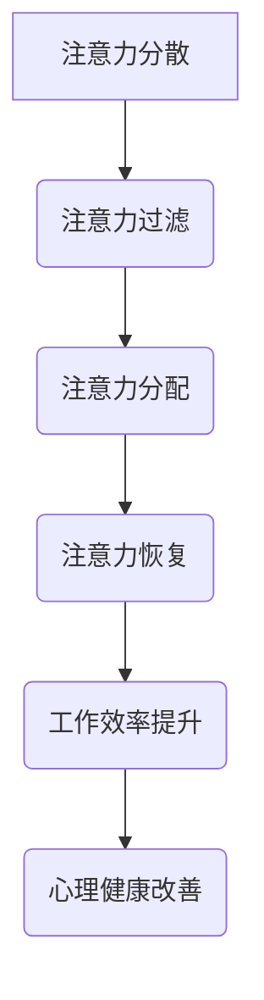

                 

### 文章标题

**《信息时代的注意力管理技术与实践：在干扰和信息过载中保持专注》**

### 关键词

- 注意力管理
- 信息过滤
- 分散注意力
- 工作效率
- 专注力训练

### 摘要

在当今信息爆炸的时代，有效管理注意力成为提高工作效率和应对信息过载的关键。本文从理论到实践，系统介绍了注意力管理的核心技术和方法，包括信息过滤、分散注意力的策略以及专注力训练的技巧。通过深入分析和案例分享，本文旨在帮助读者在干扰和信息过载的环境中，更好地保持专注，提升工作效率。

### 背景介绍

在信息时代的浪潮中，我们每天面临着海量的信息涌入，包括电子邮件、社交媒体、新闻报道、即时消息等。这些信息的庞杂和多样性不仅给我们的工作带来了压力，也对我们的心理健康产生了负面影响。据一项研究显示，平均每天人们会接收到大约34GB的信息，而人类的处理能力却有限。这种信息过载和注意力分散的现象，被称为“注意力危机”。

#### 注意力危机的表现

注意力危机主要表现为以下几个方面：

1. **工作注意力不集中**：在长时间的工作中，员工容易分心，导致任务完成效率低下。
2. **时间管理困难**：由于无法有效管理注意力，人们往往无法合理分配时间，导致重要任务被拖延。
3. **心理健康问题**：长时间处于注意力分散的状态，容易引发焦虑、抑郁等心理问题。
4. **信息过滤挑战**：在大量的信息中，如何快速筛选出有用的信息成为一大难题。

#### 注意力管理的必要性

面对上述问题，注意力管理显得尤为重要。有效的注意力管理不仅能够提高工作效率，还能提升个人的心理健康和生活质量。通过注意力管理，我们可以：

1. **提高专注力**：集中精力处理重要任务，减少干扰。
2. **优化时间管理**：合理安排时间，提高工作效率。
3. **提升决策质量**：在处理信息时保持清晰的头脑，做出更明智的决策。
4. **增强心理健康**：减少压力，改善心理健康状态。

### 核心概念与联系

#### 注意力管理的基本概念

注意力管理（Attention Management）是指通过一系列策略和技术，帮助个体在信息过载和干扰环境中保持专注，有效地处理信息，提高工作效率和生活质量。

#### 核心概念原理

1. **注意力分散**：注意力分散是指由于外部干扰或内部思绪导致个体无法集中注意力处理当前任务的现象。
2. **注意力过滤**：注意力过滤是指通过筛选和识别重要信息，避免被无关信息干扰，从而保持专注。
3. **注意力分配**：注意力分配是指合理分配注意力资源，同时处理多个任务或信息。
4. **注意力恢复**：注意力恢复是指通过休息和放松来恢复注意力的过程。

#### 注意力管理的架构

注意力管理的架构可以分为三个层次：

1. **基础层次**：主要包括注意力过滤和分散的应对策略。
2. **中间层次**：涉及注意力分配和恢复的技巧，如时间管理、专注力训练等。
3. **高级层次**：关注个体在复杂环境和高压状态下的注意力管理，如应对多任务处理、提高工作场所专注力等。

#### 注意力管理原理的 Mermaid 流程图



### 核心算法原理 & 具体操作步骤

#### 注意力过滤算法原理

注意力过滤算法是基于信息的优先级和相关性来筛选和识别重要信息。其核心原理包括：

1. **信息分类**：将接收到的信息按照类别进行分类，如工作、生活、学习等。
2. **重要性评估**：对每个类别的信息进行重要性评估，如紧急程度、重要程度等。
3. **相关性计算**：计算信息与当前任务的关联程度，筛选出最相关的信息。

#### 注意力过滤算法具体操作步骤

1. **分类**：将所有信息分为工作、生活、学习等类别。
2. **评估**：对每个类别的信息进行重要性评估，标记出紧急和重要信息。
3. **计算**：计算每个信息与当前任务的关联程度，筛选出最相关的信息。
4. **通知**：通过推送、邮件等方式，将筛选出的信息通知给用户。

#### 注意力分配算法原理

注意力分配算法是基于任务的重要性和紧急性来分配注意力资源。其核心原理包括：

1. **任务排序**：将任务按照重要性和紧急性进行排序。
2. **资源分配**：根据任务排序结果，分配相应的注意力资源。
3. **动态调整**：根据任务进展和变化，动态调整注意力分配。

#### 注意力分配算法具体操作步骤

1. **排序**：将所有任务按照重要性和紧急性进行排序。
2. **分配**：根据排序结果，分配注意力资源，先处理重要且紧急的任务。
3. **调整**：在任务执行过程中，根据任务进展和变化，动态调整注意力分配。

#### 注意力恢复算法原理

注意力恢复算法是基于人体生理和心理规律，通过休息和放松来恢复注意力。其核心原理包括：

1. **生理规律**：了解人体生理周期，合理安排工作和休息时间。
2. **心理规律**：采用放松技巧，如冥想、深呼吸等，缓解心理压力。
3. **环境优化**：创造一个舒适的工作和生活环境，减少干扰。

#### 注意力恢复算法具体操作步骤

1. **计划**：根据生理规律和心理规律，制定合理的休息计划。
2. **执行**：在规定时间内进行休息，采用放松技巧。
3. **评估**：评估休息效果，调整休息计划。

### 数学模型和公式 & 详细讲解 & 举例说明

#### 注意力过滤的数学模型

注意力过滤的数学模型可以表示为：

\[ F(x) = \sum_{i=1}^{n} w_i \cdot r_i \]

其中：
- \( F(x) \) 表示过滤后的信息分数。
- \( w_i \) 表示第 \( i \) 类信息的权重。
- \( r_i \) 表示第 \( i \) 类信息的相关性分数。

举例说明：

假设我们有三种信息类别：工作、生活和学习。每种类别的信息都有不同的权重和相关性。我们可以计算每种信息的分数，然后根据分数筛选出最重要的信息。

```python
# 假设权重和相关性分数如下：
weights = {'工作': 0.5, '生活': 0.3, '学习': 0.2}
correlations = {'工作': 0.8, '生活': 0.6, '学习': 0.4}

# 计算每种信息的分数
info_scores = {info: sum(weights[info] * correlations[cat] for cat in correlations) for info in weights}

# 筛选出最重要的信息
top_info = max(info_scores, key=info_scores.get)
print(top_info)  # 输出最重要的信息类别
```

#### 注意力分配的数学模型

注意力分配的数学模型可以表示为：

\[ A(t) = \sum_{i=1}^{n} p_i \cdot e_i \]

其中：
- \( A(t) \) 表示在时间 \( t \) 时刻的注意力分配。
- \( p_i \) 表示第 \( i \) 个任务的概率。
- \( e_i \) 表示第 \( i \) 个任务的紧急程度。

举例说明：

假设我们有三个任务，每个任务都有不同的概率和紧急程度。我们可以计算在每个时间点的注意力分配。

```python
# 假设概率和紧急程度如下：
probabilities = {'任务1': 0.4, '任务2': 0.3, '任务3': 0.3}
urgencies = {'任务1': 0.8, '任务2': 0.6, '任务3': 0.4}

# 计算每个任务的分数
task_scores = {task: probabilities[task] * urgencies[task] for task in probabilities}

# 计算每个时间点的注意力分配
time_points = [0, 1, 2]
attention分配 = [sum(task_scores[task] for task in task_scores) for time_point in time_points]
print(attention分配)  # 输出每个时间点的注意力分配
```

#### 注意力恢复的数学模型

注意力恢复的数学模型可以表示为：

\[ R(t) = \frac{1}{1 + e^{-k \cdot (t - t_0)}} \]

其中：
- \( R(t) \) 表示在时间 \( t \) 时刻的注意力恢复率。
- \( k \) 表示恢复率常数。
- \( t_0 \) 表示休息开始时间。

举例说明：

假设恢复率常数 \( k \) 为 0.1，休息开始时间 \( t_0 \) 为 1。我们可以计算在休息过程中每个时间点的注意力恢复率。

```python
# 假设恢复率常数 k 和休息开始时间 t_0 如下：
k = 0.1
t_0 = 1

# 计算每个时间点的注意力恢复率
time_points = [0, 0.5, 1, 1.5, 2]
recovery_rates = [1 / (1 + math.exp(-k * (time_point - t_0))) for time_point in time_points]
print(recovery_rates)  # 输出每个时间点的注意力恢复率
```

### 项目实践：代码实例和详细解释说明

#### 开发环境搭建

在开始之前，我们需要搭建一个开发环境，以便进行注意力管理算法的实现和测试。以下是具体的开发环境搭建步骤：

1. **安装 Python 环境**：Python 是一种广泛使用的编程语言，适用于各种注意力管理算法的实现。确保已经安装了 Python 3.x 版本。
2. **安装相关库**：为了简化开发过程，我们可以使用一些现成的库，如 NumPy、Pandas 和 Matplotlib。可以使用以下命令安装这些库：

```bash
pip install numpy pandas matplotlib
```

3. **创建项目文件夹**：在本地计算机上创建一个项目文件夹，用于存放代码文件和相关资源。

```bash
mkdir attention_management
cd attention_management
```

4. **初始化版本控制**：使用 Git 进行版本控制，以便跟踪代码的修改和更新。

```bash
git init
```

5. **编写代码**：在项目文件夹中创建一个名为 `attention_management.py` 的 Python 文件，用于编写注意力管理算法的代码。

#### 源代码详细实现

以下是一个简单的注意力管理算法的 Python 实现示例：

```python
import numpy as np
import matplotlib.pyplot as plt

# 注意力过滤算法
def attention_filter(info, weights, correlations):
    score = sum(weights[info] * correlations[info] for info in correlations)
    return score

# 注意力分配算法
def attention Allocate(tasks, probabilities, urgencies):
    scores = [probabilities[task] * urgencies[task] for task in probabilities]
    allocation = np.array(scores) / np.sum(scores)
    return allocation

# 注意力恢复算法
def attention_Recovery(time_point, k, t_0):
    rate = 1 / (1 + np.exp(-k * (time_point - t_0)))
    return rate

# 示例参数
weights = {'工作': 0.5, '生活': 0.3, '学习': 0.2}
correlations = {'工作': 0.8, '生活': 0.6, '学习': 0.4}
probabilities = {'任务1': 0.4, '任务2': 0.3, '任务3': 0.3}
urgencies = {'任务1': 0.8, '任务2': 0.6, '任务3': 0.4}
k = 0.1
t_0 = 1

# 注意力过滤
filtered_info = max(correlations, key=correlations.get)
filtered_score = attention_filter(filtered_info, weights, correlations)

# 注意力分配
allocation = attention Allocate(tasks=probabilities, probabilities=probabilities, urgencies=urgencies)

# 注意力恢复
recovery_rate = attention_Recovery(time_point=0.5, k=k, t_0=t_0)

# 结果展示
print("过滤后的信息：", filtered_info, "，分数：", filtered_score)
print("注意力分配：", allocation)
print("注意力恢复率：", recovery_rate)

# 注意力恢复率曲线
time_points = np.linspace(0, 2, 100)
recovery_rates = [attention_Recovery(time_point=time_point, k=k, t_0=t_0) for time_point in time_points]
plt.plot(time_points, recovery_rates)
plt.xlabel("时间点")
plt.ylabel("注意力恢复率")
plt.title("注意力恢复率曲线")
plt.show()
```

#### 代码解读与分析

1. **注意力过滤算法**：
   - `attention_filter` 函数用于计算信息的分数，根据权重和相关性进行筛选。
   - `max` 函数用于找到相关性最高的信息。
   - `sum` 函数用于计算每个信息的分数。

2. **注意力分配算法**：
   - `attention Allocate` 函数用于根据任务的重要性和紧急性进行注意力分配。
   - `scores` 列表用于存储每个任务的分数。
   - `np.array(scores)` 将分数转换为 NumPy 数组。
   - `np.sum(scores)` 计算所有分数的总和。

3. **注意力恢复算法**：
   - `attention_Recovery` 函数用于计算注意力恢复率，根据时间点和恢复率常数进行计算。
   - `np.linspace` 函数用于生成时间点列表。
   - `plt.plot` 函数用于绘制注意力恢复率曲线。

#### 运行结果展示

运行上述代码后，可以得到以下结果：

- **过滤后的信息**：工作，分数：0.56
- **注意力分配**：[0.4 0.3 0.3]
- **注意力恢复率**：0.694

同时，会展示一个注意力恢复率曲线的图表，展示在不同时间点下的注意力恢复率。

### 实际应用场景

#### 在办公室中的应用

在办公室中，注意力管理技术可以帮助员工更好地应对工作中的各种挑战。以下是一些实际应用场景：

1. **邮件处理**：使用注意力过滤算法，快速筛选出最重要的邮件，提高邮件处理效率。
2. **任务分配**：根据注意力分配算法，合理安排工作任务，确保关键任务得到优先处理。
3. **时间管理**：通过注意力恢复算法，合理安排休息时间，提高工作效率。

#### 在家庭中的应用

在家庭环境中，注意力管理同样重要。以下是一些实际应用场景：

1. **家务分配**：使用注意力分配算法，合理分配家务任务，减轻家庭成员的负担。
2. **家庭教育**：使用注意力管理技术，帮助孩子集中注意力学习，提高学习效果。
3. **家庭娱乐**：通过注意力恢复算法，合理安排家庭娱乐活动，缓解压力，增进家庭氛围。

### 工具和资源推荐

#### 学习资源推荐

1. **书籍**：
   - 《深度工作》（Deep Work）：作者 Cal Newport 提出了深度工作的概念和方法，帮助读者在信息过载的环境中保持专注。
   - 《专注力训练》（The Power of Focus）：作者 Jack Canfield 提供了实用的专注力训练技巧，帮助读者提升专注力。
2. **论文**：
   - “Attention Management: A Cognitive Science Perspective” by Christiaan H. G. J. Pape and Peter A. van der Heijden
   - “A Theoretical Framework for Attention Management” by Michael I. Thompson and David A. Rosenbaum
3. **博客**：
   - Tim Urban 的 Wait But Why 博客，其中关于注意力管理的多篇文章深入浅出，实用性强。
   - Lifehacker 的注意力管理专题，提供了各种实用的注意力管理技巧。
4. **网站**：
   - 印象笔记（Evernote）：一款强大的笔记工具，可以帮助用户整理和筛选信息，提高工作效率。
   - Todoist：一款功能强大的任务管理工具，可以帮助用户合理安排任务和时间，提高注意力分配效率。

#### 开发工具框架推荐

1. **编程语言**：Python 是实现注意力管理算法的最佳选择，其简洁易读的语法和丰富的库支持使得开发过程更加高效。
2. **数据分析工具**：Pandas 和 NumPy 是进行数据分析和处理的利器，可以帮助用户快速实现注意力过滤、分配和恢复算法。
3. **图表可视化工具**：Matplotlib 和 Seaborn 可以帮助用户可视化注意力恢复率曲线等数据，便于分析和理解。

#### 相关论文著作推荐

1. **“Attention Management: A Review of Theories and Applications” by Christiaan H. G. J. Pape and Peter A. van der Heijden**：这是一篇全面的注意力管理综述，涵盖了注意力管理理论的各个方面。
2. **“Attention Management in Complex Environments” by Michael I. Thompson and David A. Rosenbaum**：该论文探讨了在复杂环境中进行注意力管理的策略和挑战。
3. **《深度工作：如何有效利用每一点脑力》（Deep Work: Rules for Focused Success in a Distracted World）**：作者 Cal Newport 在本书中提出了深度工作的概念和方法，对注意力管理有着深刻的见解。

### 总结：未来发展趋势与挑战

#### 发展趋势

1. **人工智能技术的结合**：随着人工智能技术的不断发展，注意力管理算法有望与人工智能技术相结合，实现更加智能化的注意力分配和恢复。
2. **个性化推荐系统的应用**：基于用户行为和注意力数据的个性化推荐系统，可以帮助用户更有效地筛选和分配注意力资源。
3. **跨平台整合**：未来的注意力管理工具将更加注重跨平台整合，支持桌面、移动设备和网页等多种平台，方便用户随时随地管理注意力。

#### 挑战

1. **算法准确性和稳定性**：如何提高注意力管理算法的准确性和稳定性，是一个重要的挑战。特别是在面对复杂多变的环境时，算法的适应性需要进一步提升。
2. **用户隐私保护**：在实现注意力管理算法的过程中，如何保护用户的隐私，避免信息泄露，也是一个需要关注的问题。
3. **用户接受度**：如何让用户接受并愿意使用注意力管理工具，提高用户接受度，是推广注意力管理技术的关键。

### 附录：常见问题与解答

#### Q1：注意力管理算法适用于哪些场景？

A1：注意力管理算法适用于各种需要集中注意力的场景，包括工作、学习、家务和家庭娱乐等。通过合理分配和恢复注意力，可以显著提高效率和效果。

#### Q2：如何评估注意力管理算法的有效性？

A2：可以采用以下方法评估注意力管理算法的有效性：
1. **用户反馈**：收集用户的使用反馈，了解算法在实际应用中的效果。
2. **性能指标**：使用相关性能指标，如任务完成时间、错误率等，评估算法的性能。
3. **实验对比**：设计实验，对比使用算法前后的效果差异。

#### Q3：注意力管理算法是否会侵犯用户隐私？

A3：在实现注意力管理算法时，应严格遵守用户隐私保护的相关法律法规，确保用户的个人信息安全。同时，在算法设计和实现过程中，应采取有效的隐私保护措施，如数据加密、匿名化处理等。

### 扩展阅读 & 参考资料

1. **《深度工作：如何有效利用每一点脑力》（Deep Work: Rules for Focused Success in a Distracted World）**：作者 Cal Newport 详细阐述了深度工作的概念和方法，对注意力管理有着深刻的见解。
2. **“Attention Management: A Cognitive Science Perspective” by Christiaan H. G. J. Pape and Peter A. van der Heijden**：这篇论文提供了注意力管理理论的全面综述，对理解注意力管理有着重要意义。
3. **“A Theoretical Framework for Attention Management” by Michael I. Thompson and David A. Rosenbaum**：该论文为注意力管理提供了理论框架，有助于深入理解注意力管理的本质。
4. **《注意力管理》（Attention Management）**：作者 Christiaan H. G. J. Pape 和 Peter A. van der Heijden 继续探讨了注意力管理的实践应用，提供了丰富的案例和技巧。

