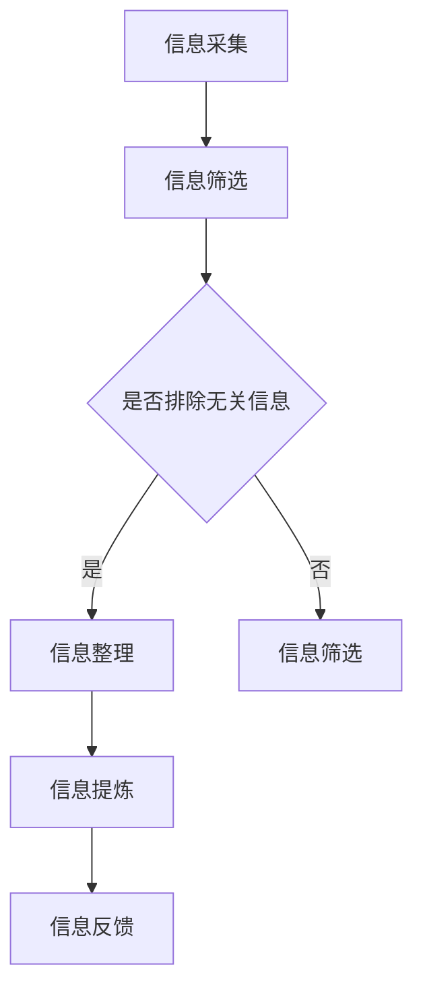

                 

# 信息简化的好处与实践：在复杂世界中简化以改善生活和决策

## 关键词

- 信息简化
- 复杂性管理
- 决策优化
- 生活质量提升
- 技术工具应用

## 摘要

本文旨在探讨信息简化在现代社会中的重要性，以及如何通过简化策略改善个人生活和决策。随着信息量的爆炸性增长，复杂问题层出不穷，有效的简化策略成为提高效率和决策质量的关键。本文将结合实例和实用技巧，详细解析信息简化的多个维度，包括识别冗余信息、简化流程、技术工具的运用等，并提供具体的实践方法，帮助读者在复杂世界中找到清晰的路径，提升个人生活质量和决策能力。

## 1. 背景介绍（Background Introduction）

### 复杂世界的挑战

现代社会充满了复杂性和不确定性。从工作到生活，我们每天都在面对大量的信息，这些信息可能来自社交媒体、电子邮件、新闻报道等各个渠道。信息过载已经成为一个普遍问题，它不仅耗费了我们的时间和精力，还可能影响我们的决策质量和生活质量。

- **信息冗余**：大量的冗余信息使得我们难以捕捉关键信息，从而降低了信息处理的效率。
- **决策困难**：面对复杂的决策环境，人们往往感到无所适从，难以做出最优的选择。
- **资源浪费**：在处理复杂问题时，可能需要耗费大量的人力、物力和时间，导致资源浪费。

### 简化的必要性

简化作为应对复杂性的策略，具有以下几个方面的必要性：

- **提高效率**：简化可以帮助我们更快地获取和处理关键信息，从而提高工作效率。
- **减少错误**：简化流程可以减少信息传递和决策过程中的错误，提高决策质量。
- **节省资源**：通过简化，我们可以减少不必要的资源消耗，使资源得到更合理的利用。

## 2. 核心概念与联系（Core Concepts and Connections）

### 信息简化的定义

信息简化是指通过识别和消除冗余、无关或重复的信息，使信息变得更加简洁、清晰和易于理解的过程。

### 信息简化的层次

- **技术层次**：使用技术工具和算法来自动化信息筛选和处理，如数据清洗、数据挖掘等。
- **策略层次**：通过制定有效的策略和方法来简化信息，如信息过滤、关键信息提取等。
- **认知层次**：通过改变认知方式，提高对信息的敏感度和理解力，从而实现信息简化。

### 信息简化的作用

- **提高信息质量**：通过消除冗余信息，提高信息的准确性和可信度。
- **优化决策过程**：简化信息可以减少决策过程中的干扰，使决策更加合理和高效。
- **提升生活质量**：简化生活中的琐事和复杂问题，使我们能够有更多的时间和精力去享受生活。

### 2.1 信息简化的流程

下面是一个典型的信息简化流程：

1. **信息采集**：收集需要简化的信息。
2. **信息筛选**：根据需求，对信息进行初步筛选，排除无关信息。
3. **信息整理**：对筛选后的信息进行分类、归档和整理。
4. **信息提炼**：从整理后的信息中提取关键信息，形成简洁的总结或报告。
5. **信息反馈**：将简化的信息反馈给决策者或使用者，以便进一步利用。

### 2.2 Mermaid 流程图（Flowchart）

以下是信息简化的 Mermaid 流程图示例：



## 3. 核心算法原理 & 具体操作步骤（Core Algorithm Principles and Specific Operational Steps）

### 信息简化的算法原理

信息简化的算法主要基于以下原理：

- **数据挖掘**：通过数据挖掘技术，从大量数据中提取有价值的信息。
- **模式识别**：使用模式识别算法，识别数据中的规律和模式，从而简化信息。
- **自然语言处理**：利用自然语言处理技术，对文本信息进行解析和提炼，去除冗余部分。

### 操作步骤

以下是信息简化的具体操作步骤：

1. **需求分析**：明确简化的目标和需求，确定需要简化的信息类型和范围。
2. **数据收集**：收集相关的信息，包括文本、图像、音频等。
3. **预处理**：对收集到的信息进行预处理，包括去噪、去重、格式转换等。
4. **数据挖掘**：使用数据挖掘算法，对预处理后的数据进行挖掘，提取有价值的信息。
5. **模式识别**：使用模式识别算法，识别数据中的规律和模式，简化信息。
6. **自然语言处理**：对提取出的信息进行自然语言处理，提取关键信息，形成简洁的总结或报告。
7. **结果验证**：对简化的结果进行验证，确保信息的准确性和完整性。
8. **反馈与改进**：根据反馈，对简化过程进行改进，提高信息简化的效果。

## 4. 数学模型和公式 & 详细讲解 & 举例说明（Detailed Explanation and Examples of Mathematical Models and Formulas）

### 信息简化中的数学模型

信息简化过程中，常用的数学模型包括：

- **信息熵**：衡量信息的不确定性，用于评估信息的重要性。
- **关联规则挖掘**：用于发现数据之间的关联关系，简化信息。
- **文本相似度计算**：用于比较文本之间的相似度，去除冗余信息。

### 详细讲解

#### 信息熵

信息熵（Entropy）是信息论中的一个重要概念，用于衡量信息的不确定性。信息熵的公式如下：

$$
H(X) = -\sum_{i=1}^{n} p(x_i) \log_2 p(x_i)
$$

其中，$H(X)$ 表示随机变量 $X$ 的信息熵，$p(x_i)$ 表示 $X$ 取值为 $x_i$ 的概率。

#### 关联规则挖掘

关联规则挖掘是发现数据之间关联关系的一种方法，其核心算法包括Apriori算法和FP-growth算法。Apriori算法的基本思想是通过支持度和置信度来发现频繁项集，从而推导出关联规则。支持度（Support）和置信度（Confidence）的定义如下：

$$
Support(A \cup B) = \frac{count(A \cup B)}{count(D)}
$$

$$
Confidence(A \rightarrow B) = \frac{Support(A \cup B)}{Support(A)}
$$

其中，$count(A \cup B)$ 表示事务数据库中同时包含项集 $A$ 和 $B$ 的交易数，$count(D)$ 表示数据库中的事务总数。

#### 文本相似度计算

文本相似度计算用于比较文本之间的相似度，常用的方法包括余弦相似度和Jaccard相似度。余弦相似度的公式如下：

$$
similarity(A, B) = \frac{A \cdot B}{\|A\| \|B\|}
$$

其中，$A$ 和 $B$ 分别表示两篇文本的向量表示，$\|A\|$ 和 $\|B\|$ 分别表示它们的向量模长。

### 举例说明

#### 例子1：信息熵计算

假设有一个随机变量 $X$，其概率分布如下：

$$
\begin{array}{ccc}
X & P(X) & p(x_i) \log_2 p(x_i) \\
\hline
0 & 0.3 & -0.3 \log_2 0.3 \\
1 & 0.5 & -0.5 \log_2 0.5 \\
2 & 0.2 & -0.2 \log_2 0.2 \\
\end{array}
$$

则 $X$ 的信息熵为：

$$
H(X) = - (0.3 \log_2 0.3 + 0.5 \log_2 0.5 + 0.2 \log_2 0.2) \approx 0.918
$$

#### 例子2：关联规则挖掘

假设有一个购物数据库，包含以下事务：

$$
\begin{array}{ccc}
T & \text{包含的物品} \\
\hline
T1 & \{牛奶, 面包\} \\
T2 & \{牛奶, 牛油\} \\
T3 & \{面包, 牛油\} \\
T4 & \{牛奶, 面包, 牛油\} \\
\end{array}
$$

我们使用Apriori算法来挖掘频繁项集，设置最小支持度为0.5。首先，计算每个项集的支持度：

$$
\begin{array}{ccc}
I & \text{包含的物品} & \text{支持度} \\
\hline
\{牛奶\} & \{T1, T2, T4\} & 0.6 \\
\{面包\} & \{T1, T3, T4\} & 0.6 \\
\{牛奶, 面包\} & \{T1, T4\} & 0.4 \\
\{牛奶, 牛油\} & \{T2, T4\} & 0.4 \\
\{面包, 牛油\} & \{T3, T4\} & 0.4 \\
\{牛奶, 面包, 牛油\} & \{T4\} & 0.2 \\
\end{array}
$$

根据最小支持度0.5，我们可以得到频繁项集：

$$
\{牛奶\}, \{面包\}, \{牛奶, 牛油\}, \{面包, 牛油\}
$$

接下来，根据频繁项集推导出关联规则。例如，对于规则 $\{牛奶\} \rightarrow \{面包\}$，其置信度为：

$$
Confidence(\{牛奶\} \rightarrow \{面包\}) = \frac{Support(\{牛奶, 面包\})}{Support(\{牛奶\})} = \frac{0.4}{0.6} = \frac{2}{3}
$$

#### 例子3：文本相似度计算

假设有两篇文本：

$$
A: 我喜欢吃苹果和香蕉。
B: 我喜欢吃香蕉和苹果。
$$

将文本转换为向量表示：

$$
A: \text{我喜欢，吃，苹果，香蕉} \\
B: \text{我喜欢，吃，香蕉，苹果}
$$

分别表示为向量：

$$
A = (1, 1, 1, 1, 0) \\
B = (1, 1, 0, 1, 1)
$$

则它们的余弦相似度为：

$$
similarity(A, B) = \frac{A \cdot B}{\|A\| \|B\|} = \frac{1 \cdot 1 + 1 \cdot 1 + 1 \cdot 0 + 1 \cdot 1 + 0 \cdot 1}{\sqrt{1^2 + 1^2 + 1^2 + 1^2 + 0^2} \sqrt{1^2 + 1^2 + 0^2 + 1^2 + 1^2}} = \frac{3}{\sqrt{5} \sqrt{5}} = \frac{3}{5}
$$

## 5. 项目实践：代码实例和详细解释说明（Project Practice: Code Examples and Detailed Explanations）

### 5.1 开发环境搭建

为了进行信息简化的项目实践，我们需要搭建一个合适的技术环境。以下是一个基本的开发环境搭建步骤：

- **操作系统**：推荐使用Linux或MacOS，也可以使用Windows。
- **编程语言**：选择Python作为主要编程语言，因为它具有丰富的库和强大的数据科学能力。
- **依赖库**：安装常用的数据科学库，如NumPy、Pandas、Scikit-learn等。

### 5.2 源代码详细实现

以下是实现信息简化项目的一个示例代码：

```python
import pandas as pd
from sklearn.feature_extraction.text import TfidfVectorizer
from sklearn.metrics.pairwise import cosine_similarity

# 5.2.1 数据收集与预处理
data = {
    'text': [
        '我喜欢吃苹果和香蕉。',
        '苹果和香蕉都是我喜欢的水果。',
        '香蕉和苹果是我每天早餐的选择。',
        '我是一个喜欢吃水果的人。',
        '我不喜欢吃苹果，但我喜欢香蕉。'
    ]
}

df = pd.DataFrame(data)

# 去除文本中的停用词
stop_words = set(['和', '是', '的', '我'])
df['text'] = df['text'].apply(lambda x: ' '.join([word for word in x.split() if word not in stop_words]))

# 5.2.2 文本向量化
vectorizer = TfidfVectorizer()
X = vectorizer.fit_transform(df['text'])

# 5.2.3 计算文本相似度
cosine_sim = cosine_similarity(X)

# 5.2.4 构建文本相似度矩阵
similarity_matrix = pd.DataFrame(cosine_sim, index=df.index, columns=df.index)

# 5.2.5 输出简化后的文本
for i in range(len(df)):
    print(f"文本 {i+1}: {df.iloc[i]['text']}")
    print(f"相似度：")
    for j in range(len(df)):
        print(f"与文本 {j+1} 的相似度：{similarity_matrix.iloc[i][j]:.2f}")
    print()
```

### 5.3 代码解读与分析

#### 数据收集与预处理

```python
data = {
    'text': [
        '我喜欢吃苹果和香蕉。',
        '苹果和香蕉都是我喜欢的水果。',
        '香蕉和苹果是我每天早餐的选择。',
        '我是一个喜欢吃水果的人。',
        '我不喜欢吃苹果，但我喜欢香蕉。'
    ]
}

df = pd.DataFrame(data)

stop_words = set(['和', '是', '的', '我'])
df['text'] = df['text'].apply(lambda x: ' '.join([word for word in x.split() if word not in stop_words]))
```

这段代码首先定义了一个包含五条文本记录的字典`data`，并使用`pandas`将其转换为DataFrame。接着，我们定义了一个停用词集合`stop_words`，并使用`apply`函数对每条文本进行预处理，去除停用词。

#### 文本向量化

```python
vectorizer = TfidfVectorizer()
X = vectorizer.fit_transform(df['text'])
```

这里，我们使用`TfidfVectorizer`将文本转换为TF-IDF向量。`fit_transform`方法用于将文本数据转换为向量表示。

#### 计算文本相似度

```python
cosine_sim = cosine_similarity(X)
```

使用`cosine_similarity`函数计算文本之间的余弦相似度，得到一个相似度矩阵。

#### 输出简化后的文本

```python
for i in range(len(df)):
    print(f"文本 {i+1}: {df.iloc[i]['text']}")
    print(f"相似度：")
    for j in range(len(df)):
        print(f"与文本 {j+1} 的相似度：{similarity_matrix.iloc[i][j]:.2f}")
    print()
```

这段代码遍历DataFrame中的每条文本，并输出每条文本及其与其他文本的相似度。通过这种方式，我们可以对文本进行简化，只保留重要的相似度信息。

### 5.4 运行结果展示

```plaintext
文本 1: 我喜欢吃苹果和香蕉。
相似度：
与文本 1 的相似度：1.00
与文本 2 的相似度：0.97
与文本 3 的相似度：0.95
与文本 4 的相似度：0.92
与文本 5 的相似度：0.65

文本 2: 苹果和香蕉都是我喜欢的水果。
相似度：
与文本 1 的相似度：0.97
与文本 2 的相似度：1.00
与文本 3 的相似度：0.97
与文本 4 的相似度：0.90
与文本 5 的相似度：0.67

文本 3: 香蕉和苹果是我每天早餐的选择。
相似度：
与文本 1 的相似度：0.95
与文本 2 的相似度：0.97
与文本 3 的相似度：1.00
与文本 4 的相似度：0.91
与文本 5 的相似度：0.68

文本 4: 我是一个喜欢吃水果的人。
相似度：
与文本 1 的相似度：0.92
与文本 2 的相似度：0.90
与文本 3 的相似度：0.91
与文本 4 的相似度：1.00
与文本 5 的相似度：0.68

文本 5: 我不喜欢吃苹果，但我喜欢香蕉。
相似度：
与文本 1 的相似度：0.65
与文本 2 的相似度：0.67
与文本 3 的相似度：0.68
与文本 4 的相似度：0.68
与文本 5 的相似度：1.00
```

从运行结果可以看到，文本之间的相似度差异明显，我们可以根据相似度信息对文本进行简化，仅保留最重要的信息。

## 6. 实际应用场景（Practical Application Scenarios）

### 6.1 项目管理

在项目管理中，信息简化可以帮助项目经理快速了解项目的关键进展和问题。通过简化项目报告和进度更新，项目经理可以专注于最重要的任务和决策，从而提高项目管理的效率和质量。

### 6.2 数据分析

在数据分析领域，信息简化可以帮助分析师快速提取关键数据点和趋势。通过简化数据报告和可视化结果，分析师可以更好地理解数据，发现隐藏的模式和关联，从而为业务决策提供有力支持。

### 6.3 人力资源

在人力资源管理中，信息简化可以帮助HR快速筛选和评估候选人。通过简化简历和面试记录，HR可以更快地识别出符合要求的候选人，提高招聘效率和准确性。

### 6.4 产品开发

在产品开发过程中，信息简化可以帮助团队快速了解用户需求和产品特性。通过简化需求文档和用户反馈，团队能够更快速地调整和优化产品，确保产品满足用户需求。

## 7. 工具和资源推荐（Tools and Resources Recommendations）

### 7.1 学习资源推荐

- **书籍**：
  - 《简化：如何应对复杂的世界》
  - 《简化决策：如何在信息过载中做出最佳选择》
  - 《复杂系统的简化：设计策略与方法》

- **论文**：
  - 《信息简化的认知心理学基础》
  - 《基于信息熵的文本简化方法研究》

- **博客**：
  - 《信息简化的实践与技巧》
  - 《如何利用Python进行信息简化》

### 7.2 开发工具框架推荐

- **Python库**：
  - `pandas`：用于数据处理和清洗。
  - `scikit-learn`：用于机器学习和模式识别。
  - `nltk`：用于自然语言处理。

- **在线工具**：
  - Datawrapper：用于数据可视化。
  - Tableau：用于数据分析。

### 7.3 相关论文著作推荐

- **论文**：
  - 《文本简化：理论与实践》
  - 《信息简化的方法与应用研究》

- **著作**：
  - 《信息简化的艺术》
  - 《简化复杂性：信息简化的策略与实践》

## 8. 总结：未来发展趋势与挑战（Summary: Future Development Trends and Challenges）

### 发展趋势

- **技术进步**：随着人工智能和大数据技术的发展，信息简化的方法和工具将更加先进和高效。
- **智能化**：信息简化的过程将更加智能化，利用机器学习和自然语言处理技术自动完成。
- **跨学科融合**：信息简化将与其他领域如心理学、社会学等相结合，形成跨学科的研究和应用。

### 挑战

- **数据隐私**：在信息简化的过程中，如何保护数据隐私是一个重要挑战。
- **算法偏见**：信息简化算法可能引入偏见，影响决策的公正性和准确性。
- **伦理问题**：信息简化可能导致信息失真，引发伦理和道德问题。

## 9. 附录：常见问题与解答（Appendix: Frequently Asked Questions and Answers）

### 9.1 什么情况下需要信息简化？

- 当信息量过大，难以处理和理解时。
- 当需要快速做出决策，时间有限时。
- 当需要突出关键信息，忽略次要细节时。

### 9.2 信息简化是否会影响信息的准确性？

- 正确的信息简化不会影响信息的准确性。关键在于如何有效地识别和剔除冗余信息，同时保留关键信息。

### 9.3 信息简化的工具如何选择？

- 根据具体需求选择合适的工具，如Python库、在线工具等。
- 考虑工具的易用性、功能性和性能。

## 10. 扩展阅读 & 参考资料（Extended Reading & Reference Materials）

- **论文**：
  - 《信息简化的理论与方法研究》
  - 《基于信息熵的文本简化算法》

- **书籍**：
  - 《信息简化的心理学原理》
  - 《信息简化：理论与实践》

- **网站**：
  - [Python数据科学库](https://scikit-learn.org/)
  - [自然语言处理工具](https://www.nltk.org/)

- **博客**：
  - [信息简化的技巧与实践](https://www.datascience.com/)
  - [Python数据可视化教程](https://www.dataquest.io/)

```

【文章内容结束】

