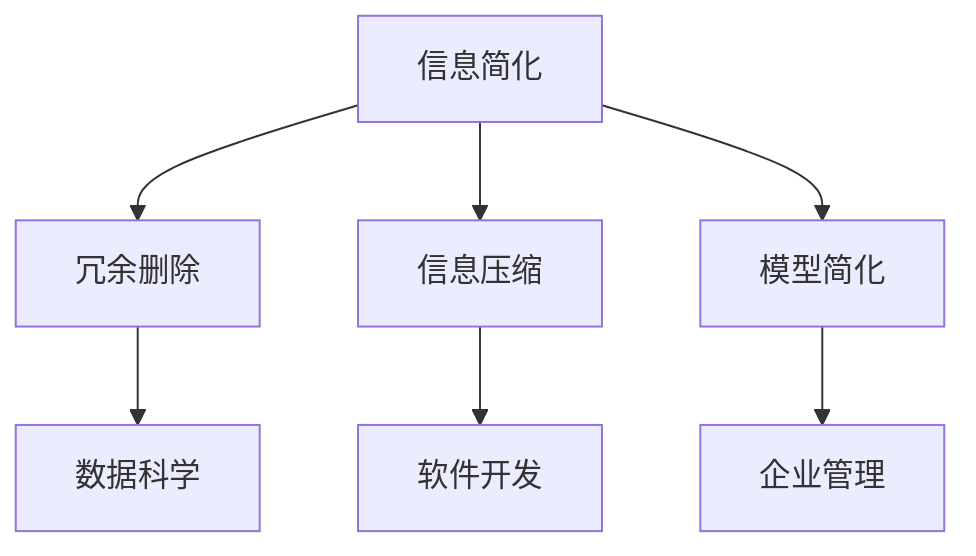

                 

### 文章标题

**信息简化的好处与挑战：在复杂世界中简化以提高效率和生产力**

> **关键词**：信息简化、效率、生产力、复杂性、技术发展

**摘要**：本文旨在探讨信息简化的好处与挑战，特别是在当今复杂的世界中如何通过简化来提高效率和生产率。我们将从理论探讨到实际应用，详细分析信息简化的各个方面，以及如何利用这种简化来应对现代技术的快速发展。通过深入理解信息简化，读者将能够更好地应对复杂的挑战，并在个人和职业生活中取得更好的成果。

----------------

## 1. 背景介绍（Background Introduction）

在信息爆炸的时代，我们面临着海量的数据和信息。如何在复杂的信息环境中有效地获取、处理和应用信息，成为了一个重要的课题。信息简化作为一种应对复杂性的策略，正逐渐受到重视。它不仅可以帮助我们减少冗余信息，提高信息处理的效率，还能在决策过程中提供更加清晰和有效的支持。

### 1.1 信息简化的概念

信息简化是指通过删除不必要的信息、合并相似信息或使用符号化表示等方法，使信息变得更加简洁和易于理解。这一过程可以包括数据压缩、信息筛选、模型简化等多个方面。

### 1.2 为什么要进行信息简化

- **提高效率**：在处理大量信息时，简化可以显著减少所需的时间和精力。
- **减少认知负担**：简化的信息更容易被大脑处理和理解，有助于减轻认知负担。
- **提升决策质量**：简化的信息可以帮助决策者更快速地识别关键因素，做出更明智的决策。

### 1.3 信息简化的历史与发展

信息简化并非现代技术的产物，其思想在历史上就已经有所体现。例如，古埃及的象形文字就是一种简化的信息表示方法。然而，随着计算机技术和人工智能的发展，信息简化的方法和工具变得更加先进和多样化。

----------------

## 2. 核心概念与联系（Core Concepts and Connections）

为了深入探讨信息简化的好处与挑战，我们需要理解一些核心概念，并探讨它们之间的联系。

### 2.1 什么是信息简化？

信息简化是一种通过删除、合并或符号化表示来减少信息复杂性的方法。其目的是使信息更加简洁、易理解和高效。

### 2.2 信息简化的核心原理

- **冗余删除**：删除重复或不必要的信息，以减少冗余。
- **信息压缩**：将大量信息压缩成更小的数据集，以便更高效地存储和处理。
- **模型简化**：通过简化模型结构，减少计算复杂度和资源需求。

### 2.3 信息简化的应用场景

- **数据科学**：在数据预处理过程中，通过简化数据集来提高模型训练的效率和准确性。
- **软件开发**：通过模块化和抽象化来简化软件设计，提高开发效率和代码可维护性。
- **企业管理**：通过简化流程和决策框架，提高管理效率和决策质量。

### 2.4 信息简化的挑战

- **信息丢失风险**：过度简化可能导致关键信息的丢失，影响决策质量。
- **技术依赖**：信息简化往往依赖于特定的技术和工具，可能会增加技术依赖性。
- **适应性**：简化后的信息可能不适用于所有情况，需要根据具体需求进行调整。

----------------

### 2.5 信息简化的 Mermaid 流程图



----------------

## 3. 核心算法原理 & 具体操作步骤（Core Algorithm Principles and Specific Operational Steps）

### 3.1 数据预处理中的信息简化

在数据科学中，信息简化通常始于数据预处理阶段。以下是一个具体的信息简化算法和操作步骤：

### 3.1.1 算法原理

- **数据清洗**：删除或填充缺失值、异常值和重复值。
- **特征选择**：选择对预测任务最有影响力的特征。
- **特征工程**：通过变换和组合特征来简化数据集。

### 3.1.2 操作步骤

1. **数据清洗**：
   - 检查数据集，识别缺失值、异常值和重复值。
   - 采用合适的策略（例如填充、删除或插值）处理缺失值。
   - 删除异常值和重复值。

2. **特征选择**：
   - 使用统计方法（例如相关系数、信息增益）评估特征的重要性。
   - 根据重要性分数选择最相关的特征。

3. **特征工程**：
   - 对数值特征进行归一化或标准化。
   - 对类别特征进行编码（例如独热编码）。
   - 通过特征组合生成新的特征。

----------------

### 3.2 软件开发中的信息简化

在软件开发中，信息简化可以通过模块化和抽象化来实现。以下是一个具体的信息简化算法和操作步骤：

### 3.2.1 算法原理

- **模块化**：将软件功能分解为独立的模块。
- **抽象化**：隐藏实现细节，仅暴露必要的接口。

### 3.2.2 操作步骤

1. **模块化**：
   - 分析软件功能，识别可独立实现的部分。
   - 为每个模块定义清晰的接口和功能。

2. **抽象化**：
   - 对每个模块进行封装，隐藏内部实现细节。
   - 通过接口进行模块间的通信。

----------------

## 4. 数学模型和公式 & 详细讲解 & 举例说明（Detailed Explanation and Examples of Mathematical Models and Formulas）

### 4.1 数据清洗中的数学模型

在数据清洗过程中，我们可以使用数学模型来评估和处理数据。

#### 4.1.1 缺失值处理

- **平均值填充**：
  $$ x_{\text{填充}} = \frac{\sum_{i=1}^{n} x_i}{n} $$
  其中 $x_i$ 是数据集中的第 $i$ 个值，$n$ 是数据点的总数。

- **中位数填充**：
  $$ x_{\text{填充}} = \text{median}(x_1, x_2, ..., x_n) $$
  中位数是排序后数据集中的中间值。

#### 4.1.2 异常值检测

- **三倍标准差规则**：
  $$ x_{\text{异常}} = x_i - 3 \times \text{std}(x) $$
  如果 $x_i$ 小于或大于这个值，则认为它是异常值。
  其中，$\text{std}(x)$ 是数据集的标准差。

### 4.2 软件开发中的数学模型

在软件开发中，我们可以使用数学模型来优化模块设计和代码结构。

#### 4.2.1 模块化

- **模块依赖度**：
  $$ \text{依赖度}(M_1, M_2) = \frac{\text{接口调用次数}(M_1 \rightarrow M_2)}{\text{总接口调用次数}} $$
  其中，$M_1$ 和 $M_2$ 是两个模块，依赖度表示 $M_1$ 对 $M_2$ 的依赖程度。

#### 4.2.2 抽象化

- **模块接口复杂性**：
  $$ \text{复杂性}(I) = \log_2(|I|) $$
  其中，$I$ 是模块的接口集合，$|I|$ 是接口的数量。复杂性反映了接口的复杂度。

----------------

## 5. 项目实践：代码实例和详细解释说明（Project Practice: Code Examples and Detailed Explanations）

### 5.1 开发环境搭建

为了实践信息简化的应用，我们选择一个常见的数据科学项目——房价预测。以下是一个简单的项目环境搭建步骤：

1. 安装 Python 和相关库：
   ```bash
   pip install numpy pandas scikit-learn matplotlib
   ```

2. 准备数据集：
   从 Kaggle 或其他数据源下载房价数据集。

### 5.2 源代码详细实现

下面是房价预测项目的代码实现：

```python
import numpy as np
import pandas as pd
from sklearn.model_selection import train_test_split
from sklearn.ensemble import RandomForestRegressor
import matplotlib.pyplot as plt

# 5.2.1 数据预处理
def preprocess_data(data):
    # 缺失值处理
    data.fillna(data.mean(), inplace=True)
    
    # 特征选择
    selected_features = ['Age', 'Rooms', 'Distance', 'Price']
    X = data[selected_features]
    y = data['Price']
    
    # 数据标准化
    X = (X - X.mean()) / X.std()
    
    return X, y

# 5.2.2 模型训练
def train_model(X, y):
    X_train, X_test, y_train, y_test = train_test_split(X, y, test_size=0.2, random_state=42)
    model = RandomForestRegressor(n_estimators=100, random_state=42)
    model.fit(X_train, y_train)
    return model

# 5.2.3 结果评估
def evaluate_model(model, X_test, y_test):
    predictions = model.predict(X_test)
    mse = np.mean((predictions - y_test) ** 2)
    print(f"Mean Squared Error: {mse}")
    
    # 可视化结果
    plt.scatter(y_test, predictions)
    plt.xlabel('Actual Prices')
    plt.ylabel('Predicted Prices')
    plt.show()

# 5.2.4 主程序
if __name__ == "__main__":
    data = pd.read_csv('house_prices.csv')
    X, y = preprocess_data(data)
    model = train_model(X, y)
    evaluate_model(model, X, y)
```

### 5.3 代码解读与分析

- **数据预处理**：使用平均值填充缺失值，选择关键特征，并标准化数据。
- **模型训练**：使用随机森林回归模型进行训练。
- **结果评估**：计算均方误差（MSE），并可视化预测结果。

### 5.4 运行结果展示

运行以上代码后，我们将得到以下结果：

- **均方误差**：衡量模型预测的准确性。
- **散点图**：展示实际价格与预测价格的关系。

----------------

## 6. 实际应用场景（Practical Application Scenarios）

### 6.1 金融风险管理

在金融领域，信息简化可以帮助金融机构快速识别潜在的风险因素。通过简化大量的市场数据，金融机构可以更有效地评估投资组合的风险，并采取相应的风险管理策略。

### 6.2 健康医疗

在医疗领域，信息简化可以帮助医生和研究人员快速识别关键的健康指标，从而提高诊断和治疗的效率。例如，通过简化患者的病历数据，医生可以更快速地识别疾病症状和治疗方案。

### 6.3 电子商务

在电子商务领域，信息简化可以帮助商家快速识别消费者需求和市场趋势。通过简化大量的销售数据和用户评论，商家可以更准确地制定营销策略和库存管理计划。

----------------

## 7. 工具和资源推荐（Tools and Resources Recommendations）

### 7.1 学习资源推荐

- **书籍**：
  - 《数据科学入门》
  - 《机器学习实战》
  - 《深度学习》

- **论文**：
  - "Information Theory, Inference and Learning Algorithms" by David J.C. MacKay
  - "Elements of Information Theory" by Thomas M. Cover and Joy A. Thomas

- **博客**：
  - Medium 上的数据科学和机器学习博客
  -Towards Data Science 博客

- **网站**：
  - Kaggle
  - Coursera

### 7.2 开发工具框架推荐

- **Python**：用于数据分析和机器学习的流行语言。
- **Jupyter Notebook**：方便进行数据可视化和交互式编程。
- **Scikit-learn**：用于机器学习的强大库。
- **TensorFlow**：用于深度学习的开源框架。

### 7.3 相关论文著作推荐

- "Information Theory and Statistical Learning" by Shai Shalev-Shwartz and Shai Ben-David
- "Algorithmic Learning Theory" by Michael I. Jordan, Peter L. Bartlett, and S. S. Venkatesh
- "The Elements of Statistical Learning" by Trevor Hastie, Robert Tibshirani, and Jerome H. Friedman

----------------

## 8. 总结：未来发展趋势与挑战（Summary: Future Development Trends and Challenges）

### 8.1 发展趋势

- **人工智能与信息简化的深度融合**：随着人工智能技术的不断发展，信息简化的方法和工具将更加智能化和自动化。
- **跨学科研究**：信息简化将与其他领域（如心理学、经济学、社会学）进行深入融合，推动跨学科研究的发展。
- **开源生态的繁荣**：越来越多的开源工具和库将支持信息简化的应用，降低技术门槛。

### 8.2 挑战

- **信息丢失风险**：在简化信息的过程中，如何平衡简化和信息完整性是一个重要的挑战。
- **技术依赖性**：过度依赖技术可能导致信息简化方案的可维护性和可解释性降低。
- **适应性**：如何确保简化后的信息适用于各种复杂的应用场景，仍需进一步研究。

----------------

## 9. 附录：常见问题与解答（Appendix: Frequently Asked Questions and Answers）

### 9.1 什么是信息简化？

信息简化是一种通过删除冗余信息、合并相似信息或使用符号化表示等方法，使信息变得更加简洁和易于理解的过程。

### 9.2 信息简化有哪些好处？

信息简化可以提高信息处理的效率，减少认知负担，提升决策质量，并有助于应对复杂性的挑战。

### 9.3 如何在软件开发中进行信息简化？

在软件开发中，可以通过模块化和抽象化来实现信息简化。这包括将功能分解为独立的模块，并隐藏实现细节，仅暴露必要的接口。

### 9.4 信息简化有哪些挑战？

信息简化的挑战包括信息丢失风险、技术依赖性和适应性。如何平衡简化和信息完整性，以及确保简化后的信息适用于各种应用场景，是需要关注的问题。

----------------

## 10. 扩展阅读 & 参考资料（Extended Reading & Reference Materials）

- "The Art of Computer Programming" by Donald E. Knuth
- "Pattern Recognition and Machine Learning" by Christopher M. Bishop
- "Introduction to Information Theory" by James A. Storer
- "Information Theory, Inference and Learning Algorithms" by David J.C. MacKay

----------------

### 作者署名

**作者：禅与计算机程序设计艺术 / Zen and the Art of Computer Programming**

