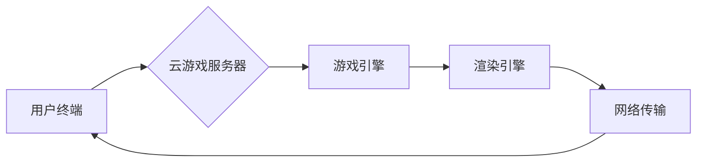

                 

## 云游戏技术：挑战与解决方案

> 关键词：云游戏、流媒体游戏、网络延迟、带宽需求、服务器架构、游戏引擎、用户体验

### 1. 背景介绍

云游戏，也称为流媒体游戏，是一种将游戏逻辑和渲染处理转移到远程服务器，并通过网络将游戏画面和音频流式传输到用户的终端设备的新兴游戏模式。它彻底改变了传统游戏的方式，消除了硬件限制，让玩家可以随时随地享受高品质的游戏体验。

近年来，云游戏技术发展迅速，受到业界和玩家的广泛关注。主要推动因素包括：

* **移动设备的普及:** 智能手机和平板电脑的普及，为云游戏提供了庞大的用户群体。
* **网络带宽的提升:** 5G 网络的商用部署和宽带网络的不断发展，为云游戏提供了高速稳定的网络传输基础。
* **云计算技术的成熟:** 云计算平台的强大算力和存储能力，能够支撑云游戏的复杂游戏逻辑和海量数据处理。

### 2. 核心概念与联系

云游戏的核心概念是将游戏服务器和游戏客户端分离，并将游戏逻辑、渲染和数据处理集中在云端服务器上。玩家通过网络连接云端服务器，接收游戏画面和音频流，并通过输入设备控制游戏角色。

**云游戏架构**

**核心概念解释:**

* **用户终端:** 包括智能手机、平板电脑、电视、PC 等各种设备。
* **云游戏服务器:** 位于数据中心，负责游戏逻辑、渲染和数据处理。
* **游戏引擎:** 提供游戏开发所需的工具和框架，例如物理引擎、人工智能引擎、图形引擎等。
* **渲染引擎:** 负责将游戏逻辑渲染成画面，并进行压缩和编码。
* **网络传输:** 通过网络将游戏画面和音频流传输到用户终端。

### 3. 核心算法原理 & 具体操作步骤

云游戏技术的核心算法主要包括：

* **流媒体编码算法:** 用于将游戏画面和音频压缩成小数据包，并进行高效的网络传输。
* **网络传输协议:** 用于保证游戏画面和音频的实时性和稳定性。
* **延迟补偿算法:** 用于弥补网络延迟带来的游戏体验影响。

#### 3.1 算法原理概述

**流媒体编码算法:**

流媒体编码算法主要利用视频压缩技术，例如 H.264、H.265 等，将游戏画面压缩成小数据包，并进行高效的网络传输。

**网络传输协议:**

常用的网络传输协议包括 TCP 和 UDP。TCP 协议提供可靠的传输，但延迟较高；UDP 协议延迟较低，但不可靠。云游戏通常采用 UDP 协议，并结合延迟补偿算法来保证游戏体验。

**延迟补偿算法:**

延迟补偿算法通过预测玩家输入的延迟，提前渲染游戏画面，从而减少网络延迟对游戏体验的影响。

#### 3.2 算法步骤详解

**流媒体编码算法步骤:**

1. **帧捕获:** 从游戏画面中捕获每一帧图像。
2. **帧编码:** 使用视频压缩算法对每一帧图像进行编码，生成小数据包。
3. **数据包传输:** 将编码后的数据包通过网络传输到用户终端。
4. **数据包解码:** 用户终端接收数据包后，使用相应的解码算法解码成原始图像。

**网络传输协议步骤:**

1. **数据包封装:** 将游戏数据包封装成网络协议格式。
2. **数据包发送:** 将封装好的数据包发送到云游戏服务器。
3. **数据包接收:** 云游戏服务器接收数据包，并进行处理。
4. **数据包回复:** 云游戏服务器将处理后的数据包发送回用户终端。

**延迟补偿算法步骤:**

1. **延迟测量:** 测量玩家输入到服务器的延迟时间。
2. **延迟预测:** 根据历史数据和当前网络状况，预测未来延迟时间。
3. **提前渲染:** 根据延迟预测，提前渲染游戏画面，以减少延迟带来的影响。

#### 3.3 算法优缺点

**流媒体编码算法:**

* **优点:** 能够有效压缩游戏画面，降低网络带宽需求。
* **缺点:** 压缩过程会损失部分图像细节，影响游戏画面质量。

**网络传输协议:**

* **优点:** TCP 协议提供可靠传输，UDP 协议延迟低。
* **缺点:** TCP 协议延迟较高，UDP 协议不可靠。

**延迟补偿算法:**

* **优点:** 可以有效减少网络延迟对游戏体验的影响。
* **缺点:** 算法复杂度较高，需要大量的数据进行训练和优化。

#### 3.4 算法应用领域

* **云游戏:** 将游戏逻辑和渲染处理转移到云端服务器，提供随时随地游戏体验。
* **远程桌面:** 远程控制计算机，访问桌面应用程序和文件。
* **视频会议:** 实时视频和音频通话，支持多人协作。
* **在线教育:** 提供在线课程和直播教学，支持远程学习。

### 4. 数学模型和公式 & 详细讲解 & 举例说明

云游戏技术涉及到许多数学模型和公式，例如：

* **带宽需求计算:** 根据游戏画面分辨率、帧率和压缩算法，计算出所需的网络带宽。
* **延迟补偿算法:** 使用数学模型预测玩家输入的延迟，并根据预测结果提前渲染游戏画面。
* **服务器负载均衡:** 使用数学模型分配游戏玩家到不同的服务器，保证服务器负载均衡。

#### 4.1 数学模型构建

**带宽需求计算模型:**

$$
B = R \times F \times C
$$

其中：

* $B$：带宽需求（Mbps）
* $R$：画面分辨率（像素）
* $F$：帧率（帧/秒）
* $C$：压缩算法效率（比特率/像素）

**延迟补偿算法模型:**

使用马尔科夫链或其他时间序列模型，预测玩家输入的延迟时间。

#### 4.2 公式推导过程

**带宽需求计算公式推导:**

1. 每帧图像的比特率：$B_f = R \times C$
2. 每秒的比特率：$B_s = B_f \times F$
3. 带宽需求：$B = B_s / 1000$

#### 4.3 案例分析与讲解

**带宽需求计算案例:**

假设游戏画面分辨率为 1920x1080 像素，帧率为 60 帧/秒，压缩算法效率为 0.5 比特率/像素。

则带宽需求为：

$$
B = 1920 \times 1080 \times 60 \times 0.5 / 1000 = 622.08 Mbps
$$

### 5. 项目实践：代码实例和详细解释说明

云游戏项目实践通常涉及以下步骤：

* **开发环境搭建:** 搭建云游戏服务器环境，包括操作系统、游戏引擎、渲染引擎等。
* **源代码详细实现:** 实现游戏逻辑、渲染和网络传输功能。
* **代码解读与分析:** 分析代码结构和功能，理解云游戏技术的实现原理。
* **运行结果展示:** 在云游戏服务器上运行游戏，并展示游戏画面和性能。

#### 5.1 开发环境搭建

云游戏服务器环境搭建可以使用云平台提供的服务，例如 AWS、Azure、Google Cloud 等。

#### 5.2 源代码详细实现

云游戏源代码实现涉及到多个模块，例如：

* **游戏逻辑模块:** 实现游戏规则、角色行为、场景交互等功能。
* **渲染模块:** 使用渲染引擎渲染游戏画面，并进行压缩和编码。
* **网络模块:** 使用网络协议实现游戏数据传输，并进行延迟补偿。

#### 5.3 代码解读与分析

代码解读和分析可以帮助开发者理解云游戏技术的实现原理，并进行优化和改进。

#### 5.4 运行结果展示

运行结果展示可以验证云游戏系统的功能和性能，并进行用户体验测试。

### 6. 实际应用场景

云游戏技术已经应用于多个实际场景，例如：

* **游戏直播:** 将游戏画面实时传输到直播平台，供观众观看。
* **游戏竞技:** 提供在线游戏竞技平台，支持多人实时对战。
* **游戏教育:** 利用云游戏技术开发游戏化教育软件，提高学习兴趣和效果。

#### 6.4 未来应用展望

云游戏技术未来将应用于更多领域，例如：

* **虚拟现实 (VR) 和增强现实 (AR):** 提供沉浸式游戏体验，并扩展到其他应用场景。
* **工业设计和模拟:** 利用云游戏技术进行产品设计和模拟，提高效率和精度。
* **医疗培训:** 提供虚拟手术模拟平台，帮助医学生进行手术训练。

### 7. 工具和资源推荐

#### 7.1 学习资源推荐

* **书籍:** 《云游戏技术》
* **网站:** 云游戏联盟 (https://www.cloudgamingalliance.org/)
* **论坛:** 云游戏开发者论坛

#### 7.2 开发工具推荐

* **游戏引擎:** Unity、Unreal Engine
* **云平台:** AWS、Azure、Google Cloud
* **网络传输协议:** WebRTC、RTMP

#### 7.3 相关论文推荐

* **云游戏技术综述:** 《云游戏技术研究进展》
* **延迟补偿算法:** 《基于预测的网络延迟补偿算法》

### 8. 总结：未来发展趋势与挑战

云游戏技术发展迅速，但也面临着一些挑战，例如：

* **网络延迟:** 网络延迟仍然是云游戏体验的主要瓶颈。
* **带宽需求:** 高分辨率游戏需要较高的带宽，对网络基础设施提出了挑战。
* **游戏兼容性:** 不同游戏引擎和平台的兼容性需要进一步提高。

未来云游戏技术的发展趋势包括：

* **5G 网络的普及:** 5G 网络的商用部署将大幅提升网络带宽和降低网络延迟。
* **边缘计算的应用:** 将游戏逻辑和渲染处理部署到边缘服务器，降低网络延迟和带宽需求。
* **人工智能技术的应用:** 利用人工智能技术进行游戏优化和个性化推荐。

### 9. 附录：常见问题与解答

* **云游戏需要什么样的网络环境？**

云游戏需要稳定的网络连接，推荐使用宽带网络，并确保网络带宽足够支持游戏需求。

* **云游戏比本地游戏有什么优势？**

云游戏可以摆脱硬件限制，随时随地享受高品质游戏体验。

* **云游戏有哪些安全风险？**

云游戏数据安全需要得到保障，选择信誉良好的云游戏平台，并注意个人信息保护。

作者：禅与计算机程序设计艺术 / Zen and the Art of Computer Programming 
<end_of_turn>

