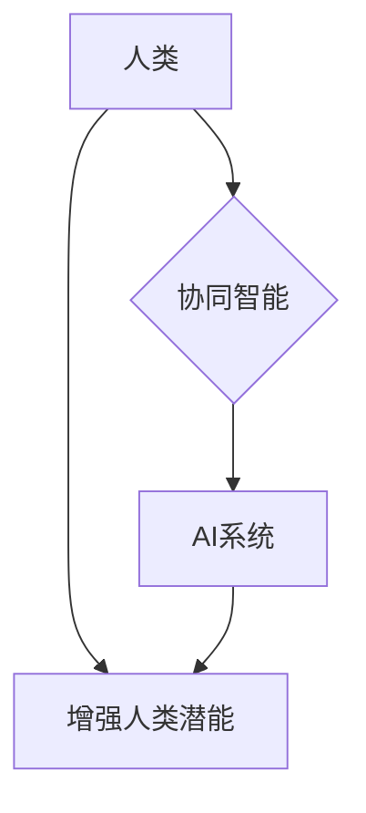

                 

## 人类-AI协作：增强人类潜能与AI能力的融合发展策略与展望

> 关键词：人工智能、人类-AI协作、协同智能、增强人类潜能、AI能力提升、融合发展策略、未来趋势

### 1. 背景介绍

人工智能（AI）技术近年来取得了飞速发展，从语音识别、图像识别到自然语言处理等领域展现出强大的应用潜力。然而，AI技术本身也存在局限性，例如缺乏人类的创造力、批判性思维和情感理解能力。因此，如何有效地将AI技术与人类智慧相结合，实现人类-AI协作，成为当前人工智能发展的重要课题。

人类-AI协作是指人类和人工智能系统在共同完成任务的过程中相互补充、协同工作，发挥各自优势，最终实现超越单一智能的协同效应。这种合作模式不仅可以提升工作效率和准确性，更重要的是可以帮助人类突破认知边界，探索新的可能性。

### 2. 核心概念与联系

**2.1 核心概念**

* **人工智能 (AI):** 指计算机模拟人类智能行为的能力，包括学习、推理、决策、感知和语言理解等。
* **协同智能 (CI):** 指人类和人工智能系统在共同完成任务的过程中相互合作、相互补充，发挥各自优势，实现超越单一智能的协同效应。
* **增强人类潜能 (HPE):** 指通过人工智能技术辅助人类提升认知能力、创造力、解决问题的能力等，从而实现人类潜能的全面释放。

**2.2 关系架构**



**2.3 协同智能的实现方式**

* **人类-在-回路 (Human-in-the-Loop):** 人工智能系统在完成任务过程中需要人类的干预和指导，例如图像识别系统需要人类确认识别结果。
* **人类-与-回路 (Human-with-the-Loop):** 人工智能系统和人类共同参与任务的完成，例如医疗诊断中，人工智能系统提供诊断建议，医生最终做出诊断决定。
* **人类-超越-回路 (Human-beyond-the-Loop):** 人工智能系统能够自主完成大部分任务，人类则负责监督和优化系统工作，例如无人驾驶汽车。

### 3. 核心算法原理 & 具体操作步骤

**3.1 算法原理概述**

人类-AI协作的核心算法原理是基于深度学习、强化学习和自然语言处理等人工智能技术，通过训练模型学习人类的行为模式、知识和经验，并与人类进行交互和协作。

**3.2 算法步骤详解**

1. **数据收集和预处理:** 收集人类和AI系统相关的任务数据，并进行清洗、格式化和标注等预处理工作。
2. **模型训练:** 使用深度学习、强化学习等算法训练AI模型，使其能够理解人类指令、预测人类行为和生成人类可理解的输出。
3. **交互设计:** 设计人类-AI交互界面和流程，使人类能够方便地与AI系统进行沟通和协作。
4. **任务分配和执行:** 根据任务需求，将任务分配给人类和AI系统，并协调两者之间的协作流程。
5. **结果评估和反馈:** 对协作结果进行评估，并根据评估结果对AI模型进行调整和优化，不断提升协作效率和准确性。

**3.3 算法优缺点**

* **优点:** 
    * 可以充分发挥人类和AI系统的各自优势，实现协同效应。
    * 可以提升工作效率和准确性，减少人为错误。
    * 可以帮助人类突破认知边界，探索新的可能性。
* **缺点:** 
    * 需要设计复杂的交互机制和流程。
    * 需要大量的训练数据和计算资源。
    * 需要解决伦理和安全问题，例如数据隐私和算法偏见。

**3.4 算法应用领域**

* **医疗保健:** AI辅助医生诊断疾病、制定治疗方案、进行手术辅助。
* **教育:** AI个性化学习辅导、智能答疑、自动批改作业。
* **金融:** AI风险评估、欺诈检测、投资决策支持。
* **制造业:** AI智能制造、设备故障预测、生产过程优化。

### 4. 数学模型和公式 & 详细讲解 & 举例说明

**4.1 数学模型构建**

人类-AI协作可以抽象为一个多智能体系统，其中人类和AI系统分别代表不同的智能体。每个智能体的行为可以由其自身的模型和策略决定。

**4.2 公式推导过程**

假设人类智能体 $h$ 和AI智能体 $a$ 在共同完成任务 $T$ 中，他们的行为分别由策略函数 $f_h(s)$ 和 $f_a(s)$ 表示，其中 $s$ 是系统当前的状态。

任务完成的成功概率可以表示为：

$$P(T|f_h, f_a) = \int_S P(s) \cdot P(T|s, f_h, f_a) ds$$

其中：

* $P(s)$ 是系统状态 $s$ 的概率分布。
* $P(T|s, f_h, f_a)$ 是在状态 $s$ 下，人类和AI系统分别使用策略 $f_h$ 和 $f_a$ 完成任务 $T$ 的概率。

**4.3 案例分析与讲解**

例如，在医疗诊断任务中，人类医生 $h$ 和AI诊断系统 $a$ 共同完成诊断任务。

* $s$ 可以表示患者的症状、病史、检查结果等信息。
* $f_h(s)$ 可以表示医生的诊断策略，例如根据患者信息进行推理和判断。
* $f_a(s)$ 可以表示AI诊断系统的诊断策略，例如根据患者信息预测疾病概率。

通过训练模型学习人类医生的诊断策略和AI诊断系统的诊断策略，可以构建一个数学模型来预测人类-AI协作完成诊断任务的成功概率。

### 5. 项目实践：代码实例和详细解释说明

**5.1 开发环境搭建**

* 操作系统: Ubuntu 20.04
* Python 版本: 3.8
* 必要的库: TensorFlow, PyTorch, scikit-learn

**5.2 源代码详细实现**

```python
# 人类-AI协作模型训练示例

import tensorflow as tf

# 定义模型结构
model = tf.keras.models.Sequential([
    tf.keras.layers.Dense(128, activation='relu', input_shape=(input_dim,)),
    tf.keras.layers.Dense(64, activation='relu'),
    tf.keras.layers.Dense(1, activation='sigmoid')
])

# 编译模型
model.compile(optimizer='adam',
              loss='binary_crossentropy',
              metrics=['accuracy'])

# 训练模型
model.fit(X_train, y_train, epochs=10, batch_size=32)

# 评估模型
loss, accuracy = model.evaluate(X_test, y_test)
print('Loss:', loss)
print('Accuracy:', accuracy)
```

**5.3 代码解读与分析**

* 该代码示例展示了使用TensorFlow框架训练一个简单的二分类模型，用于模拟人类-AI协作任务。
* 模型输入为特征向量 $X$，输出为预测结果 $y$。
* 模型结构包含三个全连接层，激活函数分别为ReLU和sigmoid。
* 模型使用Adam优化器、二分类交叉熵损失函数和准确率作为评估指标。
* 模型训练过程包括训练数据 $X_train$ 和标签 $y_train$，训练轮数 $epochs$ 和批处理大小 $batch_size$。
* 模型评估过程使用测试数据 $X_test$ 和标签 $y_test$，计算模型的损失值和准确率。

**5.4 运行结果展示**

训练完成后，可以根据模型的损失值和准确率评估模型的性能。

### 6. 实际应用场景

**6.1 医疗诊断辅助**

AI系统可以辅助医生分析患者的影像数据、病历信息和基因数据，提供诊断建议和治疗方案，提高诊断准确率和效率。

**6.2 教育个性化学习**

AI系统可以根据学生的学习进度、知识掌握情况和学习风格，提供个性化的学习内容和辅导，提高学生的学习效率和兴趣。

**6.3 金融风险管理**

AI系统可以分析海量金融数据，识别潜在的风险和欺诈行为，帮助金融机构进行风险管理和控制。

**6.4 自动驾驶汽车**

AI系统可以感知周围环境、规划驾驶路线、控制车辆行驶，实现自动驾驶功能，提高交通安全和效率。

**6.5 未来应用展望**

随着人工智能技术的不断发展，人类-AI协作将在更多领域得到应用，例如：

* **科学研究:** AI可以辅助科学家进行数据分析、模型构建和实验设计，加速科学发现。
* **艺术创作:** AI可以与艺术家合作，创作出新的艺术作品，拓展艺术的边界。
* **社会服务:** AI可以辅助社会工作者提供更精准的社会服务，帮助解决社会问题。

### 7. 工具和资源推荐

**7.1 学习资源推荐**

* **在线课程:** Coursera, edX, Udacity
* **书籍:** 《深度学习》、《人工智能：一种现代方法》
* **开源项目:** TensorFlow, PyTorch, OpenAI

**7.2 开发工具推荐**

* **深度学习框架:** TensorFlow, PyTorch, Keras
* **数据处理工具:** Pandas, NumPy
* **可视化工具:** Matplotlib, Seaborn

**7.3 相关论文推荐**

* 《Attention Is All You Need》
* 《BERT: Pre-training of Deep Bidirectional Transformers for Language Understanding》
* 《Generative Adversarial Networks》

### 8. 总结：未来发展趋势与挑战

**8.1 研究成果总结**

近年来，人类-AI协作领域取得了显著进展，例如：

* 深度学习算法的不断发展，使得AI系统能够更好地理解和处理人类语言和图像数据。
* 强化学习算法的应用，使得AI系统能够学习人类的行为模式和决策策略。
* 人机交互技术的进步，使得人类与AI系统之间的交互更加自然和便捷。

**8.2 未来发展趋势**

* **更智能的AI系统:** 未来AI系统将更加智能，能够更好地理解人类需求和意图，提供更精准和个性化的服务。
* **更广泛的应用场景:** 人类-AI协作将应用于更多领域，例如医疗保健、教育、金融、制造业等。
* **更紧密的协作模式:** 人类和AI系统将更加紧密地协作，共同完成复杂的任务。

**8.3 面临的挑战**

* **算法安全性和可靠性:** 确保AI系统安全可靠地运行，避免算法偏差和错误决策。
* **数据隐私和安全:** 保护人类数据隐私，防止数据泄露和滥用。
* **伦理和社会影响:** 考虑人类-AI协作带来的伦理和社会影响，制定相应的规范和政策。

**8.4 研究展望**

未来研究将重点关注以下几个方面：

* **开发更安全、更可靠的AI算法。**
* **探索更有效的协作机制和交互模式。**
* **研究人类-AI协作的伦理和社会影响。**
* **推动人类-AI协作的产业化应用。**

### 9. 附录：常见问题与解答

**9.1 如何评估人类-AI协作的效率？**

可以根据任务完成时间、准确率、成本等指标评估人类-AI协作的效率。

**9.2 如何解决人类-AI协作中的信任问题？**

可以通过透明化AI决策过程、提供可解释性分析、建立反馈机制等方式增强人类对AI系统的信任。

**9.3 人类-AI协作会取代人类工作吗？**

人类-AI协作更倾向于增强人类能力，而不是取代人类工作。AI系统可以帮助人类完成重复性、繁琐性工作，释放人类精力去从事更创造性、更具挑战性的工作。


作者：禅与计算机程序设计艺术 / Zen and the Art of Computer Programming 
<end_of_turn>

