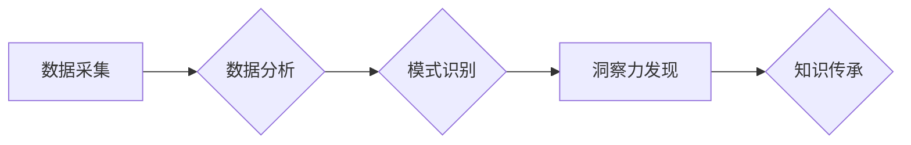

                 

## 人类知识的传承与发展：洞察力的重要作用

> 关键词：知识传承、洞察力、人工智能、机器学习、深度学习、数据分析、模式识别

### 1. 背景介绍

人类文明的发展离不开知识的传承与发展。从古至今，人类不断积累和创新，将经验、智慧和发现代代相传，推动社会进步。在信息时代，知识的获取和传播速度空前加快，人工智能技术的兴起更是为知识传承和发展注入了新的活力。

人工智能，特别是深度学习技术的快速发展，使得机器能够从海量数据中学习和提取知识，并进行推理和决策。这为人类知识的传承和发展提供了新的可能性。然而，人工智能仅仅是工具，真正的关键在于人类的洞察力。

### 2. 核心概念与联系

**2.1 洞察力**

洞察力是指从纷繁复杂的现象中识别出隐藏的模式、关系和趋势的能力。它是一种超越表面现象，深入理解本质的能力。洞察力是人类智慧的体现，也是推动创新和解决问题的关键驱动力。

**2.2 人工智能与洞察力**

人工智能技术可以帮助人类收集、整理和分析海量数据，为洞察力提供强大的工具支持。然而，人工智能本身并不能拥有洞察力。人工智能算法需要人类提供数据、模型和目标，并根据算法的输出结果进行解读和分析。最终，洞察力的产生仍然依赖于人类的理解和判断。

**2.3 知识传承与洞察力**

知识传承是将经验、智慧和发现传递给下一代的过程。洞察力在知识传承中扮演着至关重要的角色。只有通过洞察力，才能将抽象的知识转化为具体的应用，并将其有效地传递给下一代。

**Mermaid 流程图**



### 3. 核心算法原理 & 具体操作步骤

**3.1 算法原理概述**

深度学习算法是一种模仿人类大脑神经网络结构的机器学习算法。它通过多层神经网络进行特征提取和学习，能够从复杂的数据中识别出隐藏的模式和关系。

**3.2 算法步骤详解**

1. **数据预处理:** 将原始数据进行清洗、转换和格式化，使其适合深度学习算法的训练。
2. **网络结构设计:** 根据任务需求设计深度神经网络的结构，包括神经元数量、层数和激活函数等。
3. **模型训练:** 使用训练数据训练深度神经网络，调整网络参数，使其能够准确地识别模式和关系。
4. **模型评估:** 使用测试数据评估模型的性能，并根据评估结果进行模型调优。
5. **模型部署:** 将训练好的模型部署到实际应用场景中，用于数据分析、预测和决策等任务。

**3.3 算法优缺点**

**优点:**

* 能够从复杂的数据中识别出隐藏的模式和关系。
* 具有强大的泛化能力，能够应用于各种不同的任务。
* 随着数据量的增加，模型性能会不断提升。

**缺点:**

* 需要大量的训练数据。
* 训练过程耗时和耗能。
* 模型解释性较差，难以理解模型的决策过程。

**3.4 算法应用领域**

深度学习算法广泛应用于各个领域，例如：

* **图像识别:** 人脸识别、物体检测、图像分类等。
* **自然语言处理:** 文本分类、机器翻译、语音识别等。
* **推荐系统:** 商品推荐、内容推荐、用户画像等。
* **医疗诊断:** 疾病预测、影像分析、药物研发等。
* **金融分析:** 风险评估、欺诈检测、投资预测等。

### 4. 数学模型和公式 & 详细讲解 & 举例说明

**4.1 数学模型构建**

深度学习算法的核心是神经网络模型。神经网络模型由多个层组成，每层包含多个神经元。神经元之间通过连接权重进行信息传递。

**4.2 公式推导过程**

深度学习算法的训练过程是通过优化连接权重来实现的。常用的优化算法包括梯度下降法和动量法。

**梯度下降法:**

$$
\theta = \theta - \alpha \nabla J(\theta)
$$

其中：

* $\theta$ 是连接权重的参数向量。
* $\alpha$ 是学习率。
* $\nabla J(\theta)$ 是损失函数 $J(\theta)$ 的梯度。

**动量法:**

$$
v_t = \beta v_{t-1} + \alpha \nabla J(\theta)
$$

$$
\theta = \theta - v_t
$$

其中：

* $v_t$ 是动量向量。
* $\beta$ 是动量系数。

**4.3 案例分析与讲解**

假设我们有一个简单的图像分类任务，目标是将猫和狗的图片进行分类。我们可以使用卷积神经网络 (CNN) 来解决这个问题。

CNN 的结构包括卷积层、池化层和全连接层。卷积层用于提取图像特征，池化层用于降低特征维度，全连接层用于分类。

在训练过程中，我们使用猫和狗的图片作为训练数据，并使用交叉熵损失函数来衡量模型的性能。通过梯度下降法或动量法，我们可以优化 CNN 的连接权重，使其能够准确地分类猫和狗的图片。

### 5. 项目实践：代码实例和详细解释说明

**5.1 开发环境搭建**

为了实现深度学习项目，我们需要搭建一个合适的开发环境。常用的开发环境包括：

* **Python:** 深度学习框架的编程语言。
* **TensorFlow/PyTorch:** 深度学习框架。
* **GPU:** 加速深度学习训练的硬件。

**5.2 源代码详细实现**

以下是一个使用 TensorFlow 实现简单的图像分类器的代码示例：

```python
import tensorflow as tf

# 定义模型结构
model = tf.keras.models.Sequential([
    tf.keras.layers.Conv2D(32, (3, 3), activation='relu', input_shape=(28, 28, 1)),
    tf.keras.layers.MaxPooling2D((2, 2)),
    tf.keras.layers.Conv2D(64, (3, 3), activation='relu'),
    tf.keras.layers.MaxPooling2D((2, 2)),
    tf.keras.layers.Flatten(),
    tf.keras.layers.Dense(10, activation='softmax')
])

# 编译模型
model.compile(optimizer='adam',
              loss='sparse_categorical_crossentropy',
              metrics=['accuracy'])

# 训练模型
model.fit(x_train, y_train, epochs=5)

# 评估模型
loss, accuracy = model.evaluate(x_test, y_test)
print('Test loss:', loss)
print('Test accuracy:', accuracy)
```

**5.3 代码解读与分析**

这段代码定义了一个简单的卷积神经网络模型，并使用 TensorFlow 的 API 进行训练和评估。

* `tf.keras.models.Sequential`: 创建一个顺序模型，层级结构清晰。
* `tf.keras.layers.Conv2D`: 卷积层，用于提取图像特征。
* `tf.keras.layers.MaxPooling2D`: 池化层，用于降低特征维度。
* `tf.keras.layers.Flatten`: 将多维特征转换为一维向量。
* `tf.keras.layers.Dense`: 全连接层，用于分类。
* `model.compile`: 编译模型，指定优化器、损失函数和评估指标。
* `model.fit`: 训练模型，使用训练数据进行迭代训练。
* `model.evaluate`: 评估模型，使用测试数据计算损失和准确率。

**5.4 运行结果展示**

训练完成后，我们可以使用测试数据评估模型的性能。模型的准确率越高，说明模型的分类能力越强。

### 6. 实际应用场景

深度学习算法在各个领域都有广泛的应用场景，例如：

* **医疗诊断:** 深度学习算法可以用于分析医学影像，辅助医生诊断疾病。例如，可以用于识别肿瘤、骨折和心血管疾病。
* **金融风险评估:** 深度学习算法可以用于分析金融数据，识别欺诈行为和评估风险。例如，可以用于信用卡欺诈检测和信用评分。
* **智能推荐:** 深度学习算法可以用于分析用户行为数据，推荐个性化的商品、内容和服务。例如，可以用于电商平台的商品推荐和视频网站的个性化推荐。

**6.4 未来应用展望**

随着人工智能技术的不断发展，深度学习算法将在未来发挥更加重要的作用。例如，可以用于：

* **自动驾驶:** 深度学习算法可以用于训练自动驾驶汽车，使其能够感知周围环境并做出决策。
* **机器人控制:** 深度学习算法可以用于训练机器人，使其能够执行复杂的任务，例如抓取物体和导航。
* **个性化教育:** 深度学习算法可以用于分析学生的学习数据，提供个性化的学习方案。

### 7. 工具和资源推荐

**7.1 学习资源推荐**

* **课程:**
    * 深度学习 Specialization (Coursera)
    * fast.ai
    * TensorFlow 官方教程
* **书籍:**
    * 深度学习 (Ian Goodfellow, Yoshua Bengio, Aaron Courville)
    * 深度学习实践 (François Chollet)

**7.2 开发工具推荐**

* **深度学习框架:** TensorFlow, PyTorch, Keras
* **数据处理工具:** Pandas, NumPy
* **可视化工具:** Matplotlib, Seaborn

**7.3 相关论文推荐**

* AlexNet: ImageNet Classification with Deep Convolutional Neural Networks (Krizhevsky et al., 2012)
* VGGNet: Very Deep Convolutional Networks for Large-Scale Image Recognition (Simonyan & Zisserman, 2014)
* ResNet: Deep Residual Learning for Image Recognition (He et al., 2015)

### 8. 总结：未来发展趋势与挑战

**8.1 研究成果总结**

近年来，深度学习算法取得了显著的成果，在图像识别、自然语言处理、语音识别等领域取得了突破性的进展。

**8.2 未来发展趋势**

* **模型更深、更复杂:** 研究人员将继续探索更深、更复杂的深度学习模型，以提高模型的性能和泛化能力。
* **数据更丰富、更多样:** 深度学习算法需要大量的训练数据，未来将会有更多的数据被收集和利用。
* **算法更高效、更鲁棒:** 研究人员将继续探索更高效、更鲁棒的深度学习算法，以降低训练成本和提高模型的可靠性。

**8.3 面临的挑战**

* **数据隐私和安全:** 深度学习算法需要处理大量的个人数据，如何保护数据隐私和安全是一个重要的挑战。
* **模型解释性和可信度:** 深度学习模型的决策过程往往难以理解，如何提高模型的解释性和可信度是一个重要的研究方向。
* **算法公平性和偏见:** 深度学习算法可能存在公平性和偏见问题，如何确保算法的公平性和公正性是一个重要的挑战。

**8.4 研究展望**

未来，深度学习技术将继续发展，并在更多领域发挥重要作用。我们需要加强对深度学习技术的理解和研究，并积极应对其带来的挑战，以确保深度学习技术能够造福人类社会。

### 9. 附录：常见问题与解答

**Q1: 深度学习算法需要多少数据才能训练？**

A1: 深度学习算法需要大量的训练数据，一般来说，需要数千甚至数百万个样本才能达到较好的性能。

**Q2: 深度学习算法的训练过程很耗时，如何加速训练速度？**

A2: 可以使用更强大的硬件，例如GPU，来加速训练速度。还可以使用一些优化算法，例如动量法和学习率衰减，来提高训练效率。

**Q3: 深度学习算法的模型解释性差，如何提高模型的可解释性？**

A3: 可以使用一些可解释性分析方法，例如LIME和SHAP，来解释模型的决策过程。


作者：禅与计算机程序设计艺术 / Zen and the Art of Computer Programming 
<end_of_turn>

