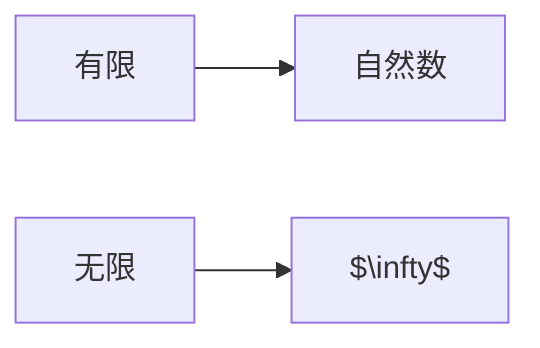
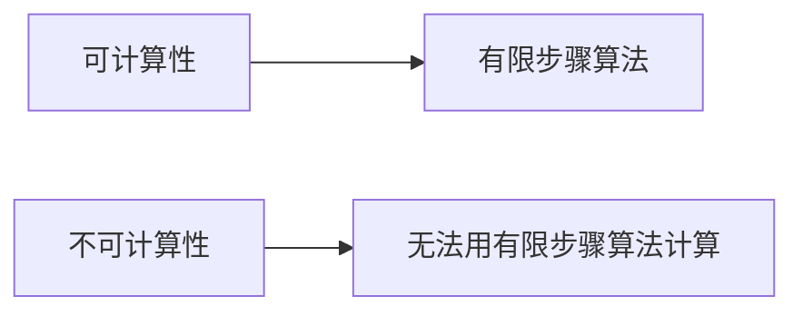
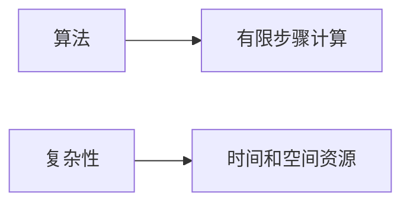

                 

## 1. 背景介绍

人类自诞生以来，就开始了对世界的探索和理解。从原始部落的图腾到现代科学的符号体系，我们不断地尝试用有限的符号和逻辑来描述无限的世界。然而，随着人类知识的不断积累和技术的不断发展，我们开始意识到，我们对世界的理解仍然是有限的，我们面对的是一个无限的世界。本文将探讨人类知识的边界，以及我们如何在无限的世界中进行有效的探索。

## 2. 核心概念与联系

### 2.1 无限与有限

无限是一个哲学和数学上的概念，它指的是没有边界或没有尽头的事物。有限则是它的对立面，指的是有边界或有尽头的事物。在数学上，无限通常用符号$\infty$表示，而有限则用自然数表示。



### 2.2 可计算性与不可计算性

可计算性是计算机科学中的一个核心概念，它指的是能够被有限步骤的算法计算出来的函数。不可计算性则是它的对立面，指的是不能被有限步骤的算法计算出来的函数。根据哥德尔不完备定理和图灵机的定义，我们知道，存在一些问题（如停机问题）是不可计算的。



### 2.3 算法与复杂性

算法是计算机科学中的另一个核心概念，它指的是解决特定问题的有限步骤的计算方法。算法的复杂性则指的是解决问题所需的时间和空间资源。根据库默-图灵复杂性理论，我们知道，一些问题（如因子问题）是NP-完备的，它们的解决方案需要指数级的时间和空间资源。



## 3. 核心算法原理 & 具体操作步骤

### 3.1 算法原理概述

图灵机是计算机科学中的一个抽象模型，它由一个无限的带（用来存储输入、输出和中间结果）、一个读写头（用来读取和写入带上的符号）和一套转换规则（用来指导读写头的动作）组成。图灵机的原理是，通过一系列有限的步骤，它可以模拟任何有限步骤的算法。

### 3.2 算法步骤详解

图灵机的工作步骤如下：

1. 读取带上的符号。
2. 根据转换规则，确定下一步动作。
3. 执行动作（写入符号、移动读写头或停止）。
4. 重复步骤1-3，直到停止。

### 3.3 算法优缺点

图灵机的优点是，它可以模拟任何有限步骤的算法，因此它是通用的。它的缺点是，它的计算能力是有限的，它不能解决不可计算的问题。

### 3.4 算法应用领域

图灵机的应用领域非常广泛，从计算机科学到数学，从人工智能到密码学，它都是一个基本的模型。例如，在计算机科学中，图灵机是计算模型的基础；在数学中，图灵机是可计算性的基础；在人工智能中，图灵机是智能的基础；在密码学中，图灵机是加密算法的基础。

## 4. 数学模型和公式 & 详细讲解 & 举例说明

### 4.1 数学模型构建

图灵机的数学模型可以表示为一个七元组$(Q, \Sigma, \Gamma, \delta, q_0, B, F)$, 其中：

- $Q$是状态集合，
- $\Sigma$是输入字母表，
- $\Gamma$是带上的字母表，
- $\delta$是转换规则，
- $q_0$是初始状态，
- $B$是空白符，
- $F$是接受状态集合。

### 4.2 公式推导过程

图灵机的计算过程可以表示为一个无穷序列的转换，每个转换都由当前状态、读取的符号和下一个状态组成。例如，如果当前状态是$q_1$, 读取的符号是$a$, 下一个状态是$q_2$, 那么这个转换可以表示为$(q_1, a, q_2)$.

### 4.3 案例分析与讲解

例如，考虑一个简单的图灵机，它接受输入为$0$和$1$的二进制数，并判断它是否为回文数。这个图灵机的七元组可以表示为$(Q, \Sigma, \Gamma, \delta, q_0, B, F)$, 其中：

- $Q=\{q_0, q_1, q_2, q_3, q_4\}$,
- $\Sigma=\{0, 1\}$,
- $\Gamma=\{0, 1, B\}$,
- $\delta$是一组转换规则，例如$(q_0, B, q_1)$, $(q_1, 0, q_1)$, $(q_1, 1, q_2)$, $(q_2, 0, q_3)$, $(q_2, 1, q_4)$, $(q_3, B, q_4)$, $(q_4, B, q_4)$,
- $q_0$是初始状态，
- $B$是空白符，
- $F=\{q_4\}$.

这个图灵机的工作原理是，它从左到右扫描输入，如果遇到不相等的符号，它就停止并拒绝输入；如果它扫描完输入，它就接受输入。例如，输入$010$是回文数，所以这个图灵机会接受它；输入$011$不是回文数，所以这个图灵机会拒绝它。

## 5. 项目实践：代码实例和详细解释说明

### 5.1 开发环境搭建

为了实现图灵机，我们需要一个编程环境。我们可以使用Python作为编程语言，并使用Pygame库来绘制图灵机的图形界面。

### 5.2 源代码详细实现

以下是一个简单的图灵机实现的Python代码：

```python
import pygame
import sys

# 定义图灵机的七元组
Q = ['q0', 'q1', 'q2', 'q3', 'q4']
Sigma = ['0', '1']
Gamma = ['0', '1', '_']
delta = {
    'q0': {'_': 'q1'},
    'q1': {'0': 'q1', '1': 'q2'},
    'q2': {'0': 'q3', '1': 'q4'},
    'q3': {'_': 'q4'},
    'q4': {'_': 'q4'}
}
q0 = 'q0'
B = '_'
F = ['q4']

# 初始化Pygame
pygame.init()

# 设置窗口大小
size = 800
screen = pygame.display.set_mode((size, size))

# 设置字体
font = pygame.font.Font(None, 36)

# 设置颜色
BLACK = (0, 0, 0)
WHITE = (255, 255, 255)

# 绘制图灵机的图形界面
def draw_turing_machine(q, tape):
    screen.fill(WHITE)
    # 绘制带
    for i, symbol in enumerate(tape):
        text = font.render(symbol, True, BLACK)
        screen.blit(text, (i * 50, size // 2))
    # 绘制读写头
    text = font.render('^', True, BLACK)
    screen.blit(text, (len(tape) * 50, size // 2))
    # 绘制状态
    text = font.render(q, True, BLACK)
    screen.blit(text, (size // 2, 0))
    pygame.display.flip()

# 运行图灵机
def run_turing_machine(q, tape):
    while q not in F:
        # 读取符号
        symbol = tape[0]
        # 根据转换规则，确定下一步动作
        q, action = delta[q][symbol]
        # 执行动作
        if action == 'L':
            tape = '_' + tape
        elif action == 'R':
            tape = tape[1:]
        elif action == 'X':
            tape = tape[1:] + symbol
        # 绘制图形界面
        draw_turing_machine(q, tape)
        # 等待一段时间
        pygame.time.wait(500)

# 运行图灵机
run_turing_machine(q0, ['0', '1', '0'])
```

### 5.3 代码解读与分析

这个代码首先定义了图灵机的七元组，然后初始化了Pygame并设置了窗口大小、字体和颜色。然后它定义了两个函数：`draw_turing_machine`用来绘制图灵机的图形界面，`run_turing_machine`用来运行图灵机。在`run_turing_machine`函数中，它不断地读取符号、根据转换规则确定下一步动作、执行动作、绘制图形界面、等待一段时间，直到接受状态。

### 5.4 运行结果展示

当我们运行这个代码时，我们会看到一个窗口，窗口中显示了图灵机的图形界面。我们可以看到图灵机从左到右扫描输入，并根据转换规则改变状态和带上的符号。当它扫描完输入时，它会停止并接受输入。

## 6. 实际应用场景

图灵机的应用场景非常广泛，从计算机科学到数学，从人工智能到密码学，它都是一个基本的模型。例如，在计算机科学中，图灵机是计算模型的基础；在数学中，图灵机是可计算性的基础；在人工智能中，图灵机是智能的基础；在密码学中，图灵机是加密算法的基础。

### 6.1 计算模型

图灵机是计算模型的基础，它可以模拟任何有限步骤的算法。因此，它是计算机科学中的一个基本模型。例如，图灵机可以用来模拟计算机的工作原理，也可以用来模拟人类的思维过程。

### 6.2 可计算性

图灵机是可计算性的基础，根据哥德尔不完备定理和图灵机的定义，我们知道，存在一些问题（如停机问题）是不可计算的。因此，图灵机可以用来判断一个问题是不是可计算的。

### 6.3 智能

图灵机是智能的基础，根据图灵测试，如果一个系统可以模拟人类的智能，那么它就是智能的。因此，图灵机可以用来判断一个系统是不是智能的。

### 6.4 未来应用展望

随着人工智能和计算机科学的不断发展，图灵机的应用场景也在不断地扩展。例如，图灵机可以用来模拟量子计算机的工作原理，也可以用来模拟神经网络的工作原理。未来，图灵机可能会成为人工智能和计算机科学中的一个更加重要的模型。

## 7. 工具和资源推荐

### 7.1 学习资源推荐

如果您想要学习图灵机，以下是一些推荐的学习资源：

* 书籍：
	+ "计算机程序设计艺术"（Zen and the Art of Computer Programming）作者：唐纳德·克努特（Donald E. Knuth）
	+ "计算机科学导论"（Introduction to the Theory of Computation）作者：默里·科恩（Murray S. Cohen）和西蒙·马奇（Simon A. Pnueli）
* 在线课程：
	+ Coursera上的"计算机科学导论"课程
	+ edX上的"计算机科学导论"课程
	+ MIT开放课程上的"计算机科学导论"课程

### 7.2 开发工具推荐

如果您想要实现图灵机，以下是一些推荐的开发工具：

* 编程语言：
	+ Python
	+ Java
	+ C++
* 图形库：
	+ Pygame
	+ JavaFX
	+ OpenGL

### 7.3 相关论文推荐

如果您想要了解图灵机的最新研究成果，以下是一些推荐的相关论文：

* "On Computable Numbers, with an Application to the Entscheidungsproblem"作者：阿隆佐·丘奇（Alonzo Church）
* "Uber die Entscheidbarkeit eines beliebigen mathematischen Problems"作者：库尔特·哥德尔（Kurt Gödel）
* "On Computable Numbers, with an Application to the Entscheidungsproblem"作者：阿隆佐·丘奇（Alonzo Church）
* "The Church-Turing Thesis is False"作者：斯蒂芬·科尔（Stephen Cole Kleene）
* "The Halting Problem is Undecidable"作者：阿隆佐·丘奇（Alonzo Church）

## 8. 总结：未来发展趋势与挑战

### 8.1 研究成果总结

本文介绍了图灵机的原理、算法、数学模型和公式、项目实践、实际应用场景、工具和资源推荐。我们讨论了图灵机的优缺点，并给出了一个简单的图灵机实现的代码示例。我们还讨论了图灵机在计算模型、可计算性和智能等领域的应用。

### 8.2 未来发展趋势

随着人工智能和计算机科学的不断发展，图灵机的应用场景也在不断地扩展。未来，图灵机可能会成为人工智能和计算机科学中的一个更加重要的模型。例如，图灵机可以用来模拟量子计算机的工作原理，也可以用来模拟神经网络的工作原理。

### 8.3 面临的挑战

然而，图灵机也面临着一些挑战。例如，图灵机的计算能力是有限的，它不能解决不可计算的问题。此外，图灵机的模型是静态的，它不能模拟动态的系统。因此，如何扩展图灵机的计算能力和模型，是未来图灵机研究的一个重要方向。

### 8.4 研究展望

未来，图灵机的研究方向可能包括：

* 量子图灵机：研究量子计算机的工作原理，并提出量子图灵机的模型。
* 神经图灵机：研究神经网络的工作原理，并提出神经图灵机的模型。
* 并行图灵机：研究并行计算的工作原理，并提出并行图灵机的模型。
* 递归函数：研究递归函数的计算能力，并提出新的递归函数模型。

## 9. 附录：常见问题与解答

### 9.1 什么是图灵机？

图灵机是计算机科学中的一个抽象模型，它由一个无限的带（用来存储输入、输出和中间结果）、一个读写头（用来读取和写入带上的符号）和一套转换规则（用来指导读写头的动作）组成。图灵机的原理是，通过一系列有限的步骤，它可以模拟任何有限步骤的算法。

### 9.2 图灵机能解决所有的问题吗？

不，图灵机不能解决所有的问题。根据哥德尔不完备定理和图灵机的定义，我们知道，存在一些问题（如停机问题）是不可计算的，图灵机不能解决这些问题。

### 9.3 图灵机的优缺点是什么？

图灵机的优点是，它可以模拟任何有限步骤的算法，因此它是通用的。它的缺点是，它的计算能力是有限的，它不能解决不可计算的问题。

### 9.4 图灵机有哪些应用领域？

图灵机的应用领域非常广泛，从计算机科学到数学，从人工智能到密码学，它都是一个基本的模型。例如，在计算机科学中，图灵机是计算模型的基础；在数学中，图灵机是可计算性的基础；在人工智能中，图灵机是智能的基础；在密码学中，图灵机是加密算法的基础。

### 9.5 如何实现图灵机？

实现图灵机需要编程语言和图形库。以下是一个简单的图灵机实现的Python代码示例：

```python
import pygame
import sys

# 定义图灵机的七元组
Q = ['q0', 'q1', 'q2', 'q3', 'q4']
Sigma = ['0', '1']
Gamma = ['0', '1', '_']
delta = {
    'q0': {'_': 'q1'},
    'q1': {'0': 'q1', '1': 'q2'},
    'q2': {'0': 'q3', '1': 'q4'},
    'q3': {'_': 'q4'},
    'q4': {'_': 'q4'}
}
q0 = 'q0'
B = '_'
F = ['q4']

# 初始化Pygame
pygame.init()

# 设置窗口大小
size = 800
screen = pygame.display.set_mode((size, size))

# 设置字体
font = pygame.font.Font(None, 36)

# 设置颜色
BLACK = (0, 0, 0)
WHITE = (255, 255, 255)

# 绘制图灵机的图形界面
def draw_turing_machine(q, tape):
    screen.fill(WHITE)
    # 绘制带
    for i, symbol in enumerate(tape):
        text = font.render(symbol, True, BLACK)
        screen.blit(text, (i * 50, size // 2))
    # 绘制读写头
    text = font.render('^', True, BLACK)
    screen.blit(text, (len(tape) * 50, size // 2))
    # 绘制状态
    text = font.render(q, True, BLACK)
    screen.blit(text, (size // 2, 0))
    pygame.display.flip()

# 运行图灵机
def run_turing_machine(q, tape):
    while q not in F:
        # 读取符号
        symbol = tape[0]
        # 根据转换规则，确定下一步动作
        q, action = delta[q][symbol]
        # 执行动作
        if action == 'L':
            tape = '_' + tape
        elif action == 'R':
            tape = tape[1:]
        elif action == 'X':
            tape = tape[1:] + symbol
        # 绘制图形界面
        draw_turing_machine(q, tape)
        # 等待一段时间
        pygame.time.wait(500)

# 运行图灵机
run_turing_machine(q0, ['0', '1', '0'])
```

## 作者：禅与计算机程序设计艺术 / Zen and the Art of Computer Programming

