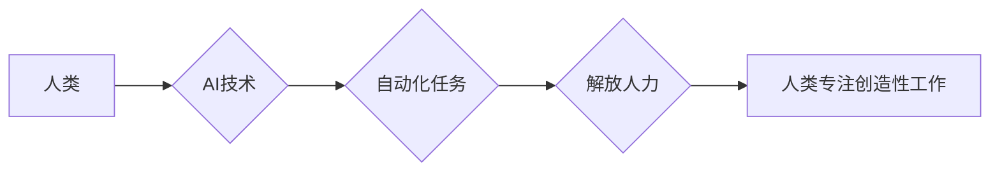

                 

## 人类计算：AI时代的未来就业市场趋势分析

> 关键词：人工智能、人类计算、未来就业、自动化、新兴职业、技能转移、职业发展、数字经济、技术趋势

## 1. 背景介绍

人工智能（AI）技术的飞速发展正在深刻地改变着我们的生活和工作方式。从自动驾驶汽车到智能语音助手，AI已经渗透到各个领域，并不断拓展着其应用范围。然而，AI的发展也引发了人们对未来就业市场趋势的担忧。一些人担心AI将导致大量失业，而另一些人则认为AI将创造新的就业机会。

当前，全球范围内对AI人才的需求量持续增长，但同时，AI技术也可能导致一些传统职业的消失。因此，我们需要深入分析AI时代下未来就业市场趋势，了解AI对不同职业的影响，并为个人职业发展提供指导。

## 2. 核心概念与联系

**2.1 人类计算**

人类计算是指利用人类的智慧、创造力和判断力来解决问题和完成任务的过程。它强调人类在决策、创新和解决复杂问题的方面的独特优势。

**2.2 AI时代的人类计算**

在AI时代，人类计算不再是孤立的，而是与AI技术深度融合。AI可以帮助人类自动化重复性任务，解放人类的生产力，从而使人类能够专注于更具创造性和战略性的工作。

**2.3 人类与AI协同工作**

未来，人类和AI将更加紧密地协同工作，形成一个高效的合作模式。人类将发挥其创造力和批判性思维能力，而AI将提供数据分析、决策支持和自动化执行等方面的帮助。

**Mermaid 流程图**



## 3. 核心算法原理 & 具体操作步骤

**3.1 算法原理概述**

人类计算的核心算法原理是基于人类认知能力的模拟和增强。这些算法通常包括以下几个方面：

* **自然语言处理（NLP）:** 理解和生成人类语言。
* **计算机视觉（CV）:** 使计算机能够“看到”和理解图像和视频。
* **机器学习（ML）:** 训练计算机模型从数据中学习和做出预测。
* **深度学习（DL）:** 一种更高级的机器学习方法，使用多层神经网络来模拟人类大脑的结构和功能。

**3.2 算法步骤详解**

人类计算算法的具体操作步骤通常包括以下几个阶段：

1. **数据收集和预处理:** 收集相关数据并进行清洗、转换和格式化。
2. **模型训练:** 使用机器学习算法训练模型，使其能够从数据中学习。
3. **模型评估:** 对训练好的模型进行评估，并根据评估结果进行调整和优化。
4. **模型部署:** 将训练好的模型部署到实际应用场景中。
5. **结果分析和反馈:** 分析模型的输出结果，并根据反馈进行模型的持续改进。

**3.3 算法优缺点**

**优点:**

* **提高效率:** 自动化重复性任务，解放人力。
* **增强决策:** 提供数据分析和决策支持。
* **创造新价值:** 挖掘数据中的隐藏规律，创造新的产品和服务。

**缺点:**

* **数据依赖:** 算法的性能取决于数据的质量和数量。
* **算法偏差:** 算法可能存在偏差，导致不公平的结果。
* **伦理问题:** AI技术的应用可能引发伦理问题，例如隐私保护和算法透明度。

**3.4 算法应用领域**

人类计算算法已广泛应用于各个领域，例如：

* **医疗保健:** 辅助诊断、个性化治疗、药物研发。
* **金融服务:** 风险管理、欺诈检测、投资决策。
* **教育:** 个性化学习、智能辅导、自动批改。
* **制造业:** 自动化生产、质量控制、预测维护。

## 4. 数学模型和公式 & 详细讲解 & 举例说明

**4.1 数学模型构建**

人类计算的数学模型通常基于统计学、概率论和机器学习算法。例如，在自然语言处理领域，可以使用词嵌入模型来表示单词的语义关系，并构建语言模型来预测文本序列。

**4.2 公式推导过程**

例如，在机器学习中，常用的线性回归模型的公式如下：

$$y = \theta_0 + \theta_1x_1 + \theta_2x_2 + ... + \theta_nx_n + \epsilon$$

其中：

* $y$ 是预测值
* $\theta_0, \theta_1, ..., \theta_n$ 是模型参数
* $x_1, x_2, ..., x_n$ 是输入特征
* $\epsilon$ 是误差项

通过最小化模型误差，可以求解出模型参数，从而建立预测模型。

**4.3 案例分析与讲解**

例如，在图像识别领域，可以使用卷积神经网络（CNN）模型来识别图像中的物体。CNN模型通过多个卷积层和池化层来提取图像特征，并最终通过全连接层进行分类。

## 5. 项目实践：代码实例和详细解释说明

**5.1 开发环境搭建**

可以使用Python语言和相关的机器学习库，例如TensorFlow、PyTorch等，来开发人类计算项目。

**5.2 源代码详细实现**

以下是一个简单的自然语言处理项目代码示例，使用Python和NLTK库来计算文本中的词频：

```python
import nltk
from nltk.corpus import stopwords

# 下载停用词列表
nltk.download('stopwords')

# 读取文本文件
with open('text.txt', 'r') as f:
    text = f.read()

# 将文本转换为小写并去除停用词
words = nltk.word_tokenize(text.lower())
stop_words = set(stopwords.words('english'))
filtered_words = [word for word in words if word not in stop_words]

# 计算词频
word_counts = nltk.FreqDist(filtered_words)

# 打印词频统计结果
print(word_counts.most_common(10))
```

**5.3 代码解读与分析**

这段代码首先使用NLTK库对文本进行分词和停用词过滤，然后使用FreqDist类计算词频。最后，打印出词频最高的10个词。

**5.4 运行结果展示**

运行这段代码后，会输出文本中词频最高的10个词及其对应的频率。

## 6. 实际应用场景

**6.1 医疗保健**

* **辅助诊断:** AI算法可以分析患者的医疗影像数据，辅助医生进行诊断。
* **个性化治疗:** AI可以根据患者的基因信息和病史，推荐个性化的治疗方案。
* **药物研发:** AI可以加速药物研发过程，例如预测药物的有效性和安全性。

**6.2 金融服务**

* **风险管理:** AI可以分析金融数据，识别潜在的风险。
* **欺诈检测:** AI可以识别金融交易中的欺诈行为。
* **投资决策:** AI可以分析市场数据，提供投资建议。

**6.3 教育**

* **个性化学习:** AI可以根据学生的学习进度和能力，提供个性化的学习内容和辅导。
* **智能辅导:** AI可以解答学生的疑问，提供学习指导。
* **自动批改:** AI可以自动批改学生的作业，节省教师的时间。

**6.4 未来应用展望**

随着AI技术的不断发展，人类计算将在更多领域得到应用，例如：

* **智能制造:** AI可以实现智能工厂的自动化生产和管理。
* **自动驾驶:** AI可以实现自动驾驶汽车的感知、决策和控制。
* **虚拟现实和增强现实:** AI可以增强虚拟现实和增强现实体验。

## 7. 工具和资源推荐

**7.1 学习资源推荐**

* **在线课程:** Coursera、edX、Udacity等平台提供丰富的AI和机器学习课程。
* **书籍:** 《深度学习》、《机器学习实战》等书籍是学习AI和机器学习的经典教材。
* **开源项目:** TensorFlow、PyTorch等开源项目可以帮助你实践AI算法。

**7.2 开发工具推荐**

* **Python:** Python是AI开发最常用的编程语言。
* **Jupyter Notebook:** Jupyter Notebook是一个交互式编程环境，方便进行AI算法开发和调试。
* **TensorFlow:** TensorFlow是一个开源的机器学习框架，支持多种深度学习算法。

**7.3 相关论文推荐**

* **《ImageNet Classification with Deep Convolutional Neural Networks》:** 这篇论文介绍了AlexNet模型，标志着深度学习在图像识别领域的突破。
* **《Attention Is All You Need》:** 这篇论文介绍了Transformer模型，在自然语言处理领域取得了显著成果。

## 8. 总结：未来发展趋势与挑战

**8.1 研究成果总结**

近年来，AI技术取得了长足的进步，在各个领域都展现出巨大的潜力。人类计算作为AI的重要组成部分，正在改变着我们的工作方式和生活方式。

**8.2 未来发展趋势**

未来，人类计算将朝着以下几个方向发展：

* **更智能的AI:** AI算法将更加智能，能够更好地理解和响应人类的需求。
* **更广泛的应用:** 人类计算将应用于更多领域，例如医疗保健、教育、金融服务等。
* **更人性化的交互:** 人类与AI的交互方式将更加自然和人性化。

**8.3 面临的挑战**

人类计算的发展也面临着一些挑战：

* **数据安全和隐私保护:** AI算法依赖于大量数据，因此数据安全和隐私保护至关重要。
* **算法透明度和可解释性:** AI算法的决策过程往往难以理解，这可能导致信任问题。
* **伦理问题:** AI技术的应用可能引发伦理问题，例如算法偏见和就业失业。

**8.4 研究展望**

未来，我们需要加强对人类计算的理论研究和技术开发，并积极应对其带来的挑战。同时，我们也需要加强对社会影响的评估和监管，确保AI技术能够真正造福人类。

## 9. 附录：常见问题与解答

**9.1 如何学习人类计算？**

可以学习相关在线课程、书籍和开源项目，并参加相关的技术社区和研讨会。

**9.2 人类计算会取代人类工作吗？**

人类计算不会完全取代人类工作，而是会改变工作方式，解放人类的生产力，并创造新的工作机会。

**9.3 人类计算有哪些伦理问题？**

人类计算可能引发算法偏见、隐私保护和就业失业等伦理问题。


作者：禅与计算机程序设计艺术 / Zen and the Art of Computer Programming 
<end_of_turn>

