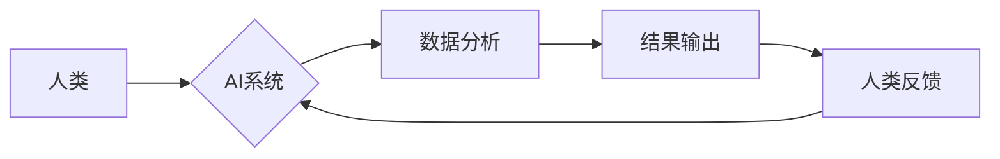

                 

## 人类计算：AI时代的未来技能发展趋势

> 关键词：人工智能、人类计算、未来技能、认知增强、数据分析、机器学习、深度学习、跨学科合作

## 1. 背景介绍

人工智能（AI）正在以惊人的速度发展，其影响力渗透到生活的方方面面。从自动驾驶汽车到个性化医疗，AI正在改变着我们世界。然而，随着AI技术的进步，一个关键问题逐渐浮出水面：在AI时代，人类需要具备哪些技能才能保持竞争力？

传统的技能体系正在被重新定义，人类需要与AI协同工作，发挥自身的独特优势。人类计算的概念应运而生，它强调人类与AI的协同作用，将人类的创造力、批判性思维和情感智能与AI的计算能力和数据处理能力相结合，从而实现更高效、更智能的计算模式。

## 2. 核心概念与联系

**2.1 人类计算的定义**

人类计算是指利用人类的认知能力和AI技术的计算能力，共同完成复杂任务的过程。它强调人类在AI系统中的主动参与，通过理解、解释和评估AI的输出，最终做出更明智的决策。

**2.2 人类计算与AI的关系**

人类计算不是简单的AI应用，而是AI与人类之间的一种新型合作关系。AI提供强大的计算能力和数据分析能力，而人类提供创造力、批判性思维和情感智能。两者相互补充，共同推动计算能力的提升。

**2.3 人类计算的架构**



**2.4 人类计算的优势**

* **提高决策质量:** 人类可以根据经验和直觉对AI的输出进行评估，避免AI算法的局限性。
* **增强创造力:** 人类可以利用AI提供的工具和数据，进行更深入的思考和创新。
* **促进跨学科合作:** 人类计算需要不同领域的专家共同参与，促进跨学科的知识交流和合作。

## 3. 核心算法原理 & 具体操作步骤

**3.1 算法原理概述**

人类计算的核心算法原理是基于人类认知过程的模拟。例如，自然语言处理领域的人类计算模型，会模拟人类理解和生成语言的过程，通过深度学习算法训练，学习语言的语法和语义规则。

**3.2 算法步骤详解**

1. **数据收集和预处理:** 收集与任务相关的各种数据，并进行清洗、格式化等预处理工作。
2. **模型构建:** 根据任务需求，选择合适的AI算法模型，并进行参数设置和训练。
3. **结果输出:** AI模型对数据进行处理，输出预测结果或解决方案。
4. **人类评估和反馈:** 人类对AI的输出进行评估，并提供反馈信息，用于模型的改进和优化。

**3.3 算法优缺点**

**优点:**

* 能够处理复杂、多变的任务。
* 具有较强的学习和适应能力。
* 可以提高决策的准确性和效率。

**缺点:**

* 需要大量的训练数据。
* 训练过程可能耗时和耗能。
* 模型的解释性和透明度较低。

**3.4 算法应用领域**

* 自然语言处理：机器翻译、文本摘要、聊天机器人等。
* 图像识别：物体检测、图像分类、人脸识别等。
* 医疗诊断：疾病预测、影像分析、药物研发等。
* 金融分析：风险评估、欺诈检测、投资决策等。

## 4. 数学模型和公式 & 详细讲解 & 举例说明

**4.1 数学模型构建**

人类计算的数学模型通常基于概率论、统计学和机器学习等领域。例如，在自然语言处理领域，可以使用词嵌入模型来表示单词的语义关系，并构建基于概率的语言模型来预测下一个单词。

**4.2 公式推导过程**

例如，在词嵌入模型中，可以使用Word2Vec算法来训练词向量。Word2Vec算法的目标是学习一个词向量空间，使得相似的单词在该空间中的距离更近。

**Word2Vec算法的损失函数可以表示为：**

$$
L = -\frac{1}{N} \sum_{i=1}^{N} \sum_{j \in C(w_i)} \log p(w_j | w_i)
$$

其中：

* $N$ 是训练语料库中单词的数量。
* $w_i$ 是当前单词。
* $C(w_i)$ 是当前单词的上下文单词集合。
* $p(w_j | w_i)$ 是给定当前单词 $w_i$，预测上下文单词 $w_j$ 的概率。

**4.3 案例分析与讲解**

例如，在训练Word2Vec模型时，可以将“国王”和“皇后”这两个单词作为上下文单词，并训练模型预测它们之间的语义关系。经过训练，模型会学习到“国王”和“皇后”这两个单词在词向量空间中的距离更近，从而体现出它们之间的语义相似性。

## 5. 项目实践：代码实例和详细解释说明

**5.1 开发环境搭建**

* Python 3.x
* TensorFlow 或 PyTorch 等深度学习框架
* Jupyter Notebook 或 VS Code 等代码编辑器

**5.2 源代码详细实现**

```python
# 使用 TensorFlow 训练 Word2Vec 模型
import tensorflow as tf

# 定义词嵌入层
embedding_layer = tf.keras.layers.Embedding(input_dim=vocab_size, output_dim=embedding_dim)

# 定义模型
model = tf.keras.Sequential([
    embedding_layer,
    tf.keras.layers.Flatten(),
    tf.keras.layers.Dense(units=1, activation='sigmoid')
])

# 编译模型
model.compile(optimizer='adam', loss='binary_crossentropy', metrics=['accuracy'])

# 训练模型
model.fit(x_train, y_train, epochs=10)

# 保存模型
model.save('word2vec_model.h5')
```

**5.3 代码解读与分析**

* 该代码使用 TensorFlow 框架训练了一个简单的 Word2Vec 模型。
* 词嵌入层将每个单词映射到一个低维向量空间。
* 模型的输出层是一个单神经元，用于预测上下文单词的出现概率。
* 模型使用 Adam 优化器和二分类交叉熵损失函数进行训练。

**5.4 运行结果展示**

训练完成后，可以将模型用于预测单词之间的语义关系。例如，可以计算“国王”和“皇后”之间的相似度，并观察其结果。

## 6. 实际应用场景

**6.1 自然语言处理**

* **机器翻译:** 人类计算可以帮助机器翻译系统更好地理解语义，提高翻译质量。
* **文本摘要:** 人类计算可以帮助文本摘要系统识别关键信息，生成更准确的摘要。
* **聊天机器人:** 人类计算可以帮助聊天机器人更好地理解用户意图，提供更自然、更人性化的对话体验。

**6.2 图像识别**

* **物体检测:** 人类计算可以帮助物体检测系统识别更复杂、更细微的物体。
* **图像分类:** 人类计算可以帮助图像分类系统更好地理解图像的语义内容，提高分类准确率。
* **人脸识别:** 人类计算可以帮助人脸识别系统识别不同角度、不同光照条件下的面部特征。

**6.3 医疗诊断**

* **疾病预测:** 人类计算可以帮助医疗诊断系统分析患者的病史、症状和检查结果，预测疾病的风险。
* **影像分析:** 人类计算可以帮助医疗诊断系统分析医学影像，识别病变区域。
* **药物研发:** 人类计算可以帮助药物研发系统分析药物的结构和作用机制，加速药物研发进程。

**6.4 未来应用展望**

随着AI技术的不断发展，人类计算将在更多领域得到应用，例如：

* **教育:** 人类计算可以帮助个性化教学，提高学生的学习效率。
* **金融:** 人类计算可以帮助金融机构进行风险评估、欺诈检测和投资决策。
* **法律:** 人类计算可以帮助律师分析法律文件，提高法律服务的效率。

## 7. 工具和资源推荐

**7.1 学习资源推荐**

* **书籍:**
    * 《深度学习》
    * 《人工智能：一种现代方法》
    * 《人类计算：AI时代的未来技能发展趋势》
* **在线课程:**
    * Coursera
    * edX
    * Udacity

**7.2 开发工具推荐**

* **Python:**
    * TensorFlow
    * PyTorch
    * scikit-learn
* **Jupyter Notebook:**
    * VS Code

**7.3 相关论文推荐**

* **《Attention Is All You Need》**
* **《BERT: Pre-training of Deep Bidirectional Transformers for Language Understanding》**
* **《GPT-3: Language Models are Few-Shot Learners》**

## 8. 总结：未来发展趋势与挑战

**8.1 研究成果总结**

人类计算是一个新兴的领域，近年来取得了显著进展。AI技术的不断发展为人类计算提供了强大的工具和技术支持。

**8.2 未来发展趋势**

* **更强大的AI模型:** 未来将出现更强大、更智能的AI模型，能够更好地理解和处理人类语言和数据。
* **更广泛的应用场景:** 人类计算将应用于更多领域，例如教育、金融、法律等。
* **更紧密的跨学科合作:** 人类计算需要不同领域的专家共同参与，促进跨学科的知识交流和合作。

**8.3 面临的挑战**

* **数据隐私和安全:** 人类计算需要处理大量的人类数据，因此数据隐私和安全问题需要得到充分重视。
* **算法解释性和透明度:** AI算法的解释性和透明度较低，这可能会导致人类对AI的信任度下降。
* **伦理问题:** 人类计算可能会带来一些伦理问题，例如算法偏见、工作岗位替代等，需要进行深入的探讨和研究。

**8.4 研究展望**

未来，人类计算的研究将继续深入，探索更有效的算法、更安全的应用场景和更完善的伦理规范。


## 9. 附录：常见问题与解答

**9.1 如何学习人类计算？**

可以学习相关书籍、在线课程和论文，并尝试参与开源项目，积累实践经验。

**9.2 人类计算会取代人类工作吗？**

人类计算不会完全取代人类工作，而是会与人类协同工作，提高工作效率和质量。

**9.3 人类计算的伦理问题有哪些？**

人类计算可能会带来一些伦理问题，例如算法偏见、工作岗位替代等，需要进行深入的探讨和研究。


作者：禅与计算机程序设计艺术 / Zen and the Art of Computer Programming 
<end_of_turn>

