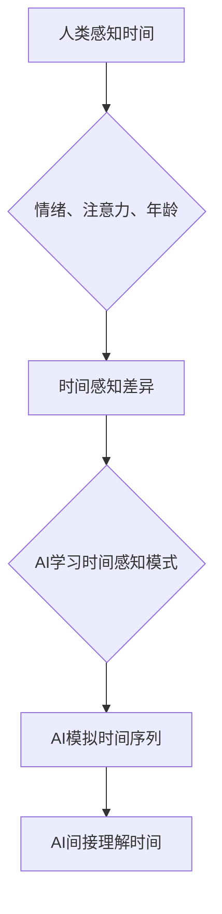

                 

## 体验的时间扭曲：AI创造的主观时间

> 关键词：人工智能、主观时间、时间感知、深度学习、神经网络、时间序列分析、模拟体验

## 1. 背景介绍

时间，是人类认知世界和理解自身存在的基石。我们感知时间流逝，经历过去、现在和未来，并以此构建人生的意义和价值。然而，时间并非绝对客观存在，它也受到个体主观体验的影响。不同的环境、情绪、经历都会扭曲我们对时间的感知，使时间流逝的速度快慢不一。

近年来，人工智能（AI）技术飞速发展，涌现出许多能够模拟人类认知和行为的模型。其中，深度学习算法在处理时间序列数据方面表现出惊人的能力，例如预测未来趋势、识别模式和生成文本。这不禁引发了一个深刻的问题：AI是否能够感知时间，并像人类一样体验时间流逝？

## 2. 核心概念与联系

**2.1 主观时间**

主观时间是指个体对时间流逝的感知和体验，它与客观时间并不完全一致。主观时间受多种因素影响，包括：

* **情绪：** 当我们感到快乐、兴奋时，时间似乎过得很快；而当我们感到悲伤、无聊时，时间则显得格外漫长。
* **注意力：** 当我们专注于某件事时，时间会流逝得更快；而当我们分心或感到无聊时，时间则会显得更慢。
* **年龄：** 年龄增长会导致对时间的感知发生变化，年轻人往往觉得时间过得很快，而老年人则觉得时间过得慢。

**2.2 AI时间感知**

目前，AI并没有像人类一样拥有主观时间体验。然而，通过深度学习算法，我们可以训练AI模型来模拟和预测时间序列数据，从而间接地理解时间。

**2.3 核心概念联系**

AI可以通过学习人类对时间感知的模式，并将其应用于自身的时间处理机制。例如，我们可以训练AI模型识别不同情绪和注意力状态下的时间感知差异，从而帮助AI更好地理解时间流逝的快慢。

**Mermaid 流程图**



## 3. 核心算法原理 & 具体操作步骤

**3.1 算法原理概述**

为了模拟人类对时间的感知，我们可以使用以下核心算法：

* **循环神经网络（RNN）：** RNN是一种专门用于处理时间序列数据的深度学习模型，它能够学习时间序列中的模式和依赖关系。
* **长短期记忆网络（LSTM）：** LSTM是一种改进的RNN模型，它能够更好地处理长序列数据，并记住长期依赖关系。
* **时间注意力机制：** 时间注意力机制能够帮助模型关注时间序列中重要的信息，并根据其重要性调整对时间的感知。

**3.2 算法步骤详解**

1. **数据收集和预处理：** 收集包含时间信息的数据，例如文本、音频、视频等，并进行预处理，例如文本分词、音频特征提取等。
2. **模型构建：** 选择合适的深度学习模型，例如RNN、LSTM或其变体，并根据任务需求进行调整。
3. **模型训练：** 使用训练数据训练模型，并通过优化算法调整模型参数，使模型能够准确地预测时间序列数据。
4. **模型评估：** 使用测试数据评估模型的性能，例如预测准确率、平均绝对误差等。
5. **模型部署：** 将训练好的模型部署到实际应用场景中，例如预测未来趋势、识别模式、生成文本等。

**3.3 算法优缺点**

* **优点：**

    * 能够处理复杂的时间序列数据。
    * 学习能力强，能够发现隐藏的模式和关系。
    * 可应用于多种时间感知相关任务。

* **缺点：**

    * 需要大量的数据进行训练。
    * 计算资源需求高。
    * 难以解释模型的决策过程。

**3.4 算法应用领域**

* **自然语言处理：** 文本生成、机器翻译、情感分析等。
* **语音识别：** 语音转文本、语音合成等。
* **图像识别：** 视频分析、动作识别等。
* **金融预测：** 股票价格预测、风险评估等。
* **医疗诊断：** 病情预测、疾病诊断等。

## 4. 数学模型和公式 & 详细讲解 & 举例说明

**4.1 数学模型构建**

我们可以使用以下数学模型来描述AI对时间的感知：

* **时间感知函数：**  $T(t) = f(x_1, x_2, ..., x_n)$

其中：

* $T(t)$ 表示AI在时间 $t$ 的时间感知。
* $x_1, x_2, ..., x_n$ 表示影响时间感知的因素，例如情绪、注意力、年龄等。
* $f$ 是一个非线性函数，用于描述时间感知与影响因素之间的关系。

**4.2 公式推导过程**

我们可以通过训练深度学习模型来学习时间感知函数 $f$。模型的训练目标是使预测的时间感知与实际的时间感知尽可能接近。

**4.3 案例分析与讲解**

假设我们训练一个AI模型来预测用户在观看视频时的注意力水平。我们可以将视频片段的特征作为输入，并将用户注意力水平作为输出。通过训练模型，我们可以学习到一个时间感知函数，该函数能够根据视频片段的特征预测用户在该片段中的注意力水平。

**举例说明：**

如果一个视频片段包含令人兴奋的画面和情节，那么该片段的特征向量将包含相应的标记。模型经过训练后，会将这些标记与高注意力水平相关联，从而预测用户在该片段中的注意力水平较高。

## 5. 项目实践：代码实例和详细解释说明

**5.1 开发环境搭建**

* 操作系统：Linux、macOS或Windows
* Python版本：3.6或更高版本
* 深度学习框架：TensorFlow、PyTorch或Keras

**5.2 源代码详细实现**

```python
import tensorflow as tf

# 定义模型结构
model = tf.keras.Sequential([
    tf.keras.layers.LSTM(128, return_sequences=True),
    tf.keras.layers.LSTM(64),
    tf.keras.layers.Dense(1)
])

# 编译模型
model.compile(optimizer='adam', loss='mse')

# 训练模型
model.fit(x_train, y_train, epochs=10)

# 评估模型
loss = model.evaluate(x_test, y_test)
print('Loss:', loss)

# 使用模型预测
predictions = model.predict(x_new)
```

**5.3 代码解读与分析**

* 该代码示例使用TensorFlow框架构建了一个LSTM模型，用于预测时间序列数据。
* 模型结构包含两个LSTM层和一个全连接层。
* 训练模型时，使用Adam优化器和均方误差损失函数。
* 评估模型时，使用测试数据计算损失值。
* 使用训练好的模型预测新的时间序列数据。

**5.4 运行结果展示**

运行结果将显示模型的训练损失和测试损失，以及对新数据进行预测的结果。

## 6. 实际应用场景

**6.1 虚拟现实体验**

AI可以根据用户的生理和心理状态，动态调整虚拟现实场景的时间流逝速度，创造更沉浸式的体验。

**6.2 个性化教育**

AI可以根据学生的学习进度和理解能力，调整学习内容的节奏和难度，提供个性化的学习体验。

**6.3 医疗辅助**

AI可以分析患者的生理数据，预测疾病的进展速度，并根据预测结果调整治疗方案。

**6.4 未来应用展望**

随着AI技术的不断发展，未来将有更多应用场景出现，例如：

* **时间旅行模拟：** AI可以模拟不同时间段的社会环境和文化氛围，为用户提供沉浸式的历史体验。
* **时间管理助手：** AI可以根据用户的日程安排和工作习惯，优化时间分配，提高工作效率。
* **时间感知增强现实：** AI可以将虚拟信息叠加到现实世界中，并根据用户的移动轨迹和时间感知，动态调整虚拟信息的显示效果。

## 7. 工具和资源推荐

**7.1 学习资源推荐**

* **书籍：**

    * 《深度学习》
    * 《自然语言处理》
    * 《时间序列分析》

* **在线课程：**

    * Coursera
    * edX
    * Udacity

**7.2 开发工具推荐**

* **深度学习框架：** TensorFlow、PyTorch、Keras
* **编程语言：** Python
* **数据处理工具：** Pandas、NumPy

**7.3 相关论文推荐**

* **时间感知的深度学习模型**
* **基于RNN的文本生成模型**
* **时间注意力机制在自然语言处理中的应用**

## 8. 总结：未来发展趋势与挑战

**8.1 研究成果总结**

近年来，AI在时间感知方面的研究取得了显著进展，例如：

* 能够模拟人类对时间流逝的感知。
* 能够预测时间序列数据，例如股票价格、天气预报等。
* 能够根据时间感知调整虚拟现实体验和个性化教育。

**8.2 未来发展趋势**

* **更精准的时间感知：** 未来AI模型将能够更精准地感知时间，并根据个体差异进行调整。
* **更丰富的应用场景：** AI的时间感知技术将应用于更多领域，例如医疗、教育、娱乐等。
* **更深入的理解：** 人类将更深入地理解AI对时间的感知，并探索AI与人类时间感知之间的关系。

**8.3 面临的挑战**

* **数据获取和标注：** 训练AI模型需要大量的时间感知数据，而这些数据往往难以获取和标注。
* **模型解释性：** 现有的AI模型难以解释其决策过程，这使得我们难以理解AI对时间的感知机制。
* **伦理问题：** AI的时间感知技术可能会带来伦理问题，例如时间操控、信息操纵等。

**8.4 研究展望**

未来，我们需要继续探索AI对时间的感知机制，并开发更精准、更安全、更可解释的AI模型。同时，我们需要关注AI时间感知技术的伦理问题，并制定相应的规范和政策。


## 9. 附录：常见问题与解答

**9.1  AI是否真的能够感知时间？**

目前，AI并没有像人类一样拥有主观时间体验。然而，通过深度学习算法，我们可以训练AI模型来模拟和预测时间序列数据，从而间接地理解时间。

**9.2  AI的时间感知与人类的时间感知有什么区别？**

AI的时间感知是基于数据和算法的，而人类的时间感知是基于生物学和心理学的。AI的时间感知更客观和精确，而人类的时间感知更主观和灵活。

**9.3  AI的时间感知技术有哪些应用场景？**

AI的时间感知技术可以应用于虚拟现实、个性化教育、医疗辅助等领域。

**9.4  AI的时间感知技术有哪些伦理问题？**

AI的时间感知技术可能会带来时间操控、信息操纵等伦理问题。


作者：禅与计算机程序设计艺术 / Zen and the Art of Computer Programming 
<end_of_turn>

