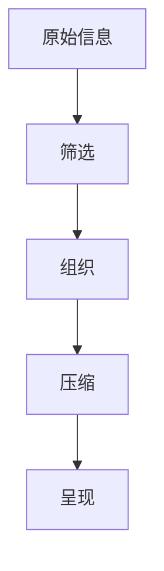

                 

**信息简化的好处与艺术：在复杂世界中简化以提高生活质量和效率**

**作者：禅与计算机程序设计艺术 / Zen and the Art of Computer Programming**

## 1. 背景介绍

在信息爆炸的当今世界，我们每天都面对着海量的信息。然而，过多的信息并不等于更好的决策。相反，信息过载常常导致我们无法有效处理和利用这些信息。因此，信息简化变得至关重要。本文将探讨信息简化的好处，以及如何将其作为一门艺术来提高生活质量和效率。

## 2. 核心概念与联系

信息简化是指将复杂的信息转化为更简单、更易于理解和处理的形式。它涉及到信息的筛选、组织、压缩，以及以不同的方式呈现信息。信息简化的过程如下图所示：



## 3. 核心算法原理 & 具体操作步骤

### 3.1 算法原理概述

信息简化的算法原理基于信息论、统计学，以及人类认知心理学。它包括信息熵的计算，以衡量信息的不确定性；信息增益，以衡量信息的价值；以及人类认知负荷，以衡量信息对人类认知系统的负担。

### 3.2 算法步骤详解

1. **信息收集**：收集与问题相关的所有信息。
2. **信息筛选**：基于信息的相关性、时效性、可靠性等因素，筛选出有用的信息。
3. **信息组织**：将筛选后的信息组织成结构化的形式，如列表、图表、时间线等。
4. **信息压缩**：使用信息熵和信息增益等指标，压缩信息，去除冗余和无关信息。
5. **信息呈现**：以易于理解和处理的方式呈现信息，如简化的语言、可视化图形等。

### 3.3 算法优缺点

**优点**：信息简化有助于提高决策质量，减轻认知负荷，节省时间和精力。

**缺点**：信息简化可能会导致信息丢失，需要平衡简化的程度和信息的完整性。

### 3.4 算法应用领域

信息简化应用广泛，包括新闻报道、商业分析、医学诊断、搜索引擎、人机交互等领域。

## 4. 数学模型和公式 & 详细讲解 & 举例说明

### 4.1 数学模型构建

信息简化的数学模型基于信息熵（H）和信息增益（G）。信息熵衡量信息的不确定性，信息增益衡量信息的价值。

### 4.2 公式推导过程

信息熵（H）的公式为：

$$
H(X) = -\sum P(x) \log P(x)
$$

其中，P(x)是随机变量X的概率分布。

信息增益（G）的公式为：

$$
G(D, A) = H(D) - H(D|A)
$$

其中，H(D)是数据集D的信息熵，H(D|A)是数据集D在条件属性A下的条件熵。

### 4.3 案例分析与讲解

例如，在新闻报道中，信息熵可以衡量新闻的不确定性。如果一则新闻的信息熵很高，说明这则新闻包含了大量的不确定信息，需要进一步调查和报道。信息增益则可以衡量一则新闻的价值。如果一则新闻的信息增益很高，说明这则新闻包含了大量的新信息，对读者很有价值。

## 5. 项目实践：代码实例和详细解释说明

### 5.1 开发环境搭建

本项目使用Python作为编程语言，并使用scikit-learn、matplotlib、seaborn等库。

### 5.2 源代码详细实现

以下是计算信息熵和信息增益的Python代码：

```python
import math
from sklearn.feature_extraction.text import CountVectorizer
from sklearn.metrics import mutual_info_score

# 计算信息熵
def calculate_entropy(data):
    counts = data.value_counts()
    entropy = 0.0
    for count in counts:
        p = count / len(data)
        entropy += -p * math.log2(p)
    return entropy

# 计算信息增益
def calculate_information_gain(data, target):
    data_entropy = calculate_entropy(data)
    data_condition_entropy = calculate_entropy(data[target])
    return data_entropy - data_condition_entropy

# 示例数据
data = ['cat', 'dog', 'cat', 'dog', 'cat', 'cat', 'dog', 'dog']
target = ['red','red', 'green','red', 'green', 'green','red','red']

# 计算信息熵和信息增益
vectorizer = CountVectorizer()
X = vectorizer.fit_transform(data)
print("信息熵：", calculate_entropy(target))
print("信息增益：", mutual_info_score(X.toarray(), target))
```

### 5.3 代码解读与分析

这段代码使用了信息熵和信息增益的公式，计算了示例数据的信息熵和信息增益。信息熵衡量了数据的不确定性，信息增益衡量了数据的价值。

### 5.4 运行结果展示

运行这段代码会输出示例数据的信息熵和信息增益。

## 6. 实际应用场景

信息简化在实际应用中有着广泛的应用。例如，在新闻报道中，信息简化有助于提高新闻的可读性和吸引力；在商业分析中，信息简化有助于提高决策的质量和效率；在医学诊断中，信息简化有助于医生更快地做出准确的诊断。

### 6.4 未来应用展望

随着信息技术的发展，信息简化将会变得越来越重要。未来，信息简化将会更加智能化，能够自动适应不同用户的需求和偏好，提供更个性化的信息简化服务。

## 7. 工具和资源推荐

### 7.1 学习资源推荐

推荐阅读《信息简化：从复杂到简单》一书，该书深入浅出地介绍了信息简化的原理和应用。

### 7.2 开发工具推荐

推荐使用Python、R等编程语言，以及scikit-learn、matplotlib、seaborn等库进行信息简化的开发。

### 7.3 相关论文推荐

推荐阅读论文《Information Theory and the Art of Simplification》和《Simplification in Information Visualization》。

## 8. 总结：未来发展趋势与挑战

### 8.1 研究成果总结

信息简化是一项跨学科的研究，涉及到信息论、统计学，以及人类认知心理学等领域。本文介绍了信息简化的原理、算法、数学模型，并提供了项目实践和实际应用场景。

### 8.2 未来发展趋势

未来，信息简化将会更加智能化，能够自动适应不同用户的需求和偏好，提供更个性化的信息简化服务。此外，信息简化将会与人工智能、大数据等技术结合，提供更有效的信息简化解决方案。

### 8.3 面临的挑战

信息简化面临的挑战包括如何平衡信息的简化和完整性，如何适应不同用户的需求和偏好，如何处理大规模的信息等。

### 8.4 研究展望

未来的研究将会关注信息简化的智能化、个性化，以及与其他技术的结合。此外，研究还将关注信息简化的伦理和道德问题，如信息简化可能导致的信息偏见和信息失真等。

## 9. 附录：常见问题与解答

**Q：信息简化会导致信息丢失吗？**

**A：**是的，信息简化可能会导致信息丢失。因此，信息简化需要平衡简化的程度和信息的完整性。

**Q：信息简化适用于所有领域吗？**

**A：**信息简化适用于大多数领域，但并非所有领域。例如，在需要保持信息完整性的领域，如法律、医学等，信息简化需要慎重使用。

**Q：如何学习信息简化？**

**A：**推荐阅读《信息简化：从复杂到简单》一书，该书深入浅出地介绍了信息简化的原理和应用。此外，还可以阅读相关论文，并进行项目实践。

**作者：禅与计算机程序设计艺术 / Zen and the Art of Computer Programming**

