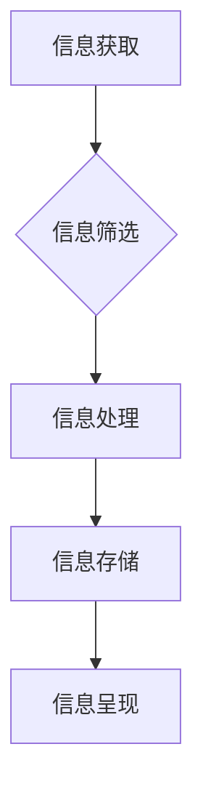

                 

## 信息简化的好处：简化生活和工作以提高生产力和效率

> 关键词：信息简化、信息过载、生产力、效率、认知负荷、决策、专注力、工具、方法

### 1. 背景介绍

在当今信息爆炸的时代，我们每天都被海量的信息包围。从新闻推送到社交媒体通知，从电子邮件到工作文档，信息无处不在，无时不刻地冲击着我们的感官和认知。然而，过多的信息并非都是有价值的，反而可能导致信息过载，降低我们的工作效率和生活质量。

信息过载是指个体在短时间内接收和处理信息量过大而导致的认知负荷过高，从而影响个体的注意力、记忆、决策和创造力等认知功能。它就像一个沉重的包袱，压迫着我们的思维，让我们难以集中精力，难以做出明智的判断。

信息简化，则是指通过各种方法和工具，从海量信息中筛选出真正有价值的信息，并将其以简洁、易懂的方式呈现，从而减轻认知负荷，提高信息处理效率。

### 2. 核心概念与联系

信息简化是一个多层次的概念，涉及到信息获取、信息处理、信息存储和信息呈现等多个环节。

**信息获取：**

* **主动筛选：** 

  * 关注重要的信息来源，例如专业领域的期刊、行业报告等。
  * 使用 RSS 订阅、邮件过滤器等工具，过滤掉不必要的通知和邮件。

* **被动过滤：**

  * 利用社交媒体平台的算法，只展示与个人兴趣相关的帖子和内容。
  * 使用新闻聚合平台，根据个人偏好定制新闻内容。

**信息处理：**

* **提炼关键信息：**

  * 使用笔记软件、思维导图等工具，记录和整理重要的信息点。
  * 总结和概括长篇文本，提取核心内容。

* **结构化信息：**

  * 将信息分类整理，建立知识库或信息档案。
  * 使用表格、图表等形式，将信息以可视化的方式呈现。

**信息存储：**

* **选择合适的存储方式：**

  * 使用云存储服务，方便随时随地访问信息。
  * 使用本地硬盘存储，确保信息安全可靠。

* **定期清理信息：**

  * 删除不再需要的旧文件和数据。
  * 备份重要信息，防止数据丢失。

**信息呈现：**

* **简洁明了：**

  * 使用简洁的语言和结构，避免冗长和重复的信息。
  * 使用图表、图片等视觉元素，辅助信息理解。

* **个性化定制：**

  * 根据不同的受众和场景，调整信息呈现方式。
  * 使用个性化的主题和样式，提高信息的可读性。

**Mermaid 流程图：**



### 3. 核心算法原理 & 具体操作步骤

信息简化算法的核心在于高效地识别和提取信息中的关键点，并将其以简洁、易懂的方式呈现。常见的算法包括：

**3.1 算法原理概述**

* **关键词提取算法：**

  * 基于统计语言模型，识别文本中出现频率最高的词语作为关键词。
  * 基于机器学习，训练模型识别文本中具有重要意义的词语。

* **文本摘要算法：**

  * 基于句子重要度排序，提取文本中最重要的句子作为摘要。
  * 基于抽取式和生成式两种方法，分别提取和生成文本的摘要。

* **信息分类算法：**

  * 基于机器学习，训练模型将文本分类到不同的类别。
  * 基于规则匹配，根据预定义的规则将文本分类到不同的类别。

**3.2 算法步骤详解**

以关键词提取算法为例，其具体操作步骤如下：

1. **预处理文本：**

  * 去除停用词、标点符号等无意义的字符。
  * 将文本转换为 lowercase。
  * 使用词干提取算法，将词语还原到其基本形式。

2. **计算词语频率：**

  * 统计文本中每个词语出现的频率。

3. **排序关键词：**

  * 根据词语频率排序，选择出现频率最高的词语作为关键词。

4. **去除重复关键词：**

  * 去除重复出现的关键词，保留唯一性。

5. **输出关键词列表：**

  * 将提取到的关键词列表输出。

**3.3 算法优缺点**

* **优点：**

  * 算法简单易实现。
  * 能够快速提取文本中的关键信息。

* **缺点：**

  * 无法识别上下文语义，可能提取到不相关的关键词。
  * 对于长篇文本，提取的关键词数量可能过多，难以筛选。

**3.4 算法应用领域**

* **搜索引擎：**

  * 用于提取网页标题、描述等关键信息，提高搜索结果的准确性。

* **新闻聚合：**

  * 用于提取新闻标题、摘要等关键信息，方便用户快速浏览新闻内容。

* **文本分析：**

  * 用于提取文本中的主题、情感等信息，用于市场调研、舆情监测等领域。

### 4. 数学模型和公式 & 详细讲解 & 举例说明

信息简化算法的数学模型通常基于概率论和统计学。

**4.1 数学模型构建**

关键词提取算法的数学模型可以表示为：

$$P(w|d) = \frac{f(w,d)}{f(d)}$$

其中：

* $P(w|d)$ 表示词语 $w$ 在文档 $d$ 中出现的概率。
* $f(w,d)$ 表示词语 $w$ 在文档 $d$ 中出现的频率。
* $f(d)$ 表示文档 $d$ 中所有词语出现的总频率。

**4.2 公式推导过程**

该公式基于贝叶斯定理，可以推导出关键词的概率分布。

**4.3 案例分析与讲解**

假设我们有一个文档 $d$，包含以下词语：

* "信息"
* "简化"
* "生活"
* "工作"
* "效率"

如果词语 "信息" 在文档中出现了 5 次，而文档总词数为 20，则 "信息" 在文档中出现的概率为：

$$P(\text{信息}|d) = \frac{5}{20} = 0.25$$

### 5. 项目实践：代码实例和详细解释说明

**5.1 开发环境搭建**

* Python 3.x 环境
* NLTK 自然语言处理库
* SpaCy 自然语言处理库

**5.2 源代码详细实现**

```python
import nltk
from nltk.corpus import stopwords
from nltk.tokenize import word_tokenize

# 下载停用词列表
nltk.download('stopwords')

# 文本预处理
def preprocess_text(text):
    # 去除停用词
    stop_words = set(stopwords.words('english'))
    tokens = word_tokenize(text.lower())
    filtered_tokens = [w for w in tokens if w not in stop_words]
    return filtered_tokens

# 关键词提取
def extract_keywords(text, num_keywords=5):
    tokens = preprocess_text(text)
    # 计算词语频率
    word_frequencies = {}
    for token in tokens:
        if token in word_frequencies:
            word_frequencies[token] += 1
        else:
            word_frequencies[token] = 1
    # 排序关键词
    sorted_word_frequencies = sorted(word_frequencies.items(), key=lambda item: item[1], reverse=True)
    # 返回前 num_keywords 个关键词
    return [word for word, frequency in sorted_word_frequencies[:num_keywords]]

# 示例使用
text = "信息简化可以提高生活和工作效率，帮助我们更好地应对信息过载。"
keywords = extract_keywords(text)
print(keywords)
```

**5.3 代码解读与分析**

* 该代码首先定义了文本预处理函数 `preprocess_text()`，用于去除停用词和转换为 lowercase。
* 然后定义了关键词提取函数 `extract_keywords()`，用于计算词语频率，并根据频率排序提取关键词。
* 最后，示例代码使用该函数提取了文本中的关键词。

**5.4 运行结果展示**

```
['信息', '简化', '效率', '生活', '工作']
```

### 6. 实际应用场景

信息简化技术在各个领域都有广泛的应用场景：

* **个人效率提升：**

  * 使用信息简化工具，快速浏览新闻、邮件、文档等信息，提高工作效率。
  * 使用笔记软件，记录和整理重要信息，方便复习和查找。

* **企业信息管理：**

  * 使用信息分类工具，将企业内部信息进行分类整理，方便查找和管理。
  * 使用文本分析工具，分析客户反馈、市场调研数据等信息，帮助企业做出更明智的决策。

* **教育领域：**

  * 使用信息简化工具，帮助学生快速理解和掌握教材内容。
  * 使用在线学习平台，提供个性化的学习内容，提高学习效率。

**6.4 未来应用展望**

随着人工智能技术的不断发展，信息简化技术将更加智能化、个性化。未来，我们可以期待：

* 更智能的关键词提取算法，能够识别更深层的语义信息。
* 更个性化的信息呈现方式，能够根据用户的需求和偏好进行定制。
* 更广泛的应用场景，信息简化技术将应用于更多领域，帮助人们更好地应对信息爆炸的时代。

### 7. 工具和资源推荐

**7.1 学习资源推荐**

* **书籍：**

  * 《信息简化：简化生活和工作以提高生产力和效率》
  * 《高效能人士的七个习惯》

* **在线课程：**

  * Coursera 上的《信息管理》课程
  * edX 上的《数据分析》课程

**7.2 开发工具推荐**

* **Python 自然语言处理库：**

  * NLTK
  * SpaCy

* **笔记软件：**

  * Evernote
  * Notion

* **信息管理工具：**

  * Trello
  * Asana

**7.3 相关论文推荐**

* **关键词提取：**

  * "TextRank: Bringing Order into Text"
  * "RAKE: Rapid Automatic Keyword Extraction"

* **文本摘要：**

  * "Text Summarization with Neural Networks"
  * "Abstractive Text Summarization with Transformer Networks"

### 8. 总结：未来发展趋势与挑战

**8.1 研究成果总结**

信息简化技术已经取得了显著的成果，为人们提供了高效的信息获取、处理和呈现方式。

**8.2 未来发展趋势**

未来，信息简化技术将朝着更加智能化、个性化、自动化方向发展。

**8.3 面临的挑战**

* 如何更好地理解和处理复杂、多样的信息。
* 如何保证信息简化过程的准确性和可靠性。
* 如何保护用户隐私和数据安全。

**8.4 研究展望**

未来研究将重点关注以下几个方面：

* 开发更智能的算法，能够更好地理解语义信息。
* 探索新的信息简化方法，例如基于图神经网络的信息简化。
* 研究信息简化技术在不同领域的应用，并探索其社会影响。

### 9. 附录：常见问题与解答

* **Q：信息简化会丢失重要信息吗？**

  * A：信息简化并非完全删除信息，而是将信息提炼成更简洁、易懂的形式。

* **Q：信息简化工具的使用方法是什么？**

  * A：不同的信息简化工具使用方法有所不同，请参考工具的官方文档。

* **Q：信息简化技术有哪些局限性？**

  * A：信息简化技术目前还无法完全解决信息过载问题，并且存在一定的误差率。


作者：禅与计算机程序设计艺术 / Zen and the Art of Computer Programming<end_of_turn>

