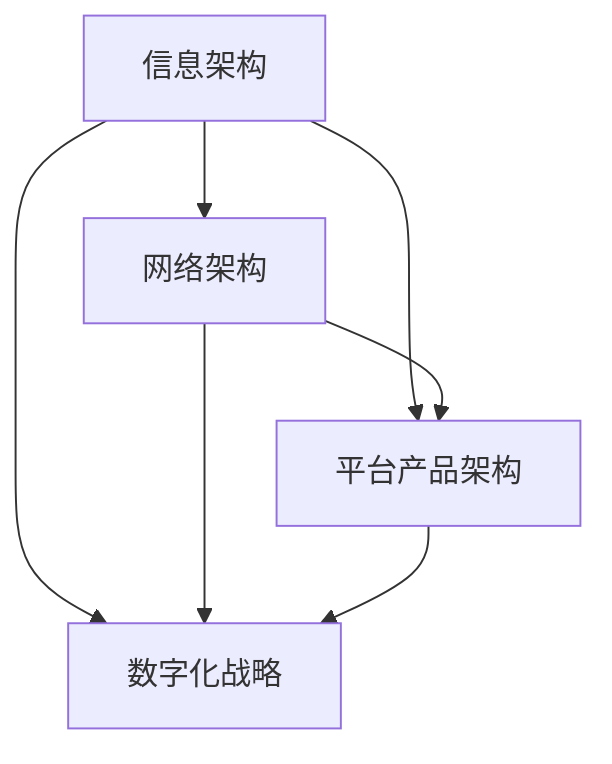
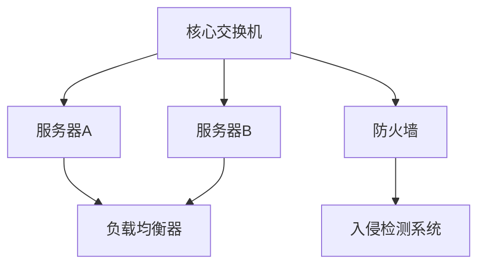
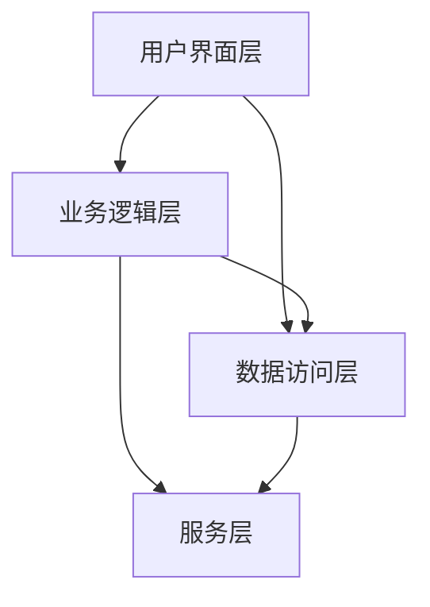

                 

### 文章标题

**信息、网络、平台产品和数字化部门规划**

信息、网络、平台产品和数字化部门规划是当今企业成功的关键因素。在这个数字化时代，信息技术已成为业务增长和创新的核心驱动力。因此，制定一个全面而精准的规划，以确保信息、网络、平台产品和数字化部门的协同运作，显得尤为重要。

本文将深入探讨信息、网络、平台产品和数字化部门规划的重要性、核心概念、实施步骤、应用场景以及未来发展趋势，旨在为企业管理者和IT专业人员提供有价值的指导和建议。

### Keywords:
- Information Planning
- Network Infrastructure
- Platform Products
- Digital Department
- IT Strategy

### Abstract:
This article delves into the importance, core concepts, implementation steps, application scenarios, and future trends of information, network, platform product, and digital department planning. It aims to provide valuable insights and guidance for business leaders and IT professionals in this digital age.

<|im_sep|>## 1. 背景介绍（Background Introduction）

在全球化和数字化进程不断加快的背景下，信息技术已经成为企业不可或缺的组成部分。信息、网络、平台产品和数字化部门规划不仅关乎企业的运营效率，更直接影响企业的核心竞争力。

### 1.1 数字化转型的必要性

数字化转型已经成为企业发展的必然趋势。通过数字化，企业可以更高效地收集、处理和利用数据，实现业务流程的自动化和智能化。数字化转型不仅有助于降低运营成本，还能提升客户体验，增强市场竞争力。

### 1.2 信息、网络、平台产品和数字化部门的作用

- **信息部门**：负责企业信息资源的管理与利用，包括数据存储、数据分析和数据安全。
- **网络部门**：负责企业网络架构的搭建与维护，确保信息传输的高速和安全。
- **平台产品部门**：负责开发和维护企业应用平台，支持业务系统的运行。
- **数字化部门**：负责企业整体数字化战略的制定和执行，推动企业数字化转型。

### 1.3 当前面临的挑战

- **技术发展迅速**：信息技术日新月异，企业需要不断更新技术栈，以保持竞争力。
- **数据安全风险**：随着数据规模的扩大，数据安全和隐私保护成为企业面临的重要挑战。
- **人才短缺**：具备数字化技能的人才短缺，成为企业数字化转型的主要障碍。

### 1.4 规划的重要性

- **明确目标**：规划有助于明确企业的发展目标和战略方向。
- **资源优化**：规划有助于优化资源配置，提高工作效率。
- **风险控制**：规划有助于提前识别和应对潜在风险，确保项目的成功实施。

<|im_sep|>## 2. 核心概念与联系（Core Concepts and Connections）

在规划信息、网络、平台产品和数字化部门时，理解以下几个核心概念及其相互关系至关重要。

### 2.1 信息架构（Information Architecture）

信息架构是组织、管理和呈现企业信息的基本框架。它包括数据模型、数据存储、数据访问和数据处理等方面。

#### 信息架构的重要性

- **提升数据利用率**：通过合理的信息架构，企业可以更高效地利用数据资源。
- **优化业务流程**：信息架构有助于优化业务流程，提高工作效率。
- **确保数据一致性**：信息架构确保数据在不同系统和部门之间的一致性。

#### 信息架构的关键要素

- **数据模型**：定义数据结构和数据关系。
- **数据存储**：选择合适的数据存储解决方案。
- **数据访问**：设计便捷的数据访问接口。
- **数据处理**：实现数据清洗、转换和分析。

### 2.2 网络架构（Network Architecture）

网络架构是企业信息传输的基础设施。它包括网络设计、网络设备配置和网络安全性等方面。

#### 网络架构的重要性

- **确保数据传输速度**：高效的网络架构能够保证数据传输的高速。
- **保障数据安全性**：网络架构的安全措施有助于防范网络攻击和数据泄露。
- **支持业务扩展**：灵活的网络架构能够支持企业的业务扩展。

#### 网络架构的关键要素

- **网络设计**：根据企业规模和业务需求设计网络拓扑。
- **网络设备配置**：选择合适的网络设备，如路由器、交换机等。
- **网络安全**：实施防火墙、入侵检测等安全措施。

### 2.3 平台产品架构（Platform Product Architecture）

平台产品架构是企业应用平台的设计和实现。它包括应用开发、应用集成、应用部署等方面。

#### 平台产品架构的重要性

- **支持业务系统运行**：平台产品架构支持企业各类业务系统的运行。
- **提高开发效率**：通过平台产品架构，企业可以快速搭建和部署新系统。
- **促进技术创新**：平台产品架构为企业技术创新提供了基础。

#### 平台产品架构的关键要素

- **应用开发**：提供开发工具和框架，支持快速应用开发。
- **应用集成**：实现不同应用之间的数据共享和业务协同。
- **应用部署**：支持应用的自动化部署和运维。

### 2.4 数字化战略（Digital Strategy）

数字化战略是企业实现数字化转型的总体规划和方向。它包括数字化目标、数字化路径、数字化资源和数字化文化等方面。

#### 数字化战略的重要性

- **明确数字化目标**：数字化战略有助于明确企业的数字化发展方向。
- **指导数字化转型**：数字化战略为企业的数字化转型提供了指导。
- **促进文化变革**：数字化战略有助于推动企业文化的变革。

#### 数字化战略的关键要素

- **数字化目标**：定义企业数字化转型的目标和预期成果。
- **数字化路径**：规划数字化转型的步骤和路径。
- **数字化资源**：整合企业内外部的数字化资源。
- **数字化文化**：建立适应数字化转型的企业文化。

#### Mermaid 流程图（Flowchart）

以下是一个简化的 Mermaid 流程图，展示信息、网络、平台产品和数字化部门规划的核心概念和相互关系：



<|im_sep|>## 3. 核心算法原理 & 具体操作步骤（Core Algorithm Principles and Specific Operational Steps）

在规划信息、网络、平台产品和数字化部门时，核心算法原理和具体操作步骤至关重要。以下将详细介绍核心算法原理，并提供具体操作步骤。

### 3.1 信息架构设计算法

信息架构设计算法主要涉及数据模型设计、数据存储设计和数据处理设计。

#### 3.1.1 数据模型设计算法

数据模型设计算法旨在定义数据的结构和关系。以下是一种常见的数据模型设计算法：

1. **需求分析**：分析企业的业务需求和数据需求。
2. **实体识别**：识别业务实体和数据实体。
3. **属性定义**：为每个实体定义属性。
4. **关系确定**：确定实体之间的关系。
5. **模型优化**：根据需求调整模型，优化数据存储和查询性能。

#### 3.1.2 数据存储设计算法

数据存储设计算法旨在选择合适的数据存储解决方案。以下是一种常见的数据存储设计算法：

1. **需求分析**：分析企业的数据存储需求，如数据规模、数据访问速度等。
2. **存储方案评估**：评估不同的存储方案，如关系型数据库、NoSQL 数据库、文件存储等。
3. **选择最优方案**：根据评估结果选择最优的数据存储方案。
4. **存储配置优化**：根据数据特性进行存储配置优化，如数据分片、数据压缩等。

#### 3.1.3 数据处理设计算法

数据处理设计算法旨在实现数据的清洗、转换和分析。以下是一种常见的数据处理设计算法：

1. **数据清洗**：识别和纠正数据中的错误、缺失和不一致。
2. **数据转换**：将数据转换成所需格式，如将文本数据转换成表格数据。
3. **数据分析**：使用数据分析方法，如统计分析、机器学习等，对数据进行处理。
4. **数据可视化**：将分析结果可视化，帮助企业更好地理解数据。

### 3.2 网络架构设计算法

网络架构设计算法主要涉及网络设计、网络设备配置和网络安全性设计。

#### 3.2.1 网络设计算法

网络设计算法旨在设计适合企业的网络拓扑。以下是一种常见的网络设计算法：

1. **需求分析**：分析企业的网络需求，如网络规模、网络带宽等。
2. **拓扑选择**：根据需求选择合适的网络拓扑，如星型拓扑、环型拓扑等。
3. **网络设备配置**：根据拓扑选择合适的网络设备，如路由器、交换机等。
4. **网络优化**：根据网络性能指标进行网络优化，如带宽优化、延迟优化等。

#### 3.2.2 网络设备配置算法

网络设备配置算法旨在配置网络设备，确保网络正常运行。以下是一种常见的网络设备配置算法：

1. **设备选型**：根据网络需求选择合适的网络设备。
2. **配置设置**：设置网络设备的参数，如 IP 地址、子网掩码等。
3. **设备调试**：调试网络设备，确保网络连接正常。
4. **设备监控**：监控网络设备状态，确保网络稳定运行。

#### 3.2.3 网络安全性设计算法

网络安全性设计算法旨在确保网络的安全性。以下是一种常见的网络安全性设计算法：

1. **安全需求分析**：分析企业的网络安全需求。
2. **安全方案评估**：评估不同的安全方案，如防火墙、入侵检测等。
3. **选择最优方案**：根据评估结果选择最优的安全方案。
4. **安全配置优化**：根据安全需求进行安全配置优化，如防火墙规则、安全组设置等。

### 3.3 平台产品架构设计算法

平台产品架构设计算法主要涉及应用开发、应用集成和应用部署。

#### 3.3.1 应用开发算法

应用开发算法旨在指导企业应用的开发。以下是一种常见的应用开发算法：

1. **需求分析**：分析企业的应用需求。
2. **技术选型**：选择合适的开发技术，如前端框架、后端框架等。
3. **开发流程设计**：设计应用的开发流程，如需求分析、设计、编码、测试等。
4. **代码质量控制**：确保代码质量，如代码审查、单元测试等。

#### 3.3.2 应用集成算法

应用集成算法旨在实现企业应用的集成。以下是一种常见的应用集成算法：

1. **需求分析**：分析企业的应用集成需求。
2. **接口设计**：设计应用之间的接口，如 API 接口、消息队列等。
3. **数据同步**：实现应用之间的数据同步。
4. **性能优化**：优化应用集成性能，如缓存、负载均衡等。

#### 3.3.3 应用部署算法

应用部署算法旨在指导企业应用的部署。以下是一种常见的应用部署算法：

1. **需求分析**：分析企业的应用部署需求。
2. **部署方案设计**：设计应用的部署方案，如容器化部署、虚拟化部署等。
3. **部署流程设计**：设计应用的部署流程，如环境准备、部署配置、部署验证等。
4. **部署监控**：监控应用的部署状态，确保部署成功。

### 3.4 数字化战略规划算法

数字化战略规划算法旨在指导企业的数字化战略规划。以下是一种常见的数字化战略规划算法：

1. **需求分析**：分析企业的数字化需求。
2. **战略目标确定**：确定企业的数字化战略目标。
3. **路径规划**：规划企业的数字化路径，如技术路线、业务模式等。
4. **资源整合**：整合企业的数字化资源，如技术、人才、资金等。
5. **文化变革**：推动企业的文化变革，适应数字化时代。

### 总结

核心算法原理和具体操作步骤是规划信息、网络、平台产品和数字化部门的基础。通过合理运用这些算法和步骤，企业可以确保部门规划的科学性、有效性和可操作性。在实际操作过程中，企业还需要根据自身特点和需求进行灵活调整和优化。

<|im_sep|>## 4. 数学模型和公式 & 详细讲解 & 举例说明（Detailed Explanation and Examples of Mathematical Models and Formulas）

在信息、网络、平台产品和数字化部门规划中，数学模型和公式扮演着关键角色。以下将详细介绍一些常用的数学模型和公式，并通过具体例子进行讲解。

### 4.1 数据模型

#### 4.1.1 关系型数据库模型

关系型数据库模型是信息架构设计中的核心。以下是一个简化的关系型数据库模型示例：

**客户表（Customers）**

| 客户ID（CustomerID） | 姓名（Name） | 年龄（Age） | 电话（Phone） |
| :------------------: | :----------: | :--------: | :----------: |
|          1          |    张三     |     30    |   123456   |
|          2          |    李四     |     35    |   234567   |

**订单表（Orders）**

| 订单ID（OrderID） | 客户ID（CustomerID） | 订单日期（OrderDate） | 订单金额（OrderAmount） |
| :----------------: | :-----------------: | :------------------: | :-------------------: |
|         1001      |          1          |     2023-01-01     |         1000         |
|         1002      |          1          |     2023-01-02     |         2000         |

#### 4.1.2 NoSQL 数据库模型

NoSQL 数据库模型在处理大规模数据和高并发场景中具有优势。以下是一个简化的 NoSQL 数据库模型示例：

**用户数据（Users）**

```json
{
  "UserID": 1,
  "Name": "张三",
  "Age": 30,
  "Phone": "123456",
  "Orders": [
    {"OrderID": 1001, "OrderDate": "2023-01-01", "OrderAmount": 1000},
    {"OrderID": 1002, "OrderDate": "2023-01-02", "OrderAmount": 2000}
  ]
}
```

### 4.2 网络模型

#### 4.2.1 网络拓扑模型

网络拓扑模型描述了网络的物理或逻辑结构。以下是一个简化的网络拓扑模型示例：



#### 4.2.2 网络流量模型

网络流量模型用于分析网络数据流量。以下是一个简化的网络流量模型示例：

$$
流量（Traffic）= 入流量（Incoming Traffic）+ 出流量（Outgoing Traffic）
$$

$$
入流量（Incoming Traffic）= \sum_{i=1}^{n}（入流量_i）
$$

$$
出流量（Outgoing Traffic）= \sum_{i=1}^{n}（出流量_i）
$$

### 4.3 平台产品模型

#### 4.3.1 应用架构模型

应用架构模型描述了应用的分层结构。以下是一个简化的应用架构模型示例：



#### 4.3.2 性能模型

性能模型用于评估应用的性能。以下是一个简化的性能模型示例：

$$
响应时间（Response Time）= \frac{1}{处理速度（Processing Speed）}
$$

$$
处理速度（Processing Speed）= \frac{处理能力（Processing Capacity）}{处理时间（Processing Time）}
$$

### 4.4 数字化战略模型

#### 4.4.1 成本效益模型

成本效益模型用于评估数字化战略的经济效益。以下是一个简化的成本效益模型示例：

$$
成本效益（Cost-Benefit Ratio）= \frac{收益（Benefits）}{成本（Costs）}
$$

$$
收益（Benefits）= \sum_{i=1}^{n}（收益_i）
$$

$$
成本（Costs）= \sum_{i=1}^{n}（成本_i）
$$

### 4.5 实例讲解

假设一个企业计划实施数字化转型，以下是一个简化的实例讲解：

#### 4.5.1 需求分析

- **收益**：提高业务效率、降低运营成本、提升客户满意度。
- **成本**：技术投入、人员培训、设备采购。

#### 4.5.2 成本效益分析

$$
成本效益（Cost-Benefit Ratio）= \frac{（提高业务效率带来的收益）+（降低运营成本带来的收益）+（提升客户满意度带来的收益）}{技术投入+人员培训+设备采购}
$$

#### 4.5.3 网络架构设计

- **网络拓扑**：核心交换机、服务器、防火墙、负载均衡器。
- **网络流量**：计算入流量和出流量，确保网络带宽充足。

#### 4.5.4 应用架构设计

- **应用架构**：用户界面层、业务逻辑层、数据访问层、服务层。
- **性能优化**：根据处理能力和处理时间，优化响应时间。

### 总结

数学模型和公式在信息、网络、平台产品和数字化部门规划中具有重要意义。通过合理运用这些模型和公式，企业可以更科学、更有效地进行部门规划，实现数字化转型。

<|im_sep|>### 5. 项目实践：代码实例和详细解释说明（Project Practice: Code Examples and Detailed Explanations）

在本节中，我们将通过一个具体的代码实例来展示信息、网络、平台产品和数字化部门规划在实际项目中的应用。以下是代码实例的详细解释说明。

#### 5.1 开发环境搭建

在开始编写代码之前，我们需要搭建一个合适的开发环境。以下是一个基本的开发环境搭建流程：

1. **安装操作系统**：安装 Linux 操作系统，如 Ubuntu 20.04。
2. **安装编程语言**：安装 Python 3.8，可以使用包管理器如 apt-get。
3. **安装开发工具**：安装代码编辑器，如 Visual Studio Code。
4. **安装依赖库**：安装所需的 Python 库，如 Flask、Pandas、NumPy 等，可以使用 pip 进行安装。

```bash
sudo apt-get update
sudo apt-get install python3.8
sudo apt-get install code
pip3 install Flask Pandas NumPy
```

#### 5.2 源代码详细实现

以下是一个简单的 Flask 应用程序，用于实现一个信息查询系统。该系统允许用户通过 API 接口查询客户信息和订单信息。

```python
from flask import Flask, jsonify, request
import pandas as pd

app = Flask(__name__)

# 假设我们已经从数据库中加载了客户数据和订单数据
customers_df = pd.read_csv('customers.csv')
orders_df = pd.read_csv('orders.csv')

@app.route('/customers', methods=['GET'])
def get_customers():
    customer_id = request.args.get('customer_id')
    if customer_id:
        customer_data = customers_df[customers_df['CustomerID'] == customer_id].to_dict('records')
        return jsonify(customer_data)
    else:
        return jsonify(customers_df.to_dict('records'))

@app.route('/orders', methods=['GET'])
def get_orders():
    customer_id = request.args.get('customer_id')
    if customer_id:
        order_data = orders_df[orders_df['CustomerID'] == customer_id].to_dict('records')
        return jsonify(order_data)
    else:
        return jsonify(orders_df.to_dict('records'))

if __name__ == '__main__':
    app.run(debug=True)
```

#### 5.3 代码解读与分析

1. **Flask 应用初始化**：首先，我们从 Flask 库中导入 Flask 类，并创建一个 Flask 实例。
2. **加载数据**：使用 Pandas 库加载客户数据和订单数据。这里我们假设数据存储在 CSV 文件中。
3. **定义 API 接口**：使用 Flask 的路由装饰器定义两个 API 接口：/customers 和 /orders。这些接口支持通过 GET 请求获取客户信息和订单信息。
4. **处理请求**：在接口函数中，我们使用 request 对象获取查询参数（如 customer_id）。根据参数值，我们从数据帧中筛选数据，并返回 JSON 格式的响应。
5. **运行应用**：最后，我们调用 Flask 实例的 run 方法启动应用，并设置 debug 模式。

#### 5.4 运行结果展示

1. **启动应用**：在终端运行以下命令启动 Flask 应用：

```bash
python app.py
```

2. **查询客户信息**：在浏览器中访问 `http://127.0.0.1:5000/customers?customer_id=1`，可以看到以下 JSON 响应：

```json
[
  {
    "CustomerID": 1,
    "Name": "张三",
    "Age": 30,
    "Phone": "123456"
  }
]
```

3. **查询订单信息**：在浏览器中访问 `http://127.0.0.1:5000/orders?customer_id=1`，可以看到以下 JSON 响应：

```json
[
  {
    "OrderID": 1001,
    "CustomerID": 1,
    "OrderDate": "2023-01-01",
    "OrderAmount": 1000
  },
  {
    "OrderID": 1002,
    "CustomerID": 1,
    "OrderDate": "2023-01-02",
    "OrderAmount": 2000
  }
]
```

#### 5.5 性能优化

在实际项目中，性能优化是一个重要环节。以下是一些可能的优化措施：

1. **缓存**：使用缓存技术，如 Redis，减少数据库查询次数。
2. **异步处理**：使用异步编程，如 asyncio，提高处理效率。
3. **分片**：对数据帧进行分片，减少单个查询的压力。
4. **数据库优化**：优化数据库查询语句，如使用索引。

### 总结

通过本节的项目实践，我们展示了信息、网络、平台产品和数字化部门规划在实际项目中的应用。代码实例包括客户信息和订单信息的查询，涵盖了信息架构、网络架构和平台产品架构的核心要素。在实际项目中，还需要根据具体需求进行进一步的性能优化和功能扩展。

<|im_sep|>### 6. 实际应用场景（Practical Application Scenarios）

在当今的数字化时代，信息、网络、平台产品和数字化部门规划的应用场景日益广泛。以下列举几个典型的实际应用场景，展示这些规划如何帮助企业实现业务目标。

#### 6.1 跨行业数字化转型

许多传统行业，如制造业、零售业和服务业，都在积极推进数字化转型。通过信息、网络、平台产品和数字化部门规划，企业可以实现以下目标：

- **提高运营效率**：通过自动化和智能化，优化业务流程，降低运营成本。
- **提升客户体验**：通过数据分析，了解客户需求，提供个性化服务。
- **增强市场竞争力**：利用数字化技术，创新业务模式，开拓新市场。

例如，一家制造企业通过数字化部门规划，引入智能制造系统，实现了生产流程的自动化和智能化，提高了生产效率，降低了生产成本。

#### 6.2 企业内部信息化管理

企业内部信息化管理是许多企业面临的挑战。通过信息、网络、平台产品和数字化部门规划，企业可以实现以下目标：

- **数据统一管理**：建立统一的数据管理体系，确保数据的一致性和安全性。
- **业务流程优化**：通过流程自动化，提高工作效率，降低人工干预。
- **信息安全保障**：实施网络安全措施，防止数据泄露和网络攻击。

例如，一家大型企业通过建立企业资源计划（ERP）系统，实现了数据的统一管理和业务流程的优化，提高了企业整体运营效率。

#### 6.3 教育行业信息化建设

教育行业信息化建设是推动教育公平和提升教育质量的重要途径。通过信息、网络、平台产品和数字化部门规划，教育行业可以实现以下目标：

- **在线教育平台**：构建在线教育平台，提供丰富的教育资源，满足不同学生的学习需求。
- **教学管理信息化**：通过数字化手段，实现教学管理的自动化和智能化。
- **教育数据分析**：通过数据分析，了解学生学习情况，优化教学策略。

例如，一家教育机构通过建设在线教育平台，实现了课程资源的在线共享，提高了教学效率，受到了广大师生的一致好评。

#### 6.4 医疗健康信息化

医疗健康信息化是提升医疗服务质量和效率的重要手段。通过信息、网络、平台产品和数字化部门规划，医疗健康行业可以实现以下目标：

- **电子病历系统**：建立电子病历系统，实现病历信息的电子化和共享。
- **远程医疗服务**：通过远程医疗服务，提高医疗资源的利用效率，降低患者就医成本。
- **医疗数据分析**：通过数据分析，提高疾病诊断和治疗水平。

例如，一家医院通过引入电子病历系统和远程医疗服务，实现了病历信息的电子化和远程诊断，提高了医疗服务质量和患者满意度。

### 总结

信息、网络、平台产品和数字化部门规划在跨行业数字化转型、企业内部信息化管理、教育行业信息化建设和医疗健康信息化等实际应用场景中发挥了重要作用。通过合理规划和实施，企业可以实现业务流程优化、提高运营效率、提升客户体验和增强市场竞争力，从而在数字化时代取得成功。

<|im_sep|>### 7. 工具和资源推荐（Tools and Resources Recommendations）

在信息、网络、平台产品和数字化部门规划中，选择合适的工具和资源至关重要。以下是一些建议的工具和资源，以帮助企业和IT专业人员更好地实施规划。

#### 7.1 学习资源推荐

1. **书籍**：
   - 《数字化转型的战略与实践》
   - 《信息架构设计》
   - 《网络架构与设计》
   - 《Python 数据科学》
   - 《深度学习入门》

2. **论文**：
   - “大数据时代的数字化战略”
   - “网络架构在数字化转型中的应用”
   - “基于云计算的数字化服务平台设计”
   - “人工智能在医疗健康领域的应用”

3. **博客/网站**：
   - 《腾讯云技术社区》
   - 《阿里云官方博客》
   - 《美团技术博客》
   - 《谷歌开发者网站》

#### 7.2 开发工具框架推荐

1. **编程语言**：
   - Python：适合快速开发和数据分析
   - Java：适合企业级应用开发
   - JavaScript：适合前端开发

2. **数据库**：
   - MySQL：适合关系型数据库应用
   - MongoDB：适合 NoSQL 数据库应用
   - Redis：适合缓存和实时数据处理

3. **开发框架**：
   - Flask：适合快速构建 Python Web 应用
   - Spring Boot：适合 Java 企业级应用开发
   - React：适合前端开发

4. **云计算平台**：
   - AWS：全球领先的云计算服务提供商
   - Azure：微软的云计算平台
   - Alibaba Cloud：阿里巴巴的云计算平台

#### 7.3 相关论文著作推荐

1. **《数字化转型的战略与实践》**：详细介绍了数字化转型的理论框架和实践案例，对企业和IT专业人员具有很高的参考价值。
2. **《信息架构设计》**：全面介绍了信息架构的设计原则和方法，有助于构建高效的信息系统。
3. **《网络架构与设计》**：深入分析了网络架构的设计原理和实现方法，为网络工程师提供了实用的指导。
4. **《Python 数据科学》**：介绍了 Python 在数据科学领域的应用，包括数据处理、数据分析和可视化等。

### 总结

选择合适的工具和资源是信息、网络、平台产品和数字化部门规划成功的关键。通过利用上述推荐的书籍、论文、博客、网站和开发工具框架，企业和IT专业人员可以更好地实施规划，推动数字化转型，实现业务目标和创新。

<|im_sep|>### 8. 总结：未来发展趋势与挑战（Summary: Future Development Trends and Challenges）

在信息、网络、平台产品和数字化部门规划领域，未来的发展趋势与挑战并存。随着技术的不断进步和市场竞争的加剧，企业需要紧跟时代潮流，应对新的挑战，以保持竞争力。

#### 8.1 发展趋势

1. **云计算与边缘计算**：云计算和边缘计算技术的融合将成为趋势，为企业提供更灵活、高效的计算资源。通过云计算，企业可以实现资源的按需分配和弹性扩展；而边缘计算则能够提高数据处理的实时性和效率。

2. **人工智能与大数据**：人工智能和大数据技术的深入应用将推动信息、网络、平台产品和数字化部门规划的创新。通过人工智能，企业可以更智能地处理海量数据，实现业务流程的优化和决策的智能化；大数据则为企业提供了丰富的数据源，助力业务洞察和决策。

3. **网络安全与隐私保护**：随着网络攻击和数据泄露事件的频发，网络安全和隐私保护将成为企业关注的重点。未来，企业将加大在网络安全和隐私保护方面的投入，采用更加严格的安全措施和合规策略。

4. **物联网与智能连接**：物联网技术的快速发展将推动各行业实现设备联网和智能连接。通过物联网，企业可以实现设备的远程监控、数据采集和智能控制，提高生产效率和运营效能。

#### 8.2 挑战

1. **技术迭代速度加快**：随着新技术的不断涌现，企业需要不断更新技术栈，以保持竞争力。这给企业的技术团队带来了巨大的挑战，需要具备快速学习和适应能力。

2. **人才短缺**：具备数字化技能的人才短缺将成为企业面临的重大挑战。为了应对这一挑战，企业需要加强人才培养和引进，建立人才梯队，以满足数字化转型的人才需求。

3. **数据安全与隐私保护**：随着数据规模的不断扩大，数据安全和隐私保护问题日益突出。企业需要在数据采集、存储、处理和传输等各个环节采取严格的安全措施，确保数据的安全性和合规性。

4. **业务整合与协同**：在数字化转型的过程中，如何实现各业务部门的信息共享和协同工作，是一个重要的挑战。企业需要建立统一的数据平台和业务流程，促进各部门的协同运作。

### 总结

未来，信息、网络、平台产品和数字化部门规划将朝着云计算与边缘计算、人工智能与大数据、网络安全与隐私保护、物联网与智能连接等方向发展。同时，企业也将面临技术迭代速度加快、人才短缺、数据安全与隐私保护、业务整合与协同等挑战。只有紧跟时代潮流，积极应对挑战，企业才能在数字化时代取得成功。

<|im_sep|>### 9. 附录：常见问题与解答（Appendix: Frequently Asked Questions and Answers）

在信息、网络、平台产品和数字化部门规划的实施过程中，企业和管理者可能会遇到一系列问题。以下是一些常见的问题及解答，以帮助读者更好地理解和应对这些挑战。

#### 9.1 什么是最重要的规划步骤？

最重要的规划步骤包括需求分析、资源评估、目标和策略制定、项目计划和时间表。首先，明确企业的需求是规划的基础。接着，对现有的资源和能力进行评估，以便制定切实可行的目标和策略。最后，制定详细的项目计划和时间表，确保规划能够按时实施。

#### 9.2 如何确保信息部门的数据安全性？

确保信息部门的数据安全性需要采取多层次的安全措施，包括数据加密、访问控制、安全审计和备份与恢复。此外，应定期进行安全培训和演练，提高员工的安全意识。同时，遵守相关法律法规和标准，如 GDPR、ISO 27001 等，以确保合规性。

#### 9.3 如何选择合适的网络架构？

选择合适的网络架构需要考虑企业的业务需求、网络规模和预算。一般来说，中小型企业可以选择传统的局域网（LAN）架构，而大规模企业可能需要采用更复杂的分布式网络架构，如多层网络架构、虚拟局域网（VLAN）和软件定义网络（SDN）。在确定架构后，还应进行详细的网络设计，以确保网络的高效性和安全性。

#### 9.4 如何实现平台产品的快速开发和部署？

实现平台产品的快速开发和部署可以通过以下方法：

- **采用敏捷开发方法**：敏捷开发方法强调快速迭代和持续交付，有助于缩短开发周期。
- **使用开发框架和工具**：使用成熟的开发框架和工具，如 Flask、Spring Boot、React，可以提高开发效率。
- **容器化和微服务架构**：采用容器化和微服务架构，可以实现应用的快速部署和水平扩展。
- **自动化部署和运维**：使用自动化工具，如 Jenkins、Docker、Kubernetes，实现自动化部署和运维，提高开发效率。

#### 9.5 如何确保数字化转型的成功？

确保数字化转型的成功需要采取以下措施：

- **明确目标和路线图**：制定清晰的数字化目标和实现路线图，确保各方对转型目标有共同的理解。
- **加强组织协同**：建立跨部门的工作团队，促进各部门的协同合作。
- **培养数字化人才**：加强数字化人才的培养和引进，提高企业整体的数字化能力。
- **持续改进和创新**：数字化转型是一个持续的过程，企业需要不断改进和创新，以适应市场变化。

### 总结

在信息、网络、平台产品和数字化部门规划的实施过程中，企业和管理者可能会遇到各种问题和挑战。通过了解和掌握常见的解决方案，企业可以更好地应对这些挑战，确保规划的顺利实施和成功落地。

<|im_sep|>### 10. 扩展阅读 & 参考资料（Extended Reading & Reference Materials）

为了更深入地了解信息、网络、平台产品和数字化部门规划的理论和实践，以下提供一些扩展阅读和参考资料：

1. **书籍**：
   - 《数字化转型：企业成功的战略与战术》
   - 《云计算与大数据时代的IT战略》
   - 《网络架构：设计、实现与优化》
   - 《敏捷软件开发：原理、实践与模式》
   - 《人工智能：一种现代方法》

2. **论文**：
   - “数字化时代的组织变革”
   - “云计算在数字化转型中的应用”
   - “基于大数据的智能决策支持系统研究”
   - “软件架构设计模式与应用”
   - “网络安全威胁分析及防护策略”

3. **博客/网站**：
   - 《哈佛商业评论》
   - 《MIT Technology Review》
   - 《CIO Magazine》
   - 《TechCrunch》
   - 《CNBC Technology》

4. **开源项目和工具**：
   - Flask（Python Web 开发框架）：[https://flask.palletsprojects.com/](https://flask.palletsprojects.com/)
   - Spring Boot（Java 企业级开发框架）：[https://spring.io/projects/spring-boot](https://spring.io/projects/spring-boot)
   - Kubernetes（容器编排与管理工具）：[https://kubernetes.io/](https://kubernetes.io/)
   - Docker（容器化技术）：[https://www.docker.com/](https://www.docker.com/)

5. **专业组织与会议**：
   - 计算机协会（ACM）：[https://www.acm.org/](https://www.acm.org/)
   - 美国电气和电子工程师协会（IEEE）：[https://www.ieee.org/](https://www.ieee.org/)
   - 国际信息系统学会（AIS）：[https://aisel.aisnet.org/](https://aisel.aisnet.org/)
   - 国际计算机学会（ACM SIGARCH）：[https://sigarch.acm.org/](https://sigarch.acm.org/)

通过阅读这些书籍、论文、博客、网站和专业组织的资料，读者可以进一步了解信息、网络、平台产品和数字化部门规划的理论基础、最佳实践和前沿动态，为实际工作提供有益的指导。

### 总结

扩展阅读和参考资料为读者提供了丰富的信息和资源，有助于深入理解信息、网络、平台产品和数字化部门规划的理论和实践。通过利用这些资源，读者可以不断提升自己的知识水平，为企业的数字化转型和创新贡献力量。作者：禅与计算机程序设计艺术 / Zen and the Art of Computer Programming。

