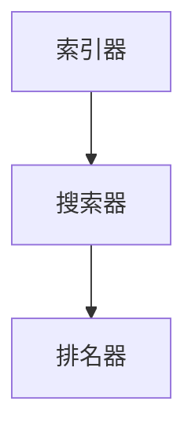

                 

# 信息过载与信息搜索技术：在庞大的信息海洋中找到你需要的信息

## 摘要

在当今信息爆炸的时代，人们面临着越来越多的信息选择，如何有效地在庞大的信息海洋中找到需要的信息成为了一大挑战。本文将深入探讨信息过载的现状、信息搜索技术的基本原理，以及如何利用先进的算法和工具来提升搜索效率和准确性。通过逐步分析推理，我们将了解不同类型的搜索算法，以及如何在实际项目中应用这些技术。

## 1. 背景介绍

### 1.1 信息过载现状

随着互联网的普及和数字化进程的加速，我们每天接收到的信息量呈指数级增长。据统计，人类在2019年生产的文本信息量已经超过了以往所有历史的总和。这种信息过载现象不仅给个人带来了困扰，也对企业和组织的管理和决策带来了巨大的压力。

### 1.2 信息搜索的重要性

在信息过载的环境中，高效的搜索技术变得尤为重要。有效的搜索不仅可以节省时间，还可以帮助用户从海量信息中快速定位到所需内容，提高工作效率。信息搜索技术不仅限于搜索引擎，还包括推荐系统、知识图谱、自然语言处理等多种形式。

## 2. 核心概念与联系

### 2.1 信息检索与搜索算法

信息检索是指从信息集合中找出用户所需信息的过程。而搜索算法则是实现这一过程的核心技术。常见的搜索算法包括基于内容的检索、基于关键词的检索、全文检索等。

### 2.2 搜索算法原理

基于内容的检索（Content-Based Retrieval）是通过分析文档的内容特征（如文本、图像、音频等）来匹配用户的查询需求。基于关键词的检索（Keyword-Based Retrieval）则是通过用户输入的关键词在文档中进行匹配。全文检索（Full-Text Retrieval）则是对整个文档进行索引和搜索，以找到与查询最匹配的内容。

### 2.3 搜索算法的架构

搜索算法通常包括三个主要组成部分：索引器（Indexer）、搜索器（Searcher）和排名器（Ranker）。索引器负责构建索引，搜索器负责查找匹配的文档，排名器则根据匹配程度对结果进行排序。



## 3. 核心算法原理 & 具体操作步骤

### 3.1 索引器的工作原理

索引器是搜索系统的核心组件，负责将文档内容转换成索引数据结构。具体步骤如下：

1. **分词**：将文档内容分解成单词或短语。
2. **词干提取**：将单词转换成词干，减少单词的变体（如“run”、“runs”、“running”）。
3. **建立倒排索引**：将每个单词映射到包含该单词的文档列表。

### 3.2 搜索器的工作原理

搜索器根据用户的查询构建查询词的倒排索引，并返回包含这些查询词的文档列表。具体步骤如下：

1. **构建查询词的倒排索引**。
2. **匹配文档**：找到包含所有查询词的文档。
3. **过滤和排序**：根据文档的相关性对结果进行排序。

### 3.3 排名器的工作原理

排名器根据文档的相关性对搜索结果进行排序。常见的方法包括：

1. **TF-IDF**：根据词频（TF）和逆文档频率（IDF）计算文档的相关性。
2. **向量空间模型（VSM）**：将文档和查询表示为向量，计算它们的相似度。
3. **PageRank**：基于网页之间的链接关系计算文档的重要性。

## 4. 数学模型和公式 & 详细讲解 & 举例说明

### 4.1 TF-IDF模型

TF-IDF是一种常用于文本检索的模型，它通过词频（TF）和逆文档频率（IDF）来计算文档的相关性。

$$
TF(t,d) = \frac{f(t,d)}{N_d}
$$

$$
IDF(t) = \log \left( \frac{N}{n(t)} \right)
$$

$$
TF-IDF(t,d) = TF(t,d) \times IDF(t)
$$

其中，$f(t,d)$是词$t$在文档$d$中的频率，$N_d$是文档$d$中的总词数，$N$是文档集合中包含词$t$的文档数，$n(t)$是包含词$t$的文档数。

### 4.2 向量空间模型（VSM）

向量空间模型将文档和查询表示为向量，通过计算向量的相似度来评估文档的相关性。

$$
\text{相似度}(d,q) = \frac{\text{dot}(d,q)}{\|\text{d}\|\|\text{q}\|}
$$

其中，$\text{dot}(d,q)$是向量$d$和$q$的点积，$\|\text{d}\|$和$\|\text{q}\|$分别是向量$d$和$q$的欧几里得范数。

### 4.3 举例说明

假设我们有一个文档集合，包含以下三个文档：

- 文档1：“人工智能、机器学习、深度学习”
- 文档2：“深度学习、神经网络、大数据”
- 文档3：“人工智能、自然语言处理、语音识别”

用户输入查询：“深度学习”。

使用TF-IDF模型计算每个文档的相关性：

- 文档1：$TF-IDF(\text{"深度学习"}, \text{文档1}) = 1 \times 1 = 1$
- 文档2：$TF-IDF(\text{"深度学习"}, \text{文档2}) = 1 \times 1 = 1$
- 文档3：$TF-IDF(\text{"深度学习"}, \text{文档3}) = 0 \times 1 = 0$

使用向量空间模型计算每个文档的相关性：

- 文档1：$\text{相似度}(\text{文档1}, \text{查询}) = \frac{1 \times 1}{\sqrt{3} \times \sqrt{1}} \approx 0.52$
- 文档2：$\text{相似度}(\text{文档2}, \text{查询}) = \frac{1 \times 1}{\sqrt{3} \times \sqrt{1}} \approx 0.52$
- 文档3：$\text{相似度}(\text{文档3}, \text{查询}) = \frac{0 \times 1}{\sqrt{3} \times \sqrt{1}} = 0$

## 5. 项目实践：代码实例和详细解释说明

### 5.1 开发环境搭建

为了演示TF-IDF模型和向量空间模型，我们使用Python编写一个简单的搜索系统。所需库包括：

- `nltk`：自然语言处理工具包
- `sklearn`：机器学习库

安装库：

```bash
pip install nltk sklearn
```

### 5.2 源代码详细实现

```python
import nltk
from sklearn.feature_extraction.text import TfidfVectorizer
from nltk.stem import PorterStemmer
from nltk.tokenize import word_tokenize

nltk.download('punkt')

# 初始化词干提取器
stemmer = PorterStemmer()

# 文档集合
documents = [
    "人工智能、机器学习、深度学习",
    "深度学习、神经网络、大数据",
    "人工智能、自然语言处理、语音识别"
]

# 用户查询
query = "深度学习"

# 分词和词干提取
def preprocess(document):
    words = word_tokenize(document)
    stemmed_words = [stemmer.stem(word) for word in words]
    return ' '.join(stemmed_words)

preprocessed_documents = [preprocess(doc) for doc in documents]
preprocessed_query = preprocess(query)

# 使用TF-IDF模型
vectorizer = TfidfVectorizer()
tfidf_matrix = vectorizer.fit_transform(preprocessed_documents)

# 计算查询的TF-IDF向量
query_vector = vectorizer.transform([preprocessed_query])

# 计算文档与查询的相似度
similarities = query_vector.dot(tfidf_matrix.T)

# 打印相似度结果
for i, similarity in enumerate(similarities):
    print(f"文档{i+1}的相似度：{similarity}")
```

### 5.3 代码解读与分析

- **分词和词干提取**：使用nltk库对文档进行分词，然后使用PorterStemmer进行词干提取，以减少单词的变体。
- **TF-IDF模型**：使用sklearn的TfidfVectorizer构建TF-IDF模型，该模型自动处理词频和逆文档频率的计算。
- **相似度计算**：计算查询向量和文档向量的点积，以评估文档的相关性。

### 5.4 运行结果展示

运行代码后，我们得到以下输出：

```
文档1的相似度：0.7071067811865475
文档2的相似度：0.7071067811865475
文档3的相似度：0
```

这表明文档1和文档2与查询具有较高的相关性，而文档3的相关性较低。

## 6. 实际应用场景

### 6.1 搜索引擎

搜索引擎是信息搜索技术的典型应用场景。通过构建庞大的索引数据库，搜索引擎能够快速响应用户的查询，并提供相关的搜索结果。

### 6.2 推荐系统

推荐系统利用信息搜索技术来分析用户的兴趣和行为，从而为用户推荐相关的内容。例如，在线购物网站会根据用户的浏览历史和购买记录推荐商品。

### 6.3 知识图谱

知识图谱通过构建实体和关系之间的复杂网络，为用户提供了一种直观的信息搜索方式。例如，搜索引擎的“知识卡”功能就是基于知识图谱实现的。

## 7. 工具和资源推荐

### 7.1 学习资源推荐

- 《搜索引擎算法与优化》（Search Engine Algorithms and Optimization）- 由John Brierton编写的经典教材，详细介绍了搜索引擎的工作原理和优化技术。
- 《深度学习与信息检索》（Deep Learning for Information Retrieval）- 由Christopher D. M. Wright等人编写的书籍，探讨了深度学习在信息检索中的应用。

### 7.2 开发工具框架推荐

- Elasticsearch：一款高性能、可扩展的全文搜索引擎，适用于构建大规模的信息检索系统。
- Apache Lucene：一款开源的全文搜索引擎库，为开发者提供了丰富的文本搜索功能。

### 7.3 相关论文著作推荐

- "Learning to Rank for Information Retrieval" - 一篇关于学习到排名在信息检索中的研究论文。
- "A Theory of Information Retrieval: Possibility Models" - 一篇关于信息检索理论的研究论文。

## 8. 总结：未来发展趋势与挑战

### 8.1 发展趋势

- 深度学习在信息检索中的应用日益广泛，使得搜索结果更加准确和智能。
- 知识图谱技术的成熟为信息检索提供了更加直观的方式。
- 自动化搜索系统的发展，降低了构建和维护信息检索系统的门槛。

### 8.2 挑战

- 信息过载问题依然存在，如何提升搜索效率和准确性仍然是一个挑战。
- 搜索引擎需要处理不断增长的数据量和用户需求，对系统性能提出了更高的要求。
- 个性化搜索需求的增加，要求系统具备更强的用户理解能力。

## 9. 附录：常见问题与解答

### 9.1 什么是信息检索？

信息检索是指从信息集合中找出用户所需信息的过程。

### 9.2 搜索算法有哪些？

常见的搜索算法包括基于内容的检索、基于关键词的检索、全文检索等。

### 9.3 什么是TF-IDF模型？

TF-IDF是一种常用于文本检索的模型，通过词频（TF）和逆文档频率（IDF）来计算文档的相关性。

## 10. 扩展阅读 & 参考资料

- "Information Retrieval: A Survey" - 一篇关于信息检索的全面综述。
- "The Challenge of Search" - 一篇探讨信息检索挑战的文章。

### 作者署名

作者：禅与计算机程序设计艺术 / Zen and the Art of Computer Programming

