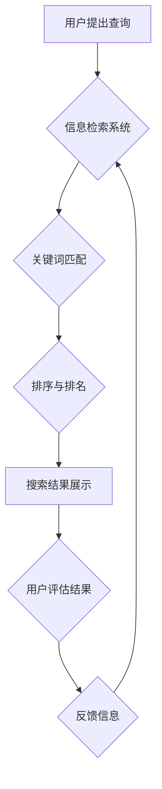

                 

## 信息过载与信息搜索策略与指南：在庞大的信息海洋中找到所需信息

> 关键词：信息过载、信息搜索、信息检索、搜索算法、信息架构、知识管理、数据挖掘、人工智能

### 1. 背景介绍

在当今信息爆炸的时代，我们每天接触的海量信息呈指数级增长。从新闻、社交媒体到学术论文、技术文档，信息无处不在，却也带来了新的挑战：信息过载。信息过载是指个体在面对过多的信息时，难以有效地获取、处理和利用信息的能力不足，从而导致认知疲劳、决策困难和效率低下。

信息过载现象已经成为现代社会普遍存在的问题，它影响着我们的工作、学习、生活和决策。面对海量信息，我们迫切需要有效的搜索策略和工具，才能在庞大的信息海洋中找到所需的信息，提高信息获取效率，并避免信息过载带来的负面影响。

### 2. 核心概念与联系

**2.1 信息搜索与信息检索**

信息搜索是指用户主动寻找特定信息的过程，而信息检索则是指系统根据用户查询进行信息匹配和返回的过程。两者密切相关，信息搜索是信息检索的驱动因素，而信息检索则是实现信息搜索的关键技术。

**2.2 信息架构与知识图谱**

信息架构是指对信息进行组织、分类和结构化的过程，目的是使信息更容易被理解和获取。知识图谱是一种基于知识表示的数据库，它将信息表示为实体和关系，并通过推理和查询来获取知识。

**2.3 搜索算法与机器学习**

搜索算法是信息检索的核心，它决定了系统如何匹配用户查询和信息文档。传统的搜索算法主要基于关键词匹配，而机器学习技术则可以学习用户行为和语义关系，提高搜索结果的准确性和相关性。

**2.4 信息过载与认知负荷**

信息过载会导致认知负荷增加，即个体处理信息的能力超负荷。认知负荷过高会导致注意力分散、记忆力下降、决策困难等问题。

**Mermaid 流程图**



### 3. 核心算法原理 & 具体操作步骤

**3.1 算法原理概述**

信息搜索算法的核心是将用户查询与信息文档进行匹配，并根据匹配程度排序和排名。常见的搜索算法包括：

* **关键词匹配算法:** 基于关键词的精确匹配，简单易实现，但缺乏语义理解能力。
* **TF-IDF算法:** 基于词频和逆向文档频率，可以衡量词语在文档中的重要性，提高搜索结果的准确性。
* **BM25算法:** 基于TF-IDF算法，考虑了文档长度和查询词的权重，进一步提高了搜索结果的精度。
* **向量空间模型:** 将文档和查询词向量化，通过余弦相似度计算匹配程度，能够处理语义相关的查询。
* **深度学习模型:** 利用神经网络学习用户行为和语义关系，可以实现更精准的搜索结果。

**3.2 算法步骤详解**

以TF-IDF算法为例，其具体操作步骤如下：

1. **文本预处理:** 对文档进行分词、去停用词、词干提取等预处理，去除无关信息，提取关键词。
2. **词频统计:** 计算每个词语在每个文档中出现的频率，即TF值 (Term Frequency)。
3. **逆向文档频率计算:** 计算每个词语在所有文档中出现的频率，即IDF值 (Inverse Document Frequency)。
4. **TF-IDF值计算:** 将TF值和IDF值相乘，得到每个词语在每个文档中的TF-IDF值。
5. **文档向量化:** 将文档的所有词语的TF-IDF值作为文档的特征向量。
6. **查询向量化:** 将用户查询的词语的TF-IDF值作为查询的特征向量。
7. **相似度计算:** 使用余弦相似度等方法计算文档向量和查询向量的相似度。
8. **排序排名:** 根据相似度排序文档，并将排序结果返回给用户。

**3.3 算法优缺点**

**优点:**

* 能够处理大量文本数据。
* 能够识别文档中的重要关键词。
* 能够提高搜索结果的准确性。

**缺点:**

* 缺乏语义理解能力，难以处理复杂的查询。
* 对文本预处理方式敏感，预处理效果会影响搜索结果。
* 难以处理新词和领域特定词汇。

**3.4 算法应用领域**

TF-IDF算法广泛应用于搜索引擎、信息检索系统、文本挖掘、推荐系统等领域。

### 4. 数学模型和公式 & 详细讲解 & 举例说明

**4.1 数学模型构建**

TF-IDF算法的数学模型可以表示为：

$$TF-IDF(t, d) = TF(t, d) \times IDF(t)$$

其中：

* $TF-IDF(t, d)$ 表示词语 $t$ 在文档 $d$ 中的TF-IDF值。
* $TF(t, d)$ 表示词语 $t$ 在文档 $d$ 中的词频。
* $IDF(t)$ 表示词语 $t$ 在所有文档中的逆向文档频率。

**4.2 公式推导过程**

* **词频 (TF):**

$$TF(t, d) = \frac{f(t, d)}{\sum_{t' \in d} f(t', d)}$$

其中：

* $f(t, d)$ 表示词语 $t$ 在文档 $d$ 中出现的次数。
* $\sum_{t' \in d} f(t', d)$ 表示文档 $d$ 中所有词语的总次数。

* **逆向文档频率 (IDF):**

$$IDF(t) = \log \frac{N}{df(t)}$$

其中：

* $N$ 表示所有文档的总数。
* $df(t)$ 表示词语 $t$ 在所有文档中出现的文档数。

**4.3 案例分析与讲解**

假设有三个文档：

* 文档 1: “苹果是水果，香蕉也是水果。”
* 文档 2: “苹果是一种甜美的水果，香蕉则比较酸。”
* 文档 3: “香蕉是一种热带水果，苹果则生长在温带地区。”

我们想要查询“苹果”的TF-IDF值。

* **TF(苹果, 文档 1):** 1 / 4 = 0.25
* **TF(苹果, 文档 2):** 1 / 5 = 0.2
* **TF(苹果, 文档 3):** 0 / 4 = 0

* **IDF(苹果):** log(3 / 3) = 0

因此，文档 1 中“苹果”的TF-IDF值为0.25 * 0 = 0，文档 2 中“苹果”的TF-IDF值为0.2 * 0 = 0，文档 3 中“苹果”的TF-IDF值为0 * 0 = 0。

### 5. 项目实践：代码实例和详细解释说明

**5.1 开发环境搭建**

* Python 3.x
* NLTK 自然语言处理库
* Scikit-learn 机器学习库

**5.2 源代码详细实现**

```python
import nltk
from nltk.corpus import stopwords
from sklearn.feature_extraction.text import TfidfVectorizer

# 下载停用词列表
nltk.download('stopwords')

# 文档列表
documents = [
    "苹果是水果，香蕉也是水果。",
    "苹果是一种甜美的水果，香蕉则比较酸。",
    "香蕉是一种热带水果，苹果则生长在温带地区。"
]

# 文本预处理
stop_words = set(stopwords.words('english'))
processed_documents = [
    " ".join([word for word in nltk.word_tokenize(doc) if word.lower() not in stop_words])
    for doc in documents
]

# TF-IDF向量化
vectorizer = TfidfVectorizer()
tfidf_matrix = vectorizer.fit_transform(processed_documents)

# 打印TF-IDF矩阵
print(tfidf_matrix.toarray())
```

**5.3 代码解读与分析**

* 代码首先下载停用词列表，并使用NLTK库对文档进行分词和停用词去除。
* 然后使用Scikit-learn库中的TfidfVectorizer类进行TF-IDF向量化，将文档转换为特征向量。
* 最后打印TF-IDF矩阵，展示每个词语在每个文档中的TF-IDF值。

**5.4 运行结果展示**

运行代码后，会输出一个TF-IDF矩阵，其中每个元素代表一个词语在某个文档中的TF-IDF值。

### 6. 实际应用场景

**6.1 搜索引擎**

搜索引擎利用TF-IDF算法和其他搜索算法，对网页进行索引和排名，帮助用户找到相关信息。

**6.2 信息检索系统**

信息检索系统，例如图书馆数据库、学术论文数据库，利用TF-IDF算法帮助用户检索特定信息。

**6.3 文本挖掘**

文本挖掘技术利用TF-IDF算法和其他算法，从文本数据中提取知识、发现模式和趋势。

**6.4 推荐系统**

推荐系统利用TF-IDF算法分析用户行为和偏好，推荐相关商品、内容或服务。

**6.5 知识图谱构建**

TF-IDF算法可以用于知识图谱构建，帮助识别实体和关系，构建知识网络。

**6.6 未来应用展望**

随着人工智能技术的不断发展，TF-IDF算法将与其他技术相结合，应用于更广泛的领域，例如：

* **个性化信息搜索:** 根据用户的兴趣和偏好，提供个性化的搜索结果。
* **跨语言信息检索:** 实现不同语言之间的信息检索和翻译。
* **语义搜索:** 理解用户查询的语义含义，提供更精准的搜索结果。
* **自动文档摘要:** 利用TF-IDF算法提取文档的关键信息，生成自动摘要。

### 7. 工具和资源推荐

**7.1 学习资源推荐**

* **书籍:**
    * 信息检索 (Information Retrieval) - Manning, Raghavan, Schütze
    * 自然语言处理 (Natural Language Processing) - Jurafsky, Martin
* **在线课程:**
    * Coursera: Natural Language Processing Specialization
    * edX: Introduction to Information Retrieval
* **博客和网站:**
    * Towards Data Science
    * Analytics Vidhya

**7.2 开发工具推荐**

* **Python:** 广泛用于自然语言处理和信息检索。
* **NLTK:** 自然语言处理工具包。
* **Scikit-learn:** 机器学习库。
* **SpaCy:** 高性能自然语言处理库。

**7.3 相关论文推荐**

* **TF-IDF:**
    * Robertson, S. E., & Zaragoza, H. (2009). The probabilistic relevance model. In Foundations of Information Retrieval (pp. 1-20). Springer, Berlin, Heidelberg.
* **深度学习在信息检索中的应用:**
    * Deng, L., &  Liu, Y. (2018). Deep learning for information retrieval: A survey. ACM Computing Surveys (CSUR), 50(6), 1-36.

### 8. 总结：未来发展趋势与挑战

**8.1 研究成果总结**

信息搜索技术已经取得了显著的进展，TF-IDF算法等传统算法在信息检索领域发挥着重要作用。深度学习技术的应用进一步提升了信息搜索的准确性和效率。

**8.2 未来发展趋势**

* **个性化信息搜索:** 基于用户行为和偏好，提供个性化的搜索结果。
* **跨语言信息检索:** 实现不同语言之间的信息检索和翻译。
* **语义搜索:** 理解用户查询的语义含义，提供更精准的搜索结果。
* **多模态信息搜索:** 将文本、图像、音频等多种数据类型融合，实现更全面的信息检索。

**8.3 面临的挑战**

* **信息爆炸:** 海量信息增长速度快，信息检索系统面临着处理和管理海量数据的挑战。
* **信息质量:** 网络信息质量参差不齐，如何识别和过滤虚假信息是一个重要挑战。
* **隐私保护:** 信息搜索过程中涉及用户隐私数据，如何保障用户隐私安全是一个关键问题。

**8.4 研究展望**

未来信息搜索技术的研究方向将集中在以下几个方面:

* **开发更智能的搜索算法:** 利用人工智能技术，开发能够理解用户意图、提供个性化推荐的搜索算法。
* **构建更完善的知识图谱:** 构建更全面的知识图谱，帮助用户更深入地理解信息。
* **探索新的信息表示方式:** 研究新的信息表示方式，例如图表示、向量表示等，提高信息检索的效率和准确性。


### 9. 附录：常见问题与解答

**9.1 如何选择合适的搜索算法？**

选择合适的搜索算法取决于具体的应用场景和需求。

* **关键词匹配算法:** 简单易实现，适用于简单的查询。
* **TF-IDF算法:** 能够识别文档中的重要关键词，适用于文本检索和信息挖掘。
* **向量空间模型:** 能够处理语义相关的查询，适用于更复杂的搜索场景。
* **深度学习模型:** 能够学习用户行为和语义关系，适用于个性化信息搜索和跨语言信息检索。

**9.2 如何提高信息搜索的准确性？**

* **文本预处理:** 对文本进行分词、去停用词、词干提取等预处理，去除无关信息，提高搜索结果的准确性。
* **特征工程:** 选择合适的特征，例如TF-IDF值、词向量等，可以提高搜索结果的准确性。
* **模型训练:** 使用足够的数据进行模型训练，可以提高模型的性能。
* **反馈机制:** 收集用户反馈，不断优化搜索算法和模型。

**9.3 如何解决信息过载问题？**

* **信息过滤:** 利用规则、算法或人工筛选，过滤掉不相关的或不重要的信息。
* **信息聚合:** 将多个信息源的信息进行聚合，生成更简洁的摘要或报告。
* **知识管理:** 建立知识库或信息管理系统，对信息进行组织、分类和结构化，方便用户查找和利用。
* **信息素养:** 提高用户的批判性思维能力，帮助用户更好地评估信息质量和可靠性。


作者：禅与计算机程序设计艺术 / Zen and the Art of Computer Programming<end_of_turn>

