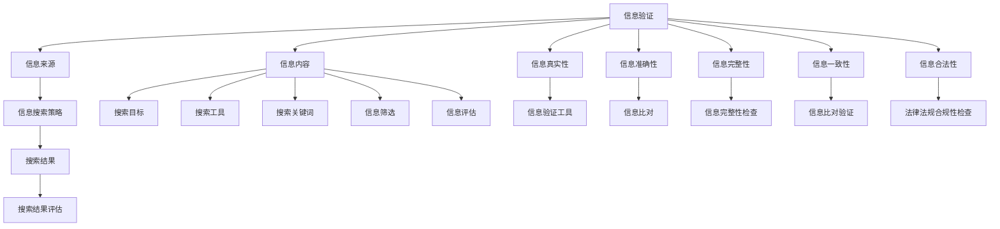
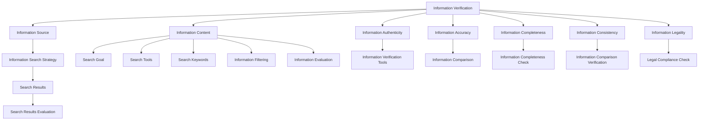

                 

### 文章标题

“信息验证和信息搜索策略：如何在信息海洋中找到可靠的信息”

### 关键词
- 信息验证
- 信息搜索策略
- 可靠性
- 数据库
- 人工智能
- 信息伦理

### 摘要
在信息爆炸的时代，如何确保我们获取到的信息是准确和可靠的，成为了一个关键问题。本文将探讨信息验证和信息搜索策略，通过深入分析，提供一系列方法和工具，帮助读者在信息海洋中找到可靠的信息。我们将讨论信息验证的核心原则、信息搜索的策略与技术，以及在实际应用中如何运用这些策略来提高信息获取的可靠性。

<|assistant|>## 1. 背景介绍

在当今的信息社会中，数据和信息以惊人的速度增长。互联网、社交媒体、各类数据库和智能设备使得信息获取变得前所未有的便捷。然而，这也带来了一个巨大的挑战：如何在海量的信息中找到可靠和准确的信息。信息验证和信息搜索策略的研究和实践变得尤为重要。

### 信息验证的重要性

信息验证是指对信息来源、真实性、准确性和完整性进行评估的过程。在信息时代，可靠的信息是决策、学习和创新的基础。错误或不准确的信息可能导致严重的后果，包括经济损失、误解和错误决策。例如，在金融领域，错误的财务报告可能导致投资者损失巨大；在医疗领域，错误的信息可能导致错误的诊断和治疗方案。

### 信息搜索策略的必要性

信息搜索策略是指导我们在信息海洋中高效、准确地找到所需信息的方法。有效的信息搜索策略可以帮助我们节省时间，提高工作效率，并确保获取的信息是可靠的。随着互联网和大数据技术的发展，信息搜索策略也在不断演变，从传统的搜索引擎到更加智能的信息检索系统，再到基于人工智能的推荐算法，每一种策略都有其独特的优势和应用场景。

### 研究目的

本文旨在探讨信息验证和信息搜索策略的核心概念、方法和技术，分析它们在实际应用中的作用和效果，并提出一些实用的建议，帮助读者在复杂的信息环境中找到可靠的信息。

### 文章结构

本文将按照以下结构展开：

1. **背景介绍**：概述信息验证和信息搜索策略的重要性。
2. **核心概念与联系**：详细解释信息验证和信息搜索策略的基本概念。
3. **核心算法原理 & 具体操作步骤**：介绍用于信息验证和信息搜索的核心算法和操作步骤。
4. **数学模型和公式 & 详细讲解 & 举例说明**：讨论支持信息验证和信息搜索的数学模型和公式，并给出具体示例。
5. **项目实践：代码实例和详细解释说明**：通过具体实例展示如何应用信息验证和信息搜索策略。
6. **实际应用场景**：分析信息验证和信息搜索策略在不同领域的应用。
7. **工具和资源推荐**：推荐学习资源和开发工具。
8. **总结：未来发展趋势与挑战**：总结本文的主要观点，探讨未来的发展趋势和挑战。
9. **附录：常见问题与解答**：回答读者可能关心的问题。
10. **扩展阅读 & 参考资料**：提供进一步的阅读材料和参考资料。

通过本文的深入探讨，我们希望能够帮助读者更好地理解和应用信息验证和信息搜索策略，提升信息获取的可靠性和效率。

<|assistant|>## 2. 核心概念与联系

### 2.1 什么是信息验证？

信息验证是一种确保信息来源可靠、内容准确和完整的过程。它涉及到对信息的真实性、可靠性、一致性和合法性的检查。信息验证的目的是防止错误、欺诈和不准确的信息传播，从而保障信息的使用者和依赖者的权益。

#### 信息验证的关键要素

1. **真实性**：信息是否来自可信赖的来源。
2. **准确性**：信息内容是否与实际情况相符。
3. **完整性**：信息是否完整，没有缺失或篡改。
4. **一致性**：信息在不同时间或不同来源处是否保持一致。
5. **合法性**：信息是否符合法律法规的要求。

#### 信息验证的方法

- **人工审核**：通过专业人员对信息进行详细审查。
- **自动化工具**：使用软件工具自动化地检查信息。
- **比对验证**：将多个来源的信息进行比对，以验证其一致性。

### 2.2 什么是信息搜索策略？

信息搜索策略是指导我们在信息海洋中高效、准确地找到所需信息的方法。有效的信息搜索策略应该考虑信息的类型、质量、相关性以及搜索者的需求。

#### 信息搜索策略的关键要素

1. **目标明确**：明确搜索的目标和所需信息类型。
2. **选择合适的搜索工具**：根据信息类型选择合适的搜索引擎或数据库。
3. **优化搜索关键词**：设计有效的关键词组合，提高搜索的精准度。
4. **筛选和评估信息**：从搜索结果中筛选出符合需求的信息，并进行评估。
5. **信息更新**：定期更新搜索策略，以适应信息环境的变化。

#### 信息搜索策略的分类

- **传统搜索策略**：基于关键词的搜索，如使用搜索引擎。
- **高级搜索策略**：使用布尔运算符、自然语言处理等技术提高搜索效果。
- **社会化搜索策略**：通过社交媒体平台和用户推荐进行信息搜索。
- **智能搜索策略**：利用人工智能和机器学习技术进行智能化的信息检索。

### 2.3 信息验证与信息搜索策略的关系

信息验证和信息搜索策略是相辅相成的。有效的信息验证可以确保搜索到的信息是可靠的，从而避免因信息不准确而造成的误导和损失。而有效的信息搜索策略则可以提高信息验证的效率，确保在复杂的信息环境中能够迅速找到可靠的信息。

#### 关联与互动

1. **信息验证指导信息搜索**：在信息搜索过程中，通过验证信息的来源和内容，可以避免不准确的搜索结果。
2. **信息搜索支持信息验证**：通过搜索获取大量信息，可以为信息验证提供更多参考和依据。

### 2.4 信息验证和信息搜索策略的架构图

为了更好地理解信息验证和信息搜索策略的关系，我们可以使用 Mermaid 流程图来展示它们的架构。

通过上述 Mermaid 流程图，我们可以清晰地看到信息验证和信息搜索策略之间的关联和互动。信息验证为信息搜索提供了可靠性和准确性的保障，而信息搜索则为信息验证提供了丰富的信息和数据支持。

## 2. Core Concepts and Connections

### 2.1 What is Information Verification?

Information verification is a process that ensures the reliability, accuracy, and completeness of information. It involves checking the authenticity, reliability, consistency, and legality of information. The purpose of information verification is to prevent the spread of incorrect, fraudulent, or incomplete information, thereby protecting the rights and interests of users and stakeholders.

#### Key Elements of Information Verification

1. **Authenticity**: Whether the information originates from a trusted source.
2. **Accuracy**: Whether the content of the information aligns with reality.
3. **Completeness**: Whether the information is complete without omissions or alterations.
4. **Consistency**: Whether the information remains consistent across different times or sources.
5. **Legality**: Whether the information complies with legal requirements.

#### Methods of Information Verification

- **Manual Review**: Detailed examination of information by professionals.
- **Automated Tools**: Use of software tools to automate the verification process.
- **Comparative Verification**: Comparing information from multiple sources to verify consistency.

### 2.2 What is Information Search Strategy?

Information search strategy is a method that guides us in efficiently and accurately finding the information we need in an information-rich environment. An effective information search strategy should consider the type, quality, relevance, and needs of the information seeker.

#### Key Elements of Information Search Strategy

1. **Clear Goals**: Defining the objectives and type of information needed.
2. **Choosing the Right Tools**: Selecting appropriate search engines or databases based on the type of information.
3. **Optimizing Search Keywords**: Designing effective keyword combinations to improve search precision.
4. **Filtering and Evaluating Information**: Screening and evaluating search results to find information that meets the needs.
5. **Information Updating**: Regularly updating the search strategy to adapt to changes in the information environment.

#### Types of Information Search Strategies

- **Traditional Search Strategies**: Keyword-based searches, such as using search engines.
- **Advanced Search Strategies**: Using Boolean operators, natural language processing, and other techniques to improve search effectiveness.
- **Social Search Strategies**: Using social media platforms and user recommendations for information search.
- **Intelligent Search Strategies**: Using artificial intelligence and machine learning technologies for intelligent information retrieval.

### 2.3 The Relationship Between Information Verification and Information Search Strategy

Information verification and information search strategy are complementary. Effective information verification ensures the reliability of the information found, thereby avoiding misleading or costly consequences. Meanwhile, an effective information search strategy improves the efficiency of information verification, ensuring that reliable information can be found quickly in a complex information environment.

#### Association and Interaction

1. **Information Verification Guides Information Search**: During the information search process, verifying the source and content of information can prevent inaccurate search results.
2. **Information Search Supports Information Verification**: By gathering a large amount of information through search, more references and data can be provided for information verification.

### 2.4 Architecture Diagram of Information Verification and Information Search Strategy

To better understand the relationship between information verification and information search strategy, we can use a Mermaid flowchart to illustrate their architecture.

Through the above Mermaid flowchart, we can clearly see the association and interaction between information verification and information search strategy. Information verification provides reliability and accuracy for information search, while information search strategy improves the efficiency of information verification in a complex information environment.

<|assistant|>## 3. 核心算法原理 & 具体操作步骤

### 3.1 信息验证的核心算法

信息验证的核心在于对信息源的可靠性进行评估，以及对信息内容进行核实。以下是几种常用的信息验证算法：

#### 1. 基于哈希函数的验证

哈希函数是一种将任意长度的输入数据转换成固定长度输出数据的算法。通过对比哈希值，可以快速验证信息内容的完整性。

- **具体操作步骤**：
  - 计算原始信息的哈希值。
  - 将哈希值存储在可信的第三方平台或数据库中。
  - 在需要验证时，重新计算信息的哈希值，并与存储的哈希值进行比较。
  - 如果哈希值一致，则信息未被篡改。

#### 2. 数字签名验证

数字签名是一种用于验证信息完整性和真实性的技术。它利用公钥加密和私钥解密来实现。

- **具体操作步骤**：
  - 生成一对公钥和私钥。
  - 使用私钥对原始信息进行签名。
  - 将签名附在信息后面发送给接收者。
  - 接收者使用公钥验证签名。
  - 如果验证成功，则信息未被篡改，且来源于私钥所有者。

#### 3. 链式哈希算法

链式哈希算法（如SHA-256）通过将多个信息块链接在一起，确保信息链的完整性和不可篡改性。

- **具体操作步骤**：
  - 将信息分成多个块。
  - 对每个块进行哈希处理，并将结果连接在一起。
  - 计算整个信息链的哈希值。
  - 将哈希值存储在可信的第三方平台。
  - 在需要验证时，重新生成信息链，并计算哈希值。
  - 对比存储的哈希值，以验证信息链的完整性。

### 3.2 信息搜索策略的核心算法

信息搜索策略的核心在于高效地找到所需信息，并确保搜索结果的准确性和相关性。以下是几种常用的信息搜索算法：

#### 1. 暴力搜索

暴力搜索是最简单的搜索算法，它通过遍历所有可能的搜索路径来找到所需信息。

- **具体操作步骤**：
  - 对搜索空间进行遍历。
  - 对每个节点进行检查，找到满足条件的节点。
  - 记录找到的信息，并返回结果。

#### 2. 布尔搜索

布尔搜索通过使用布尔运算符（AND、OR、NOT）来组合多个关键词，提高搜索的精确度。

- **具体操作步骤**：
  - 确定搜索的关键词。
  - 使用布尔运算符组合关键词。
  - 将组合后的关键词输入搜索引擎。
  - 分析搜索结果，筛选出最相关的信息。

#### 3. 排序算法

排序算法用于对搜索结果进行排序，以提高结果的准确性。常用的排序算法包括快速排序、归并排序和堆排序。

- **具体操作步骤**：
  - 收集搜索结果。
  - 对搜索结果进行排序。
  - 根据排序结果，返回前几个最相关的结果。

### 3.3 实践操作示例

以下是一个简单的示例，说明如何使用上述算法进行信息验证和信息搜索：

#### 信息验证示例

1. **哈希函数验证**：
   - 假设有一段文本：“我是一个可靠的源。”
   - 使用SHA-256计算文本的哈希值。
   - 将哈希值存储在第三方平台。
   - 在需要验证时，重新计算文本的哈希值，并与存储的哈希值进行比较。
   - 如果哈希值一致，则确认文本未被篡改。

2. **数字签名验证**：
   - 假设有一段签名文本：“这是一个签名示例。”
   - 使用私钥对文本进行签名。
   - 将签名附在文本后面发送给接收者。
   - 接收者使用公钥验证签名。
   - 如果验证成功，则确认文本来自私钥所有者，且未被篡改。

#### 信息搜索示例

1. **暴力搜索**：
   - 假设需要搜索包含“人工智能”和“深度学习”的网页。
   - 对所有网页进行遍历，查找包含关键词的网页。
   - 记录所有符合条件的网页。

2. **布尔搜索**：
   - 假设需要搜索包含“人工智能”和“深度学习”的网页。
   - 将关键词组合为：“人工智能 AND 深度学习”。
   - 使用搜索引擎进行布尔搜索，获取搜索结果。

3. **排序算法**：
   - 假设从搜索引擎获取了10个搜索结果。
   - 使用快速排序对搜索结果进行排序，按照相关度排序。
   - 返回排序后的前3个搜索结果。

通过上述示例，我们可以看到如何将信息验证和信息搜索策略应用于实际操作中。这些算法和策略为我们提供了可靠和高效的方法，以确保在信息海洋中找到准确和可靠的信息。

## 3. Core Algorithm Principles and Specific Operational Steps

### 3.1 Core Verification Algorithms

The core of information verification lies in assessing the reliability of information sources and verifying the content of information. Here are several commonly used verification algorithms:

#### 1. Hash Function Verification

Hash functions are algorithms that convert input data of any length into a fixed-length output. By comparing hash values, the integrity of information content can be quickly verified.

- **Specific Operational Steps**:
  - Compute the hash value of the original information.
  - Store the hash value on a trusted third-party platform or database.
  - When verification is needed, recompute the hash value of the information and compare it with the stored hash value.
  - If the hash values match, the information has not been tampered with.

#### 2. Digital Signature Verification

Digital signatures are a technology used to verify the integrity and authenticity of information. They use public-key encryption and private-key decryption to achieve this.

- **Specific Operational Steps**:
  - Generate a pair of public and private keys.
  - Sign the original information using the private key.
  - Attach the signature to the end of the information and send it to the receiver.
  - The receiver verifies the signature using the public key.
  - If the verification is successful, the information has not been tampered with and originates from the owner of the private key.

#### 3. Chain Hash Algorithm

Chain hash algorithms (e.g., SHA-256) link multiple information blocks to ensure the integrity and tamper-proof nature of the information chain.

- **Specific Operational Steps**:
  - Split the information into multiple blocks.
  - Hash each block and concatenate the results.
  - Compute the hash value of the entire information chain.
  - Store the hash value on a trusted third-party platform.
  - When verification is needed, recreate the information chain and compute the hash value.
  - Compare the stored hash value to verify the integrity of the information chain.

### 3.2 Core Information Search Algorithms

The core of information search strategies is to efficiently find the needed information and ensure the accuracy and relevance of the search results. Here are several commonly used information search algorithms:

#### 1. Brute Force Search

Brute force search is the simplest search algorithm, which traverses all possible search paths to find the needed information.

- **Specific Operational Steps**:
  - Traverse the search space.
  - Check each node for the desired information.
  - Record the found information and return the results.

#### 2. Boolean Search

Boolean search uses Boolean operators (AND, OR, NOT) to combine multiple keywords, improving the precision of the search.

- **Specific Operational Steps**:
  - Determine the search keywords.
  - Combine the keywords using Boolean operators (e.g., "artificial intelligence AND deep learning").
  - Input the combined keywords into the search engine.
  - Analyze the search results and filter out the most relevant information.

#### 3. Sorting Algorithms

Sorting algorithms are used to sort search results to improve accuracy. Common sorting algorithms include quicksort, mergesort, and heapsort.

- **Specific Operational Steps**:
  - Collect the search results.
  - Sort the search results based on relevance.
  - Return the top few results based on the sorted order.

### 3.3 Practical Operational Examples

Below is a simple example illustrating how to apply these algorithms and strategies to actual operations:

#### Verification Example

1. **Hash Function Verification**:
   - Assume there is a text: "I am a reliable source."
   - Compute the SHA-256 hash value of the text.
   - Store the hash value on a trusted third-party platform.
   - When verification is needed, recompute the hash value of the text and compare it with the stored hash value.
   - If the hash values match, confirm that the text has not been tampered with.

2. **Digital Signature Verification**:
   - Assume there is a signed text: "This is a signature example."
   - Sign the text using a private key.
   - Attach the signature to the end of the text and send it to the receiver.
   - The receiver verifies the signature using the public key.
   - If the verification is successful, confirm that the text comes from the owner of the private key and has not been tampered with.

#### Search Example

1. **Brute Force Search**:
   - Assume the need to search for web pages containing both "artificial intelligence" and "deep learning".
   - Traverse all web pages to find pages containing the keywords.
   - Record all pages that meet the criteria.

2. **Boolean Search**:
   - Assume the need to search for web pages containing both "artificial intelligence" and "deep learning".
   - Combine the keywords as "artificial intelligence AND deep learning".
   - Use a search engine to perform a Boolean search and obtain the results.

3. **Sorting Algorithms**:
   - Assume obtaining 10 search results from a search engine.
   - Sort the search results using quicksort based on relevance.
   - Return the top 3 results based on the sorted order.

Through these examples, we can see how to apply information verification and information search strategies in actual operations. These algorithms and strategies provide reliable and efficient methods to ensure accurate and reliable information is found in the information ocean.

