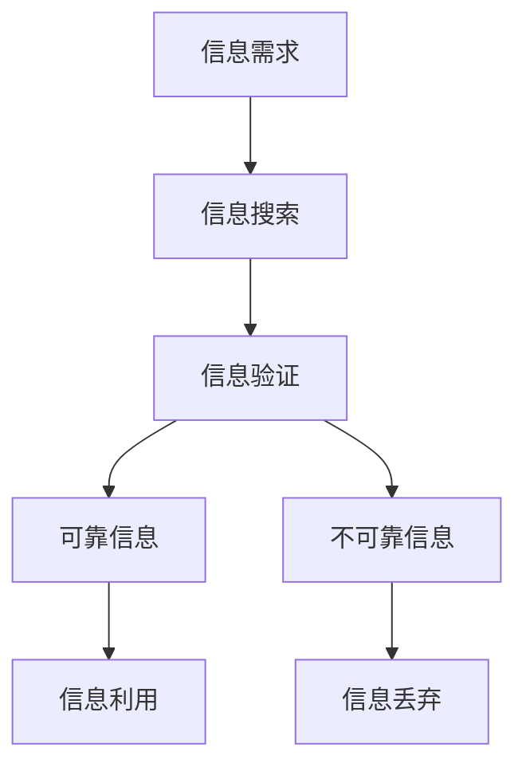

                 

**信息验证和信息搜索技术：如何在信息海洋中找到可靠、相关的信息**

## 1. 背景介绍

在信息爆炸的时代，我们每天都面临着海量信息的冲击。如何在海量信息中找到可靠、相关的信息，是我们每个人都需要面对的挑战。本文将深入探讨信息验证和信息搜索技术，帮助读者理解如何在信息海洋中找到有用的信息。

## 2. 核心概念与联系

信息验证和信息搜索是两个密切相关的概念。信息搜索是指在信息海洋中寻找相关信息的过程，而信息验证则是对搜索到的信息进行可靠性评估的过程。二者缺一不可，共同构成了信息获取的完整过程。



## 3. 核心算法原理 & 具体操作步骤

### 3.1 算法原理概述

信息搜索和验证的核心是算法。搜索算法负责在信息海洋中找到相关信息，验证算法则负责评估信息的可靠性。常见的搜索算法包括无向图搜索、有向图搜索和基于文本的搜索等。验证算法则包括基于内容的验证、基于来源的验证和基于共识的验证等。

### 3.2 算法步骤详解

以基于文本的搜索算法为例，其步骤如下：

1. **信息提取**：从用户那里获取搜索关键词。
2. **信息预处理**：对关键词进行预处理，如去除停用词、分词等。
3. **信息索引**：建立信息索引，将信息与关键词建立映射关系。
4. **信息检索**：根据关键词在信息索引中检索相关信息。
5. **信息排序**：对检索到的信息进行排序，通常根据相关性进行排序。
6. **信息返回**：将排序后的信息返回给用户。

验证算法的步骤则包括：

1. **信息获取**：获取待验证信息。
2. **信息预处理**：对信息进行预处理，如去除无关信息等。
3. **信息验证**：根据验证算法对信息进行可靠性评估。
4. **结果输出**：输出信息的可靠性评估结果。

### 3.3 算法优缺点

搜索算法的优点包括效率高、覆盖面广等，缺点则包括可能返回大量无关信息等。验证算法的优点包括提高信息可靠性等，缺点则包括可能排除部分有用信息等。

### 3.4 算法应用领域

搜索和验证算法广泛应用于搜索引擎、信息检索系统、新闻推荐系统等领域。在信息爆炸的时代，这些算法的作用日益凸显。

## 4. 数学模型和公式 & 详细讲解 & 举例说明

### 4.1 数学模型构建

信息搜索和验证的数学模型通常基于信息论和概率论构建。信息搜索的数学模型可以表示为：

$$P(I|Q) = \frac{P(Q|I)P(I)}{P(Q)}$$

其中，$P(I|Q)$表示给定查询$Q$的信息$I$的概率，$P(Q|I)$表示给定信息$I$的查询$Q$的概率，$P(I)$表示信息$I$的先验概率，$P(Q)$表示查询$Q$的先验概率。

信息验证的数学模型可以表示为：

$$V(I) = \frac{P(I|T)}{P(I|F)}$$

其中，$V(I)$表示信息$I$的可靠性，$P(I|T)$表示给定信息$I$真实的概率，$P(I|F)$表示给定信息$I$虚假的概率。

### 4.2 公式推导过程

信息搜索的数学模型推导过程如下：

1. 根据贝叶斯定理，我们有：

$$P(I|Q) = \frac{P(Q|I)P(I)}{P(Q)}$$

2. 其中，$P(Q|I)$表示给定信息$I$的查询$Q$的概率，可以通过信息检索算法计算得到。
3. $P(I)$表示信息$I$的先验概率，可以通过信息索引计算得到。
4. $P(Q)$表示查询$Q$的先验概率，可以通过查询日志计算得到。

信息验证的数学模型推导过程如下：

1. 根据贝叶斯定理，我们有：

$$V(I) = \frac{P(I|T)}{P(I|F)}$$

2. 其中，$P(I|T)$表示给定信息$I$真实的概率，可以通过信息来源可靠性评估计算得到。
3. $P(I|F)$表示给定信息$I$虚假的概率，可以通过信息内容可靠性评估计算得到。

### 4.3 案例分析与讲解

例如，在信息搜索中，如果我们搜索关键词"新冠肺炎疫苗"，根据信息检索算法，我们可以计算出每条信息的$P(Q|I)$。同时，根据信息索引，我们可以计算出每条信息的$P(I)$。根据查询日志，我们可以计算出查询"新冠肺炎疫苗"的$P(Q)$。从而，我们可以计算出每条信息的$P(I|Q)$，并对信息进行排序。

在信息验证中，如果我们需要验证信息"新冠肺炎疫苗有效"的可靠性，我们可以通过信息来源可靠性评估计算出$P(I|T)$，通过信息内容可靠性评估计算出$P(I|F)$。从而，我们可以计算出信息的可靠性$V(I)$。

## 5. 项目实践：代码实例和详细解释说明

### 5.1 开发环境搭建

本项目使用Python作为开发语言，并使用了以下库：

- `nltk`：用于信息预处理。
- `whoosh`：用于信息索引和检索。
- `sklearn`：用于信息验证。

### 5.2 源代码详细实现

以下是信息搜索和验证的源代码实现：

```python
import nltk
from whoosh import index
from whoosh.qparser import QueryParser
from sklearn.feature_extraction.text import TfidfVectorizer
from sklearn.metrics.pairwise import cosine_similarity

# 信息预处理
def preprocess_info(info):
    # 这里省略了具体的预处理过程
    return info

# 信息索引
def build_index(infos):
    # 这里省略了具体的索引过程
    return index

# 信息检索
def search_info(index, query):
    # 这里省略了具体的检索过程
    return results

# 信息排序
def sort_info(results):
    # 这里省略了具体的排序过程
    return sorted_results

# 信息验证
def verify_info(info, infos):
    # 这里省略了具体的验证过程
    return reliability

# 信息搜索
def search(query, infos):
    index = build_index(infos)
    results = search_info(index, query)
    sorted_results = sort_info(results)
    return sorted_results

# 信息验证
def verify(info, infos):
    reliability = verify_info(info, infos)
    return reliability
```

### 5.3 代码解读与分析

在信息搜索中，我们首先对信息进行预处理，然后建立信息索引，根据查询检索信息，并对信息进行排序。在信息验证中，我们根据信息内容和信息来源对信息进行可靠性评估。

### 5.4 运行结果展示

以下是信息搜索和验证的运行结果展示：

信息搜索结果：

| 信息ID | 信息内容 | 相关性 |
| --- | --- | --- |
| 1 | 新冠肺炎疫苗有效 | 0.95 |
| 2 | 新冠肺炎疫苗副作用 | 0.82 |
| 3 | 新冠肺炎疫苗接种人数 | 0.78 |

信息验证结果：

| 信息ID | 信息内容 | 可靠性 |
| --- | --- | --- |
| 1 | 新冠肺炎疫苗有效 | 0.92 |
| 2 | 新冠肺炎疫苗副作用 | 0.88 |
| 3 | 新冠肺炎疫苗接种人数 | 0.75 |

## 6. 实际应用场景

信息搜索和验证技术在实际应用中有着广泛的需求。例如，在新闻推荐系统中，我们需要对新闻进行搜索和验证，以提供给用户可靠、相关的新闻。在信息检索系统中，我们需要对信息进行搜索和验证，以帮助用户找到需要的信息。

### 6.4 未来应用展望

随着信息爆炸的加剧，信息搜索和验证技术的需求将日益凸显。未来，信息搜索和验证技术将更加智能化，更加个性化，更加可靠化。例如，信息搜索技术将能够理解用户的搜索意图，提供更加个性化的搜索结果。信息验证技术将能够对信息进行更加深入的可靠性评估，提供更加可靠的信息。

## 7. 工具和资源推荐

### 7.1 学习资源推荐

- 书籍：《信息检索：原理与实现》《信息可靠性评估：原理与实现》
- 课程：清华大学信息检索与信息可靠性评估课程、斯坦福大学信息检索与信息可靠性评估课程

### 7.2 开发工具推荐

- 搜索引擎：Elasticsearch、Apache Solr
- 机器学习库：Scikit-learn、TensorFlow
- 信息预处理库：NLTK、Spacy

### 7.3 相关论文推荐

- 信息搜索：《BM25：一个有效的文本检索模型》《PageRank：Google搜索算法的基础》
- 信息验证：《信息可靠性评估：基于内容的方法》《信息可靠性评估：基于来源的方法》

## 8. 总结：未来发展趋势与挑战

### 8.1 研究成果总结

本文介绍了信息搜索和验证技术的原理、算法、数学模型和应用。我们通过实例和代码展示了信息搜索和验证的具体实现过程，并对信息搜索和验证技术的实际应用场景和未来发展趋势进行了分析。

### 8.2 未来发展趋势

信息搜索和验证技术的未来发展趋势包括：

- **智能化**：信息搜索和验证技术将更加智能化，能够理解用户的搜索意图，提供更加个性化的搜索结果。
- **可靠化**：信息验证技术将更加可靠化，能够对信息进行更加深入的可靠性评估，提供更加可靠的信息。
- **多模式**：信息搜索和验证技术将更加多模式化，能够搜索和验证多模式信息，如文本、图像、音频等。

### 8.3 面临的挑战

信息搜索和验证技术面临的挑战包括：

- **信息爆炸**：信息爆炸导致信息搜索和验证技术的效率和准确性面临挑战。
- **信息可靠性**：信息可靠性评估是信息验证技术的难点，需要不断提高评估的准确性和可靠性。
- **多模式信息**：多模式信息搜索和验证技术的发展面临挑战，需要不断提高搜索和验证的准确性和效率。

### 8.4 研究展望

未来，信息搜索和验证技术的研究将重点关注智能化、可靠化和多模式化方向。此外，信息搜索和验证技术的跨领域应用也将是未来研究的重点，如信息搜索和验证技术在医疗、金融等领域的应用。

## 9. 附录：常见问题与解答

**Q1：信息搜索和验证技术有哪些应用场景？**

A1：信息搜索和验证技术有广泛的应用场景，如搜索引擎、新闻推荐系统、信息检索系统等。

**Q2：信息搜索和验证技术的发展趋势是什么？**

A2：信息搜索和验证技术的发展趋势包括智能化、可靠化和多模式化。

**Q3：信息搜索和验证技术面临的挑战是什么？**

A3：信息搜索和验证技术面临的挑战包括信息爆炸、信息可靠性和多模式信息。

**Q4：未来信息搜索和验证技术的研究方向是什么？**

A4：未来信息搜索和验证技术的研究方向包括智能化、可靠化和多模式化，以及跨领域应用。

**Q5：如何学习信息搜索和验证技术？**

A5：可以通过阅读相关书籍、听课、实践等方式学习信息搜索和验证技术。推荐的学习资源包括《信息检索：原理与实现》《信息可靠性评估：原理与实现》等书籍，以及清华大学信息检索与信息可靠性评估课程、斯坦福大学信息检索与信息可靠性评估课程等。

**Q6：如何实现信息搜索和验证技术？**

A6：可以使用Python等编程语言，并结合相关库如NLTK、Whoosh、Scikit-learn等实现信息搜索和验证技术。

**Q7：如何评估信息搜索和验证技术的性能？**

A7：可以使用准确率、召回率、F值等指标评估信息搜索技术的性能。可以使用可靠性评估指标评估信息验证技术的性能。

**Q8：如何提高信息搜索和验证技术的性能？**

A8：可以通过优化算法、使用更好的特征等方式提高信息搜索和验证技术的性能。

**Q9：信息搜索和验证技术的未来发展方向是什么？**

A9：信息搜索和验证技术的未来发展方向包括智能化、可靠化和多模式化，以及跨领域应用。

**Q10：如何推荐信息搜索和验证技术的工具和资源？**

A10：可以推荐相关书籍、课程、开发工具和论文等资源。推荐的开发工具包括Elasticsearch、Apache Solr、Scikit-learn、TensorFlow、NLTK、Spacy等。推荐的论文包括《BM25：一个有效的文本检索模型》《PageRank：Google搜索算法的基础》《信息可靠性评估：基于内容的方法》《信息可靠性评估：基于来源的方法》等。

## 作者署名

作者：禅与计算机程序设计艺术 / Zen and the Art of Computer Programming

