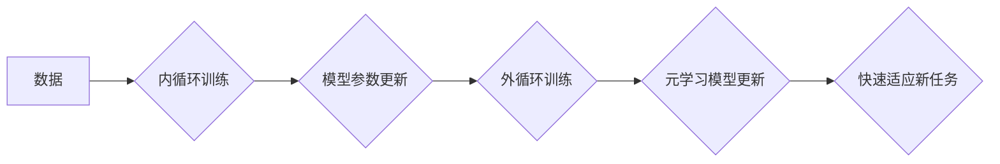

                 

## 元学习在NLP中的应用：快速适应新任务

> 关键词：元学习、NLP、迁移学习、快速适应、Few-Shot Learning、Fine-Tuning

## 1. 背景介绍

自然语言处理 (NLP) 领域近年来取得了显著进展，深度学习模型在各种任务上表现出色，例如机器翻译、文本摘要和问答系统。然而，这些模型通常需要大量特定任务的数据进行训练，这在现实世界中往往难以实现。

元学习 (Meta-Learning) 作为一种新兴的机器学习范式，旨在学习如何学习。它通过训练模型在多个相关任务上进行学习，从而提高模型对新任务的快速适应能力。元学习在 NLP 领域具有巨大的潜力，可以帮助模型更有效地利用有限的数据资源，并更快地适应新的任务需求。

## 2. 核心概念与联系

元学习的核心思想是学习一个通用的学习算法，而不是仅仅学习特定任务的模型参数。这个通用的学习算法可以被应用于各种不同的任务，并能够快速适应新的任务。

**元学习与迁移学习的关系:**

元学习可以看作是一种更高级的迁移学习。传统的迁移学习方法通常是将预训练模型的知识迁移到新的任务上，而元学习则更进一步，学习一个能够泛化到各种任务的学习算法。

**元学习的架构:**

元学习的架构通常包括以下几个部分：

* **内循环:** 在每个具体的任务上进行训练，学习任务特有的知识。
* **外循环:** 在多个任务上进行训练，学习一个通用的学习算法。
* **元学习模型:** 负责学习通用的学习算法。

**Mermaid 流程图:**



## 3. 核心算法原理 & 具体操作步骤

### 3.1  算法原理概述

元学习算法的核心思想是通过学习一个“学习如何学习”的模型，从而能够快速适应新的任务。

常见的元学习算法包括：

* **Model-Agnostic Meta-Learning (MAML):** MAML 通过在多个任务上进行训练，学习一个模型参数的初始值，使得模型能够快速适应新的任务。
* **Prototypical Networks:** Prototypical Networks 通过学习每个类别的原型，使得模型能够快速识别新的样本所属的类别。
* **Matching Networks:** Matching Networks 通过学习一个匹配函数，使得模型能够比较两个样本之间的相似度，从而进行分类或检索。

### 3.2  算法步骤详解

以 MAML 为例，其具体操作步骤如下：

1. **初始化模型参数:** 为模型参数赋予初始值。
2. **内循环训练:** 在每个具体的任务上进行训练，更新模型参数。
3. **外循环训练:** 在多个任务上进行训练，更新模型参数，使得模型能够快速适应新的任务。
4. **快速适应新任务:** 将预训练好的模型参数应用于新的任务，进行少量数据训练，即可快速适应新的任务。

### 3.3  算法优缺点

**优点:**

* **快速适应新任务:** 元学习模型能够快速适应新的任务，无需大量的数据训练。
* **泛化能力强:** 元学习模型能够泛化到各种不同的任务。

**缺点:**

* **训练复杂:** 元学习算法的训练过程相对复杂，需要更多的计算资源。
* **数据需求:** 尽管元学习模型能够快速适应新的任务，但仍然需要一些数据进行训练。

### 3.4  算法应用领域

元学习算法在 NLP 领域具有广泛的应用场景，例如：

* **Few-Shot Learning:** 元学习算法能够在少量数据的情况下进行学习，适用于数据稀缺的任务。
* **文本分类:** 元学习算法能够快速适应新的文本分类任务。
* **机器翻译:** 元学习算法能够提高机器翻译模型的泛化能力。
* **对话系统:** 元学习算法能够使对话系统更灵活地应对用户的各种提问。

## 4. 数学模型和公式 & 详细讲解 & 举例说明

### 4.1  数学模型构建

MAML 的目标是学习一个模型参数 θ，使得在新的任务上进行少量数据训练后，模型能够达到最佳性能。

假设我们有 N 个任务，每个任务包含 M 个训练样本。对于每个任务，我们使用一个损失函数 L 来衡量模型性能。

MAML 的目标函数可以表示为：

$$
\mathcal{L}(\theta) = \frac{1}{N} \sum_{i=1}^{N} \mathbb{E}_{(\mathbf{x}, y) \sim \mathcal{D}_i} \left[ L(\theta, \mathbf{x}, y) \right]
$$

其中：

* θ 是模型参数
* N 是任务数量
* $\mathcal{D}_i$ 是第 i 个任务的数据集
* $(\mathbf{x}, y)$ 是一个训练样本

### 4.2  公式推导过程

MAML 通过梯度下降算法来优化目标函数。

在每个任务上进行训练时，我们使用一个小的学习率 α 来更新模型参数：

$$
\theta' = \theta - \alpha \nabla_{\theta} L(\theta, \mathbf{x}, y)
$$

其中：

* θ' 是更新后的模型参数

在外循环训练时，我们使用所有任务的数据来更新模型参数：

$$
\theta = \theta - \beta \nabla_{\theta} \mathcal{L}(\theta)
$$

其中：

* β 是外循环的学习率

### 4.3  案例分析与讲解

假设我们有一个文本分类任务，需要将文本分类为正例或负例。

我们可以使用 MAML 来训练一个文本分类模型。

在内循环训练中，我们使用每个任务的数据来训练模型，并更新模型参数。

在外循环训练中，我们使用所有任务的数据来更新模型参数，使得模型能够泛化到各种不同的文本分类任务。

## 5. 项目实践：代码实例和详细解释说明

### 5.1  开发环境搭建

* Python 3.6+
* PyTorch 1.0+
* CUDA 10.0+

### 5.2  源代码详细实现

```python
import torch
import torch.nn as nn

class MetaLearner(nn.Module):
    def __init__(self, input_size, hidden_size, output_size):
        super(MetaLearner, self).__init__()
        self.fc1 = nn.Linear(input_size, hidden_size)
        self.fc2 = nn.Linear(hidden_size, output_size)

    def forward(self, x):
        x = torch.relu(self.fc1(x))
        x = self.fc2(x)
        return x

# 定义训练函数
def train(model, optimizer, train_loader, epochs):
    for epoch in range(epochs):
        for batch_idx, (data, target) in enumerate(train_loader):
            # 前向传播
            output = model(data)
            # 计算损失
            loss = nn.CrossEntropyLoss()(output, target)
            # 反向传播
            optimizer.zero_grad()
            loss.backward()
            # 更新参数
            optimizer.step()

# 定义评估函数
def evaluate(model, test_loader):
    correct = 0
    total = 0
    with torch.no_grad():
        for data, target in test_loader:
            output = model(data)
            _, predicted = torch.max(output.data, 1)
            total += target.size(0)
            correct += (predicted == target).sum().item()
    return correct / total

# 实例化模型、优化器和训练数据
model = MetaLearner(input_size=100, hidden_size=50, output_size=2)
optimizer = torch.optim.Adam(model.parameters(), lr=0.001)
train_loader = ...
test_loader = ...

# 训练模型
train(model, optimizer, train_loader, epochs=10)

# 评估模型
accuracy = evaluate(model, test_loader)
print(f"Accuracy: {accuracy}")
```

### 5.3  代码解读与分析

* **MetaLearner 类:** 定义了元学习模型的结构，包含两个全连接层。
* **train 函数:** 定义了模型的训练过程，包括前向传播、损失计算、反向传播和参数更新。
* **evaluate 函数:** 定义了模型的评估过程，计算模型在测试集上的准确率。
* **实例化模型、优化器和训练数据:** 创建了模型实例、优化器实例和训练数据加载器。
* **训练模型:** 使用 train 函数训练模型。
* **评估模型:** 使用 evaluate 函数评估模型的性能。

### 5.4  运行结果展示

运行代码后，会输出模型在测试集上的准确率。

## 6. 实际应用场景

元学习在 NLP 领域具有广泛的应用场景，例如：

* **Few-Shot Learning:** 元学习算法能够在少量数据的情况下进行学习，适用于数据稀缺的任务，例如情感分析、文本摘要和问答系统。
* **文本分类:** 元学习算法能够快速适应新的文本分类任务，例如垃圾邮件过滤、新闻分类和主题分类。
* **机器翻译:** 元学习算法能够提高机器翻译模型的泛化能力，使其能够翻译更多种类的语言对。
* **对话系统:** 元学习算法能够使对话系统更灵活地应对用户的各种提问，例如聊天机器人、虚拟助手和问答系统。

### 6.4  未来应用展望

元学习在 NLP 领域的应用前景广阔，未来可能在以下方面得到进一步发展：

* **更有效的元学习算法:** 研究更有效的元学习算法，提高模型的学习效率和泛化能力。
* **更广泛的应用场景:** 将元学习应用到更多 NLP 任务中，例如文本生成、代码生成和自然语言推理。
* **跨模态元学习:** 研究跨模态元学习，将文本、图像、音频等多种模态信息融合在一起，提高模型的理解能力和应用范围。

## 7. 工具和资源推荐

### 7.1  学习资源推荐

* **论文:**
    * Model-Agnostic Meta-Learning for Fast Adaptation of Deep Networks
    * Prototypical Networks for Few-Shot Learning
    * Matching Networks for One Shot Learning
* **博客:**
    * OpenAI Blog: Meta-Learning with MAML
    * Towards Data Science: Meta-Learning in NLP

### 7.2  开发工具推荐

* **PyTorch:** 深度学习框架，支持元学习算法的实现。
* **TensorFlow:** 深度学习框架，也支持元学习算法的实现。

### 7.3  相关论文推荐

* **Meta-Learning with Differentiable Convex Optimization**
* **Learning to Learn by Gradient Descent by Gradient Descent**
* **Meta-Learning for Few-Shot Text Classification**

## 8. 总结：未来发展趋势与挑战

### 8.1  研究成果总结

元学习在 NLP 领域取得了显著的进展，能够有效地提高模型的快速适应能力，并应用于各种任务。

### 8.2  未来发展趋势

未来元学习的研究将朝着以下方向发展：

* **更有效的元学习算法:** 研究更有效的元学习算法，提高模型的学习效率和泛化能力。
* **更广泛的应用场景:** 将元学习应用到更多 NLP 任务中，例如文本生成、代码生成和自然语言推理。
* **跨模态元学习:** 研究跨模态元学习，将文本、图像、音频等多种模态信息融合在一起，提高模型的理解能力和应用范围。

### 8.3  面临的挑战

元学习仍然面临一些挑战，例如：

* **数据需求:** 尽管元学习能够在少量数据的情况下进行学习，但仍然需要一些数据进行训练。
* **计算复杂度:** 元学习算法的训练过程相对复杂，需要更多的计算资源。
* **理论解释:** 元学习的理论基础仍然需要进一步研究。

### 8.4  研究展望

元学习是一个充满潜力的研究领域，未来将会有更多新的发现和应用。


## 9. 附录：常见问题与解答

* **什么是元学习？**

元学习是一种机器学习范式，旨在学习如何学习。它通过训练模型在多个相关任务上进行学习，从而提高模型对新任务的快速适应能力。

* **元学习与迁移学习有什么区别？**

元学习可以看作是一种更高级的迁移学习。传统的迁移学习方法通常是将预训练模型的知识迁移到新的任务上，而元学习则更进一步，学习一个能够泛化到各种任务的学习算法。

* **元学习有哪些应用场景？**

元学习在 NLP 领域具有广泛的应用场景，例如 Few-Shot Learning、文本分类、机器翻译和对话系统。

* **如何实现元学习？**

可以使用 PyTorch 或 TensorFlow 等深度学习框架实现元学习算法。

* **元学习的未来发展趋势是什么？**

未来元学习的研究将朝着更有效的算法、更广泛的应用场景和跨模态学习的方向发展。


作者：禅与计算机程序设计艺术 / Zen and the Art of Computer Programming 
<end_of_turn>

