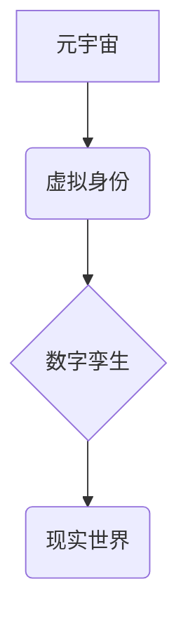

                 

## 元宇宙中的身份认同:虚实自我的融合

> 关键词：元宇宙、身份认同、虚拟现实、增强现实、区块链、数字孪生、人工智能、隐私保护、伦理问题

## 1. 背景介绍

元宇宙的概念近年来备受关注，它被描述为一个由虚拟现实 (VR)、增强现实 (AR) 和互联网连接的沉浸式数字世界。在这个世界里，人们可以创建虚拟形象，与他人互动，参与各种活动，甚至拥有虚拟财产。元宇宙的出现为我们提供了全新的体验和可能性，但也引发了许多关于身份认同的深刻思考。

传统社会中，我们的身份认同主要建立在现实世界中，通过姓名、职业、家庭关系等要素来定义。然而，在元宇宙中，身份认同将更加多元化和灵活。人们可以创造出与现实身份不同的虚拟形象，探索不同的角色和身份，甚至可以拥有多个虚拟身份。这种虚实融合的特性将对我们的认知、行为和社会关系产生深远影响。

## 2. 核心概念与联系

**2.1 核心概念**

* **元宇宙 (Metaverse):** 一个由虚拟现实、增强现实和互联网连接的沉浸式数字世界，用户可以在其中创建虚拟形象，与他人互动，参与各种活动。
* **身份认同 (Identity):**  指个体对自身认知和社会定位的理解和表达，包括个人特征、社会角色、价值观等方面。
* **虚拟身份 (Virtual Identity):** 在元宇宙中创建的虚拟形象，可以与现实身份不同，拥有不同的特征、角色和属性。
* **数字孪生 (Digital Twin):**  一个与现实世界物体或系统完全对应的虚拟模型，可以实时反映现实世界的状态和变化。

**2.2 核心概念联系**

在元宇宙中，虚拟身份与数字孪生密切相关。数字孪生可以为虚拟身份提供基础数据和交互体验，而虚拟身份则可以赋予数字孪生更丰富的个性和功能。



## 3. 核心算法原理 & 具体操作步骤

**3.1 算法原理概述**

元宇宙中身份认同的实现需要结合多种算法和技术，包括：

* **人脸识别和生物特征识别:** 用于验证用户身份，确保虚拟身份的唯一性。
* **自然语言处理 (NLP):** 用于理解用户意图，构建更自然的虚拟身份交互体验。
* **机器学习 (ML):** 用于个性化虚拟身份，根据用户行为和喜好不断调整虚拟形象和属性。
* **区块链技术:** 用于保障虚拟身份的安全性、不可篡改性和可追溯性。

**3.2 算法步骤详解**

1. **用户注册:** 用户通过人脸识别或其他生物特征识别方式验证身份，并创建虚拟形象。
2. **虚拟身份构建:** 用户可以根据自己的喜好选择虚拟形象的特征、服装、道具等，并赋予虚拟身份不同的个性和属性。
3. **身份验证:** 用户在元宇宙中进行各种活动时，需要通过身份验证机制来确保其身份的合法性。
4. **身份管理:** 用户可以随时修改和更新虚拟身份的特征和属性，并管理自己的虚拟财产和社交关系。
5. **身份保护:** 元宇宙平台需要采用安全措施来保护用户的虚拟身份信息，防止身份盗用和数据泄露。

**3.3 算法优缺点**

* **优点:** 
    * 提供更丰富的身份表达方式，满足用户个性化需求。
    * 增强用户在元宇宙中的沉浸感和参与度。
    * 为虚拟经济和社会发展提供基础设施。
* **缺点:** 
    * 存在身份盗用和虚假身份的风险。
    * 虚拟身份与现实身份的界限可能变得模糊，引发伦理问题。
    * 需要强大的技术支持和安全保障措施。

**3.4 算法应用领域**

* **游戏和娱乐:** 创建更具沉浸性和互动性的游戏体验。
* **社交和社区:** 建立虚拟社交平台，连接不同地域和文化背景的用户。
* **教育和培训:** 提供沉浸式学习环境，增强学习效果。
* **商业和营销:** 打造虚拟购物和体验中心，提升用户参与度。

## 4. 数学模型和公式 & 详细讲解 & 举例说明

**4.1 数学模型构建**

我们可以用一个简单的数学模型来描述虚拟身份的构建过程。假设虚拟身份由多个属性组成，每个属性可以用一个数值来表示，例如：

* 年龄：$A$
* 性别：$B$ (0:男性，1:女性)
* 外貌特征：$C$ (例如身高、体重、肤色等)
* 个性特征：$D$ (例如性格、爱好等)

那么，虚拟身份可以表示为一个向量：

$V = (A, B, C, D)$

**4.2 公式推导过程**

我们可以根据用户的喜好和需求，对每个属性进行调整，从而构建出不同的虚拟身份。例如，用户可以设定自己的年龄、性别、外貌特征，也可以选择不同的个性特征来塑造虚拟形象。

**4.3 案例分析与讲解**

假设用户想要创建一个虚拟身份，其属性设定如下：

* 年龄：$A = 25$
* 性别：$B = 0$
* 外貌特征：$C = (1.75, 65, 0.8)$ (身高、体重、肤色)
* 个性特征：$D = (0.8, 0.5, 0.2)$ (开朗、理性、谨慎)

那么，该用户的虚拟身份向量可以表示为：

$V = (25, 0, (1.75, 65, 0.8), (0.8, 0.5, 0.2))$

## 5. 项目实践：代码实例和详细解释说明

**5.1 开发环境搭建**

* 操作系统：Windows/macOS/Linux
* 编程语言：Python
* 框架：Unity/Unreal Engine
* 虚拟现实头显：Oculus Rift/HTC Vive

**5.2 源代码详细实现**

```python
# 虚拟身份类
class VirtualIdentity:
    def __init__(self, age, gender, appearance, personality):
        self.age = age
        self.gender = gender
        self.appearance = appearance
        self.personality = personality

    def display_info(self):
        print(f"年龄: {self.age}")
        print(f"性别: {self.gender}")
        print(f"外貌特征: {self.appearance}")
        print(f"个性特征: {self.personality}")

# 创建虚拟身份实例
my_identity = VirtualIdentity(25, 0, (1.75, 65, 0.8), (0.8, 0.5, 0.2))

# 显示虚拟身份信息
my_identity.display_info()
```

**5.3 代码解读与分析**

* `VirtualIdentity` 类定义了虚拟身份的基本属性，包括年龄、性别、外貌特征和个性特征。
* `__init__` 方法用于初始化虚拟身份对象，并设置其属性值。
* `display_info` 方法用于打印虚拟身份的信息。
* 代码示例演示了如何创建虚拟身份对象并显示其属性信息。

**5.4 运行结果展示**

运行上述代码将输出虚拟身份的信息：

```
年龄: 25
性别: 0
外貌特征: (1.75, 65, 0.8)
个性特征: (0.8, 0.5, 0.2)
```

## 6. 实际应用场景

**6.1 游戏和娱乐**

在元宇宙游戏中，玩家可以创建个性化的虚拟形象，并根据自己的喜好选择不同的角色和技能。虚拟身份可以与玩家的现实性格和兴趣爱好相结合，提供更沉浸性和互动性的游戏体验。

**6.2 社交和社区**

元宇宙平台可以提供虚拟社交空间，让用户创建虚拟形象，与他人互动交流。虚拟身份可以帮助用户打破现实世界的限制，建立新的社交关系，并探索不同的身份和角色。

**6.3 教育和培训**

虚拟身份可以用于教育和培训领域，例如模拟真实场景进行培训，或创建虚拟角色进行互动学习。虚拟身份可以帮助用户更好地理解和掌握知识，并提高学习效率。

**6.4 未来应用展望**

随着元宇宙技术的不断发展，虚拟身份将应用于更多领域，例如虚拟商务、虚拟医疗、虚拟艺术等。虚拟身份将成为我们与数字世界交互的重要方式，并对我们的生活、工作和社会关系产生深远影响。

## 7. 工具和资源推荐

**7.1 学习资源推荐**

* **书籍:**
    * 《元宇宙：虚拟世界与现实的融合》
    * 《数字孪生：构建未来》
* **在线课程:**
    * Coursera: 元宇宙与虚拟现实
    * edX: 数字孪生技术

**7.2 开发工具推荐**

* **Unity:** 游戏引擎
* **Unreal Engine:** 游戏引擎
* **Blender:** 3D建模软件
* **A-Frame:** WebVR开发框架

**7.3 相关论文推荐**

* 《元宇宙：概念、技术和应用》
* 《数字身份在元宇宙中的挑战和机遇》

## 8. 总结：未来发展趋势与挑战

**8.1 研究成果总结**

元宇宙中的身份认同是一个复杂而充满挑战的领域，但近年来取得了显著进展。从算法原理到代码实现，从理论研究到实际应用，我们已经积累了丰富的经验和成果。

**8.2 未来发展趋势**

* **更个性化和沉浸式的虚拟身份:** 随着人工智能和机器学习技术的进步，虚拟身份将更加个性化和智能化，能够更好地反映用户的真实需求和意图。
* **虚拟身份与现实身份的融合:** 元宇宙将与现实世界更加紧密地融合，虚拟身份将成为现实身份的重要补充和延伸。
* **虚拟身份的经济价值:** 虚拟身份将拥有越来越高的经济价值，例如虚拟财产、虚拟服务等。

**8.3 面临的挑战**

* **隐私保护:** 元宇宙中的虚拟身份信息需要得到有效保护，防止泄露和滥用。
* **身份安全:** 虚拟身份需要防止盗用和欺诈，确保其合法性和安全性。
* **伦理问题:** 虚拟身份的过度发展可能会引发伦理问题，例如虚拟身份与现实身份的界限模糊、虚拟身份的价值观冲突等。

**8.4 研究展望**

未来，我们需要继续深入研究元宇宙中的身份认同问题，探索更安全、更可靠、更具伦理性的解决方案。同时，还需要加强与社会各界的合作，共同构建一个更加和谐、可持续的元宇宙世界。

## 9. 附录：常见问题与解答

**9.1 如何保护我的虚拟身份信息？**

* 使用强密码并定期更换密码。
* 启用双重身份验证。
* 谨慎分享个人信息。
* 注意网络安全风险。

**9.2 虚拟身份可以被盗用吗？**

是的，虚拟身份可以被盗用。攻击者可以通过各种手段获取用户的身份信息，例如网络钓鱼、恶意软件等。因此，我们需要采取措施保护自己的虚拟身份信息。

**9.3 虚拟身份与现实身份有什么区别？**

虚拟身份是在元宇宙中创建的虚拟形象，可以与现实身份不同，拥有不同的特征、角色和属性。现实身份是指个体在现实世界中的身份，由姓名、职业、家庭关系等要素定义。

**9.4 元宇宙中的身份认同会对社会产生什么影响？**

元宇宙中的身份认同将对社会产生深远影响，例如改变我们的社交方式、工作方式、娱乐方式等。同时，也可能引发一些伦理问题，需要我们认真思考和应对。


作者：禅与计算机程序设计艺术 / Zen and the Art of Computer Programming 
<end_of_turn>

