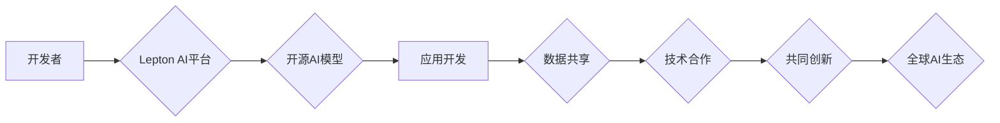

                 

## 全球AI伙伴生态：Lepton AI的战略合作

> 关键词：人工智能、生态系统、战略合作、Lepton AI、开源、可扩展性、协同创新、全球化

## 1. 背景介绍

人工智能（AI）正以惊人的速度发展，其影响力正在渗透到各个行业和领域。从医疗保健到金融，从制造业到娱乐，AI正在改变着我们生活的方方面面。然而，AI技术的快速发展也带来了新的挑战，例如数据孤岛、算法可解释性、伦理问题等。

为了应对这些挑战，构建一个开放、协作、可扩展的全球AI伙伴生态系统显得尤为重要。这种生态系统将汇集来自不同领域的专家、学者、企业和开发者，共同推动AI技术的进步和应用。

Lepton AI作为一家致力于推动AI开源和可持续发展的公司，积极倡导构建全球AI伙伴生态。Lepton AI相信，只有通过合作共赢，才能真正释放AI技术的巨大潜力，造福人类社会。

## 2. 核心概念与联系

Lepton AI的全球AI伙伴生态系统基于以下核心概念：

* **开源共享：** Lepton AI致力于开源其核心AI技术和平台，鼓励开发者和研究者共同参与开发和改进。
* **协同创新：** Lepton AI鼓励合作伙伴之间进行知识共享、资源整合和技术合作，共同解决AI领域的挑战。
* **可扩展性：** Lepton AI的生态系统设计灵活可扩展，能够适应不同规模和类型的合作伙伴，并支持多种应用场景。
* **全球化：** Lepton AI致力于构建一个覆盖全球的AI伙伴生态系统，汇聚来自世界各地的智慧和力量。

**Mermaid 流程图**

## 3. 核心算法原理 & 具体操作步骤

Lepton AI的核心算法原理基于深度学习，并结合了最新的研究成果，例如Transformer模型、强化学习等。

### 3.1  算法原理概述

Lepton AI的核心算法主要包括以下几个方面：

* **深度神经网络：** Lepton AI使用多层神经网络结构，能够学习复杂的特征表示。
* **卷积神经网络（CNN）：** 用于处理图像和视频数据，能够提取图像中的特征。
* **循环神经网络（RNN）：** 用于处理序列数据，例如文本和语音，能够捕捉序列中的依赖关系。
* **Transformer模型：** 用于处理自然语言处理任务，能够更好地理解上下文信息。
* **强化学习：** 用于训练智能体，使其能够在环境中学习和决策。

### 3.2  算法步骤详解

Lepton AI的算法训练过程通常包括以下步骤：

1. **数据预处理：** 将原始数据进行清洗、转换和格式化，使其适合模型训练。
2. **模型构建：** 根据具体任务选择合适的模型架构，并设置模型参数。
3. **模型训练：** 使用训练数据训练模型，并通过反向传播算法调整模型参数，使其能够准确地预测目标输出。
4. **模型评估：** 使用测试数据评估模型的性能，并根据评估结果进行模型调优。
5. **模型部署：** 将训练好的模型部署到实际应用场景中，用于进行预测或决策。

### 3.3  算法优缺点

Lepton AI的核心算法具有以下优点：

* **高精度：** 深度学习算法能够学习复杂的特征表示，从而实现高精度的预测和识别。
* **可扩展性：** 深度学习算法能够处理海量数据，并可以根据需要进行模型扩展。
* **通用性：** 深度学习算法可以应用于多种不同的任务，例如图像识别、自然语言处理、语音识别等。

然而，Lepton AI的核心算法也存在一些缺点：

* **数据依赖性：** 深度学习算法需要大量的训练数据才能达到较高的精度。
* **计算资源消耗：** 训练深度学习模型需要大量的计算资源，例如GPU。
* **可解释性：** 深度学习模型的决策过程比较复杂，难以解释其背后的逻辑。

### 3.4  算法应用领域

Lepton AI的核心算法已应用于多个领域，例如：

* **医疗保健：** 疾病诊断、药物研发、医疗影像分析。
* **金融：** 风险评估、欺诈检测、投资决策。
* **制造业：** 质量控制、预测维护、智能制造。
* **零售：** 商品推荐、个性化营销、库存管理。

## 4. 数学模型和公式 & 详细讲解 & 举例说明

Lepton AI的核心算法基于以下数学模型和公式：

### 4.1  数学模型构建

Lepton AI的核心算法主要基于神经网络模型，其数学模型可以表示为一个多层感知机（MLP）。MLP由多个神经元层组成，每个神经元接收来自上一层的输入信号，并通过激活函数进行处理，输出到下一层。

### 4.2  公式推导过程

MLP的输出可以表示为：

$$
y = f(W^L x^L + b^L)
$$

其中：

* $y$ 是模型的输出
* $f$ 是激活函数
* $W^L$ 是第L层的权重矩阵
* $x^L$ 是第L层的输入向量
* $b^L$ 是第L层的偏置向量

通过反向传播算法，可以更新权重矩阵和偏置向量，使得模型的输出与实际输出之间的误差最小化。

### 4.3  案例分析与讲解

例如，在图像分类任务中，Lepton AI可以使用CNN模型来提取图像特征。CNN模型的卷积层和池化层可以学习图像中的局部特征，而全连接层可以将这些特征进行组合，最终输出图像类别。

## 5. 项目实践：代码实例和详细解释说明

Lepton AI提供了一系列开源工具和平台，方便开发者进行AI项目实践。

### 5.1  开发环境搭建

Lepton AI支持多种开发环境，例如Python、C++、Java等。开发者可以根据自己的需求选择合适的开发环境进行搭建。

### 5.2  源代码详细实现

Lepton AI的源代码托管在GitHub平台上，开发者可以自由下载和修改。Lepton AI还提供了一系列示例代码，方便开发者快速上手。

### 5.3  代码解读与分析

Lepton AI的代码结构清晰，注释详细，方便开发者理解和维护。Lepton AI还提供了一系列文档和教程，帮助开发者深入理解代码实现原理。

### 5.4  运行结果展示

Lepton AI的开源平台提供了多种工具和接口，方便开发者进行模型训练、评估和部署。开发者可以根据自己的需求选择合适的工具和接口，进行项目实践。

## 6. 实际应用场景

Lepton AI的AI技术已应用于多个实际场景，例如：

### 6.1  医疗诊断

Lepton AI的AI模型可以帮助医生进行疾病诊断，例如癌症检测、心血管疾病预测等。

### 6.2  金融风险评估

Lepton AI的AI模型可以帮助金融机构进行风险评估，例如信用评分、欺诈检测等。

### 6.3  智能客服

Lepton AI的AI模型可以帮助企业构建智能客服系统，例如聊天机器人、语音助手等。

### 6.4  未来应用展望

Lepton AI相信，AI技术将继续在各个领域发挥越来越重要的作用。未来，Lepton AI将继续致力于推动AI技术的进步和应用，为人类社会创造更多价值。

## 7. 工具和资源推荐

### 7.1  学习资源推荐

* Lepton AI官方文档：https://docs.lepton.ai/
* Lepton AI GitHub仓库：https://github.com/LeptonAI
* AI学习平台：Coursera、edX、Udacity等

### 7.2  开发工具推荐

* Python：https://www.python.org/
* TensorFlow：https://www.tensorflow.org/
* PyTorch：https://pytorch.org/

### 7.3  相关论文推荐

* Attention Is All You Need：https://arxiv.org/abs/1706.03762
* Deep Learning：https://www.deeplearningbook.org/

## 8. 总结：未来发展趋势与挑战

### 8.1  研究成果总结

Lepton AI在AI领域取得了一系列重要成果，例如开源了高效的AI模型和平台，并将其应用于多个实际场景。Lepton AI的开源策略和全球化战略，为AI技术的普及和发展做出了重要贡献。

### 8.2  未来发展趋势

Lepton AI将继续致力于以下几个方面：

* **提升模型性能：** Lepton AI将继续研究和开发更先进的AI算法，提升模型的精度、效率和鲁棒性。
* **拓展应用场景：** Lepton AI将继续将AI技术应用于更多领域，例如自动驾驶、机器人、个性化教育等。
* **加强生态建设：** Lepton AI将继续积极构建全球AI伙伴生态，汇聚来自世界各地的智慧和力量，共同推动AI技术的进步和应用。

### 8.3  面临的挑战

Lepton AI也面临着一些挑战：

* **数据安全和隐私保护：** AI模型的训练需要大量数据，如何确保数据安全和隐私保护是一个重要的挑战。
* **算法可解释性和公平性：** AI模型的决策过程比较复杂，难以解释其背后的逻辑，如何保证算法的公平性和可解释性是一个重要的研究方向。
* **人才短缺：** AI领域人才需求量大，如何培养更多AI人才是一个重要的课题。

### 8.4  研究展望

Lepton AI相信，通过不断努力，可以克服这些挑战，推动AI技术的发展，造福人类社会。Lepton AI将继续致力于成为全球领先的AI技术提供商，为世界带来更多创新和价值。

## 9. 附录：常见问题与解答

### 9.1  Q1：Lepton AI的AI技术开源吗？

A1：是的，Lepton AI致力于开源其核心AI技术和平台，方便开发者进行学习和应用。

### 9.2  Q2：Lepton AI支持哪些开发环境？

A2：Lepton AI支持多种开发环境，例如Python、C++、Java等。

### 9.3  Q3：Lepton AI的AI模型可以应用于哪些领域？

A3：Lepton AI的AI模型已应用于多个领域，例如医疗诊断、金融风险评估、智能客服等。

### 9.4  Q4：Lepton AI如何保证数据安全和隐私保护？

A4：Lepton AI采用多种安全措施来保护用户数据，例如数据加密、访问控制等。

### 9.5  Q5：Lepton AI如何解决算法可解释性和公平性问题？

A5：Lepton AI正在积极研究和开发可解释的AI算法，并致力于构建公平、透明的AI系统。

作者：禅与计算机程序设计艺术 / Zen and the Art of Computer Programming 
<end_of_turn>

