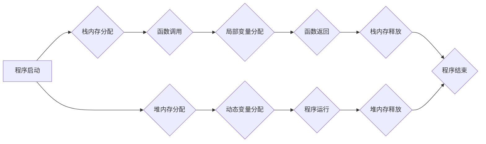

                 

## 内存管理：C/C++中的内存优化技巧

> 关键词：内存管理、C/C++、堆内存、栈内存、动态内存分配、内存泄漏、内存碎片、内存优化、性能调优

## 1. 背景介绍

在现代软件开发中，内存管理是至关重要的环节，它直接影响着程序的性能、稳定性和安全性。C/C++ 作为两种强大的编程语言，提供了灵活的内存管理机制，但也带来了更高的责任和复杂性。

C/C++ 中的内存管理主要分为堆内存和栈内存两种。栈内存是程序运行时自动分配和释放的，其特点是速度快、安全可靠，但容量有限。堆内存则需要程序员手动分配和释放，其特点是容量灵活，但容易出现内存泄漏和碎片化等问题。

内存泄漏是指程序在运行过程中分配了内存，但没有及时释放，导致内存资源不断占用，最终导致程序崩溃或系统资源耗尽。内存碎片是指堆内存中出现许多大小不一的空闲块，无法满足程序对连续内存块的需求，导致程序性能下降。

因此，掌握 C/C++ 中的内存管理技巧，能够有效避免内存泄漏和碎片化，提高程序的性能和稳定性。

## 2. 核心概念与联系

### 2.1 堆内存和栈内存

* **栈内存**：
    * 按照 LIFO（后进先出）原则分配和释放内存。
    * 存储函数局部变量、参数和返回值等。
    * 栈内存分配和释放速度快，安全可靠。
    * 容量有限，通常由编译器自动管理。
* **堆内存**：
    * 按照需要分配和释放内存。
    * 存储动态分配的变量和数据结构。
    * 堆内存分配和释放速度相对较慢，需要程序员手动管理。
    * 容量灵活，可以根据程序需求动态分配。



### 2.2 内存分配和释放

* **malloc()**: 从堆内存中分配一块连续的内存块，并返回指向该块的指针。
* **calloc()**: 从堆内存中分配一块连续的内存块，并将其初始化为零，返回指向该块的指针。
* **realloc()**: 修改已分配的内存块的大小，并返回指向新内存块的指针。
* **free()**: 释放堆内存中分配的内存块。

## 3. 核心算法原理 & 具体操作步骤

### 3.1 算法原理概述

内存管理算法的核心是高效地分配和释放内存块，以满足程序的内存需求，同时避免内存泄漏和碎片化。常见的内存管理算法包括：

* **分段式内存管理**: 将内存划分为多个固定大小的段，每个段都包含一个段表，用于记录段的可用状态。
* **分页式内存管理**: 将内存划分为多个固定大小的页，每个页都包含一个页表，用于记录页的可用状态。
* **块式内存管理**: 将内存划分为多个可变大小的块，每个块都包含一个块表，用于记录块的可用状态。

### 3.2 算法步骤详解

以块式内存管理为例，其具体操作步骤如下：

1. **初始化**: 创建一个空闲块表，用于记录所有空闲块的信息。
2. **分配**: 当程序需要分配内存块时，算法会遍历空闲块表，找到一个满足需求的空闲块。
3. **释放**: 当程序释放内存块时，算法会将该块标记为空闲，并将其添加到空闲块表中。

### 3.3 算法优缺点

* **分段式内存管理**:
    * 优点: 简单易实现，适合小型系统。
    * 缺点: 内存碎片化严重，效率低。
* **分页式内存管理**:
    * 优点: 内存碎片化较少，效率较高。
    * 缺点: 复杂度较高，需要额外的页表管理。
* **块式内存管理**:
    * 优点: 灵活度高，可以根据需求分配不同大小的内存块。
    * 缺点: 内存碎片化问题仍然存在。

### 3.4 算法应用领域

不同的内存管理算法适用于不同的应用场景。例如，

* **嵌入式系统**: 通常采用分段式内存管理，因为其简单易实现，适合资源受限的系统。
* **大型服务器**: 通常采用分页式内存管理，因为其效率较高，可以更好地管理大量内存。
* **通用应用程序**: 通常采用块式内存管理，因为其灵活度高，可以根据程序需求分配不同大小的内存块。

## 4. 数学模型和公式 & 详细讲解 & 举例说明

### 4.1 数学模型构建

内存管理算法可以抽象为一个数学模型，其中：

* **M**: 表示总内存大小。
* **A**: 表示已分配的内存大小。
* **F**: 表示空闲的内存大小。

则有以下关系式：

$$M = A + F$$

### 4.2 公式推导过程

* **内存碎片化率**:

$$碎片化率 = \frac{F}{M}$$

* **内存利用率**:

$$利用率 = \frac{A}{M}$$

### 4.3 案例分析与讲解

假设总内存大小为 1024 MB，已分配内存大小为 768 MB，则：

* 空闲内存大小为 1024 - 768 = 256 MB。
* 内存碎片化率为 256 / 1024 = 0.25 或 25%。
* 内存利用率为 768 / 1024 = 0.75 或 75%。

## 5. 项目实践：代码实例和详细解释说明

### 5.1 开发环境搭建

* 操作系统: Linux/macOS/Windows
* 编译器: GCC/Clang
* IDE: Visual Studio Code/Eclipse/CLion

### 5.2 源代码详细实现

```c++
#include <iostream>
#include <cstdlib>

// 定义一个空闲块结构体
struct Block {
    size_t size;
    Block* next;
};

// 创建一个空闲块表
Block* freeList = nullptr;

// 分配内存块
void* malloc(size_t size) {
    // 遍历空闲块表，找到一个满足需求的空闲块
    Block* current = freeList;
    while (current != nullptr) {
        if (current->size >= size) {
            // 如果找到一个满足需求的空闲块，则将其从空闲块表中移除
            Block* next = current->next;
            current->size -= size;
            // 如果剩余空间大于0，则将其添加到空闲块表中
            if (current->size > 0) {
                current->next = next;
            } else {
                freeList = next;
            }
            return (void*)current;
        }
        current = current->next;
    }
    // 如果没有找到一个满足需求的空闲块，则分配一个新的内存块
    Block* newBlock = (Block*)malloc(sizeof(Block) + size);
    newBlock->size = size;
    newBlock->next = freeList;
    freeList = newBlock;
    return (void*)(newBlock + 1);
}

// 释放内存块
void free(void* ptr) {
    // 将内存块添加到空闲块表中
    Block* block = (Block*)ptr - 1;
    block->next = freeList;
    freeList = block;
}

int main() {
    // 分配一个 100 字节的内存块
    int* ptr = (int*)malloc(100);
    // 使用内存块
    *ptr = 10;
    // 释放内存块
    free(ptr);
    return 0;
}
```

### 5.3 代码解读与分析

* `malloc()` 函数负责分配内存块，它会遍历空闲块表，找到一个满足需求的空闲块，并将其从空闲块表中移除。如果找不到一个满足需求的空闲块，则会分配一个新的内存块。
* `free()` 函数负责释放内存块，它会将内存块添加到空闲块表中。

### 5.4 运行结果展示

程序运行后，会分配一个 100 字节的内存块，并将该块的地址存储在 `ptr` 变量中。然后，程序会使用该内存块，并将值 10 存储到该内存块中。最后，程序会释放该内存块。

## 6. 实际应用场景

### 6.1 游戏开发

游戏开发需要频繁分配和释放内存，以处理游戏场景、角色、物体等数据。

### 6.2 图像处理

图像处理需要处理大量图像数据，需要高效的内存管理机制来分配和释放内存。

### 6.3 数据分析

数据分析需要处理大量数据，需要高效的内存管理机制来分配和释放内存。

### 6.4 未来应用展望

随着人工智能、大数据等技术的快速发展，对内存管理的需求将更加迫切。未来，内存管理技术将更加智能化、高效化，能够更好地满足程序的内存需求。

## 7. 工具和资源推荐

### 7.1 学习资源推荐

* **书籍**:
    * 《深入理解C++》
    * 《C++ Primer》
    * 《Effective C++》
* **网站**:
    * cppreference.com
    * cplusplus.com

### 7.2 开发工具推荐

* **调试器**: GDB/LLDB
* **内存分析工具**: Valgrind/AddressSanitizer

### 7.3 相关论文推荐

* **Memory Management Techniques for Modern Operating Systems**
* **A Survey of Memory Management Algorithms**

## 8. 总结：未来发展趋势与挑战

### 8.1 研究成果总结

近年来，内存管理技术取得了显著的进展，例如：

* **动态内存分配算法**: 出现了许多新的动态内存分配算法，例如：Buddy System、Free List、Binomial Heap等，这些算法能够更加高效地分配和释放内存。
* **内存碎片化解决技术**: 出现了许多新的内存碎片化解决技术，例如：Compaction、Memory Reclamation等，这些技术能够有效减少内存碎片化，提高内存利用率。

### 8.2 未来发展趋势

* **智能内存管理**: 未来，内存管理将更加智能化，能够根据程序的运行情况动态调整内存分配策略，提高内存利用率。
* **分布式内存管理**: 随着云计算和大数据等技术的快速发展，分布式内存管理将成为未来内存管理的重要趋势。
* **内存安全**: 随着程序复杂度的增加，内存安全问题越来越突出，未来内存管理技术将更加注重内存安全。

### 8.3 面临的挑战

* **内存泄漏**: 内存泄漏仍然是程序开发中一个常见的问题，需要开发更有效的内存泄漏检测和修复工具。
* **内存碎片化**: 内存碎片化仍然是一个需要解决的问题，需要开发更有效的内存碎片化解决技术。
* **内存安全**: 随着程序复杂度的增加，内存安全问题越来越突出，需要开发更有效的内存安全机制。

### 8.4 研究展望

未来，内存管理技术将继续朝着智能化、高效化、安全化的方向发展，为程序开发提供更强大的支持。


## 9. 附录：常见问题与解答

### 9.1 什么是内存泄漏？

内存泄漏是指程序在运行过程中分配了内存，但没有及时释放，导致内存资源不断占用，最终导致程序崩溃或系统资源耗尽。

### 9.2 如何避免内存泄漏？

* **及时释放内存**: 在不再需要使用内存时，及时使用 `free()` 函数释放内存。
* **使用智能指针**: 智能指针可以自动释放内存，避免内存泄漏。
* **使用内存泄漏检测工具**: 使用 Valgrind 或 AddressSanitizer 等内存泄漏检测工具，可以帮助发现内存泄漏问题。

### 9.3 什么是内存碎片化？

内存碎片化是指堆内存中出现许多大小不一的空闲块，无法满足程序对连续内存块的需求，导致程序性能下降。

### 9.4 如何解决内存碎片化？

* **使用内存碎片化解决技术**: 使用 Compaction 或 Memory Reclamation 等内存碎片化解决技术，可以有效减少内存碎片化。
* **合理分配内存**: 尽量分配连续的内存块，避免产生大量的碎片。


作者：禅与计算机程序设计艺术 / Zen and the Art of Computer Programming 
<end_of_turn>

