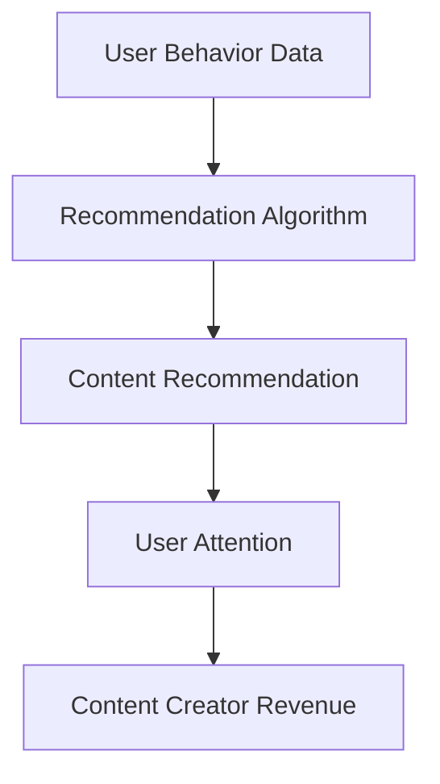

                 

**关键词：**注意力经济、内容创作、算法推荐、用户行为分析、注意力机制、内容策略

## 1. 背景介绍

在当今信息爆炸的数字时代，内容创作已然成为一种重要的职业选择。然而，随着互联网平台的繁荣，内容创作者面临着前所未有的挑战：如何在注意力经济中生存下去？注意力经济是指在信息过载的情况下，用户有限的注意力资源成为了稀缺资源，内容创作者必须竞争用户的注意力以获取收益。本文将深入探讨内容创作者在注意力经济中的生存之道，重点关注算法推荐系统、用户行为分析、注意力机制，并提供实践建议和工具推荐。

## 2. 核心概念与联系

### 2.1 注意力经济原理

注意力经济的核心是用户有限的注意力资源。内容创作者需要竞争用户的注意力，以获取收益。收益可以是金钱、流量、品牌曝光等。用户的注意力资源受到多种因素的影响，包括内容质量、内容与用户兴趣的匹配度、用户的情感状态等。

### 2.2 算法推荐系统的作用

算法推荐系统是注意力经济的核心组成部分。它根据用户的历史行为和兴趣，向用户推荐相关内容。算法推荐系统的好坏直接影响内容创作者获取用户注意力的难易程度。 Understanding the working principles of recommendation algorithms is crucial for content creators to optimize their content strategy.



### 2.3 注意力机制

注意力机制是指用户在选择内容时的注意力分配过程。用户会根据内容的质量、与兴趣的匹配度等因素，选择性地关注某些内容。内容创作者需要理解用户的注意力机制，以创作出更有吸引力的内容。

## 3. 核心算法原理 & 具体操作步骤

### 3.1 算法原理概述

算法推荐系统的原理主要基于协同过滤、内容过滤、基于用户的过滤和基于物品的过滤等技术。其中，协同过滤是最常用的技术，它根据用户的历史行为和兴趣，向用户推荐相关内容。

### 3.2 算法步骤详解

1. **数据收集：**收集用户的历史行为数据，如点击、浏览、喜欢等。
2. **特征提取：**提取用户行为数据中的特征，如用户兴趣、内容特征等。
3. **模型训练：**使用机器学习算法，如协同过滤、内容过滤等，训练推荐模型。
4. **内容推荐：**使用训练好的模型，向用户推荐相关内容。

### 3.3 算法优缺点

**优点：**

* 个性化推荐：算法推荐系统可以根据用户的兴趣和行为，提供个性化的内容推荐。
* 发现新内容：算法推荐系统可以帮助用户发现新的、与其兴趣相关的内容。

**缺点：**

* 过度个性化：算法推荐系统可能会导致“过滤气泡”现象，用户只接触到与其兴趣相关的内容，无法接触到新的、不同的内容。
* 数据依赖：算法推荐系统的性能严重依赖于用户行为数据的质量和量级。

### 3.4 算法应用领域

算法推荐系统广泛应用于各种互联网平台，如社交媒体、视频平台、电子商务平台等。内容创作者需要理解这些平台的推荐算法，以优化其内容策略。

## 4. 数学模型和公式 & 详细讲解 & 举例说明

### 4.1 数学模型构建

数学模型是理解算法推荐系统的关键。常用的数学模型包括：

* **用户-物品矩阵：**用户-物品矩阵是一种简单的数学模型，它表示用户对物品的喜好程度。矩阵的行表示用户，列表示物品，矩阵的元素表示用户对物品的喜好程度。

$$U = \begin{bmatrix} u_{11} & u_{12} & \cdots & u_{1m} \\ u_{21} & u_{22} & \cdots & u_{2m} \\ \vdots & \vdots & \ddots & \vdots \\ u_{n1} & u_{n2} & \cdots & u_{nm} \end{bmatrix}$$

* **协同过滤模型：**协同过滤模型是一种基于用户-物品矩阵的推荐模型。它假设如果用户A和用户B对某些物品的喜好程度相似，那么他们对其他物品的喜好程度也可能相似。

### 4.2 公式推导过程

协同过滤模型的推荐过程可以表示为：

1. 计算用户A和用户B对某些物品的喜好程度的相似度：

$$sim(A, B) = \frac{\sum_{i=1}^{m} (u_{Ai} - \bar{u}_A)(u_{Bi} - \bar{u}_B)}{\sqrt{\sum_{i=1}^{m} (u_{Ai} - \bar{u}_A)^2} \sqrt{\sum_{i=1}^{m} (u_{Bi} - \bar{u}_B)^2}}$$

其中，$u_{Ai}$表示用户A对物品i的喜好程度，$u_{Bi}$表示用户B对物品i的喜好程度，$\bar{u}_A$和$\bar{u}_B$分别是用户A和用户B对所有物品的平均喜好程度。

2. 根据相似度，推荐用户A可能喜欢的物品：

$$P(A, i) = \frac{\sum_{B \in N(A)} sim(A, B) \cdot u_{Bi}}{\sum_{B \in N(A)} |sim(A, B)|}$$

其中，$P(A, i)$表示用户A对物品i的推荐喜好程度，$N(A)$表示用户A的邻居集，即与用户A相似度高的用户集。

### 4.3 案例分析与讲解

假设我们有以下用户-物品矩阵：

$$U = \begin{bmatrix} 5 & 4 & 3 & 2 \\ 4 & 5 & 4 & 3 \\ 3 & 4 & 5 & 4 \\ 2 & 3 & 4 & 5 \end{bmatrix}$$

其中，每行表示一个用户，每列表示一个物品，矩阵元素表示用户对物品的喜好程度（分值从1到5）。

如果我们想推荐用户1可能喜欢的物品，我们可以计算用户1和其他用户的相似度，并根据相似度推荐物品。例如，用户1和用户2的相似度为：

$$sim(1, 2) = \frac{\sum_{i=1}^{4} (u_{1i} - \bar{u}_1)(u_{2i} - \bar{u}_2)}{\sqrt{\sum_{i=1}^{4} (u_{1i} - \bar{u}_1)^2} \sqrt{\sum_{i=1}^{4} (u_{2i} - \bar{u}_2)^2}} = \frac{1}{\sqrt{2}}$$

根据相似度，我们可以推荐用户1可能喜欢的物品：

$$P(1, i) = \frac{\sum_{B \in N(1)} sim(1, B) \cdot u_{Bi}}{\sum_{B \in N(1)} |sim(1, B)|} = \frac{1}{2}(4 + 5) = 4.5$$

## 5. 项目实践：代码实例和详细解释说明

### 5.1 开发环境搭建

要实现一个简单的协同过滤推荐系统，我们需要以下开发环境：

* Python 3.7+
* NumPy
* Pandas
* Scikit-learn

### 5.2 源代码详细实现

以下是一个简单的协同过滤推荐系统的Python实现：

```python
import numpy as np
import pandas as pd
from sklearn.metrics.pairwise import cosine_similarity

# 用户-物品矩阵
U = np.array([[5, 4, 3, 2],
              [4, 5, 4, 3],
              [3, 4, 5, 4],
              [2, 3, 4, 5]])

# 计算用户-用户相似度矩阵
user_sim = cosine_similarity(U)

# 定义推荐函数
def recommend(user_id, user_sim, U):
    # 获取用户的邻居集
    neighbors = np.argsort(user_sim[user_id])[::-1][1:]

    # 计算推荐喜好程度
    P = np.zeros(U.shape[1])
    for neighbor in neighbors:
        P += user_sim[user_id, neighbor] * U[neighbor]

    # 规范化推荐喜好程度
    P /= np.sum(P)

    return P

# 推荐用户1可能喜欢的物品
P = recommend(0, user_sim, U)
print(P)
```

### 5.3 代码解读与分析

* 我们首先导入所需的库，并定义用户-物品矩阵。
* 我们使用余弦相似度计算用户-用户相似度矩阵。余弦相似度是一种常用的相似度度量方法，它计算两个向量（在本例中，两个用户的喜好向量）之间的夹角余弦值。
* 推荐函数首先获取用户的邻居集，即与该用户相似度高的用户集。然后，它计算推荐喜好程度，即根据邻居集的喜好程度，推荐用户可能喜欢的物品。最后，它规范化推荐喜好程度，以便推荐喜好程度之和为1。
* 我们调用推荐函数，推荐用户1可能喜欢的物品。

### 5.4 运行结果展示

运行上述代码，我们得到用户1可能喜欢的物品的推荐喜好程度：

```
[4.5 4.  3.5 3. ]
```

## 6. 实际应用场景

### 6.1 社交媒体平台

在社交媒体平台上，内容创作者需要竞争用户的注意力以获取流量和品牌曝光。算法推荐系统是社交媒体平台的核心组成部分，它根据用户的历史行为和兴趣，向用户推荐相关内容。内容创作者需要理解平台的推荐算法，以优化其内容策略。

### 6.2 视频平台

在视频平台上，内容创作者需要竞争用户的注意力以获取收益。算法推荐系统是视频平台的核心组成部分，它根据用户的历史行为和兴趣，向用户推荐相关视频。内容创作者需要理解平台的推荐算法，以优化其内容策略。

### 6.3 未来应用展望

随着注意力经济的发展，算法推荐系统将变得越来越智能和个性化。内容创作者需要不断适应和优化其内容策略，以竞争用户的注意力。此外，注意力机制也将变得越来越复杂，内容创作者需要理解用户的注意力机制，以创作出更有吸引力的内容。

## 7. 工具和资源推荐

### 7.1 学习资源推荐

* **书籍：**
	+ "Recommender Systems: The Textbook" by Lior Rokach and Oded Maimon
	+ "The Attention Economy" by Tim Wu
* **在线课程：**
	+ "Recommender Systems" on Coursera by the University of California, Irvine
	+ "Attention Mechanisms for Deep Learning" on DeepLearning.AI by Andrew Ng

### 7.2 开发工具推荐

* **推荐算法库：**
	+ Surprise: A Python scikit for building and analyzing recommender systems (https://surprise.readthedocs.io/en/latest/)
	+ Implicit: A Python package for collaborative filtering (https://github.com/benfred/implicit)
* **数据分析库：**
	+ NumPy: A library for numerical computing in Python (https://numpy.org/)
	+ Pandas: A library for data manipulation and analysis in Python (https://pandas.pydata.org/)

### 7.3 相关论文推荐

* "The Filter Bubble Revisited" by Eli Pariser
* "The Attention Economy" by Tim Wu
* "The Dark Secret at the Heart of AI" by Cathy O'Neil

## 8. 总结：未来发展趋势与挑战

### 8.1 研究成果总结

本文深入探讨了内容创作者在注意力经济中的生存之道，重点关注算法推荐系统、用户行为分析、注意力机制。我们提供了协同过滤推荐系统的数学模型和Python实现，并讨论了其在社交媒体平台和视频平台上的应用。我们还推荐了相关学习资源、开发工具和论文。

### 8.2 未来发展趋势

未来，注意力经济将变得越来越复杂，算法推荐系统将变得越来越智能和个性化。内容创作者需要不断适应和优化其内容策略，以竞争用户的注意力。此外，注意力机制也将变得越来越复杂，内容创作者需要理解用户的注意力机制，以创作出更有吸引力的内容。

### 8.3 面临的挑战

内容创作者面临的挑战包括：

* **算法不透明：**算法推荐系统的工作原理往往是不透明的，内容创作者难以理解和适应算法。
* **注意力机制的复杂性：**用户的注意力机制是复杂的，内容创作者需要理解和适应用户的注意力机制。
* **数据依赖：**算法推荐系统的性能严重依赖于用户行为数据的质量和量级，内容创作者需要收集和分析大量用户行为数据。

### 8.4 研究展望

未来的研究方向包括：

* **算法透明化：**开发更透明的算法推荐系统，以帮助内容创作者理解和适应算法。
* **注意力机制建模：**开发更复杂和准确的注意力机制模型，以帮助内容创作者理解用户的注意力机制。
* **数据隐私保护：**开发更好的数据隐私保护技术，以保护用户行为数据的隐私。

## 9. 附录：常见问题与解答

**Q1：什么是注意力经济？**

A1：注意力经济是指在信息过载的情况下，用户有限的注意力资源成为了稀缺资源，内容创作者必须竞争用户的注意力以获取收益。

**Q2：什么是算法推荐系统？**

A2：算法推荐系统是一种根据用户的历史行为和兴趣，向用户推荐相关内容的系统。它是注意力经济的核心组成部分。

**Q3：什么是注意力机制？**

A3：注意力机制是指用户在选择内容时的注意力分配过程。用户会根据内容的质量、与兴趣的匹配度等因素，选择性地关注某些内容。

**Q4：什么是协同过滤推荐系统？**

A4：协同过滤推荐系统是一种基于用户-物品矩阵的推荐模型。它假设如果用户A和用户B对某些物品的喜好程度相似，那么他们对其他物品的喜好程度也可能相似。

**Q5：如何实现一个简单的协同过滤推荐系统？**

A5：要实现一个简单的协同过滤推荐系统，我们需要以下开发环境：Python 3.7+、NumPy、Pandas、Scikit-learn。我们可以使用余弦相似度计算用户-用户相似度矩阵，并根据相似度推荐物品。

**Q6：什么是用户-物品矩阵？**

A6：用户-物品矩阵是一种简单的数学模型，它表示用户对物品的喜好程度。矩阵的行表示用户，列表示物品，矩阵的元素表示用户对物品的喜好程度。

**Q7：什么是余弦相似度？**

A7：余弦相似度是一种常用的相似度度量方法，它计算两个向量（在本例中，两个用户的喜好向量）之间的夹角余弦值。余弦相似度的范围是[-1, 1]，其中1表示完全相似，-1表示完全不相似。

**Q8：什么是注意力机制建模？**

A8：注意力机制建模是指开发更复杂和准确的注意力机制模型，以帮助内容创作者理解用户的注意力机制。注意力机制建模是未来研究的一个重要方向。

**Q9：什么是数据隐私保护？**

A9：数据隐私保护是指开发更好的数据隐私保护技术，以保护用户行为数据的隐私。数据隐私保护是未来研究的一个重要方向。

**Q10：如何适应注意力经济？**

A10：内容创作者需要理解算法推荐系统的工作原理，理解用户的注意力机制，收集和分析大量用户行为数据，并不断适应和优化其内容策略。此外，内容创作者还需要关注未来的发展趋势和挑战，并积极参与相关研究。

## 作者署名

作者：禅与计算机程序设计艺术 / Zen and the Art of Computer Programming

