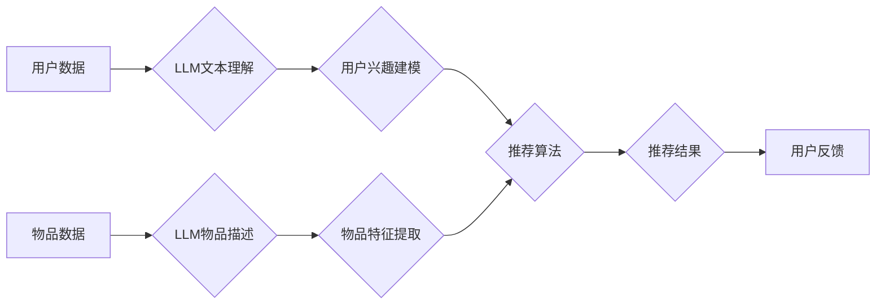

                 

## 利用LLM提升推荐系统的跨平台推荐能力

> 关键词：LLM,推荐系统,跨平台推荐,多模态推荐,个性化推荐,自然语言处理,机器学习

## 1. 背景介绍

推荐系统作为互联网时代的重要组成部分，在电商、社交媒体、视频平台等领域发挥着至关重要的作用。传统的推荐系统主要依赖于用户行为数据和商品特征，通过协同过滤、内容过滤等算法进行推荐。然而，随着用户需求的不断变化和平台的多样化发展，传统的推荐系统面临着新的挑战：

* **数据孤岛问题:** 用户数据分散在不同的平台，难以进行统一分析和利用。
* **个性化推荐的局限性:** 传统的推荐算法难以捕捉用户细粒度的兴趣和偏好，导致推荐结果不够精准。
* **跨平台推荐的难点:** 用户在不同平台上的行为和偏好可能存在差异，跨平台推荐需要考虑用户上下文和平台特性。

近年来，大语言模型 (LLM) 的快速发展为解决这些问题提供了新的思路。LLM 拥有强大的文本理解和生成能力，能够从海量文本数据中学习用户兴趣和偏好，并生成个性化、跨平台的推荐内容。

## 2. 核心概念与联系

### 2.1  LLM 的优势

LLM 作为一种基于 Transformer 架构的深度学习模型，具有以下优势：

* **强大的文本理解能力:** LLM 可以理解复杂的自然语言文本，并从中提取关键信息和用户意图。
* **丰富的知识表示:** LLM 在训练过程中学习了大量的文本知识，能够构建丰富的知识图谱和语义网络。
* **灵活的文本生成能力:** LLM 可以根据用户需求生成不同风格和格式的文本内容，例如推荐理由、商品描述、个性化问答等。

### 2.2  推荐系统的核心要素

推荐系统主要包含以下核心要素：

* **用户建模:** 理解用户的兴趣、偏好、行为等特征。
* **物品建模:** 描述商品的属性、特征、类别等信息。
* **推荐算法:** 根据用户和物品信息，预测用户对物品的兴趣和评分。
* **推荐结果展示:** 将推荐结果以用户友好的方式呈现给用户。

### 2.3  LLM 与推荐系统的融合

LLM 可以与推荐系统中的各个环节进行融合，提升推荐系统的性能和用户体验。

* **用户建模:** LLM 可以分析用户的文本评论、聊天记录等数据，挖掘用户的隐性需求和兴趣偏好。
* **物品建模:** LLM 可以生成更丰富的商品描述和推荐理由，帮助用户更好地理解商品信息。
* **推荐算法:** LLM 可以作为推荐算法的输入，提供更丰富的用户和物品信息，提升推荐算法的准确性和个性化程度。
* **推荐结果展示:** LLM 可以生成更自然、更生动的推荐文案，提升用户阅读兴趣和点击率。

**Mermaid 流程图**



## 3. 核心算法原理 & 具体操作步骤

### 3.1  算法原理概述

LLM 提升推荐系统的跨平台推荐能力主要基于以下算法原理：

* **多模态融合:** 将用户行为数据、文本数据、图像数据等多模态数据进行融合，构建更全面的用户画像和物品特征。
* **跨平台知识迁移:** 利用 LLM 的知识表示能力，将不同平台的用户行为和偏好进行迁移，实现跨平台的个性化推荐。
* **文本生成与增强:** 利用 LLM 生成个性化推荐理由、商品描述等文本内容，提升推荐结果的吸引力和用户体验。

### 3.2  算法步骤详解

1. **数据收集与预处理:** 从不同平台收集用户行为数据、文本数据、图像数据等，并进行清洗、预处理和特征提取。
2. **多模态特征融合:** 利用深度学习模型将不同模态数据进行融合，构建用户和物品的多模态特征向量。
3. **LLM 用户建模:** 利用 LLM 对用户的文本数据进行分析，挖掘用户的兴趣偏好、隐性需求等信息，构建用户兴趣模型。
4. **LLM 物品建模:** 利用 LLM 生成更丰富的商品描述和推荐理由，提升物品的语义表达能力。
5. **跨平台知识迁移:** 利用 LLM 的知识迁移能力，将不同平台的用户行为和偏好进行迁移，构建跨平台的用户兴趣模型。
6. **推荐算法:** 基于用户兴趣模型和物品特征向量，采用协同过滤、内容过滤等推荐算法进行推荐。
7. **推荐结果展示:** 利用 LLM 生成个性化推荐文案，将推荐结果以用户友好的方式呈现给用户。

### 3.3  算法优缺点

**优点:**

* 能够提升推荐系统的个性化程度和跨平台推荐能力。
* 可以挖掘用户隐性需求和兴趣偏好。
* 可以生成更丰富的推荐文案，提升用户体验。

**缺点:**

* 需要大量的文本数据进行训练，训练成本较高。
* LLM 模型的推理速度相对较慢。
* 缺乏对用户隐私保护的考虑。

### 3.4  算法应用领域

LLM 提升推荐系统的跨平台推荐能力可以应用于以下领域:

* **电商平台:** 为用户提供个性化商品推荐，提升转化率。
* **社交媒体平台:** 为用户推荐感兴趣的内容和用户，提升用户粘性。
* **视频平台:** 为用户推荐个性化视频内容，提升用户观看时长。
* **新闻平台:** 为用户推荐个性化新闻资讯，提升用户阅读兴趣。

## 4. 数学模型和公式 & 详细讲解 & 举例说明

### 4.1  数学模型构建

LLM 提升推荐系统的跨平台推荐能力可以基于以下数学模型构建:

* **用户兴趣模型:** 使用深度学习模型，例如 Transformer，将用户的文本数据进行编码，构建用户兴趣向量。

* **物品特征模型:** 使用深度学习模型，例如 CNN，将物品的文本数据和图像数据进行编码，构建物品特征向量。

* **推荐模型:** 使用协同过滤、内容过滤等推荐算法，结合用户兴趣向量和物品特征向量，预测用户对物品的兴趣评分。

### 4.2  公式推导过程

**用户兴趣向量:**

$$
u = \text{Transformer}(text_{user})
$$

其中，$text_{user}$ 表示用户的文本数据，Transformer 是深度学习模型。

**物品特征向量:**

$$
i = \text{CNN}(text_{item}, image_{item})
$$

其中，$text_{item}$ 表示物品的文本数据，$image_{item}$ 表示物品的图像数据，CNN 是深度学习模型。

**推荐评分:**

$$
r(u, i) = \text{Similarity}(u, i)
$$

其中，$r(u, i)$ 表示用户 $u$ 对物品 $i$ 的推荐评分，Similarity 是相似度计算函数。

### 4.3  案例分析与讲解

假设用户 Alice 在电商平台上浏览了以下商品：

* 商品 A: 智能手机
* 商品 B: 无线耳机
* 商品 C: 智能手表

Alice 的文本评论数据包括：

* “这款智能手机拍照效果很棒！”
* “这款无线耳机音质很不错！”
* “这款智能手表功能很强大！”

利用 LLM 可以分析 Alice 的评论数据，构建她的用户兴趣向量，并预测她对其他商品的兴趣评分。例如，如果平台上有一款新的智能手表，LLM 可以根据 Alice 的兴趣向量和智能手表的信息，预测 Alice 对这款智能手表感兴趣的概率。

## 5. 项目实践：代码实例和详细解释说明

### 5.1  开发环境搭建

* Python 3.7+
* PyTorch 1.7+
* Transformers 4.10+
* TensorFlow 2.5+

### 5.2  源代码详细实现

```python
# 用户兴趣建模
from transformers import BertModel, BertTokenizer

tokenizer = BertTokenizer.from_pretrained('bert-base-uncased')
model = BertModel.from_pretrained('bert-base-uncased')

def user_interest_model(text):
    inputs = tokenizer(text, return_tensors='pt')
    outputs = model(**inputs)
    user_vector = outputs.last_hidden_state[:, 0, :]
    return user_vector

# 物品特征建模
from tensorflow.keras.applications import ResNet50

model = ResNet50(weights='imagenet', include_top=False)

def item_feature_model(image):
    features = model.predict(image)
    return features

# 推荐算法
def recommend(user_vector, item_vector):
    similarity = np.dot(user_vector, item_vector)
    return similarity

# 举例说明
user_text = "我喜欢智能手机和无线耳机"
item_image = load_image("item.jpg")
user_vector = user_interest_model(user_text)
item_vector = item_feature_model(item_image)
similarity = recommend(user_vector, item_vector)
print(similarity)
```

### 5.3  代码解读与分析

* 用户兴趣建模部分使用 BERT 模型对用户的文本数据进行编码，提取用户的兴趣向量。
* 物品特征建模部分使用 ResNet50 模型对物品的图像数据进行编码，提取物品的特征向量。
* 推荐算法部分使用余弦相似度计算用户兴趣向量和物品特征向量的相似度，作为推荐评分。

### 5.4  运行结果展示

运行上述代码，可以得到用户对特定物品的推荐评分。

## 6. 实际应用场景

### 6.1  电商平台

LLM 可以帮助电商平台实现个性化商品推荐，提升用户购物体验和转化率。例如，可以根据用户的浏览历史、购买记录、评论数据等，生成个性化的商品推荐列表，并使用 LLM 生成更吸引用户的推荐文案。

### 6.2  社交媒体平台

LLM 可以帮助社交媒体平台推荐用户感兴趣的内容和用户，提升用户粘性和活跃度。例如，可以根据用户的兴趣爱好、社交关系、阅读历史等，推荐相关的文章、视频、话题等，并使用 LLM 生成更个性化的推荐理由。

### 6.3  视频平台

LLM 可以帮助视频平台推荐用户感兴趣的视频内容，提升用户观看时长和用户留存率。例如，可以根据用户的观看历史、点赞记录、评论数据等，推荐相关的视频内容，并使用 LLM 生成更吸引用户的推荐文案。

### 6.4  未来应用展望

LLM 提升推荐系统的跨平台推荐能力在未来将有更广泛的应用场景，例如：

* **医疗健康领域:** 为患者推荐个性化的医疗方案和健康资讯。
* **教育领域:** 为学生推荐个性化的学习资源和课程。
* **金融领域:** 为用户推荐个性化的理财产品和投资建议。

## 7. 工具和资源推荐

### 7.1  学习资源推荐

* **书籍:**
    * 《深度学习》
    * 《自然语言处理》
    * 《推荐系统》
* **在线课程:**
    * Coursera: 深度学习
    * edX: 自然语言处理
    * Udacity: 推荐系统

### 7.2  开发工具推荐

* **Python:** 
* **PyTorch:** 深度学习框架
* **Transformers:** 预训练语言模型库
* **TensorFlow:** 深度学习框架

### 7.3  相关论文推荐

* **BERT: Pre-training of Deep Bidirectional Transformers for Language Understanding**
* **Attention Is All You Need**
* **Recurrent Neural Network Based Language Model**

## 8. 总结：未来发展趋势与挑战

### 8.1  研究成果总结

LLM 提升推荐系统的跨平台推荐能力是一个新兴的研究领域，取得了一些重要的成果。例如，利用 LLM 可以构建更全面的用户画像和物品特征，提升推荐系统的个性化程度和跨平台推荐能力。

### 8.2  未来发展趋势

未来，LLM 提升推荐系统的跨平台推荐能力将朝着以下方向发展:

* **多模态融合:** 将更多模态数据，例如音频、视频等，融入推荐系统，构建更全面的用户和物品信息。
* **个性化推荐:** 利用 LLM 的文本生成能力，生成更个性化的推荐文案和推荐理由，提升用户体验。
* **跨平台知识迁移:** 利用 LLM 的知识迁移能力，将不同平台的用户行为和偏好进行迁移，实现更精准的跨平台推荐。

### 8.3  面临的挑战

LLM 提升推荐系统的跨平台推荐能力也面临一些挑战:

* **数据隐私保护:** LLM 的训练需要大量的用户数据，如何保护用户隐私是一个重要的挑战。
* **模型解释性:** LLM 的模型结构复杂，难以解释其推荐结果，如何提升模型的解释性是一个重要的研究方向。
* **模型效率:** LLM 的推理速度相对较慢，如何提升模型的效率是一个重要的技术难题。

### 8.4  研究展望

未来，我们将继续研究 LLM 提升推荐系统的跨平台推荐能力，探索更有效的算法和技术，为用户提供更个性化、更精准的推荐体验。

## 9. 附录：常见问题与解答

**Q1: LLM 提升推荐系统的跨平台推荐能力需要哪些数据？**

**A1:** 需要用户行为数据、文本数据、图像数据等多模态数据。

**Q2: LLM 提升推荐系统的跨平台推荐能力有哪些优势？**

**A2:** 可以提升推荐系统的个性化程度和跨平台推荐能力，挖掘用户隐性需求和兴趣偏好。

**Q3: LLM 提升推荐系统的跨平台推荐能力有哪些挑战？**

**A3:** 数据隐私保护、模型解释性和模型效率都是重要的挑战。


作者：禅与计算机程序设计艺术 / Zen and the Art of Computer Programming<end_of_turn>

