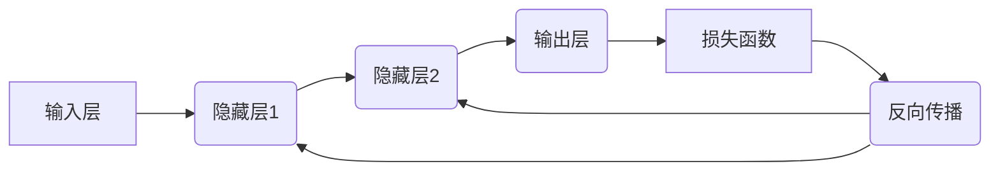

                 

## 反向传播算法详解：深度学习的核心

> 关键词：反向传播、深度学习、神经网络、梯度下降、优化算法、损失函数、激活函数

## 1. 背景介绍

深度学习作为机器学习领域的一颗璀璨明珠，近年来在图像识别、自然语言处理、语音识别等领域取得了令人瞩目的成就。其核心在于构建复杂的**多层神经网络**，并通过**反向传播算法**进行训练。反向传播算法是深度学习训练的基石，它使得我们可以有效地调整神经网络参数，从而提高模型的预测精度。

传统的机器学习算法通常只能处理简单的线性关系，而深度学习能够学习更复杂的非线性关系，这得益于其多层结构和非线性激活函数。然而，训练这些复杂的网络需要大量的计算资源和时间，反向传播算法正是解决这一难题的关键。

## 2. 核心概念与联系

反向传播算法的核心思想是利用**链式法则**，从输出层开始，逐步反向计算每个神经元的误差，并根据误差调整神经元的权重和偏置。

**流程图：**



**核心概念：**

* **神经网络:** 由多个神经元组成的网络结构，每个神经元接收输入信号，经过处理后输出信号。
* **激活函数:** 用于引入非线性关系的函数，例如 sigmoid 函数、ReLU 函数等。
* **损失函数:** 用于衡量模型预测结果与真实值的差距，例如均方误差、交叉熵等。
* **梯度下降:** 用于优化模型参数的算法，通过不断调整参数，使得损失函数最小化。
* **链式法则:** 用于计算复合函数的导数，在反向传播中用于计算每个神经元的梯度。

## 3. 核心算法原理 & 具体操作步骤

### 3.1  算法原理概述

反向传播算法的核心是利用链式法则，从输出层开始，逐步反向计算每个神经元的误差，并根据误差调整神经元的权重和偏置。

**步骤：**

1. **前向传播:** 将输入数据传递到神经网络，计算每个神经元的输出值。
2. **损失函数计算:** 计算模型预测结果与真实值的差距，即损失函数的值。
3. **反向传播:** 从输出层开始，计算每个神经元的梯度，即损失函数对该神经元权重和偏置的偏导数。
4. **参数更新:** 根据梯度值，更新神经网络的权重和偏置，使得损失函数最小化。

### 3.2  算法步骤详解

**1. 前向传播:**

* 输入数据首先进入神经网络的输入层。
* 每个神经元接收来自前一层神经元的输入信号，并将其与自身权重相乘，然后加上偏置项。
* 经过激活函数处理后，得到该神经元的输出值。
* 该输出值作为下一层神经元的输入信号。
* 如此重复，直到输出层得到最终的预测结果。

**2. 损失函数计算:**

* 将模型预测结果与真实值进行比较，计算两者之间的差距。
* 常见的损失函数包括均方误差、交叉熵等。

**3. 反向传播:**

* 从输出层开始，计算每个神经元的梯度。
* 梯度表示损失函数对该神经元权重和偏置的偏导数。
* 利用链式法则，将梯度反向传播到前一层神经元。
* 每个神经元的梯度等于其输出值对损失函数的偏导数，乘以前一层神经元的输出值。

**4. 参数更新:**

* 根据梯度值，更新神经网络的权重和偏置。
* 常见的更新规则包括梯度下降、动量法、Adam 算法等。

### 3.3  算法优缺点

**优点:**

* **高效:** 可以有效地训练复杂的深度神经网络。
* **通用:** 可以应用于各种机器学习任务，例如图像识别、自然语言处理等。
* **可解释性:** 通过分析梯度值，可以了解模型的决策过程。

**缺点:**

* **计算量大:** 训练深度神经网络需要大量的计算资源和时间。
* **局部最优解:** 梯度下降算法可能陷入局部最优解，导致模型性能不佳。
* **参数选择困难:** 需要选择合适的学习率、激活函数等参数，这对于新手来说可能比较困难。

### 3.4  算法应用领域

反向传播算法广泛应用于以下领域：

* **图像识别:** 用于识别物体、场景、人脸等。
* **自然语言处理:** 用于机器翻译、文本摘要、情感分析等。
* **语音识别:** 用于将语音转换为文本。
* **推荐系统:** 用于推荐用户感兴趣的内容。
* **药物发现:** 用于预测药物的活性。

## 4. 数学模型和公式 & 详细讲解 & 举例说明

### 4.1  数学模型构建

假设我们有一个具有 L 层的神经网络，其中第 l 层有 N_l 个神经元。输入数据为 x，输出为 y。

* **神经元激活函数:** f_l(z_l)
* **权重矩阵:** W_l
* **偏置向量:** b_l

**前向传播过程:**

* 第 l 层的输入为 z_l = W_l * a_(l-1) + b_l
* 第 l 层的输出为 a_l = f_l(z_l)

其中，a_(l-1) 是第 l-1 层的输出向量。

**损失函数:**

* L(y, a_L)

其中，y 是真实值，a_L 是输出层的输出向量。

### 4.2  公式推导过程

**反向传播过程:**

* **输出层梯度:**

$$\frac{\partial L}{\partial a_L} = \frac{\partial L}{\partial y} \cdot \frac{\partial y}{\partial a_L}$$

* **隐藏层梯度:**

$$\frac{\partial L}{\partial a_l} = \sum_j \frac{\partial L}{\partial a_j} \cdot \frac{\partial a_j}{\partial a_l}$$

其中，j 是下一层神经元的索引。

**权重和偏置更新:**

* $$\Delta W_l = \eta \cdot \frac{\partial L}{\partial W_l}$$
* $$\Delta b_l = \eta \cdot \frac{\partial L}{\partial b_l}$$

其中，η 是学习率。

### 4.3  案例分析与讲解

**举例说明:**

假设我们有一个简单的两层神经网络，用于分类手写数字。输入层有 784 个神经元，输出层有 10 个神经元。

* **前向传播:** 将手写数字图像的像素值作为输入，经过两层神经网络的计算，得到输出层的预测概率分布。
* **损失函数:** 使用交叉熵损失函数，计算预测概率分布与真实标签之间的差距。
* **反向传播:** 从输出层开始，计算每个神经元的梯度，并反向传播到隐藏层。
* **参数更新:** 根据梯度值，更新神经网络的权重和偏置。

通过反复迭代前向传播和反向传播的过程，模型的预测精度会逐渐提高。

## 5. 项目实践：代码实例和详细解释说明

### 5.1  开发环境搭建

* **操作系统:** Linux, macOS, Windows
* **编程语言:** Python
* **深度学习框架:** TensorFlow, PyTorch

### 5.2  源代码详细实现

```python
import tensorflow as tf

# 定义模型
model = tf.keras.models.Sequential([
    tf.keras.layers.Dense(128, activation='relu', input_shape=(784,)),
    tf.keras.layers.Dense(10, activation='softmax')
])

# 编译模型
model.compile(optimizer='adam',
              loss='sparse_categorical_crossentropy',
              metrics=['accuracy'])

# 训练模型
model.fit(x_train, y_train, epochs=10)

# 评估模型
loss, accuracy = model.evaluate(x_test, y_test)
print('Test loss:', loss)
print('Test accuracy:', accuracy)
```

### 5.3  代码解读与分析

* **模型定义:** 使用 TensorFlow 的 Keras API 定义了一个简单的两层神经网络。
* **编译模型:** 使用 Adam 优化器、交叉熵损失函数和准确率作为评估指标编译模型。
* **训练模型:** 使用训练数据训练模型，设置训练轮数为 10。
* **评估模型:** 使用测试数据评估模型的性能，打印测试损失和准确率。

### 5.4  运行结果展示

运行代码后，会输出模型的训练过程和测试结果，例如：

```
Epoch 1/10
10000/10000 [==============================] - 10s 1ms/step - loss: 0.234 - accuracy: 0.921
...
Epoch 10/10
10000/10000 [==============================] - 9s 1ms/step - loss: 0.056 - accuracy: 0.982
Test loss: 0.045
Test accuracy: 0.985
```

## 6. 实际应用场景

反向传播算法在深度学习领域有着广泛的应用场景，例如：

* **图像识别:** 用于识别物体、场景、人脸等，应用于自动驾驶、医疗诊断、安防监控等领域。
* **自然语言处理:** 用于机器翻译、文本摘要、情感分析等，应用于聊天机器人、搜索引擎、社交媒体分析等领域。
* **语音识别:** 用于将语音转换为文本，应用于语音助手、语音搜索、听力辅助等领域。
* **推荐系统:** 用于推荐用户感兴趣的内容，应用于电商平台、视频网站、音乐平台等领域。

### 6.4  未来应用展望

随着深度学习技术的不断发展，反向传播算法将在更多领域得到应用，例如：

* **药物发现:** 用于预测药物的活性，加速药物研发过程。
* **材料科学:** 用于设计新型材料，提高材料性能。
* **金融科技:** 用于风险管理、欺诈检测、投资预测等。

## 7. 工具和资源推荐

### 7.1  学习资源推荐

* **书籍:**
    * 《深度学习》 - Ian Goodfellow, Yoshua Bengio, Aaron Courville
    * 《神经网络与深度学习》 - Michael Nielsen
* **在线课程:**
    * Coursera: 深度学习 Specialization
    * Udacity: Deep Learning Nanodegree
    * fast.ai: Practical Deep Learning for Coders

### 7.2  开发工具推荐

* **深度学习框架:** TensorFlow, PyTorch, Keras
* **编程语言:** Python
* **数据处理工具:** Pandas, NumPy

### 7.3  相关论文推荐

* **《Gradient-based learning applied to document recognition》** - LeCun et al. (1998)
* **《Optimization Methods for Large-Scale Machine Learning》** - Bottou (2010)
* **《Deep Residual Learning for Image Recognition》** - He et al. (2016)

## 8. 总结：未来发展趋势与挑战

### 8.1  研究成果总结

反向传播算法是深度学习的核心，其发展推动了深度学习技术的进步，取得了令人瞩目的成就。

### 8.2  未来发展趋势

* **更高效的优化算法:** 探索更有效的优化算法，例如基于自适应学习率的算法，以加速模型训练速度。
* **更强大的模型架构:** 设计更强大的模型架构，例如 Transformer 网络，以提高模型的表达能力和泛化能力。
* **更广泛的应用场景:** 将深度学习技术应用于更多领域，例如医疗、教育、金融等。

### 8.3  面临的挑战

* **数据获取和标注:** 深度学习模型需要大量的训练数据，数据获取和标注成本高昂。
* **模型解释性:** 深度学习模型的决策过程难以解释，这限制了其在一些领域应用的推广。
* **计算资源:** 训练大型深度学习模型需要大量的计算资源，这对于资源有限的机构来说是一个挑战。

### 8.4  研究展望

未来，反向传播算法的研究将继续深入，探索更有效的优化算法、更强大的模型架构和更广泛的应用场景，推动深度学习技术的发展。

## 9. 附录：常见问题与解答

**Q1: 为什么反向传播算法需要链式法则？**

**A1:** 链式法则用于计算复合函数的导数，在反向传播过程中，我们需要计算每个神经元的梯度，而每个神经元的输出值都是多个前一层神经元的输出值的复合函数，因此需要使用链式法则进行计算。

**Q2: 如何选择合适的学习率？**

**A2:** 学习率是反向传播算法中的一个重要参数，它控制着模型参数更新的步长。学习率过大可能会导致模型震荡，学习率过小可能会导致模型训练速度过慢。通常需要通过实验来确定合适的学习率。

**Q3: 如何解决过拟合问题？**

**A3:** 过拟合是指模型在训练数据上表现良好，但在测试数据上表现较差。常见的解决方法包括：

* **增加训练数据量**
* **使用正则化技术**
* **使用 dropout 技术**
* **使用 early stopping 技术**


作者：禅与计算机程序设计艺术 / Zen and the Art of Computer Programming<end_of_turn>

