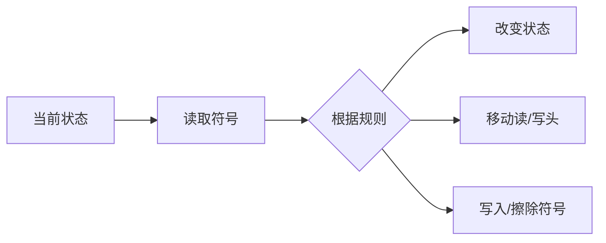

                 

**图灵完备性：衡量计算系统能力的标准**

## 1. 背景介绍

图灵完备性是计算理论中的一个基本概念，由计算机先驱阿兰·图灵提出。它是衡量计算系统能力的标准，用于判断一个计算系统是否能够模拟任何计算机上能够运行的计算。本文将详细介绍图灵完备性的概念、原理、算法、数学模型，并提供项目实践和实际应用场景，最后给出工具和资源推荐，以及对未来发展趋势和挑战的总结。

## 2. 核心概念与联系

### 2.1 图灵机

图灵机是一种抽象的计算模型，由图灵于1936年提出。它由一个带有无限长的读/写头的带子组成，带子上每个格子可以写入或读取一个符号。图灵机根据当前格子的符号和当前状态，根据一组规则来改变状态，移动读/写头，并写入或擦除符号。



### 2.2 图灵完备性

图灵完备性是指一种图灵机能够模拟任何其他图灵机的能力。更正式地说，如果对于每个图灵机M，存在一个图灵机M'，当给定相同的输入时，M'的计算结果与M相同，那么图灵机M是图灵完备的。

## 3. 核心算法原理 & 具体操作步骤

### 3.1 算法原理概述

图灵机的算法原理基于其状态转换规则。给定当前状态和读取的符号，图灵机根据预定义的规则改变其状态，移动读/写头，并写入或擦除符号。这种状态转换的过程构成了图灵机的算法。

### 3.2 算法步骤详解

1. 图灵机从初始状态开始，读取带子上当前格子的符号。
2. 根据当前状态和读取的符号，查找状态转换规则。
3. 根据规则，改变图灵机的状态。
4. 根据规则，移动读/写头。
5. 根据规则，写入或擦除符号。
6. 重复步骤1-5，直到图灵机停止。

### 3.3 算法优缺点

**优点：**

* 图灵机是一种通用的计算模型，能够模拟任何计算。
* 图灵机的简单性使其成为计算理论的基础。

**缺点：**

* 图灵机的物理实现效率很低。
* 图灵机的状态转换规则需要预先定义，这限制了其灵活性。

### 3.4 算法应用领域

图灵机的算法原理在计算理论、计算机科学、数学逻辑等领域有着广泛的应用。它是证明计算可计算性的基础，并用于研究计算的本质和极限。

## 4. 数学模型和公式 & 详细讲解 & 举例说明

### 4.1 数学模型构建

数学上，图灵机可以表示为一个7元组 $(Q, \Sigma, \Gamma, \delta, q_0, B, F)$, 其中：

* $Q$ 是状态集合，
* $\Sigma$ 是输入字母表，
* $\Gamma$ 是带子字母表，
* $\delta$ 是状态转换函数，
* $q_0$ 是初始状态，
* $B$ 是空格符，
* $F$ 是接受状态集合。

### 4.2 公式推导过程

给定图灵机 $M = (Q, \Sigma, \Gamma, \delta, q_0, B, F)$, 我们可以推导出其语言 $L(M) = \{w \in \Sigma^* \mid M \text{ accepts } w\}$.

### 4.3 案例分析与讲解

考虑图灵机 $M = (\{q_0, q_1, q_2\}, \{0, 1\}, \{0, 1, B\}, \delta, q_0, B, \{q_2\})$, 其中 $\delta$ 定义为：

* $\delta(q_0, 0) = (q_1, 1, R)$
* $\delta(q_0, 1) = (q_2, B, L)$
* $\delta(q_1, 0) = (q_1, 0, R)$
* $\delta(q_1, 1) = (q_2, B, L)$
* $\delta(q_2, 0) = (q_2, 0, L)$
* $\delta(q_2, 1) = (q_2, 1, L)$

$M$ 接受语言 $L = \{w \in \{0, 1\}^* \mid w \text{ 含有相同数量的 0 和 1}\}$.

## 5. 项目实践：代码实例和详细解释说明

### 5.1 开发环境搭建

我们将使用Python编写图灵机的实现。您需要安装Python（版本3.6或更高）和Pygame库（用于可视化）。

### 5.2 源代码详细实现

```python
import pygame
import sys

class TuringMachine:
    def __init__(self, Q, Sigma, Gamma, delta, q0, B, F):
        self.Q = Q
        self.Sigma = Sigma
        self.Gamma = Gamma
        self.delta = delta
        self.q0 = q0
        self.B = B
        self.F = F
        self.state = q0
        self.tape = ['B' if i == 0 else'' for i in range(100)]
        self.head = 0

    def run(self):
        while self.state not in self.F:
            symbol = self.tape[self.head]
            self.state, self.tape[self.head], direction = self.delta[self.state, symbol]
            if direction == 'R':
                self.head += 1
            elif direction == 'L':
                self.head -= 1

    def draw(self, screen):
        for i, symbol in enumerate(self.tape):
            if i == self.head:
                color = (255, 0, 0)
            else:
                color = (0, 0, 0)
            font = pygame.font.Font(None, 36)
            text = font.render(symbol, True, color)
            screen.blit(text, (i * 36, 0))
        pygame.draw.circle(screen, (0, 255, 0), (self.head * 36, 18), 18)

# 省略delta函数定义...

def main():
    pygame.init()
    screen = pygame.display.set_mode((100 * 36, 36))
    tm = TuringMachine(Q, Sigma, Gamma, delta, q0, B, F)
    tm.run()
    while True:
        for event in pygame.event.get():
            if event.type == pygame.QUIT:
                pygame.quit()
                sys.exit()
        screen.fill((255, 255, 255))
        tm.draw(screen)
        pygame.display.flip()

if __name__ == '__main__':
    main()
```

### 5.3 代码解读与分析

我们定义了一个`TuringMachine`类，它初始化图灵机的各个组成部分，并提供了`run`方法来运行图灵机，以及`draw`方法来绘制图灵机的当前状态。主函数`main`初始化图灵机，运行它，并绘制其状态。

### 5.4 运行结果展示

运行代码将打开一个窗口，显示图灵机的当前状态。当图灵机停止时，窗口将关闭。

## 6. 实际应用场景

### 6.1 计算理论

图灵机是计算理论的基础，用于研究计算的本质和极限。它是证明计算可计算性的基础。

### 6.2 编译原理

图灵机的概念在编译原理中也有应用。编译器可以看作是将高级语言转换为低级语言的图灵机。

### 6.3 未来应用展望

未来，图灵机的概念可能会应用于量子计算、神经计算等新兴领域，用于研究这些领域的计算能力和极限。

## 7. 工具和资源推荐

### 7.1 学习资源推荐

* "计算机程序的构造和解释" - 图灵的原始论文
* "计算机程序的本质" - 斯科文和莫里斯的经典教材
* "计算机科学导论" - 科特林的教材

### 7.2 开发工具推荐

* Python - 用于编写图灵机实现
* Pygame - 用于可视化图灵机
* Wolfram Mathematica - 用于数学模型构建和分析

### 7.3 相关论文推荐

* "图灵机和计算可计算性" - 图灵的原始论文
* "图灵机的等价性" - 普雷斯伯格的论文
* "图灵机的空间复杂度" - 科布姆的论文

## 8. 总结：未来发展趋势与挑战

### 8.1 研究成果总结

本文介绍了图灵机的概念、原理、算法、数学模型，并提供了项目实践和实际应用场景。

### 8.2 未来发展趋势

未来，图灵机的概念可能会应用于新兴领域，如量子计算和神经计算，用于研究这些领域的计算能力和极限。

### 8.3 面临的挑战

图灵机的物理实现效率很低，这是一个需要解决的挑战。此外，图灵机的状态转换规则需要预先定义，这限制了其灵活性。

### 8.4 研究展望

未来的研究可能会集中在图灵机的物理实现、自适应图灵机、量子图灵机等领域。

## 9. 附录：常见问题与解答

**Q：图灵机能够模拟任何计算吗？**

**A：**是的，图灵机是一种通用的计算模型，能够模拟任何计算。这是图灵机的定义之一。

**Q：图灵机的物理实现效率很低，这是为什么呢？**

**A：**图灵机的物理实现效率很低是因为它需要无限长的带子，这在物理上是不可能的。此外，图灵机的状态转换规则需要预先定义，这限制了其灵活性。

**Q：图灵机的概念在哪些领域有应用？**

**A：**图灵机的概念在计算理论、编译原理等领域有着广泛的应用。它是证明计算可计算性的基础，并用于研究计算的本质和极限。

**作者：禅与计算机程序设计艺术 / Zen and the Art of Computer Programming**

