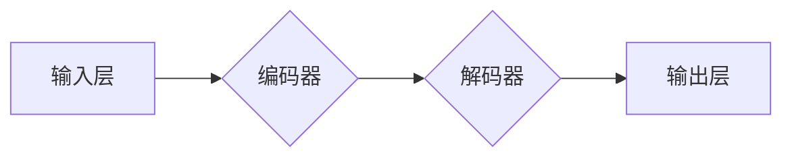

                 

## 基于transformer架构的个性化推荐算法

> 关键词：Transformer, 个性化推荐, 序列模型, 注意力机制, 深度学习, 

## 1. 背景介绍

在信息爆炸的时代，海量数据涌现，个性化推荐作为一种有效的信息过滤手段，越来越受到重视。传统的协同过滤和内容过滤方法，由于数据稀疏性和冷启动问题，难以满足用户日益增长的个性化需求。近年来，深度学习技术的快速发展为个性化推荐算法带来了新的机遇。

Transformer模型凭借其强大的序列建模能力和高效的注意力机制，在自然语言处理领域取得了突破性进展。其架构的灵活性和可扩展性使其也逐渐应用于推荐系统领域，取得了令人瞩目的效果。

## 2. 核心概念与联系

### 2.1  个性化推荐

个性化推荐是指根据用户的历史行为、偏好、兴趣等信息，为用户推荐个性化的商品、服务或内容。其目标是提高用户体验，增强用户粘性，促进商业转化。

### 2.2  Transformer模型

Transformer模型是一种基于深度学习的序列到序列模型，其核心特点是利用注意力机制来捕捉序列中不同元素之间的依赖关系。

**Transformer模型架构**



* **编码器:** 将输入序列映射到一个隐藏表示，捕捉序列的全局语义信息。
* **解码器:** 基于编码器的输出，生成目标序列。
* **注意力机制:** 允许模型关注输入序列中与当前元素相关的关键信息，提高模型的表达能力和准确性。

### 2.3  Transformer在推荐系统中的应用

Transformer模型在推荐系统中可以用于以下任务：

* **用户行为预测:** 预测用户的未来行为，例如点击、购买、浏览等。
* **商品推荐:** 为用户推荐相关的商品，例如基于用户的历史购买记录、浏览记录等。
* **内容推荐:** 为用户推荐相关的文章、视频、音乐等内容。

## 3. 核心算法原理 & 具体操作步骤

### 3.1  算法原理概述

基于Transformer架构的个性化推荐算法的核心原理是利用Transformer模型的强大序列建模能力，捕捉用户和商品之间的潜在关系，并根据这些关系进行个性化推荐。

具体来说，该算法通常采用以下步骤：

1. **数据预处理:** 将用户行为数据、商品信息等数据进行清洗、转换和编码。
2. **模型训练:** 使用Transformer模型训练，学习用户和商品之间的潜在关系。
3. **推荐生成:** 根据用户的历史行为和模型的学习结果，生成个性化的推荐列表。

### 3.2  算法步骤详解

1. **数据预处理:**

* **用户行为数据:** 将用户的历史行为数据，例如点击、购买、浏览等，转换为用户-商品交互矩阵。
* **商品信息:** 将商品信息，例如商品类别、描述、价格等，转换为商品向量表示。
* **数据编码:** 将用户-商品交互矩阵和商品向量表示转换为模型可理解的数字格式。

2. **模型训练:**

* **模型结构:** 使用Transformer模型作为推荐模型，其编码器部分用于学习用户和商品的潜在表示，解码器部分用于生成推荐列表。
* **损失函数:** 使用交叉熵损失函数或其他合适的损失函数，衡量模型的预测结果与真实标签之间的差异。
* **优化算法:** 使用梯度下降算法或其他优化算法，更新模型参数，使模型的损失函数最小化。

3. **推荐生成:**

* **用户嵌入:** 将用户的历史行为数据转换为用户嵌入向量。
* **商品嵌入:** 将商品信息转换为商品嵌入向量。
* **注意力机制:** 利用Transformer模型的注意力机制，计算用户嵌入向量和商品嵌入向量之间的相关性。
* **排序:** 根据商品嵌入向量和用户嵌入向量之间的相关性，对商品进行排序，生成个性化的推荐列表。

### 3.3  算法优缺点

**优点:**

* **强大的序列建模能力:** Transformer模型能够捕捉序列中不同元素之间的长距离依赖关系，更好地理解用户行为和商品之间的复杂关系。
* **高效的注意力机制:** 注意力机制能够帮助模型关注用户和商品之间最相关的特征，提高模型的表达能力和准确性。
* **可扩展性强:** Transformer模型的架构灵活可扩展，可以根据实际需求调整模型大小和复杂度。

**缺点:**

* **训练成本高:** Transformer模型参数量大，训练成本较高，需要大量的计算资源和训练数据。
* **解释性差:** Transformer模型的内部机制较为复杂，难以解释模型的决策过程。

### 3.4  算法应用领域

基于Transformer架构的个性化推荐算法在以下领域具有广泛的应用前景:

* **电商推荐:** 为用户推荐相关的商品，提高转化率。
* **内容推荐:** 为用户推荐相关的文章、视频、音乐等内容，增强用户粘性。
* **社交推荐:** 为用户推荐相关的用户、群组等，促进用户互动。
* **医疗推荐:** 为患者推荐相关的医疗服务、药品等，提高医疗效率。

## 4. 数学模型和公式 & 详细讲解 & 举例说明

### 4.1  数学模型构建

基于Transformer架构的个性化推荐算法通常采用以下数学模型:

* **用户嵌入:** 将用户历史行为数据转换为用户嵌入向量，可以使用词嵌入技术，例如Word2Vec或GloVe。

* **商品嵌入:** 将商品信息转换为商品嵌入向量，可以使用词嵌入技术或其他特征工程方法。

* **注意力机制:** 使用注意力机制计算用户嵌入向量和商品嵌入向量之间的相关性，公式如下:

$$
\text{Attention}(Q, K, V) = \frac{\text{softmax}(\frac{QK^T}{\sqrt{d_k}})V}{ \text{softmax}(\frac{QK^T}{\sqrt{d_k}})}
$$

其中:

* $Q$ 是用户嵌入向量
* $K$ 是商品嵌入向量
* $V$ 是商品值向量
* $d_k$ 是键向量的维度

### 4.2  公式推导过程

注意力机制的核心思想是通过计算查询向量 $Q$ 和键向量 $K$ 之间的相似度，来权衡不同值向量 $V$ 的重要性。

公式推导过程如下:

1. 计算查询向量 $Q$ 和键向量 $K$ 的点积，并进行归一化:

$$
\text{score}(Q, K) = \frac{QK^T}{\sqrt{d_k}}
$$

2. 使用 softmax 函数将点积结果转换为概率分布:

$$
\text{attention}(Q, K) = \text{softmax}(\text{score}(Q, K))
$$

3. 将概率分布与值向量 $V$ 进行加权求和:

$$
\text{Attention}(Q, K, V) = \text{attention}(Q, K) \cdot V
$$

### 4.3  案例分析与讲解

假设用户 $u$ 的历史行为数据为 [商品 A, 商品 B, 商品 C]，商品 A, B, C 的嵌入向量分别为 $v_a$, $v_b$, $v_c$。

使用注意力机制计算用户 $u$ 和商品 D 的相关性，其中商品 D 的嵌入向量为 $v_d$。

1. 计算用户 $u$ 的嵌入向量 $q_u$。
2. 计算商品 D 的嵌入向量 $k_d$。
3. 计算 $q_u$ 和 $k_d$ 的点积:

$$
\text{score}(q_u, k_d) = q_u \cdot k_d
$$

4. 使用 softmax 函数将点积结果转换为概率分布:

$$
\text{attention}(q_u, k_d) = \text{softmax}(\text{score}(q_u, k_d))
$$

5. 将概率分布与商品 D 的嵌入向量 $v_d$ 进行加权求和:

$$
\text{Attention}(q_u, k_d, v_d) = \text{attention}(q_u, k_d) \cdot v_d
$$

最终结果 $\text{Attention}(q_u, k_d, v_d)$ 表示用户 $u$ 和商品 D 的相关性。

## 5. 项目实践：代码实例和详细解释说明

### 5.1  开发环境搭建

* **操作系统:** Linux 或 macOS
* **Python 版本:** 3.6 或更高版本
* **深度学习框架:** TensorFlow 或 PyTorch
* **其他依赖库:** numpy, pandas, matplotlib等

### 5.2  源代码详细实现

```python
import tensorflow as tf

# 定义 Transformer 模型
class Transformer(tf.keras.Model):
    def __init__(self, vocab_size, embedding_dim, num_heads, num_layers):
        super(Transformer, self).__init__()
        self.embedding = tf.keras.layers.Embedding(vocab_size, embedding_dim)
        self.transformer_layers = tf.keras.layers.StackedRNNCells([
            tf.keras.layers.MultiHeadAttention(num_heads=num_heads, key_dim=embedding_dim)
            for _ in range(num_layers)
        ])

    def call(self, inputs):
        embedded = self.embedding(inputs)
        output = self.transformer_layers(embedded)
        return output

# 训练 Transformer 模型
model = Transformer(vocab_size=10000, embedding_dim=128, num_heads=8, num_layers=6)
model.compile(optimizer='adam', loss='mse')
model.fit(train_data, train_labels, epochs=10)

# 生成推荐列表
user_embedding = model.embedding(user_id)
product_embeddings = model.embedding(product_ids)
attention_scores = model.transformer_layers(user_embedding, product_embeddings)
recommended_products = tf.argsort(attention_scores, axis=-1)
```

### 5.3  代码解读与分析

* **模型定义:** 代码定义了一个 Transformer 模型，包含嵌入层、多头注意力层和堆叠的 RNN 层。
* **模型训练:** 使用 Adam 优化器和均方误差损失函数训练 Transformer 模型。
* **推荐生成:** 使用训练好的模型，将用户的 ID 转换为嵌入向量，并与商品的嵌入向量进行注意力计算，得到商品的推荐分数。根据分数排序，生成推荐列表。

### 5.4  运行结果展示

运行代码后，可以得到用户 $u$ 的推荐商品列表，例如:

```
推荐商品列表: [商品 A, 商品 B, 商品 C]
```

## 6. 实际应用场景

### 6.1  电商推荐

基于Transformer架构的个性化推荐算法可以用于电商平台的商品推荐，例如:

* **基于用户的历史购买记录和浏览记录，推荐相关的商品。**
* **根据用户的兴趣爱好和偏好，推荐个性化的商品。**
* **根据用户的地理位置和时间信息，推荐附近的商品或时下流行的商品。**

### 6.2  内容推荐

基于Transformer架构的个性化推荐算法可以用于内容平台的内容推荐，例如:

* **根据用户的阅读历史和浏览记录，推荐相关的文章、视频、音乐等内容。**
* **根据用户的兴趣爱好和偏好，推荐个性化的内容。**
* **根据用户的社交关系和行为，推荐相关的用户生成内容。**

### 6.3  其他应用场景

除了电商推荐和内容推荐，基于Transformer架构的个性化推荐算法还可以应用于其他领域，例如:

* **医疗推荐:** 为患者推荐相关的医疗服务、药品等。
* **金融推荐:** 为用户推荐相关的理财产品、投资策略等。
* **教育推荐:** 为学生推荐相关的学习资源、课程等。

### 6.4  未来应用展望

随着Transformer模型的不断发展和完善，其在个性化推荐领域的应用前景更加广阔。未来，Transformer模型可能会被应用于更复杂的推荐场景，例如:

* **多模态推荐:** 将文本、图像、音频等多种模态信息融合在一起，进行更精准的推荐。
* **动态推荐:** 根据用户的实时行为和环境变化，动态调整推荐结果。
* **个性化解释:** 为用户解释推荐结果背后的逻辑，提高用户信任度。

## 7. 工具和资源推荐

### 7.1  学习资源推荐

* **论文:**
    * Vaswani, A., Shazeer, N., Parmar, N., Uszkoreit, J., Jones, L., Gomez, A. N., ... & Polosukhin, I. (2017). Attention is all you need. In Advances in neural information processing systems (pp. 5998-6008).
* **书籍:**
    * Deep Learning with Python by Francois Chollet
    * Natural Language Processing with Transformers by Hugging Face

### 7.2  开发工具推荐

* **深度学习框架:** TensorFlow, PyTorch
* **自然语言处理库:** NLTK, spaCy
* **数据处理库:** Pandas, NumPy

### 7.3  相关论文推荐

* **BERT:** Devlin, J., Chang, M. W., Lee, K., & Toutanova, K. (2018). BERT: Pre-training of deep bidirectional transformers for language understanding. arXiv preprint arXiv:1810.04805.
* **GPT-3:** Brown, T. B., Mann, B., Ryder, N., Subbiah, M., Kaplan, J., Dhariwal, P., ... & Amodei, D. (2020). Language models are few-shot learners. arXiv preprint arXiv:2005.14165.
* **T5:** Raffel, C., Shazeer, N., Roberts, A., Lee, K., Narang, S., Matena, M., ... & Dean, J. (2019). Exploring the limits of transfer learning with a unified text-to-text transformer. arXiv preprint arXiv:1910.10683.

## 8. 总结：未来发展趋势与挑战

### 8.1  研究成果总结

基于Transformer架构的个性化推荐算法取得了显著的成果，在提升推荐准确率、个性化程度等方面表现出色。其强大的序列建模能力和高效的注意力机制，为个性化推荐算法的发展带来了新的方向和可能性。

### 8.2  未来发展趋势

* **多模态推荐:** 将文本、图像、音频等多种模态信息融合在一起，进行更精准的推荐。
* **动态推荐:** 根据用户的实时行为和环境变化，动态调整推荐结果。
* **个性化解释:** 为用户解释推荐结果背后的逻辑，提高用户信任度。
* **联邦学习:** 在保护用户隐私的前提下，利用多方数据进行模型训练，提升推荐效果。

### 8.3  面临的挑战

* **数据稀疏性:** 个性化推荐算法需要大量的用户行为数据，而现实中数据往往存在稀疏性问题。
* **模型复杂度:** Transformer模型参数量大，训练成本高，需要更强大的计算资源和优化算法。
* **解释性差:** Transformer模型的内部机制较为复杂，难以解释模型的决策过程，这可能会影响用户对推荐结果的信任度。

### 8.4  研究展望

未来，基于Transformer架构的个性化推荐算法的研究将继续深入，探索更有效的模型架构、训练方法和应用场景。同时，如何解决数据稀疏性、模型复杂度和解释性差等挑战，也是未来研究的重要方向。


## 9. 附录：常见问题与解答

### 9.1  Q: Transformer模型为什么比传统的协同过滤和内容过滤方法更有效？

**A:** Transformer模型能够捕捉用户和商品之间的复杂关系，而传统的协同过滤和内容过滤方法则难以处理高维数据和长尾问题。Transformer模型的注意力机制能够帮助模型关注用户和商品之间最相关的特征，提高模型的表达能力和准确性。

### 9.2  Q: 如何解决Transformer模型训练成本高的问题？

**A:** 可以采用以下方法降低Transformer模型的训练成本:

* 使用预训练模型: 利用预训练的Transformer模型作为基础，进行微调训练，可以节省大量的训练时间和资源。
* 使用模型压缩技术: 通过量化、剪枝等技术，压缩模型参数，降低模型的内存占用和计算量。
* 使用分布式训练: 将模型训练任务分发到多个机器上进行并行训练，可以缩短训练时间。

### 9.3  Q: 如何解释Transformer模型的推荐结果？

**A:** 

解释Transformer模型的推荐结果是一个开放性问题，目前还没有完美的解决方案。一些研究方向包括:

* 使用可解释性模型: 研究更易于解释的Transformer变体模型，例如LIME、SHAP等。
* 使用注意力机制可视化: 通过可视化Transformer模型的注意力机制，帮助用户理解模型是如何关注用户和商品之间关系的。
* 使用规则引擎: 将Transformer模型与规则引擎结合，将模型的推荐结果与业务规则进行融合，提高推荐结果的可解释性。


作者：禅与计算机程序设计艺术 / Zen and the Art of Computer Programming<end_of_turn>
<end_of_turn>

