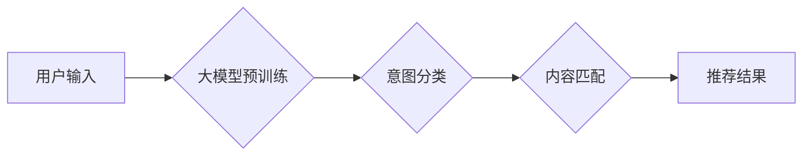

                 

## 基于大模型的推荐系统用户意图理解

> 关键词：大模型、推荐系统、用户意图、自然语言处理、Transformer、BERT、Fine-tuning

## 1. 背景介绍

推荐系统作为互联网时代的重要技术之一，旨在根据用户的历史行为、偏好和上下文信息，预测用户可能感兴趣的内容并提供个性化的推荐。传统的推荐系统主要依赖于协同过滤、内容过滤和基于知识的推荐算法，但这些方法在面对用户行为的复杂性和内容的多样性时，往往难以准确捕捉用户的真实意图。

近年来，大模型的快速发展为推荐系统带来了新的机遇。大模型，例如BERT、GPT等，拥有强大的语义理解和文本生成能力，能够更好地理解用户的自然语言表达，从而更准确地识别用户的意图。基于大模型的推荐系统能够更深入地挖掘用户需求，提供更精准、更个性化的推荐体验。

## 2. 核心概念与联系

### 2.1 用户意图理解

用户意图是指用户在与推荐系统交互时，想要达成的目标或需求。例如，用户搜索“电影推荐”可能意图是想观看一部新上映的喜剧电影，而搜索“美食推荐”可能意图是想寻找一家附近评分高的餐厅。准确理解用户的意图是推荐系统提供个性化推荐的关键。

### 2.2 大模型

大模型是指参数量巨大、训练数据海量的人工智能模型。它们通过学习海量文本数据，掌握了丰富的语言知识和语义理解能力。大模型可以用于各种自然语言处理任务，例如文本分类、问答系统、机器翻译等。

### 2.3 推荐系统架构

基于大模型的推荐系统通常采用以下架构：



**流程图说明：**

1. 用户输入：用户向推荐系统发出请求，例如搜索关键词、浏览商品等。
2. 大模型预训练：预训练的大模型能够理解用户的自然语言表达，提取关键信息。
3. 意图分类：根据用户的输入，模型识别用户的意图，例如搜索、购买、评论等。
4. 内容匹配：根据识别的意图，模型匹配用户感兴趣的内容，例如推荐相关的商品、文章、视频等。
5. 推荐结果：系统返回个性化的推荐结果给用户。

## 3. 核心算法原理 & 具体操作步骤

### 3.1 算法原理概述

基于大模型的推荐系统主要利用大模型的强大的语义理解能力，通过以下步骤实现用户意图理解：

1. **文本预处理:** 对用户输入的文本进行清洗、分词、词性标注等预处理操作，以便模型更好地理解文本内容。
2. **特征提取:** 利用大模型的嵌入层，将文本转换为向量表示，提取文本的语义特征。
3. **意图分类:** 使用分类模型，例如BERT、RoBERTa等，对文本的语义特征进行分类，识别用户的意图。

### 3.2 算法步骤详解

1. **数据准备:** 收集用户行为数据、文本数据等，并进行清洗、标注等预处理工作。
2. **模型选择:** 选择合适的预训练大模型，例如BERT、GPT等，并根据任务需求进行微调。
3. **模型训练:** 使用准备好的数据训练模型，优化模型参数，提高模型的准确率。
4. **模型评估:** 使用测试数据评估模型的性能，例如准确率、召回率等。
5. **模型部署:** 将训练好的模型部署到生产环境中，用于实际的推荐系统。

### 3.3 算法优缺点

**优点:**

* **语义理解能力强:** 大模型能够更好地理解用户的自然语言表达，提高意图识别的准确率。
* **泛化能力强:** 预训练的大模型已经掌握了丰富的语言知识，能够应用于不同的推荐场景。
* **可扩展性强:** 大模型可以根据需要进行微调，适应不同的任务需求。

**缺点:**

* **计算资源消耗大:** 大模型的训练和部署需要大量的计算资源。
* **数据依赖性强:** 大模型的性能依赖于训练数据的质量和数量。
* **解释性差:** 大模型的决策过程较为复杂，难以解释模型的决策结果。

### 3.4 算法应用领域

基于大模型的推荐系统可以应用于各种场景，例如：

* **电商推荐:** 根据用户的浏览历史、购买记录等信息，推荐相关的商品。
* **内容推荐:** 根据用户的阅读习惯、兴趣爱好等信息，推荐相关的文章、视频、音频等内容。
* **社交推荐:** 根据用户的社交关系、兴趣爱好等信息，推荐相关的用户、群组等内容。

## 4. 数学模型和公式 & 详细讲解 & 举例说明

### 4.1 数学模型构建

基于大模型的推荐系统通常采用基于概率的数学模型，例如贝叶斯网络、隐马尔可夫模型等，来建模用户行为和意图。

**举例说明:**

假设我们想要构建一个基于贝叶斯网络的用户意图分类模型。我们可以将用户意图分为不同的类别，例如搜索、购买、评论等。每个类别都对应一个概率分布，表示用户在不同类别下的概率。

### 4.2 公式推导过程

我们可以使用贝叶斯定理来推导用户意图的概率分布。

$$P(C|D) = \frac{P(D|C)P(C)}{P(D)}$$

其中：

* $P(C|D)$ 是用户属于类别 $C$ 的概率，给定用户输入 $D$ 的条件下。
* $P(D|C)$ 是用户输入 $D$ 的概率，给定用户属于类别 $C$ 的条件下。
* $P(C)$ 是用户属于类别 $C$ 的先验概率。
* $P(D)$ 是用户输入 $D$ 的概率。

### 4.3 案例分析与讲解

我们可以使用训练好的大模型来计算 $P(D|C)$ 和 $P(C)$ 的值。然后，根据贝叶斯定理，我们可以计算出用户属于不同类别的概率，从而识别用户的意图。

## 5. 项目实践：代码实例和详细解释说明

### 5.1 开发环境搭建

* Python 3.6+
* TensorFlow/PyTorch
* NLTK/SpaCy

### 5.2 源代码详细实现

```python
# 导入必要的库
import tensorflow as tf
from transformers import BertTokenizer, BertModel

# 加载预训练模型和词典
tokenizer = BertTokenizer.from_pretrained('bert-base-uncased')
model = BertModel.from_pretrained('bert-base-uncased')

# 定义用户输入文本
user_input = "我想看一部科幻电影"

# 对文本进行预处理
input_ids = tokenizer.encode(user_input, add_special_tokens=True)

# 将文本输入到模型中
outputs = model(tf.constant([input_ids]))

# 从模型输出中提取特征
last_hidden_state = outputs.last_hidden_state

# 使用分类模型对特征进行分类
# ...

# 输出分类结果
```

### 5.3 代码解读与分析

* 代码首先导入必要的库，并加载预训练的BERT模型和词典。
* 然后，定义用户输入文本，并使用BERT模型对文本进行编码，得到文本的语义特征。
* 最后，使用分类模型对特征进行分类，并输出分类结果。

### 5.4 运行结果展示

运行代码后，模型会输出用户的意图分类结果，例如“搜索电影”。

## 6. 实际应用场景

基于大模型的推荐系统已经应用于许多实际场景，例如：

* **电商平台:** 淘宝、京东等电商平台利用大模型来理解用户的商品搜索意图，提供更精准的商品推荐。
* **内容平台:** 知乎、今日头条等内容平台利用大模型来理解用户的阅读兴趣，推荐相关的文章、视频等内容。
* **社交平台:** 微信、微博等社交平台利用大模型来理解用户的社交需求，推荐相关的用户、群组等内容。

### 6.4 未来应用展望

未来，基于大模型的推荐系统将朝着以下方向发展：

* **更精准的推荐:** 利用更强大的大模型和更丰富的用户数据，提供更精准、更个性化的推荐。
* **更丰富的交互方式:** 支持语音、图像等多模态的交互方式，提供更丰富的用户体验。
* **更智能的推荐:** 利用机器学习和深度学习算法，实现推荐系统的自学习和自优化，提供更智能的推荐。

## 7. 工具和资源推荐

### 7.1 学习资源推荐

* **书籍:**
    * 《深度学习》
    * 《自然语言处理》
    * 《大模型》
* **在线课程:**
    * Coursera: 自然语言处理
    * Udacity: 深度学习
    * fast.ai: 深度学习

### 7.2 开发工具推荐

* **TensorFlow:** 开源深度学习框架
* **PyTorch:** 开源深度学习框架
* **HuggingFace Transformers:** 预训练大模型库

### 7.3 相关论文推荐

* BERT: Pre-training of Deep Bidirectional Transformers for Language Understanding
* GPT-3: Language Models are Few-Shot Learners
* XLNet: Generalized Autoregressive Pretraining for Language Understanding

## 8. 总结：未来发展趋势与挑战

### 8.1 研究成果总结

基于大模型的推荐系统取得了显著的成果，能够更好地理解用户的意图，提供更精准、更个性化的推荐体验。

### 8.2 未来发展趋势

未来，基于大模型的推荐系统将朝着更精准、更智能、更丰富的方向发展。

### 8.3 面临的挑战

* **数据隐私:** 大模型的训练需要大量的用户数据，如何保护用户隐私是一个重要的挑战。
* **模型解释性:** 大模型的决策过程较为复杂，难以解释模型的决策结果，如何提高模型的解释性是一个重要的研究方向。
* **模型可扩展性:** 大模型的训练和部署需要大量的计算资源，如何提高模型的可扩展性是一个重要的技术挑战。

### 8.4 研究展望

未来，我们将继续研究基于大模型的推荐系统，探索更有效的算法、更强大的模型和更安全的应用场景。


## 9. 附录：常见问题与解答

**Q1: 如何选择合适的预训练大模型？**

**A1:** 选择预训练大模型需要根据具体的应用场景和任务需求进行选择。例如，对于文本分类任务，BERT、RoBERTa等模型效果较好。

**Q2: 如何评估基于大模型的推荐系统的性能？**

**A2:** 可以使用准确率、召回率、F1-score等指标来评估基于大模型的推荐系统的性能。

**Q3: 如何解决数据隐私问题？**

**A3:** 可以使用联邦学习等技术来解决数据隐私问题，避免将用户数据集中存储。


作者：禅与计算机程序设计艺术 / Zen and the Art of Computer Programming 
<end_of_turn>

