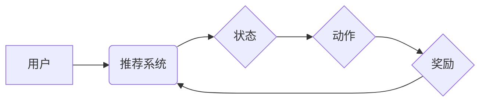

                 

## 基于强化学习的动态推荐策略适应

> 关键词：强化学习、推荐系统、动态策略、用户行为、个性化推荐

## 1. 背景介绍

推荐系统作为信息过滤和个性化内容呈现的关键技术，在电商、社交媒体、视频平台等领域发挥着越来越重要的作用。传统的推荐系统主要依赖于协同过滤、内容过滤等静态方法，难以适应用户行为的动态变化和个性化需求。随着人工智能技术的快速发展，基于强化学习的动态推荐策略逐渐成为研究热点。

强化学习是一种机器学习方法，通过强化信号（奖励或惩罚）来训练智能体，使其在环境中采取最优行动。将强化学习应用于推荐系统，可以使推荐策略更加灵活、适应性强，能够根据用户的实时反馈和行为模式进行动态调整，从而提供更精准、更个性化的推荐结果。

## 2. 核心概念与联系

### 2.1 强化学习

强化学习的核心概念包括：

* **智能体 (Agent):**  推荐系统中的智能体，负责根据用户行为和环境信息做出推荐决策。
* **环境 (Environment):**  推荐系统所处的环境，包括用户、物品、交互历史等信息。
* **状态 (State):**  智能体在环境中所处的状态，例如用户的兴趣偏好、浏览历史等。
* **动作 (Action):**  智能体可以采取的行动，例如推荐特定物品、调整推荐策略等。
* **奖励 (Reward):**  智能体采取特定动作后获得的反馈信号，用于评估动作的好坏。

### 2.2 推荐系统

推荐系统旨在根据用户的历史行为和偏好，预测用户对特定物品的兴趣，并提供个性化的推荐。

### 2.3 动态策略适应

动态策略适应是指根据用户的实时反馈和行为模式，不断调整推荐策略，以提高推荐效果。

**核心概念与联系流程图:**



## 3. 核心算法原理 & 具体操作步骤

### 3.1 算法原理概述

基于强化学习的动态推荐策略通常采用**Q学习**算法或其变种。Q学习是一种经典的强化学习算法，通过学习**Q值**来指导智能体选择最优动作。Q值代表了在特定状态下采取特定动作的期望累积奖励。

### 3.2 算法步骤详解

1. **初始化Q值表:** 为所有状态-动作对赋予初始Q值，通常设置为0。
2. **获取初始状态:** 从环境中获取用户的初始状态，例如用户的兴趣偏好、浏览历史等。
3. **选择动作:** 根据当前状态和Q值表，选择一个动作，例如推荐特定物品。
4. **执行动作:** 在环境中执行选择的动作，并观察环境的反馈，即奖励。
5. **更新Q值:** 根据Bellman方程更新Q值，以反映当前状态-动作对的期望累积奖励。
6. **重复步骤3-5:**  重复以上步骤，直到智能体学习到最优策略。

### 3.3 算法优缺点

**优点:**

* **适应性强:**  可以根据用户的实时反馈和行为模式进行动态调整。
* **个性化推荐:**  可以学习用户的个性化偏好，提供更精准的推荐。
* **可解释性:**  Q值表可以直观地反映智能体对不同状态-动作对的评估。

**缺点:**

* **数据需求:**  需要大量的用户行为数据进行训练。
* **计算复杂度:**  Q值表的更新需要大量的计算。
* **探索与利用的平衡:**  需要平衡探索新物品和利用已知信息，以找到最优策略。

### 3.4 算法应用领域

* **电商推荐:**  推荐商品、优惠券、促销活动等。
* **社交媒体推荐:**  推荐好友、话题、文章等。
* **视频平台推荐:**  推荐视频、节目、用户等。
* **音乐平台推荐:**  推荐歌曲、专辑、艺术家等。

## 4. 数学模型和公式 & 详细讲解 & 举例说明

### 4.1 数学模型构建

强化学习的数学模型主要包括状态空间、动作空间、奖励函数和价值函数。

* **状态空间 (S):**  所有可能的系统状态的集合。
* **动作空间 (A):**  智能体在每个状态下可以采取的所有动作的集合。
* **奖励函数 (R):**  描述智能体在特定状态采取特定动作后获得的奖励。
* **价值函数 (V):**  描述在特定状态下采取最优策略的期望累积奖励。

### 4.2 公式推导过程

Q学习算法的核心公式是Bellman方程：

$$Q(s,a) = Q(s,a) + \alpha [r + \gamma \max_{a'} Q(s',a') - Q(s,a)]$$

其中：

* $Q(s,a)$:  在状态 $s$ 下采取动作 $a$ 的Q值。
* $\alpha$:  学习率，控制学习速度。
* $r$:  在状态 $s$ 下采取动作 $a$ 后获得的奖励。
* $\gamma$:  折扣因子，控制未来奖励的权重。
* $s'$:  执行动作 $a$ 后进入的下一个状态。
* $a'$:  在下一个状态 $s'$ 下采取的最优动作。

### 4.3 案例分析与讲解

假设一个推荐系统，状态 $s$ 包含用户的兴趣偏好，动作 $a$ 包含推荐特定物品，奖励 $r$ 为用户点击或购买该物品的概率。

当用户对某个物品感兴趣时，推荐该物品的Q值会增加，反之则会减少。通过不断学习和更新Q值，推荐系统可以逐渐学习到用户喜欢的物品类型，并提供更精准的推荐。

## 5. 项目实践：代码实例和详细解释说明

### 5.1 开发环境搭建

* Python 3.x
* TensorFlow 或 PyTorch
* Jupyter Notebook

### 5.2 源代码详细实现

```python
import tensorflow as tf

# 定义Q网络
class QNetwork(tf.keras.Model):
    def __init__(self):
        super(QNetwork, self).__init__()
        self.dense1 = tf.keras.layers.Dense(64, activation='relu')
        self.dense2 = tf.keras.layers.Dense(32, activation='relu')
        self.output = tf.keras.layers.Dense(num_actions)

    def call(self, state):
        x = self.dense1(state)
        x = self.dense2(x)
        return self.output(x)

# 定义Q学习算法
def q_learning(env, q_network, alpha, gamma, epsilon):
    # ... (算法实现细节)

# 实例化环境、Q网络、参数
env = ...
q_network = QNetwork()
alpha = 0.1
gamma = 0.9
epsilon = 0.1

# 训练Q网络
q_learning(env, q_network, alpha, gamma, epsilon)
```

### 5.3 代码解读与分析

* Q网络是一个简单的多层感知机，用于估计状态-动作对的Q值。
* Q学习算法通过迭代更新Q值，学习最优策略。
* 环境模拟用户行为和推荐系统交互。
* 参数 $\alpha$, $\gamma$, $\epsilon$ 控制学习速度、未来奖励权重和探索策略。

### 5.4 运行结果展示

* 通过训练Q网络，可以获得用户对不同物品的Q值，并根据Q值进行推荐。
* 可以通过评估指标，例如点击率、转化率等，来衡量推荐系统的性能。

## 6. 实际应用场景

### 6.1 电商推荐

基于强化学习的动态推荐策略可以用于推荐商品、优惠券、促销活动等，提高用户购物体验和转化率。

### 6.2 社交媒体推荐

可以用于推荐好友、话题、文章等，增强用户粘性和社交互动。

### 6.3 视频平台推荐

可以用于推荐视频、节目、用户等，提高用户观看时长和用户留存率。

### 6.4 未来应用展望

* **个性化学习路径:**  根据用户的学习进度和偏好，推荐个性化的学习路径和资源。
* **医疗诊断辅助:**  根据患者的症状和病史，推荐可能的诊断方案和治疗方案。
* **智能客服:**  根据用户的咨询内容，推荐合适的解决方案和服务。

## 7. 工具和资源推荐

### 7.1 学习资源推荐

* **书籍:**
    * Reinforcement Learning: An Introduction by Richard S. Sutton and Andrew G. Barto
    * Deep Reinforcement Learning Hands-On by Maxim Lapan
* **在线课程:**
    * Deep Reinforcement Learning Specialization by DeepLearning.AI
    * Reinforcement Learning by David Silver (University of DeepMind)

### 7.2 开发工具推荐

* **TensorFlow:**  开源深度学习框架，支持强化学习算法的实现。
* **PyTorch:**  开源深度学习框架，灵活易用，适合强化学习研究。
* **OpenAI Gym:**  强化学习环境库，提供各种标准的强化学习任务。

### 7.3 相关论文推荐

* **Deep Q-Network (DQN)** by Volodymyr Mnih et al. (2015)
* **Proximal Policy Optimization Algorithms** by John Schulman et al. (2017)
* **Asynchronous Methods for Deep Reinforcement Learning** by David Silver et al. (2016)

## 8. 总结：未来发展趋势与挑战

### 8.1 研究成果总结

基于强化学习的动态推荐策略取得了显著的成果，能够提供更精准、更个性化的推荐，提高用户体验和商业价值。

### 8.2 未来发展趋势

* **模型复杂度提升:**  探索更复杂的强化学习模型，例如Transformer、Graph Neural Networks等，以更好地捕捉用户行为和物品关系。
* **数据效率提升:**  研究更有效的训练方法，例如迁移学习、联邦学习等，以降低数据需求和训练成本。
* **解释性增强:**  开发更可解释的强化学习模型，以便更好地理解推荐策略背后的决策机制。

### 8.3 面临的挑战

* **数据隐私保护:**  强化学习算法需要大量用户行为数据，如何保护用户隐私是一个重要挑战。
* **公平性与偏见:**  强化学习模型可能学习到用户偏见，导致推荐结果不公平，需要研究如何 mitigate 这些问题。
* **可解释性与信任:**  强化学习模型的决策机制往往难以理解，如何提高模型的可解释性和用户信任是一个关键问题。

### 8.4 研究展望

未来，基于强化学习的动态推荐策略将继续朝着更智能、更个性化、更可解释的方向发展，为用户提供更优质的体验和服务。

## 9. 附录：常见问题与解答

* **Q:  强化学习与传统推荐系统的区别是什么？**

**A:**  传统推荐系统主要依赖于静态特征和历史数据，而强化学习则通过实时反馈和交互学习，能够更灵活地适应用户的动态变化。

* **Q:  强化学习的训练需要多少数据？**

**A:**  强化学习算法对数据的需求量较大，通常需要大量的用户行为数据进行训练。

* **Q:  如何评估强化学习推荐系统的性能？**

**A:**  常用的评估指标包括点击率、转化率、用户满意度等。

* **Q:  强化学习推荐系统存在哪些伦理问题？**

**A:**  强化学习模型可能学习到用户偏见，导致推荐结果不公平，需要研究如何 mitigate 这些问题。


作者：禅与计算机程序设计艺术 / Zen and the Art of Computer Programming 
<end_of_turn>

