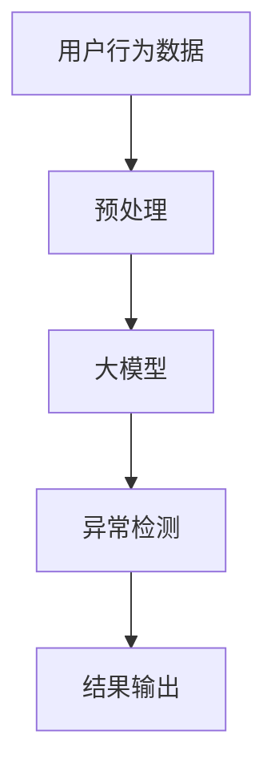

                 

## 1. 背景介绍

在电商平台上，用户行为异常检测是维护平台安全和保护用户利益的关键一环。传统的异常检测方法通常基于手工特征工程和传统机器学习模型，但这些方法面临着特征选择困难、模型泛化能力有限等挑战。大模型的出现为异常检测带来了新的机遇，本文将探讨大模型在电商平台用户行为异常检测中的应用。

## 2. 核心概念与联系

### 2.1 大模型（Large Language Models）

大模型是指具有数十亿甚至数千亿参数的语言模型，通过自回归预测训练而成。它们可以理解和生成人类语言，并展现出惊人的泛化能力。在异常检测任务中，大模型可以学习用户正常行为的模式，从而识别异常行为。

### 2.2 用户行为异常检测（Anomaly Detection in User Behavior）

用户行为异常检测旨在识别电商平台上异常的用户行为，如恶意购买、刷单、虚假评价等。异常检测通常基于监督学习、无监督学习或半监督学习框架进行。

下图展示了大模型在电商平台用户行为异常检测中的架构：



## 3. 核心算法原理 & 具体操作步骤

### 3.1 算法原理概述

大模型在异常检测中的核心原理是学习用户正常行为的分布，并将异常行为定义为落在该分布外的行为。具体而言，大模型首先学习用户行为的上下文，然后预测下一个行为。异常检测则基于预测的准确性或模型的不确定性进行。

### 3.2 算法步骤详解

1. **数据预处理**：收集用户行为数据，包括点击、购买、评价等。对数据进行清洗、去重、缺失值填充等预处理。
2. **大模型训练**：使用预处理后的数据训练大模型。常用的大模型架构包括 Transformer、BERT 等。
3. **异常检测**：使用训练好的大模型对新的用户行为进行预测。如果预测的准确性低或模型的不确定性高，则标记该行为为异常。
4. **结果输出**：输出异常检测结果，并根据需要采取相应措施。

### 3.3 算法优缺点

**优点**：

- 大模型可以学习到丰富的上下文信息，从而提高异常检测的准确性。
- 无需手工特征工程，节省了大量人力物力。
- 具有良好的泛化能力，可以适应新的用户行为。

**缺点**：

- 训练大模型需要大量的计算资源和时间。
- 大模型存在过拟合的风险，需要进行正则化或其他防止过拟合的措施。
- 大模型的解释性较差，难以理解其决策的原因。

### 3.4 算法应用领域

大模型在异常检测中的应用不仅限于电商平台，还可以应用于金融领域的欺诈检测、网络安全领域的入侵检测、医疗领域的病理检测等。

## 4. 数学模型和公式 & 详细讲解 & 举例说明

### 4.1 数学模型构建

设用户行为序列为 $X = (x_1, x_2,..., x_n)$, 其中 $x_i$ 表示第 $i$ 个用户行为。大模型的目标是学习条件概率分布 $P(X_{i+1} | X_1,..., X_i)$, 即预测下一个用户行为给定前 $i$ 个用户行为的条件下的概率分布。

### 4.2 公式推导过程

大模型通常使用交叉熵损失函数进行训练。设真实的下一个用户行为为 $y$, 则损失函数定义为：

$$
L = -\log P(y | X_1,..., X_i)
$$

大模型的目标是最小化损失函数 $L$, 即最大化条件概率分布 $P(y | X_1,..., X_i)$.

### 4.3 案例分析与讲解

例如，在电商平台上，用户行为序列 $X$ 可能是 $(搜索: "iPhone", 点击: "iPhone 12", 添加购物车: "iPhone 12", 购买: "iPhone 12")$. 大模型的目标是学习条件概率分布 $P(下一个行为 | 搜索: "iPhone", 点击: "iPhone 12", 添加购物车: "iPhone 12")$, 并预测下一个用户行为。

## 5. 项目实践：代码实例和详细解释说明

### 5.1 开发环境搭建

本项目使用 Python 语言开发，并依赖于 Transformers 库训练大模型。首先，安装必要的库：

```bash
pip install transformers datasets torch
```

### 5.2 源代码详细实现

以下是大模型训练和异常检测的伪代码：

```python
from transformers import AutoTokenizer, AutoModelForCausalLM
from datasets import load_dataset

# 1. 加载数据集
dataset = load_dataset('your_dataset')

# 2. 加载 tokenizer 和模型
tokenizer = AutoTokenizer.from_pretrained('bigscience/bloom')
model = AutoModelForCausalLM.from_pretrained('bigscience/bloom')

# 3. 预处理数据
def preprocess_function(examples):
    # 将用户行为序列转换为 token IDs
    return tokenizer(examples['behavior_sequence'], truncation=True, padding='max_length')

# 4. 训练大模型
tokenized_dataset = dataset.map(preprocess_function, batched=True)
model.train(tokenized_dataset)

# 5. 异常检测
def detect_anomaly(behavior_sequence):
    # 将用户行为序列转换为 token IDs
    inputs = tokenizer(behavior_sequence, return_tensors='pt')
    # 预测下一个用户行为
    outputs = model(**inputs, labels=inputs['input_ids'])
    # 计算损失函数值，若值过高则标记为异常
    loss = outputs.loss
    if loss > threshold:
        return True
    else:
        return False
```

### 5.3 代码解读与分析

上述代码首先加载数据集和预训练的大模型。然后，对数据进行预处理，将用户行为序列转换为 token IDs。接着，使用预处理后的数据训练大模型。最后，定义异常检测函数，将用户行为序列转换为 token IDs，预测下一个用户行为，并根据损失函数值判断是否为异常行为。

### 5.4 运行结果展示

运行上述代码后，异常检测函数会返回一个布尔值，表示用户行为序列是否为异常。可以根据需要采取相应措施，如发送警报、限制用户行为等。

## 6. 实际应用场景

### 6.1 电商平台用户行为异常检测

大模型可以应用于电商平台的用户行为异常检测，帮助平台维护安全和保护用户利益。例如，可以检测刷单、虚假评价等异常行为。

### 6.2 金融领域欺诈检测

大模型也可以应用于金融领域的欺诈检测，帮助金融机构保护客户资金安全。例如，可以检测信用卡欺诈、网络银行欺诈等。

### 6.3 未来应用展望

随着大模型技术的不断发展，其在异常检测领域的应用将更加广泛。未来，大模型有望应用于更多领域，如医疗、交通等，帮助人们识别和应对各种异常情况。

## 7. 工具和资源推荐

### 7.1 学习资源推荐

- "Attention is All You Need"：https://arxiv.org/abs/1706.03762
- "BERT: Pre-training of Deep Bidirectional Transformers for Language Understanding"：https://arxiv.org/abs/1810.04805
- "Large Language Models are Few-Shot Learners"：https://arxiv.org/abs/2005.14165

### 7.2 开发工具推荐

- Transformers 库：https://huggingface.co/transformers/
- Datasets 库：https://huggingface.co/datasets/

### 7.3 相关论文推荐

- "Anomaly Detection Using Large Language Models"：https://arxiv.org/abs/2107.01297
- "Unsupervised Anomaly Detection with Large Language Models"：https://arxiv.org/abs/2108.08835

## 8. 总结：未来发展趋势与挑战

### 8.1 研究成果总结

本文介绍了大模型在电商平台用户行为异常检测中的应用。通过学习用户正常行为的分布，大模型可以识别异常行为，帮助平台维护安全和保护用户利益。

### 8.2 未来发展趋势

未来，大模型技术将不断发展，其在异常检测领域的应用也将更加广泛。大模型有望应用于更多领域，帮助人们识别和应对各种异常情况。

### 8.3 面临的挑战

然而，大模型技术也面临着一些挑战，如训练资源消耗大、过拟合风险等。此外，大模型的解释性较差，难以理解其决策的原因，也是一个亟待解决的问题。

### 8.4 研究展望

未来的研究方向包括但不限于以下几个方面：

- 研究大模型的解释性，帮助人们理解其决策的原因。
- 研究大模型的过拟合问题，提出有效的防止过拟合的措施。
- 研究大模型在更多领域的应用，如医疗、交通等。

## 9. 附录：常见问题与解答

**Q1：大模型在异常检测中的优势是什么？**

A1：大模型可以学习丰富的上下文信息，从而提高异常检测的准确性。此外，大模型无需手工特征工程，节省了大量人力物力，且具有良好的泛化能力。

**Q2：大模型在异常检测中的缺点是什么？**

A2：大模型训练需要大量的计算资源和时间，存在过拟合的风险，且解释性较差。

**Q3：大模型在异常检测中的应用领域有哪些？**

A3：大模型在异常检测中的应用领域包括但不限于电商平台、金融领域、网络安全领域、医疗领域等。

**Q4：如何构建大模型的数学模型？**

A4：大模型的数学模型是学习条件概率分布 $P(X_{i+1} | X_1,..., X_i)$, 即预测下一个用户行为给定前 $i$ 个用户行为的条件下的概率分布。

**Q5：如何推导大模型的公式？**

A5：大模型通常使用交叉熵损失函数进行训练。设真实的下一个用户行为为 $y$, 则损失函数定义为 $L = -\log P(y | X_1,..., X_i)$. 大模型的目标是最小化损失函数 $L$, 即最大化条件概率分布 $P(y | X_1,..., X_i)$.

**Q6：如何使用大模型进行异常检测？**

A6：使用训练好的大模型对新的用户行为进行预测。如果预测的准确性低或模型的不确定性高，则标记该行为为异常。

**Q7：大模型在异常检测中的未来发展趋势是什么？**

A7：未来，大模型技术将不断发展，其在异常检测领域的应用也将更加广泛。大模型有望应用于更多领域，帮助人们识别和应对各种异常情况。

**Q8：大模型在异常检测中的挑战是什么？**

A8：大模型技术面临的挑战包括但不限于训练资源消耗大、过拟合风险、解释性较差等。

**Q9：未来的研究方向是什么？**

A9：未来的研究方向包括但不限于研究大模型的解释性、研究大模型的过拟合问题、研究大模型在更多领域的应用等。

**Q10：如何学习大模型技术？**

A10：可以阅读相关论文、使用开源的大模型库、参加相关的会议和培训等。

## 作者：禅与计算机程序设计艺术 / Zen and the Art of Computer Programming

