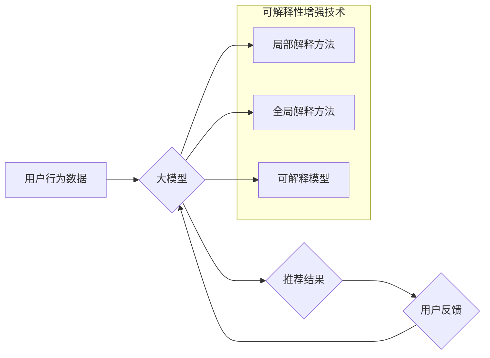

                 

## 大模型推荐中的模型可解释性增强技术探索与实践

> 关键词：大模型、推荐系统、模型可解释性、XAI、LIME、SHAP、案例分析

## 1. 背景介绍

近年来，深度学习模型在推荐系统领域取得了显著的成功，例如基于协同过滤、内容过滤和混合方法的推荐模型，能够精准地预测用户对商品或服务的偏好，为用户提供个性化的推荐服务。然而，随着模型复杂度的不断增加，大模型的决策过程变得越来越难以理解。缺乏可解释性使得模型的应用受到限制，难以获得用户的信任和接受。

模型可解释性（Model Interpretability，简称XAI）是指能够理解和解释机器学习模型的决策过程的能力。对于推荐系统来说，可解释性至关重要，因为它可以帮助我们：

* **理解模型的决策逻辑：** 识别哪些特征对推荐结果有重要影响，从而更好地理解用户偏好和推荐机制。
* **提高模型的信任度：** 当用户能够理解模型的决策过程时，他们会更加信任模型的推荐结果。
* **发现模型的潜在偏差：** 通过分析模型的决策过程，可以发现潜在的偏见，并采取措施进行纠正。
* **改进模型的性能：** 通过分析模型的错误决策，可以找到模型的不足之处，并进行改进。

## 2. 核心概念与联系

模型可解释性增强技术旨在提高机器学习模型的透明度和可理解性。它涵盖了多种方法，包括：

* **局部解释方法：** 例如LIME（Local Interpretable Model-agnostic Explanations）和SHAP（SHapley Additive exPlanations），它们可以解释单个预测结果背后的决策逻辑。
* **全局解释方法：** 例如特征重要性分析和决策树可视化，它们可以解释模型整体的决策机制。
* **可解释模型：** 例如线性回归和决策树，它们本身就具有可解释性，更容易理解其决策过程。

**Mermaid 流程图**



## 3. 核心算法原理 & 具体操作步骤

### 3.1  算法原理概述

**LIME**是一种局部解释方法，它通过构建一个简单的可解释模型来近似大模型在特定输入下的决策过程。具体来说，LIME会：

1. **采样：** 在大模型预测的附近随机采样一些数据点。
2. **扰动：** 对每个采样数据点进行扰动，生成一系列新的数据点。
3. **预测：** 使用大模型和可解释模型分别对每个扰动数据点进行预测。
4. **训练：** 使用扰动数据点和预测结果训练可解释模型。
5. **解释：** 使用训练好的可解释模型解释大模型在特定输入下的决策过程。

**SHAP**是一种全局解释方法，它基于博弈论中的Shapley值来分配特征对预测结果的贡献。具体来说，SHAP会：

1. **定义特征集：** 将所有特征划分为不同的子集。
2. **计算Shapley值：** 对于每个特征，计算其在不同特征子集中的贡献值。
3. **解释：** 根据Shapley值，解释每个特征对预测结果的贡献。

### 3.2  算法步骤详解

**LIME算法步骤详解：**

1. **数据准备：** 首先需要准备一个包含用户行为数据的训练集。
2. **模型训练：** 使用大模型训练一个推荐模型。
3. **样本选择：** 选择一个需要解释的预测结果，并从训练集中选择一些与该预测结果相似的样本点。
4. **扰动生成：** 对每个样本点进行扰动，生成一系列新的样本点。
5. **模型训练：** 使用扰动样本点和预测结果训练一个简单的可解释模型，例如线性回归模型。
6. **解释结果：** 使用训练好的可解释模型解释大模型在特定输入下的决策过程。

**SHAP算法步骤详解：**

1. **特征集划分：** 将所有特征划分为不同的子集。
2. **Shapley值计算：** 对于每个特征，计算其在不同特征子集中的贡献值。
3. **贡献值排序：** 根据Shapley值，对所有特征进行排序，并绘制特征重要性图。

### 3.3  算法优缺点

**LIME算法优缺点：**

* **优点：** 
    * 可以解释单个预测结果背后的决策逻辑。
    * 对模型类型不敏感，可以应用于各种类型的机器学习模型。
* **缺点：** 
    * 只能解释局部决策，无法解释模型整体的决策机制。
    * 可解释模型的训练过程可能比较复杂。

**SHAP算法优缺点：**

* **优点：** 
    * 可以解释模型整体的决策机制。
    * 基于博弈论的Shapley值，具有较强的理论基础。
* **缺点：** 
    * 计算复杂度较高，对于大型模型可能需要较长时间。
    * 难以解释高维特征的情况。

### 3.4  算法应用领域

LIME和SHAP算法广泛应用于推荐系统、自然语言处理、计算机视觉等领域，用于解释机器学习模型的决策过程。

## 4. 数学模型和公式 & 详细讲解 & 举例说明

### 4.1  数学模型构建

**LIME算法数学模型：**

LIME算法的目标是找到一个简单的可解释模型 $f(x)$，它能够近似大模型 $g(x)$ 在特定输入 $x$ 处的预测结果。

$$
f(x) = \arg\min_{f} \mathcal{L}(f, g(x))
$$

其中，$\mathcal{L}$ 是损失函数，用于衡量 $f(x)$ 和 $g(x)$ 之间的差异。

**SHAP算法数学模型：**

SHAP算法基于博弈论中的Shapley值，将特征的贡献值定义为其在不同特征子集中的平均贡献。

$$
\phi_i(S) = \frac{1}{|S|!} \sum_{\substack{T \subseteq S \\ i \in T}} \frac{(|S| - |T|)!}{(|T| - 1)!} [g(S \cup \{i\}) - g(S \setminus \{i\})]
$$

其中，$\phi_i(S)$ 是特征 $i$ 在特征子集 $S$ 中的Shapley值，$g(S)$ 是模型在特征子集 $S$ 中的预测结果。

### 4.2  公式推导过程

LIME算法的损失函数通常采用二范数或KL散度，SHAP算法的Shapley值计算公式基于博弈论的Shapley价值分配原理。

### 4.3  案例分析与讲解

**LIME算法案例分析：**

假设我们有一个推荐电影的模型，需要解释为什么模型推荐了一部特定的电影给某个用户。我们可以使用LIME算法来分析模型的决策过程。

首先，我们选择该用户观看过的电影作为样本点，并对这些样本点进行扰动，生成一系列新的样本点。然后，我们使用LIME算法训练一个简单的可解释模型，例如线性回归模型，来近似大模型在这些样本点上的预测结果。

最后，我们可以使用训练好的可解释模型来解释大模型推荐该电影的原因。例如，如果可解释模型显示出用户观看过的动作片数量与推荐结果之间存在正相关关系，则说明大模型可能根据用户的观看历史推荐了动作片。

**SHAP算法案例分析：**

假设我们有一个预测用户购买商品的模型，需要解释哪些特征对预测结果有重要影响。我们可以使用SHAP算法来分析模型的决策过程。

首先，我们计算每个特征在不同特征子集中的Shapley值。然后，我们可以根据Shapley值绘制特征重要性图，显示每个特征对预测结果的贡献大小。

例如，如果特征重要性图显示出用户的年龄和购买历史对预测结果有较大的贡献，则说明大模型可能根据用户的年龄和购买历史来预测其购买商品的可能性。

## 5. 项目实践：代码实例和详细解释说明

### 5.1  开发环境搭建

* Python 3.7+
* TensorFlow 2.0+
* scikit-learn 0.23+
* SHAP 0.39+
* LIME 0.1.0+

### 5.2  源代码详细实现

```python
# 使用SHAP解释模型决策
import shap

# 加载模型
model = load_model("my_model.h5")

# 生成特征值
explainer = shap.TreeExplainer(model)
shap_values = explainer(X_test)

# 可视化特征重要性
shap.summary_plot(shap_values, X_test)

# 使用LIME解释单个预测结果
from lime import lime_tabular

# 加载模型
model = load_model("my_model.h5")

# 选择需要解释的预测结果
instance = X_test[0]

# 使用LIME解释模型决策
explainer = lime_tabular.LimeTabularExplainer(X_train, feature_names=feature_names, class_names=class_names)
explanation = explainer.explain_instance(instance, model.predict, top_labels=1)

# 可视化解释结果
explanation.as_list()
explanation.as_pyplot_figure()
```

### 5.3  代码解读与分析

* **SHAP算法代码实现：**
    * 使用`shap.TreeExplainer`创建解释器对象。
    * 使用`explainer(X_test)`计算特征值。
    * 使用`shap.summary_plot`绘制特征重要性图。
* **LIME算法代码实现：**
    * 使用`lime_tabular.LimeTabularExplainer`创建解释器对象。
    * 使用`explainer.explain_instance`解释模型决策。
    * 使用`explanation.as_list()`和`explanation.as_pyplot_figure()`可视化解释结果。

### 5.4  运行结果展示

运行上述代码后，可以生成特征重要性图和解释结果的可视化展示，帮助我们理解模型的决策过程。

## 6. 实际应用场景

### 6.1  电商推荐

在电商平台，可解释性增强技术可以帮助我们理解用户购买商品的偏好，并推荐更符合用户需求的商品。例如，我们可以使用SHAP算法分析用户购买商品的特征重要性，发现用户的年龄、性别、购买历史等特征对推荐结果有重要影响。

### 6.2  新闻推荐

在新闻推荐领域，可解释性增强技术可以帮助我们理解用户阅读新闻的偏好，并推荐更符合用户兴趣的新闻。例如，我们可以使用LIME算法解释模型推荐特定新闻的原因，发现用户阅读过的新闻类型、新闻来源等特征对推荐结果有重要影响。

### 6.3  医疗诊断

在医疗诊断领域，可解释性增强技术可以帮助医生理解模型的诊断结果，并提高诊断的准确性和可靠性。例如，我们可以使用SHAP算法分析模型诊断疾病的特征重要性，发现患者的症状、检查结果等特征对诊断结果有重要影响。

### 6.4  未来应用展望

随着大模型的不断发展，模型可解释性增强技术将发挥越来越重要的作用。未来，我们可以期待以下应用场景：

* **个性化教育推荐：** 根据学生的学习情况和兴趣爱好，推荐个性化的学习资源。
* **智能客服：** 使用可解释性增强技术，使智能客服能够更好地理解用户的需求，并提供更准确的回复。
* **自动驾驶：** 使用可解释性增强技术，帮助驾驶员理解自动驾驶系统的决策过程，提高驾驶安全。

## 7. 工具和资源推荐

### 7.1  学习资源推荐

* **书籍：**
    * "Interpretable Machine Learning" by Christoph Molnar
    * "The Master Algorithm" by Pedro Domingos
* **在线课程：**
    * Coursera: "Machine Learning" by Andrew Ng
    * edX: "Artificial Intelligence" by Columbia University
* **博客和网站：**
    * Towards Data Science
    * Machine Learning Mastery

### 7.2  开发工具推荐

* **SHAP:** https://github.com/slundberg/shap
* **LIME:** https://github.com/marcotcr/lime
* **TensorFlow:** https://www.tensorflow.org/
* **PyTorch:** https://pytorch.org/

### 7.3  相关论文推荐

* **"SHAP: A Unified Approach to Interpreting Model Predictions"** by Lundberg and Lee (2017)
* **"Local Interpretable Model-agnostic Explanations"** by Ribeiro, Singh, and Guestrin (2016)
* **"Towards a Rigorous Science of Interpretable Machine Learning"** by Guidotti et al. (2018)

## 8. 总结：未来发展趋势与挑战

### 8.1  研究成果总结

近年来，模型可解释性增强技术取得了显著的进展，涌现出多种有效的解释方法，并得到了广泛的应用。

### 8.2  未来发展趋势

未来，模型可解释性增强技术将朝着以下方向发展：

* **更有效的解释方法：** 研究更有效的解释方法，能够更好地解释复杂模型的决策过程。
* **自动化解释：** 开发自动化解释工具，能够自动生成模型解释报告。
* **可交互式解释：** 设计可交互式解释界面，用户可以根据自己的需求进行解释定制。
* **跨领域应用：** 将模型可解释性增强技术应用到更多领域，例如医疗、金融、法律等。

### 8.3  面临的挑战

模型可解释性增强技术仍然面临一些挑战：

* **解释结果的可信度：** 确保解释结果的准确性和可靠性。
* **解释结果的可理解性：** 使解释结果易于理解和解读。
* **解释方法的通用性：** 开发能够应用于各种类型模型的解释方法。
* **解释方法的效率：** 提高解释方法的效率，能够处理大规模数据。

### 8.4  研究展望

未来，我们将继续致力于模型可解释性增强技术的研究，探索更有效的解释方法，并将其应用到更多领域，为人工智能的透明化和可信赖性做出贡献。

## 9. 附录：常见问题与解答

**常见问题：**

* **什么是模型可解释性？**

模型可解释性是指能够理解和解释机器学习模型的决策过程的能力。

* **为什么需要模型可解释性？**

模型可解释性可以帮助我们理解模型的决策逻辑，提高模型的信任度，发现模型的潜在偏差，并改进模型的性能。

* **有哪些模型可解释性增强技术？**

常见的模型可解释性增强技术包括局部解释方法（例如LIME和SHAP）和全局解释方法（例如特征重要性分析和决策树可视化）。

* **如何选择合适的模型可解释性增强技术？**

选择合适的模型可解释性增强技术需要考虑模型类型、解释目标和数据规模等因素。

**解答：**

* **模型可解释性**是指能够理解和解释机器学习模型的决策过程的能力。
* **需要模型可解释性**的原因包括：提高模型的信任度，发现模型的潜在偏差，改进模型的性能，以及理解模型的决策逻辑。
* **常见的模型可解释性增强技术**包括局部解释方法（例如LIME和SHAP）和全局解释方法（例如特征重要性分析和决策树可视化）。
* **选择合适的模型可解释性增强技术**需要根据模型类型、解释目标和数据规模等因素进行选择。


作者：禅与计算机程序设计艺术 / Zen and the Art of Computer Programming<end_of_turn>

