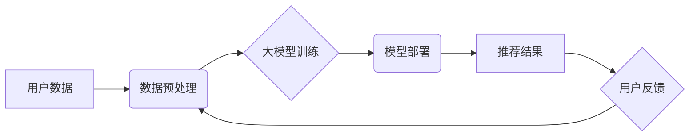

                 

## 大模型推荐系统的可扩展性研究

> 关键词：大模型、推荐系统、可扩展性、微服务架构、分布式训练、模型压缩、联邦学习

## 1. 背景介绍

推荐系统作为互联网信息服务的重要组成部分，在电商、社交媒体、视频平台等领域发挥着越来越重要的作用。随着用户需求的不断变化和数据量的激增，传统推荐系统面临着越来越大的挑战。大模型的出现为推荐系统带来了新的机遇，其强大的学习能力和泛化能力能够更好地理解用户需求和挖掘潜在的关联性。然而，大模型的规模庞大，训练和部署成本高昂，如何保证大模型推荐系统的可扩展性成为一个关键问题。

## 2. 核心概念与联系

### 2.1  大模型

大模型是指参数量在数十亿甚至千亿级别的神经网络模型，其强大的学习能力和泛化能力使其能够在自然语言处理、计算机视觉、语音识别等多个领域取得突破性进展。

### 2.2  推荐系统

推荐系统旨在根据用户的历史行为、偏好和上下文信息，预测用户对特定物品的兴趣，并推荐相关物品。常见的推荐算法包括协同过滤、内容过滤和基于知识图谱的推荐。

### 2.3  可扩展性

可扩展性是指系统能够随着用户需求和数据量的增长而灵活地扩展其容量和性能的能力。

**大模型推荐系统架构**



## 3. 核心算法原理 & 具体操作步骤

### 3.1  算法原理概述

大模型推荐系统通常采用基于深度学习的算法，例如Transformer、BERT等。这些算法能够学习用户和物品之间的复杂关系，并生成更精准的推荐结果。

### 3.2  算法步骤详解

1. **数据预处理:** 收集用户行为数据、物品信息等，并进行清洗、转换、特征工程等操作，构建训练数据。
2. **模型训练:** 使用大模型架构，训练模型以学习用户和物品之间的关系。训练过程通常采用梯度下降算法，不断优化模型参数。
3. **模型评估:** 使用测试数据评估模型性能，并根据评估结果调整模型参数和训练策略。
4. **模型部署:** 将训练好的模型部署到生产环境中，用于实时推荐。
5. **在线推荐:** 根据用户的查询或行为，模型生成推荐结果并返回给用户。
6. **用户反馈:** 收集用户对推荐结果的反馈，并将其用于模型的后续训练和优化。

### 3.3  算法优缺点

**优点:**

* 强大的学习能力，能够捕捉用户和物品之间的复杂关系。
* 泛化能力强，能够对新用户和新物品进行有效推荐。
* 可持续改进，通过不断收集用户反馈和更新模型，推荐效果不断提升。

**缺点:**

* 训练成本高昂，需要大量的计算资源和时间。
* 模型规模庞大，部署和维护成本较高。
* 缺乏可解释性，难以理解模型的推荐决策过程。

### 3.4  算法应用领域

大模型推荐系统广泛应用于以下领域:

* **电商推荐:** 推荐商品、优惠券、促销活动等。
* **社交媒体推荐:** 推荐好友、群组、内容等。
* **视频平台推荐:** 推荐视频、节目、主播等。
* **音乐平台推荐:** 推荐歌曲、专辑、艺术家等。

## 4. 数学模型和公式 & 详细讲解 & 举例说明

### 4.1  数学模型构建

大模型推荐系统通常采用基于矩阵分解的数学模型，例如协同过滤模型。协同过滤模型将用户和物品表示为两个低维向量，并通过计算这两个向量的内积来预测用户对物品的评分。

### 4.2  公式推导过程

假设用户集合为U，物品集合为I，用户u对物品i的评分为r<sub>ui</sub>。协同过滤模型的目标是学习用户向量u和物品向量v，使得预测评分与实际评分尽可能接近。

损失函数：

$$
L = \sum_{u \in U, i \in I} (r_{ui} - \hat{r}_{ui})^2
$$

其中，$\hat{r}_{ui}$为预测评分，由用户向量u和物品向量v计算得到：

$$
\hat{r}_{ui} = u \cdot v_i
$$

### 4.3  案例分析与讲解

假设用户A对电影1评分为5，对电影2评分为3，用户B对电影1评分为4，对电影3评分为5。我们可以使用协同过滤模型学习用户和电影的向量表示，并预测用户A对电影3的评分。

## 5. 项目实践：代码实例和详细解释说明

### 5.1  开发环境搭建

* Python 3.7+
* TensorFlow/PyTorch
* CUDA/cuDNN

### 5.2  源代码详细实现

```python
import tensorflow as tf

# 定义用户和物品的嵌入层
user_embedding = tf.keras.layers.Embedding(input_dim=num_users, output_dim=embedding_dim)
item_embedding = tf.keras.layers.Embedding(input_dim=num_items, output_dim=embedding_dim)

# 定义模型
model = tf.keras.Sequential([
    user_embedding,
    item_embedding,
    tf.keras.layers.Dot(axes=1),
    tf.keras.layers.Activation('sigmoid')
])

# 编译模型
model.compile(optimizer='adam', loss='binary_crossentropy', metrics=['accuracy'])

# 训练模型
model.fit(x_train, y_train, epochs=10)

# 预测评分
predictions = model.predict(x_test)
```

### 5.3  代码解读与分析

* 嵌入层将用户和物品映射到低维向量空间。
* Dot操作计算用户向量和物品向量的内积，得到预测评分。
* Sigmoid激活函数将预测评分映射到0到1之间。
* 模型使用Adam优化器、二分类交叉熵损失函数和准确率作为评估指标进行训练。

### 5.4  运行结果展示

训练完成后，可以使用测试数据评估模型性能，并可视化预测评分与实际评分之间的关系。

## 6. 实际应用场景

### 6.1  电商推荐

大模型推荐系统可以根据用户的购买历史、浏览记录、购物车内容等信息，推荐相关的商品、优惠券、促销活动等。

### 6.2  社交媒体推荐

大模型推荐系统可以根据用户的兴趣爱好、好友关系、社交行为等信息，推荐相关的好友、群组、内容等。

### 6.3  视频平台推荐

大模型推荐系统可以根据用户的观看历史、点赞记录、评论内容等信息，推荐相关的视频、节目、主播等。

### 6.4  未来应用展望

随着大模型技术的不断发展，大模型推荐系统将在更多领域得到应用，例如个性化教育、医疗诊断、金融理财等。

## 7. 工具和资源推荐

### 7.1  学习资源推荐

* **书籍:**
    * Deep Learning by Ian Goodfellow
    * Hands-On Machine Learning with Scikit-Learn, Keras & TensorFlow by Aurélien Géron
* **在线课程:**
    * TensorFlow Tutorials
    * PyTorch Tutorials
* **博客:**
    * Towards Data Science
    * Machine Learning Mastery

### 7.2  开发工具推荐

* **TensorFlow:** 开源深度学习框架
* **PyTorch:** 开源深度学习框架
* **Keras:** 高级深度学习API

### 7.3  相关论文推荐

* Attention Is All You Need
* BERT: Pre-training of Deep Bidirectional Transformers for Language Understanding
* Transformer-XL: Attentive Language Modeling Beyond Millions of Tokens

## 8. 总结：未来发展趋势与挑战

### 8.1  研究成果总结

大模型推荐系统在推荐精度、个性化程度等方面取得了显著的进步，为用户提供更精准、更个性化的推荐服务。

### 8.2  未来发展趋势

* **模型规模进一步扩大:** 随着计算资源的不断提升，大模型规模将进一步扩大，学习能力和推荐精度将得到进一步提升。
* **多模态融合:** 将文本、图像、音频等多种模态信息融合到推荐系统中，实现更全面的用户理解和推荐。
* **联邦学习:** 利用联邦学习技术，在不泄露用户隐私的情况下，训练大模型，提升推荐系统的安全性。

### 8.3  面临的挑战

* **训练成本高昂:** 大模型的训练成本非常高，需要大量的计算资源和时间。
* **模型部署难度大:** 大模型的部署难度大，需要强大的硬件设施和软件支持。
* **可解释性差:** 大模型的推荐决策过程难以解释，缺乏透明度和可信度。

### 8.4  研究展望

未来研究将重点关注降低大模型训练和部署成本、提升模型的可解释性和安全性、探索多模态融合和联邦学习等新技术在推荐系统中的应用。

## 9. 附录：常见问题与解答

* **Q: 如何选择合适的嵌入维度？**

* **A:** 嵌入维度的大小需要根据实际情况进行调整，通常可以通过交叉验证的方式进行选择。

* **Q: 如何处理稀疏数据？**

* **A:** 可以使用稀疏编码技术，例如One-Hot编码或Word2Vec，将稀疏数据转换为稠密的向量表示。

* **Q: 如何评估大模型推荐系统的性能？**

* **A:** 可以使用多种指标进行评估，例如准确率、召回率、NDCG等。

作者：禅与计算机程序设计艺术 / Zen and the Art of Computer Programming 


<end_of_turn>

