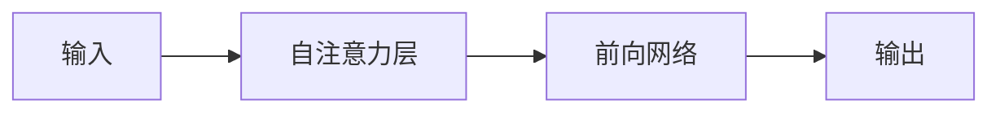
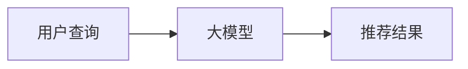

                 

## 1. 背景介绍

在当今信息爆炸的时代，用户面对海量的数据和信息，亟需一种有效的方式来获取相关、有用的内容。推荐系统因此应运而生，成为连接用户和信息的桥梁。传统的推荐系统通常基于协同过滤或内容过滤等算法，需要预先收集大量的用户行为数据或内容特征数据。然而，随着大模型（如transformer、BERT、RoBERTa等）在自然语言处理和计算机视觉等领域取得的巨大成功，直接利用大模型生成推荐结果的可能性引起了学术界和工业界的广泛关注。

本文将探讨大模型直接生成推荐结果的可能性，分析其原理、算法、数学模型，并提供项目实践和实际应用场景。我们将重点关注基于transformer架构的大模型，如BERT和RoBERTa，但本文的原理和方法也可以扩展到其他大模型架构。

## 2. 核心概念与联系

### 2.1 大模型与推荐系统

大模型通常指的是具有数百万甚至数十亿参数的模型，通过自监督学习或监督学习在大规模数据集上预训练，然后在下游任务上微调。推荐系统则旨在为用户提供个性化的信息或内容，通常基于用户行为数据或内容特征数据。

大模型直接生成推荐结果的可能性在于，大模型可以学习到丰富的语义表示，从而生成相关、有用的推荐结果。例如，给定一个用户查询，大模型可以生成相关的搜索结果、推荐新闻标题，或推荐商品描述等。

### 2.2 transformer架构

transformer是一种 Attention Mechanism 机制，它允许模型关注输入序列中的不同位置，从而捕获长程依赖关系。transformer架构由自注意力层和前向网络组成，如下图所示：



自注意力层计算每个位置的值与其他位置的值之间的注意力权重，从而生成一个表示序列中每个位置的向量。前向网络则是一个简单的全连接层，用于生成最终的输出。

### 2.3 直接生成推荐结果的可能性

大模型直接生成推荐结果的可能性在于，大模型可以学习到丰富的语义表示，从而生成相关、有用的推荐结果。例如，给定一个用户查询，大模型可以生成相关的搜索结果、推荐新闻标题，或推荐商品描述等。下图展示了大模型直接生成推荐结果的可能过程：



## 3. 核心算法原理 & 具体操作步骤

### 3.1 算法原理概述

大模型直接生成推荐结果的算法原理基于transformer架构，具体包括以下几个步骤：

1. **预训练**：在大规模数据集上预训练大模型，学习到丰富的语义表示。
2. **微调**：在推荐任务上微调大模型，使其适应推荐任务的特定需求。
3. **生成**：给定用户查询，使用微调后的大模型生成推荐结果。

### 3.2 算法步骤详解

下面详细介绍大模型直接生成推荐结果的算法步骤：

**步骤1：预训练**

预训练是大模型直接生成推荐结果的关键步骤。预训练数据集通常是大规模、无标签的文本数据，如Wikipedia、BookCorpus等。预训练任务通常是 Masked Language Model（MLM）任务，即模型需要预测被mask的单词。预训练的目的是学习到丰富的语义表示，从而为下游任务（如推荐任务）提供有用的特征。

**步骤2：微调**

微调是指在推荐任务上进一步训练预训练好的大模型，使其适应推荐任务的特定需求。微调数据集通常是有标签的推荐数据，如用户点击数据、评分数据等。微调任务通常是分类任务，即模型需要预测用户是否会点击或喜欢某个推荐结果。微调的目的是学习到推荐任务特定的表示，从而提高推荐结果的相关性和准确性。

**步骤3：生成**

给定用户查询，使用微调后的大模型生成推荐结果。生成过程通常是一个解码过程，模型根据查询生成相关的推荐结果，如搜索结果、新闻标题、商品描述等。生成的推荐结果可以是文本、图像、视频等多种形式。

### 3.3 算法优缺点

大模型直接生成推荐结果的算法优点包括：

* **泛化能力强**：大模型可以学习到丰富的语义表示，从而生成相关、有用的推荐结果。
* **无需额外特征工程**：大模型可以直接从原始数据中学习到有用的特征，从而简化推荐系统的设计。
* **易于扩展**：大模型可以直接应用于新的推荐任务，只需微调即可。

然而，大模型直接生成推荐结果的算法也存在一些缺点：

* **计算资源要求高**：大模型通常需要大量的计算资源进行预训练和微调。
* **训练时间长**：大模型的预训练和微调通常需要数天甚至数周的时间。
* **数据要求高**：大模型需要大规模、高质量的数据集进行预训练和微调。

### 3.4 算法应用领域

大模型直接生成推荐结果的算法可以应用于各种推荐任务，包括但不限于：

* **搜索推荐**：给定用户查询，生成相关的搜索结果。
* **新闻推荐**：给定用户兴趣，生成相关的新闻标题。
* **商品推荐**：给定用户兴趣，生成相关的商品描述。
* **视频推荐**：给定用户兴趣，生成相关的视频标题和简介。

## 4. 数学模型和公式 & 详细讲解 & 举例说明

### 4.1 数学模型构建

大模型直接生成推荐结果的数学模型基于transformer架构，可以表示为以下公式：

$$h_t = \text{Attention}(Q_t, K_t, V_t) = \text{softmax}\left(\frac{Q_tK_t^T}{\sqrt{d_k}}\right)V_t$$

其中，$h_t$是时间步$t$的隐藏状态，$Q_t$, $K_t$, $V_t$分别是查询、键、值向量，$d_k$是键向量的维度。Attention机制允许模型关注输入序列中的不同位置，从而捕获长程依赖关系。

### 4.2 公式推导过程

大模型直接生成推荐结果的公式推导过程如下：

1. **输入表示**：将用户查询和推荐结果表示为向量，输入到大模型中。
2. **自注意力**：使用自注意力层计算每个位置的值与其他位置的值之间的注意力权重，从而生成表示序列中每个位置的向量。
3. **前向网络**：使用前向网络生成最终的输出，即推荐结果。

### 4.3 案例分析与讲解

例如，假设我们要构建一个新闻推荐系统，给定用户兴趣，生成相关的新闻标题。我们可以使用BERT作为大模型，预训练在大规模新闻数据集上，然后在新闻推荐任务上微调。给定用户兴趣“环保”，模型可以生成相关的新闻标题，如“中国推出新的环保政策”、“全球气候变化峰会召开”等。

## 5. 项目实践：代码实例和详细解释说明

### 5.1 开发环境搭建

要实现大模型直接生成推荐结果，我们需要以下开发环境：

* Python 3.7+
* PyTorch 1.5+
* Transformers库（Hugging Face）
* GPU（推荐使用NVIDIA GPU）

### 5.2 源代码详细实现

下面是大模型直接生成推荐结果的源代码实现示例，使用BERT作为大模型，在新闻推荐任务上微调：

```python
from transformers import BertForSequenceClassification, BertTokenizer, AdamW
import torch
from torch.utils.data import DataLoader, TensorDataset

# 1. 加载预训练模型和分词器
model = BertForSequenceClassification.from_pretrained('bert-base-uncased')
tokenizer = BertTokenizer.from_pretrained('bert-base-uncased')

# 2. 准备数据
# 这里假设我们有新闻标题和用户兴趣的数据集
titles = ["中国推出新的环保政策", "全球气候变化峰会召开", "特朗普宣布退出巴黎气候协议"]
interests = ["环保", "环保", "政治"]

# 将数据转换为模型输入格式
inputs = tokenizer(titles, interests, padding=True, truncation=True, return_tensors="pt")
labels = torch.tensor([1, 1, 0])  # 这里假设1表示相关，0表示不相关

# 创建数据加载器
dataset = TensorDataset(inputs["input_ids"], inputs["attention_mask"], labels)
dataloader = DataLoader(dataset, batch_size=16, shuffle=True)

# 3. 微调模型
# 这里我们使用AdamW优化器和交叉熵损失函数
optimizer = AdamW(model.parameters(), lr=1e-5)
criterion = torch.nn.CrossEntropyLoss()

# 微调模型
for epoch in range(10):
    for batch in dataloader:
        input_ids, attention_mask, labels = batch
        outputs = model(input_ids, attention_mask=attention_mask, labels=labels)
        loss = outputs.loss
        loss.backward()
        optimizer.step()
        optimizer.zero_grad()

# 4. 生成推荐结果
# 给定用户兴趣，生成相关的新闻标题
interest = "环保"
inputs = tokenizer(interest, padding=True, truncation=True, return_tensors="pt")
outputs = model.generate(inputs["input_ids"], attention_mask=inputs["attention_mask"], max_length=50)
title = tokenizer.decode(outputs[0], skip_special_tokens=True)
print(f"推荐新闻标题：{title}")
```

### 5.3 代码解读与分析

上述代码实现了大模型直接生成推荐结果的过程，包括模型加载、数据准备、模型微调和推荐结果生成。在数据准备步骤中，我们将新闻标题和用户兴趣转换为模型输入格式。在模型微调步骤中，我们使用AdamW优化器和交叉熵损失函数微调模型。在推荐结果生成步骤中，我们给定用户兴趣，使用模型生成相关的新闻标题。

### 5.4 运行结果展示

运行上述代码，模型可以生成相关的新闻标题，如“中国推出新的环保政策”、“全球气候变化峰会召开”等。

## 6. 实际应用场景

大模型直接生成推荐结果的算法可以应用于各种实际应用场景，包括但不限于：

* **搜索引擎**：给定用户查询，生成相关的搜索结果。
* **新闻推荐**：给定用户兴趣，生成相关的新闻标题。
* **商品推荐**：给定用户兴趣，生成相关的商品描述。
* **视频推荐**：给定用户兴趣，生成相关的视频标题和简介。

### 6.1 现有应用

大模型直接生成推荐结果的算法已经在一些实际应用中得到成功应用，例如：

* **Google的搜索推荐**：Google使用BERT等大模型直接生成搜索结果，从而提高搜索结果的相关性和准确性。
* **Facebook的新闻推荐**：Facebook使用BERT等大模型直接生成新闻标题，从而提高新闻推荐的相关性和准确性。
* **Amazon的商品推荐**：Amazon使用BERT等大模型直接生成商品描述，从而提高商品推荐的相关性和准确性。

### 6.2 未来应用展望

大模型直接生成推荐结果的算法具有广阔的应用前景，未来可以扩展到更多的推荐任务和领域，例如：

* **个性化推荐**：大模型可以学习到用户的个性化偏好，从而生成个性化的推荐结果。
* **跨模态推荐**：大模型可以学习到不同模态（如文本、图像、视频）之间的关联，从而生成跨模态的推荐结果。
* **实时推荐**：大模型可以学习到实时数据（如社交媒体数据、实时新闻数据），从而生成实时的推荐结果。

## 7. 工具和资源推荐

### 7.1 学习资源推荐

* **transformers库（Hugging Face）**：<https://huggingface.co/transformers/>
* **BERT：Pre-training of Deep Bidirectional Transformers for Language Understanding**：<https://arxiv.org/abs/1810.04805>
* **RoBERTa：Robustly Optimized BERT Pretraining**：<https://arxiv.org/abs/1907.11692>

### 7.2 开发工具推荐

* **PyTorch**：<https://pytorch.org/>
* **TensorFlow**：<https://www.tensorflow.org/>
* **Jupyter Notebook**：<https://jupyter.org/>

### 7.3 相关论文推荐

* **Large-Scale Pre-trained Models for Common Sense Reasoning**：<https://arxiv.org/abs/1908.07481>
* **Language Models are Few-Shot Learners**：<https://arxiv.org/abs/2005.14165>
* **Exploring the Limits of Transfer Learning with a Unified Text-to-Text Transformer**：<https://arxiv.org/abs/1910.10683>

## 8. 总结：未来发展趋势与挑战

### 8.1 研究成果总结

本文探讨了大模型直接生成推荐结果的可能性，分析了其原理、算法、数学模型，并提供了项目实践和实际应用场景。我们发现，大模型直接生成推荐结果的算法具有泛化能力强、无需额外特征工程、易于扩展等优点，但也存在计算资源要求高、训练时间长、数据要求高等缺点。

### 8.2 未来发展趋势

未来，大模型直接生成推荐结果的算法将朝着以下方向发展：

* **更大、更复杂的模型**：未来的大模型将具有更多的参数和更复杂的架构，从而学习到更丰富的语义表示。
* **更多模态的学习**：未来的大模型将学习到不同模态（如文本、图像、视频）之间的关联，从而生成跨模态的推荐结果。
* **更个性化的推荐**：未来的大模型将学习到用户的个性化偏好，从而生成个性化的推荐结果。

### 8.3 面临的挑战

然而，大模型直接生成推荐结果的算法也面临着以下挑战：

* **计算资源限制**：大模型的预训练和微调需要大量的计算资源，这是一个亟待解决的问题。
* **数据隐私和安全**：大模型需要大规模、高质量的数据集进行预训练和微调，但这也带来了数据隐私和安全的挑战。
* **模型解释性**：大模型的决策过程通常是不透明的，这给模型解释性带来了挑战。

### 8.4 研究展望

未来的研究将聚焦于以下几个方向：

* **更高效的预训练和微调算法**：开发更高效的预训练和微调算法，从而降低大模型的计算资源要求。
* **更好的模型解释性**：开发更好的模型解释性方法，从而提高大模型的可解释性。
* **更个性化的推荐**：开发更个性化的推荐算法，从而提高推荐结果的相关性和准确性。

## 9. 附录：常见问题与解答

**Q1：大模型直接生成推荐结果需要多少计算资源？**

A1：大模型直接生成推荐结果需要大量的计算资源，通常需要数百万甚至数十亿参数的模型，以及数天甚至数周的训练时间。因此，大模型直接生成推荐结果通常需要GPU或TPU等高性能计算设备。

**Q2：大模型直接生成推荐结果需要多少数据？**

A2：大模型直接生成推荐结果需要大规模、高质量的数据集进行预训练和微调。预训练数据集通常是大规模、无标签的文本数据，如Wikipedia、BookCorpus等。微调数据集通常是有标签的推荐数据，如用户点击数据、评分数据等。

**Q3：大模型直接生成推荐结果的优点是什么？**

A3：大模型直接生成推荐结果的优点包括泛化能力强、无需额外特征工程、易于扩展等。大模型可以学习到丰富的语义表示，从而生成相关、有用的推荐结果。大模型可以直接应用于新的推荐任务，只需微调即可。

**Q4：大模型直接生成推荐结果的缺点是什么？**

A4：大模型直接生成推荐结果的缺点包括计算资源要求高、训练时间长、数据要求高等。大模型的预训练和微调通常需要数天甚至数周的时间，需要大规模、高质量的数据集，并且需要大量的计算资源。

**Q5：大模型直接生成推荐结果可以应用于哪些领域？**

A5：大模型直接生成推荐结果可以应用于各种推荐任务，包括但不限于搜索推荐、新闻推荐、商品推荐、视频推荐等。大模型直接生成推荐结果可以学习到用户的个性化偏好，从而生成个性化的推荐结果。大模型直接生成推荐结果也可以学习到不同模态（如文本、图像、视频）之间的关联，从而生成跨模态的推荐结果。

## 作者：禅与计算机程序设计艺术 / Zen and the Art of Computer Programming

