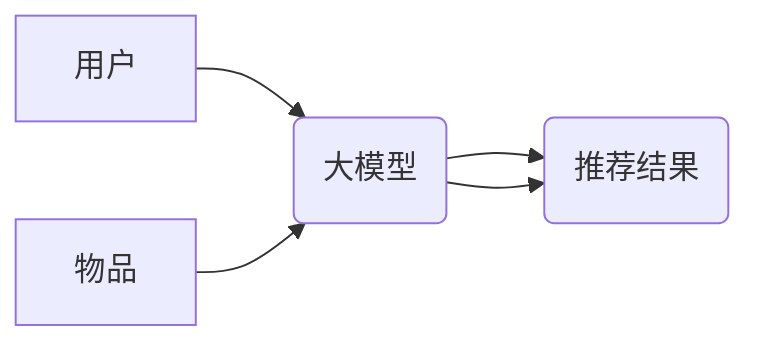

                 

## 大模型辅助的推荐系统冷启动策略优化

> 关键词：推荐系统、冷启动、大模型、策略优化、协同过滤、内容过滤、知识图谱

## 1. 背景介绍

推荐系统作为互联网时代的重要技术支柱，在电商、社交媒体、视频平台等领域发挥着至关重要的作用。然而，推荐系统面临着诸多挑战，其中冷启动问题尤为突出。冷启动是指推荐系统在面对新用户或新物品时，由于缺乏历史数据，难以准确预测用户偏好，从而导致推荐结果不精准，甚至产生“推荐荒漠”现象。

传统推荐系统主要依赖协同过滤和内容过滤两种算法，但这些算法在面对冷启动问题时表现乏力。协同过滤算法需要大量用户行为数据进行训练，而新用户缺乏历史数据，无法进行有效的预测。内容过滤算法则依赖于物品的特征信息，但对于新物品，特征信息往往不完整，难以进行准确的推荐。

近年来，大模型技术蓬勃发展，其强大的学习能力和泛化能力为解决推荐系统冷启动问题提供了新的思路。大模型可以学习海量数据中的复杂模式和关系，即使面对新用户或新物品，也能进行有效的预测。

## 2. 核心概念与联系

### 2.1 推荐系统冷启动

推荐系统冷启动是指推荐系统在面对新用户或新物品时，由于缺乏历史数据，难以准确预测用户偏好，从而导致推荐结果不精准，甚至产生“推荐荒漠”现象。

### 2.2 大模型

大模型是指参数量巨大、训练数据海量的人工智能模型。大模型通常具有强大的泛化能力和学习能力，能够学习复杂的数据模式和关系，并应用于各种任务，例如自然语言处理、图像识别、推荐系统等。

### 2.3 大模型辅助推荐系统

大模型可以辅助推荐系统解决冷启动问题，其主要原理是利用大模型的强大的学习能力，从海量数据中学习用户偏好和物品特征，即使面对新用户或新物品，也能进行有效的预测。

**大模型辅助推荐系统架构**



## 3. 核心算法原理 & 具体操作步骤

### 3.1 算法原理概述

大模型辅助推荐系统主要利用大模型的学习能力，从海量数据中学习用户偏好和物品特征，并结合传统推荐算法，进行新用户或新物品的推荐。

大模型可以学习用户行为数据、物品属性数据、文本评论数据等多种数据，并从中提取用户兴趣、物品属性、用户评价等关键信息。

### 3.2 算法步骤详解

1. **数据预处理:** 收集用户行为数据、物品属性数据、文本评论数据等，并进行清洗、转换、特征提取等预处理操作。
2. **大模型训练:** 利用预处理后的数据，训练大模型，例如BERT、GPT等，使其能够学习用户偏好和物品特征。
3. **特征提取:** 将新用户或新物品输入到训练好的大模型中，提取其对应的特征向量。
4. **推荐算法融合:** 将大模型提取的特征向量与传统推荐算法（例如协同过滤、内容过滤）结合，进行推荐结果的生成。
5. **结果评估:** 利用评估指标（例如准确率、召回率、NDCG）评估推荐结果的质量，并根据评估结果进行模型调优。

### 3.3 算法优缺点

**优点:**

* 能够有效解决冷启动问题，即使面对新用户或新物品也能进行推荐。
* 能够学习用户复杂偏好，提供更精准的推荐结果。
* 能够利用多源数据进行推荐，提高推荐的准确性和多样性。

**缺点:**

* 需要海量数据进行训练，训练成本较高。
* 大模型参数量巨大，部署和推理成本较高。
* 需要专业的技术人员进行模型训练和调优。

### 3.4 算法应用领域

大模型辅助推荐系统在电商、社交媒体、视频平台、音乐平台等领域都有广泛的应用。例如，

* **电商平台:** 为新用户推荐个性化商品，提高用户转化率。
* **社交媒体平台:** 为用户推荐相关好友、兴趣小组、话题等，提高用户粘性。
* **视频平台:** 为用户推荐个性化视频内容，提高用户观看时长。

## 4. 数学模型和公式 & 详细讲解 & 举例说明

### 4.1 数学模型构建

大模型辅助推荐系统可以构建基于用户-物品交互矩阵的数学模型，其中用户和物品分别用向量表示，用户向量表示用户的兴趣偏好，物品向量表示物品的特征信息。

**用户-物品交互矩阵:**

$$
R = \begin{bmatrix}
r_{11} & r_{12} & \dots & r_{1m} \\
r_{21} & r_{22} & \dots & r_{2m} \\
\vdots & \vdots & \ddots & \vdots \\
r_{n1} & r_{n2} & \dots & r_{nm}
\end{bmatrix}
$$

其中，$r_{ij}$表示用户$i$对物品$j$的评分或交互行为。

**用户向量:**

$$
u_i = \begin{bmatrix}
u_{i1} & u_{i2} & \dots & u_{ik}
\end{bmatrix}
$$

**物品向量:**

$$
v_j = \begin{bmatrix}
v_{j1} & v_{j2} & \dots & v_{jk}
\end{bmatrix}
$$

### 4.2 公式推导过程

推荐评分可以使用用户向量和物品向量的内积来计算：

$$
\hat{r}_{ij} = u_i \cdot v_j = \sum_{k=1}^{k} u_{ik}v_{jk}
$$

其中，$\hat{r}_{ij}$表示预测的用户$i$对物品$j$的评分。

### 4.3 案例分析与讲解

假设有一个电商平台，用户和商品的交互数据如下：

**用户-商品交互矩阵:**

$$
R = \begin{bmatrix}
5 & 4 & 3 & 2 \\
4 & 5 & 2 & 1 \\
3 & 2 & 5 & 4 \\
2 & 1 & 4 & 5
\end{bmatrix}
$$

其中，数字表示用户对商品的评分。

我们可以使用大模型训练用户向量和商品向量，然后利用公式计算预测评分。例如，预测用户1对商品4的评分：

$$
\hat{r}_{14} = u_1 \cdot v_4 = \sum_{k=1}^{k} u_{1k}v_{4k}
$$

其中，$u_1$和$v_4$分别是用户1和商品4的向量。

## 5. 项目实践：代码实例和详细解释说明

### 5.1 开发环境搭建

* Python 3.7+
* TensorFlow 2.0+
* PyTorch 1.0+
* CUDA 10.0+ (可选)

### 5.2 源代码详细实现

```python
import tensorflow as tf

# 定义用户-物品交互矩阵
R = tf.constant([[5, 4, 3, 2],
                 [4, 5, 2, 1],
                 [3, 2, 5, 4],
                 [2, 1, 4, 5]])

# 定义用户向量和物品向量
user_embedding = tf.Variable(tf.random.normal([4, 10]))
item_embedding = tf.Variable(tf.random.normal([4, 10]))

# 计算预测评分
def predict_rating(user_id, item_id):
    user_vector = user_embedding[user_id]
    item_vector = item_embedding[item_id]
    return tf.reduce_sum(user_vector * item_vector)

# 预测用户1对商品4的评分
predicted_rating = predict_rating(0, 3)
print(predicted_rating)
```

### 5.3 代码解读与分析

* 代码首先定义了用户-物品交互矩阵R。
* 然后定义了用户向量和物品向量，并使用随机数初始化。
* predict_rating函数计算用户和物品的内积，得到预测评分。
* 最后，使用predict_rating函数预测用户1对商品4的评分。

### 5.4 运行结果展示

运行代码后，会输出预测的用户1对商品4的评分。

## 6. 实际应用场景

### 6.1 电商平台

大模型辅助推荐系统可以帮助电商平台解决新用户冷启动问题，为新用户推荐个性化商品，提高用户转化率。例如，当一个新用户注册到电商平台时，大模型可以根据用户的浏览历史、搜索记录、购买行为等数据，学习用户的兴趣偏好，并推荐相关的商品。

### 6.2 社交媒体平台

大模型辅助推荐系统可以帮助社交媒体平台解决新用户和新内容的冷启动问题，为用户推荐相关好友、兴趣小组、话题等，提高用户粘性。例如，当一个新用户注册到社交媒体平台时，大模型可以根据用户的兴趣爱好、社交关系等数据，推荐相关的用户、群组和话题。

### 6.3 视频平台

大模型辅助推荐系统可以帮助视频平台解决新用户和新视频的冷启动问题，为用户推荐个性化视频内容，提高用户观看时长。例如，当一个新用户注册到视频平台时，大模型可以根据用户的观看历史、点赞记录、评论内容等数据，推荐相关的视频内容。

### 6.4 未来应用展望

随着大模型技术的不断发展，大模型辅助推荐系统将在更多领域得到应用，例如：

* **音乐平台:** 为用户推荐个性化音乐，提高用户听歌时长。
* **新闻平台:** 为用户推荐个性化新闻，提高用户阅读量。
* **教育平台:** 为用户推荐个性化学习资源，提高用户学习效率。

## 7. 工具和资源推荐

### 7.1 学习资源推荐

* **书籍:**
    * 《深度学习》
    * 《自然语言处理》
    * 《推荐系统》
* **在线课程:**
    * Coursera: 深度学习
    * edX: 自然语言处理
    * Udacity: 机器学习工程师

### 7.2 开发工具推荐

* **TensorFlow:** 开源深度学习框架
* **PyTorch:** 开源深度学习框架
* **Scikit-learn:** 机器学习库

### 7.3 相关论文推荐

* **BERT: Pre-training of Deep Bidirectional Transformers for Language Understanding**
* **GPT-3: Language Models are Few-Shot Learners**
* **Collaborative Filtering for Recommender Systems**

## 8. 总结：未来发展趋势与挑战

### 8.1 研究成果总结

大模型辅助推荐系统在解决推荐系统冷启动问题方面取得了显著的成果，能够有效提高推荐结果的准确性和多样性。

### 8.2 未来发展趋势

* **模型规模和能力的提升:** 未来大模型规模将进一步扩大，模型能力将更加强大，能够学习更复杂的用户偏好和物品特征。
* **多模态融合:** 大模型将融合文本、图像、音频等多模态数据，提供更全面的用户体验。
* **个性化推荐的增强:** 大模型将更加注重用户个性化需求，提供更加精准的推荐结果。

### 8.3 面临的挑战

* **数据隐私和安全:** 大模型训练需要海量数据，如何保护用户数据隐私和安全是一个重要的挑战。
* **模型解释性和可解释性:** 大模型的决策过程往往难以理解，如何提高模型的解释性和可解释性是一个重要的研究方向。
* **模型部署和推理成本:** 大模型参数量巨大，部署和推理成本较高，如何降低模型部署和推理成本是一个重要的技术挑战。

### 8.4 研究展望

未来，大模型辅助推荐系统将继续朝着更智能、更个性化、更安全的方向发展，为用户提供更加精准、高效、便捷的推荐服务。

## 9. 附录：常见问题与解答

**Q1: 大模型辅助推荐系统与传统推荐系统相比有什么优势？**

**A1:** 大模型辅助推荐系统能够有效解决冷启动问题，并利用多源数据进行推荐，提供更精准、更个性化的推荐结果。

**Q2: 如何选择合适的推荐算法？**

**A2:** 选择合适的推荐算法需要根据具体业务场景和数据特点进行选择。例如，对于用户行为数据丰富的场景，可以使用协同过滤算法；对于物品特征数据丰富的场景，可以使用内容过滤算法。

**Q3: 如何评估推荐系统的性能？**

**A3:** 推荐系统的性能可以评估指标例如准确率、召回率、NDCG等。

**作者：禅与计算机程序设计艺术 / Zen and the Art of Computer Programming**<end_of_turn>

