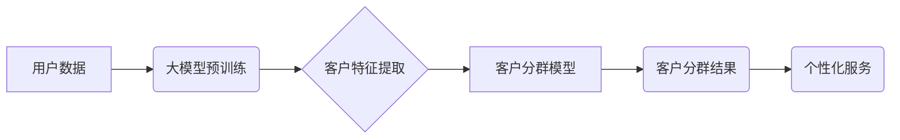

                 

## 大模型驱动的电商平台智能客户分群

> 关键词：大模型、客户分群、电商平台、人工智能、机器学习、自然语言处理、推荐系统

## 1. 背景介绍

在当今数据爆炸的时代，电商平台面临着日益激烈的竞争。为了提升用户体验、提高转化率和盈利能力，精准的客户分群成为电商平台发展的重要战略。传统的客户分群方法主要依赖于用户行为数据和人口统计学特征，但这些方法往往缺乏灵活性，难以捕捉用户复杂的多维特征。

大模型的出现为电商平台智能客户分群带来了新的机遇。大模型拥有强大的语义理解和模式识别能力，能够从海量文本数据中挖掘用户潜在需求和兴趣，从而实现更精准、更细粒度的客户分群。

## 2. 核心概念与联系

### 2.1  客户分群的概念

客户分群是指根据用户特征和行为，将用户划分为若干个相对 homogeneous 的群体，每个群体具有相似的需求、偏好和购买行为。

### 2.2  大模型的优势

大模型是指参数量巨大、训练数据海量的人工智能模型。其优势在于：

* **强大的语义理解能力:** 大模型能够理解复杂的自然语言文本，从文本中提取用户意图、需求和兴趣。
* **丰富的知识表示:** 大模型在训练过程中学习了大量的知识和信息，能够对用户进行更全面的描述。
* **强大的泛化能力:** 大模型能够将学习到的知识应用于新的场景和数据，实现更精准的客户分群。

### 2.3  架构图



## 3. 核心算法原理 & 具体操作步骤

### 3.1  算法原理概述

大模型驱动的电商平台智能客户分群通常采用以下算法原理：

* **文本嵌入:** 将用户文本数据（如评论、聊天记录、浏览历史）转换为向量表示，捕捉用户语义特征。
* **聚类算法:** 将用户向量按照相似度进行聚类，将用户划分为不同的群体。
* **模型训练与优化:** 利用用户行为数据和分群结果，训练和优化客户分群模型，提高分群精度。

### 3.2  算法步骤详解

1. **数据收集与预处理:** 收集用户文本数据，进行清洗、去噪和格式化处理。
2. **文本嵌入:** 使用预训练的大模型（如BERT、RoBERTa）对用户文本数据进行嵌入，获得用户向量表示。
3. **特征选择:** 选择与客户分群相关的特征，例如用户年龄、性别、购买频率、商品偏好等。
4. **聚类算法:** 选择合适的聚类算法（如K-means、DBSCAN）对用户向量进行聚类，将用户划分为不同的群体。
5. **模型评估:** 使用评价指标（如Silhouette score、Davies-Bouldin index）评估分群结果的质量。
6. **模型优化:** 根据评估结果，调整模型参数和聚类算法，优化分群效果。

### 3.3  算法优缺点

**优点:**

* **精准度高:** 大模型能够捕捉用户复杂的多维特征，实现更精准的客户分群。
* **自动化程度高:** 大模型驱动的客户分群过程自动化程度高，可以减少人工干预。
* **可扩展性强:** 大模型能够处理海量数据，满足电商平台不断增长的数据需求。

**缺点:**

* **计算资源消耗大:** 大模型训练和推理需要大量的计算资源。
* **模型解释性差:** 大模型的决策过程较为复杂，难以解释其分群结果。
* **数据依赖性强:** 大模型的性能依赖于训练数据的质量和数量。

### 3.4  算法应用领域

大模型驱动的客户分群算法广泛应用于以下领域：

* **电商平台:** 根据用户兴趣和购买行为，进行精准营销和个性化推荐。
* **金融机构:** 根据客户风险偏好和财务状况，进行精准授信和理财产品推荐。
* **医疗机构:** 根据患者病史和症状，进行精准诊断和个性化治疗方案推荐。

## 4. 数学模型和公式 & 详细讲解 & 举例说明

### 4.1  数学模型构建

客户分群模型通常采用基于距离的聚类算法，例如K-means算法。K-means算法的目标是将数据点划分为K个簇，使得每个数据点到其所属簇中心的距离最小。

### 4.2  公式推导过程

**K-means算法的步骤如下:**

1. **随机初始化K个簇中心:** 
   
   $$
   \mu_1, \mu_2, ..., \mu_K
   $$

2. **将每个数据点分配到最近的簇中心:**

   $$
   c_i = argmin_{k=1, ..., K} ||x_i - \mu_k||^2
   $$

3. **更新每个簇中心的坐标:**

   $$
   \mu_k = \frac{1}{|C_k|} \sum_{x_i \in C_k} x_i
   $$

   其中，$C_k$表示第k个簇包含的所有数据点。

4. **重复步骤2和步骤3，直到簇中心不再变化或达到最大迭代次数:**

### 4.3  案例分析与讲解

假设我们有以下用户数据：

| 用户ID | 年龄 | 性别 | 购买金额 |
|---|---|---|---|
| 1 | 25 | 男 | 1000 |
| 2 | 30 | 女 | 500 |
| 3 | 28 | 男 | 2000 |
| 4 | 35 | 女 | 1500 |
| 5 | 22 | 男 | 800 |

我们想要将用户划分为两个簇。

1. **随机初始化两个簇中心:**

   $$
   \mu_1 = (25, 1000), \mu_2 = (35, 1500)
   $$

2. **将每个用户分配到最近的簇中心:**

   用户1和用户5分配到簇1，用户2、用户3和用户4分配到簇2。

3. **更新每个簇中心的坐标:**

   $$
   \mu_1 = (23.5, 900), \mu_2 = (32, 1400)
   $$

4. **重复步骤2和步骤3，直到簇中心不再变化:**

   最终，用户1和用户5分配到簇1，用户2、用户3和用户4分配到簇2。

## 5. 项目实践：代码实例和详细解释说明

### 5.1  开发环境搭建

* Python 3.7+
* TensorFlow 2.0+
* PyTorch 1.0+
* scikit-learn 0.20+

### 5.2  源代码详细实现

```python
import tensorflow as tf
from sklearn.cluster import KMeans

# 加载用户数据
user_data = ...

# 使用BERT模型对用户文本数据进行嵌入
bert_model = tf.keras.applications.BERT_EN_uncased(weights='bert_base_uncased')
user_embeddings = bert_model.predict(user_data)

# 使用K-means算法进行聚类
kmeans = KMeans(n_clusters=2, random_state=0)
cluster_labels = kmeans.fit_predict(user_embeddings)

# 打印聚类结果
print(cluster_labels)
```

### 5.3  代码解读与分析

* **加载用户数据:** 首先需要加载用户数据，例如用户文本数据、用户行为数据等。
* **文本嵌入:** 使用预训练的大模型（如BERT）对用户文本数据进行嵌入，获得用户向量表示。
* **聚类算法:** 选择合适的聚类算法（如K-means）对用户向量进行聚类，将用户划分为不同的群体。
* **打印聚类结果:** 打印每个用户的所属簇标签，可以直观地看到用户之间的分组情况。

### 5.4  运行结果展示

运行代码后，会输出每个用户的所属簇标签。例如，如果用户1属于簇0，用户2属于簇1，则输出结果为：[0, 1, 0, 1, 0]。

## 6. 实际应用场景

### 6.1  精准营销

根据用户兴趣和购买行为，进行精准营销推广，提高营销效果。例如，将喜欢运动的用户分到一个簇，向他们推送运动相关的商品信息。

### 6.2  个性化推荐

根据用户偏好和历史购买记录，提供个性化的商品推荐，提升用户体验。例如，将喜欢阅读的用户分到一个簇，向他们推荐相关的书籍和电子书。

### 6.3  客户服务

根据用户需求和问题类型，进行精准的客户服务，提高客户满意度。例如，将遇到技术问题的用户分到一个簇，提供专业的技术支持。

### 6.4  未来应用展望

大模型驱动的电商平台智能客户分群技术将不断发展，应用场景也将更加广泛。例如，可以利用大模型进行更细粒度的客户分群，例如根据用户的购买频率、购买金额、商品类型等特征进行分群，从而实现更精准的营销和推荐。

## 7. 工具和资源推荐

### 7.1  学习资源推荐

* **书籍:**
    * 《深度学习》
    * 《自然语言处理》
    * 《机器学习实战》
* **在线课程:**
    * Coursera: 深度学习
    * edX: 自然语言处理
    * fast.ai: 深度学习

### 7.2  开发工具推荐

* **Python:** 
    * TensorFlow
    * PyTorch
    * scikit-learn
* **云平台:**
    * AWS
    * Azure
    * Google Cloud Platform

### 7.3  相关论文推荐

* BERT: Pre-training of Deep Bidirectional Transformers for Language Understanding
* RoBERTa: A Robustly Optimized BERT Pretraining Approach
* K-Means Clustering Algorithm

## 8. 总结：未来发展趋势与挑战

### 8.1  研究成果总结

大模型驱动的电商平台智能客户分群技术取得了显著进展，能够实现更精准、更细粒度的客户分群，为电商平台提供了更有效的营销和推荐策略。

### 8.2  未来发展趋势

* **模型规模和能力提升:** 大模型的规模和能力将不断提升，能够捕捉更丰富的用户特征，实现更精准的客户分群。
* **多模态数据融合:** 将文本数据、图像数据、音频数据等多模态数据融合，实现更全面的用户画像，提升客户分群精度。
* **动态客户分群:** 基于用户行为变化，动态调整客户分群，实现更灵活的营销策略。

### 8.3  面临的挑战

* **数据隐私和安全:** 大模型训练需要大量用户数据，如何保护用户隐私和数据安全是一个重要挑战。
* **模型解释性和可信度:** 大模型的决策过程较为复杂，难以解释其分群结果，如何提高模型的解释性和可信度是一个关键问题。
* **计算资源消耗:** 大模型训练和推理需要大量的计算资源，如何降低计算成本是一个需要解决的问题。

### 8.4  研究展望

未来，大模型驱动的电商平台智能客户分群技术将继续发展，为电商平台提供更精准、更有效的营销和推荐服务。


## 9. 附录：常见问题与解答

### 9.1  常见问题

* **如何选择合适的聚类算法?**

   选择合适的聚类算法取决于用户的具体需求和数据特点。K-means算法简单易用，但对数据分布有要求。DBSCAN算法能够发现任意形状的簇，但对参数设置较为敏感。

* **如何评估客户分群结果的质量?**

   常用的评估指标包括Silhouette score、Davies-Bouldin index等。Silhouette score衡量每个数据点与其所属簇的相似度，Davies-Bouldin index衡量不同簇之间的相似度。

* **如何处理缺失数据?**

   可以采用多种方法处理缺失数据，例如使用均值填充、使用众数填充、使用机器学习模型进行预测等。

### 9.2  解答

* **如何选择合适的聚类算法?**

   选择合适的聚类算法取决于用户的具体需求和数据特点。K-means算法简单易用，但对数据分布有要求。DBSCAN算法能够发现任意形状的簇，但对参数设置较为敏感。建议根据实际情况进行尝试和比较。

* **如何评估客户分群结果的质量?**

   常用的评估指标包括Silhouette score、Davies-Bouldin index等。Silhouette score衡量每个数据点与其所属簇的相似度，Davies-Bouldin index衡量不同簇之间的相似度。选择合适的评估指标需要根据具体的应用场景和数据特点进行考虑。

* **如何处理缺失数据?**

   可以采用多种方法处理缺失数据，例如使用均值填充、使用众数填充、使用机器学习模型进行预测等。选择合适的处理方法需要根据数据的特点和缺失数据的比例进行判断。


作者：禅与计算机程序设计艺术 / Zen and the Art of Computer Programming 
<end_of_turn>

